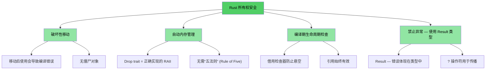
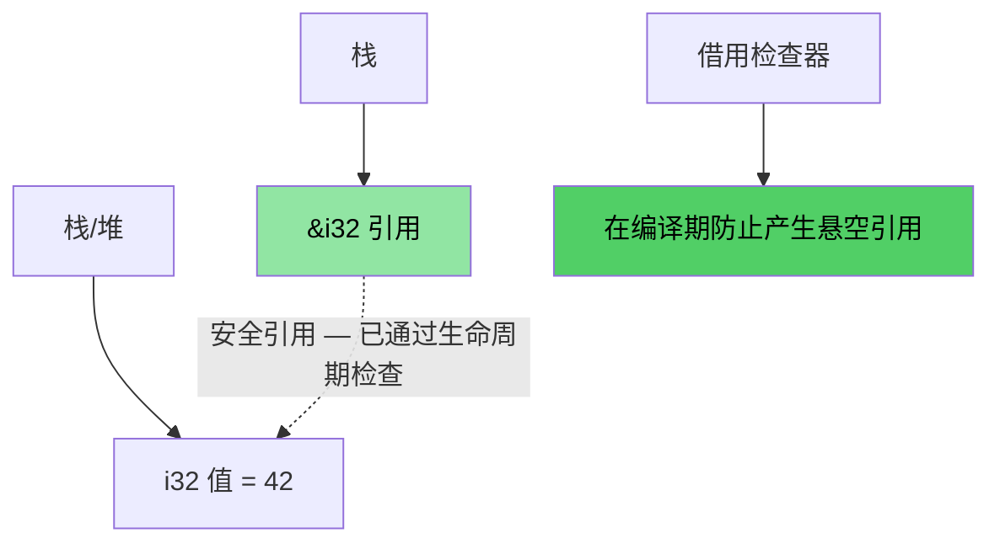
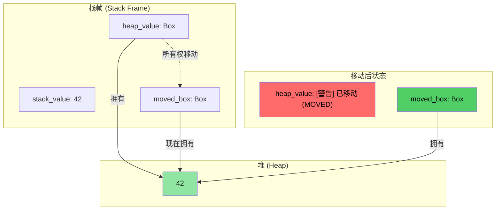
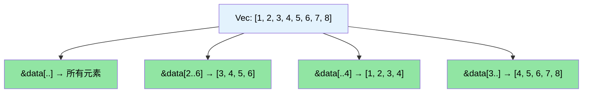

[English Original](../en/ch01-introduction-and-motivation.md)

# 讲师介绍与通用方法

> **你将学到：** 课程结构、互动形式，以及熟悉的 C/C++ 概念如何映射到 Rust 的对等概念。本章将设定预期，并为你提供本书其余部分的路线图。

- **讲师介绍**
    - 微软 SCHIE（芯片与云硬件基础设施工程）团队的首席固件架构师
    - 行业资深专家，专长于安全、系统编程（固件、操作系统、超管理器）、CPU 与平台架构以及 C++ 系统
    - 自 2017 年（在 AWS EC2 时）开始使用 Rust 编程，并从此深深爱上了这门语言
- **本课程旨在尽可能地保持互动性**
    - **前提假设**：你已经了解 C、C++ 或两者兼有
    - **案例设计**：有意识地将熟悉的概念映射到 Rust 的对等实现
    - **欢迎随时提出澄清性的问题**
- 讲师期待与各团队保持持续参与

# 为什么要用 Rust
> **想直接看代码？** 请跳至 [少说废话：直接看代码](ch02-getting-started.md#enough-talk-already-show-me-some-code)

无论你来自 C 还是 C++，核心痛点都是一样的：那些能正常编译通过，却在运行时导致崩溃、数据损坏或内存泄漏的内存安全 Bug。

- **超过 70% 的 CVE** 是由内存安全问题引起的 —— 缓冲区溢出、悬空指针、使用后释放（use-after-free）
- C++ 的 `shared_ptr`、`unique_ptr`、RAII 和移动语义虽然在正确的方向上迈出了步伐，但它们只是**权宜之计，而非根治良方** —— 它们依然留下了移动后使用（use-after-move）、引用循环、迭代器失效以及异常安全漏洞
- Rust 提供了你所依赖的 C/C++ 性能，同时提供了**编译期的安全保障**

> **📖 深度解析**：参见 [为什么 C/C++ 开发者需要 Rust](ch01-1-why-c-cpp-developers-need-rust.md)，查看具体的漏洞案例、Rust 消除的问题清单，以及为什么 C++ 智能指针还不够。

---

# Rust 如何解决这些问题？

## 缓冲区溢出与越界访问
- 所有的 Rust 数组、切片和字符串都带有显式的边界。编译器会插入检查，确保任何越界访问都会导致**运行时崩溃** (Rust 中称为 Panic) —— 绝不会出现未定义行为 (Undefined Behavior)。

## 悬空指针与引用
- Rust 引入了生命周期 (Lifetimes) 和借用检查 (Borrow Checking)，在**编译期**消除悬空引用。
- 没有悬空指针，没有使用后释放 (Use-after-free) —— 编译器根本不会让它们发生。

## 移动后使用 (Use-after-move)
- Rust 的所有权系统使移动成为**破坏性**的 —— 一旦你移动了一个值，编译器就会**拒绝**让你使用原值。没有僵尸对象，也没有“有效但未指定状态”。

## 资源管理
- Rust 的 `Drop` Trait 是正确实现的 RAII —— 编译器在资源离开作用域时自动释放，并**防止移动后使用**，而 C++ 的 RAII 无法强制执行这一点。
- 不需要“五法则” (Rule of Five) —— 无需手动定义拷贝构造、移动构造、拷贝赋值、移动赋值及析构函数。

## 错误处理
- Rust 没有异常。所有的错误都是值 (`Result<T, E>`)，使得错误处理在类型签名中显式且可见。

## 迭代器失效
- Rust 的借用检查器**禁止在遍历集合的同时修改它**。你根本写不出那些困扰 C++ 代码库的 Bug：
```rust
// Rust 中等效的迭代期间删除：retain()
pending_faults.retain(|f| f.id != fault_to_remove.id);

// 或者：收集到新的 Vec (函数式风格)
let remaining: Vec<_> = pending_faults
    .into_iter()
    .filter(|f| f.id != fault_to_remove.id)
    .collect();
```

## 数据竞态 (Data Races)
- 类型系统通过 `Send` 和 `Sync` Trait 在**编译期**防止数据竞态。

---

# 内存安全可视化

### Rust 所有权 — 设计初衷即安全

```rust
fn safe_rust_ownership() {
    // 移动是破坏性的：原变量失效
    let data = vec![1, 2, 3];
    let data2 = data;           // 移动发生
    // data.len();              // 编译错误：值在移动后被使用
    
    // 借用：安全的共享访问
    let owned = String::from("你好，世界！");
    let slice: &str = &owned;  // 借用 — 无需内存分配
    println!("{}", slice);     // 总是安全的
    
    // 不可能出现悬空引用
    /*
    let dangling_ref;
    {
        let temp = String::from("临时变量");
        dangling_ref = &temp;  // 编译错误：temp 存活时间不够长
    }
    */
}
```



---

## 内存布局：Rust 引用



### `Box<T>` 堆内存分配可视化

```rust
fn box_allocation_example() {
    // 栈分配
    let stack_value = 42;
    
    // 使用 Box 进行堆分配
    let heap_value = Box::new(42);
    
    // 移动所有权
    let moved_box = heap_value;
    // heap_value 不再可访问
}
```



## 切片 (Slice) 操作可视化

```rust
fn slice_operations() {
    let data = vec![1, 2, 3, 4, 5, 6, 7, 8];
    
    let full_slice = &data[..];        // [1,2,3,4,5,6,7,8]
    let partial_slice = &data[2..6];   // [3,4,5,6]
    let from_start = &data[..4];       // [1,2,3,4]
    let to_end = &data[3..];           // [4,5,6,7,8]
}
```



---

# Rust 的其他核心卖点与特性
- **线程间无数据竞态** (通过编译期的 `Send`/`Sync` 检查实现)
- **无移动后使用 (Use-after-move)** (不同于 C++ 的 `std::move` 会留下僵尸对象)
- **无未初始化变量**
    - 所有变量在使用前必须被初始化
- **无显而易见的内存泄漏**
    - `Drop` Trait = 正确实现的 RAII，不再需要“五法则”
    - 编译器在变量离开作用域时自动释放内存
- **Mutex 上不会忘记加锁/解锁**
    - Lock Guard 是访问数据的**唯一**途径 (`Mutex<T>` 包裹的是数据，而非对数据的访问操作)
- **无异常处理带来的复杂性**
    - 错误即是值 (`Result<T, E>`)，在函数签名中可见，且通过 `?` 进行传播
- **卓越的类型推导、枚举、模式匹配以及零成本抽象支持**
- **内建的依赖管理、构建、测试、格式化及 Lint 支持**
    - `cargo` 可以取代 make/CMake + 单元测试框架 + Lint 工具

# 快速参考：Rust vs C/C++

| **概念** | **C** | **C++** | **Rust** | **关键差异** |
|-------------|-------|---------|----------|-------------------|
| 内存管理 | `malloc()/free()` | `unique_ptr`, `shared_ptr` | `Box<T>`, `Rc<T>`, `Arc<T>` | 自动化，无循环引用 |
| 数组 | `int arr[10]` | `std::vector<T>`, `std::array<T>` | `Vec<T>`, `[T; N]` | 默认进行边界检查 |
| 字符串 | 以 `\0` 结尾的 `char*` | `std::string`, `string_view` | `String`, `&str` | 保证 UTF-8，生命周期检查 |
| 引用 | `int* ptr` | `T&`, `T&&` (移动) | `&T`, `&mut T` | 借用检查，生命周期 |
| 多态 | 函数指针 | 虚函数，继承 | Traits，特征对象 (Trait Objects) | 组合优于继承 |
| 泛型编程 | 宏 (`void*`) | 模板 (Templates) | 泛型 + Trait 约束 | 更友好的错误提示 |
| 错误处理 | 返回值，`errno` | 异常，`std::optional` | `Result<T, E>`, `Option<T>` | 无隐藏的控制流 |
| NULL 安全性 | `ptr == NULL` | `nullptr`, `std::optional<T>` | `Option<T>` | 强制进行空值检查 |
| 线程安全性 | 手动 (pthreads) | 手动同步 | 编译期保障 | 不可能出现数据竞态 |
| 构建系统 | Make, CMake | CMake, Make 等 | Cargo | 集成化的工具链 |
| 未定义行为 (UB) | 运行时崩溃 | 隐蔽的 UB (有符号溢出等) | 编译期错误 | 安全有保障 |
