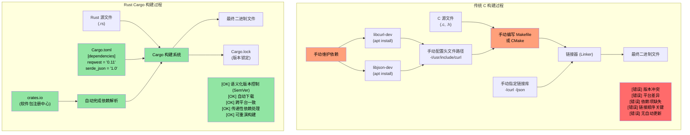
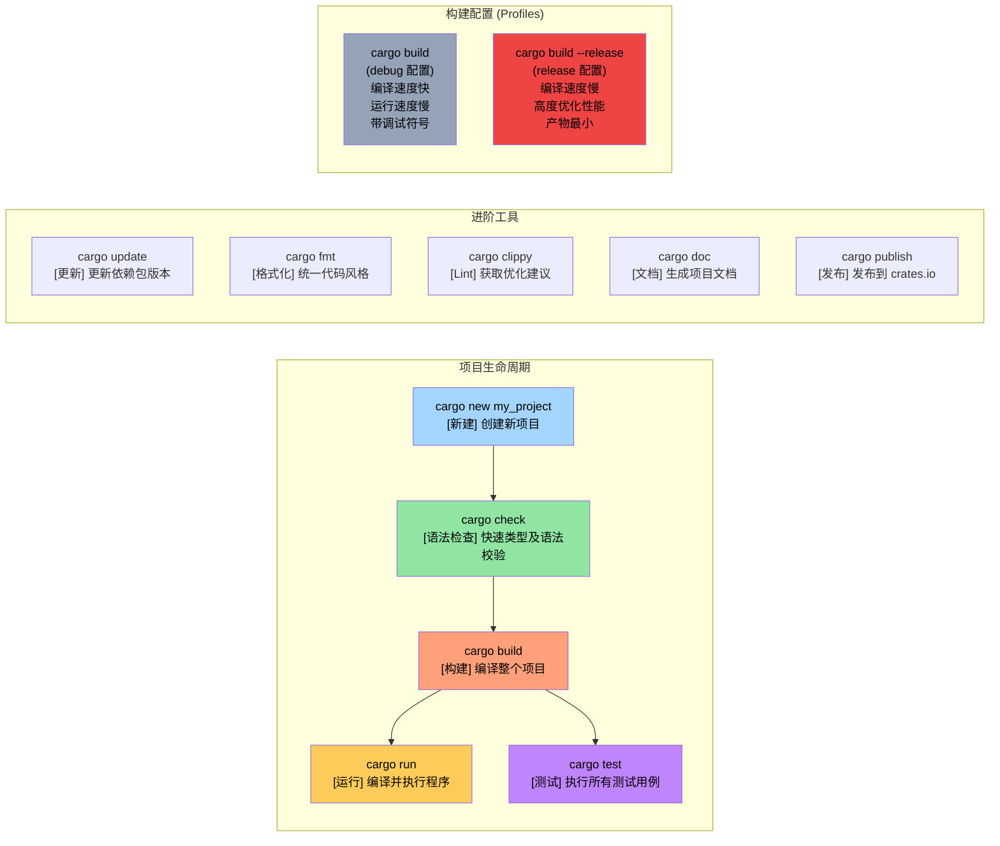

[English Original](../en/ch02-getting-started.md)

# 少说废话：直接看代码

> **你将学到：** 你的第一个 Rust 程序 —— `fn main()`、`println!()`，以及 Rust 宏与 C/C++ 预处理器宏的本质区别。到本章结束时，你将能够编写、编译并运行简单的 Rust 程序。

```rust
fn main() {
    println!("你好，Rust 世界");
}
```
- 上述语法对于任何熟悉 C 风格语言的人来说都应该非常亲切：
    - Rust 中的所有函数都以 `fn` 关键字开头
    - 可执行文件的默认入口点是 `main()`
    - `println!` 看起来像是一个函数，但它实际上是一个**宏**。Rust 中的宏与 C/C++ 的预处理器宏有着本质不同 —— 它们是卫生的（hygienic）、类型安全的，并且作用于语法树而非简单的文本替换。
- 快速尝试 Rust 代码片段的两种绝佳方式：
    - **在线端**：[Rust Playground](https://play.rust-lang.org/) —— 粘贴代码，点击运行，分享结果。无需安装任何软件。
    - **本地交互式终端 (REPL)**：安装 [`evcxr_repl`](https://github.com/evcxr/evcxr) 以获得交互式的 Rust REPL 环境（类似于 Python 的 REPL，但针对 Rust）：
```bash
cargo install --locked evcxr_repl
evcxr   # 启动 REPL，交互式地输入 Rust 表达式
```

### Rust 本地安装指南
- 可以通过以下方法在本地安装 Rust：
    - Windows：https://static.rust-lang.org/rustup/dist/x86_64-pc-windows-msvc/rustup-init.exe
    - Linux / WSL：`curl --proto '=https' --tlsv1.2 -sSf https://sh.rustup.rs | sh`
- Rust 生态由以下核心组件构成：
    - `rustc` 是独立的编译器，但很少被直接使用。
    - 首选工具为 `cargo`，它是 Rust 的“瑞士军刀”，用于依赖管理、构建、测试、格式化、Lint 检查等。
    - Rust 工具链分为 `stable`（稳定版）、`beta`（测试版）和 `nightly`（开发版/实验版）三个渠道，本课程将统一使用 `stable`。使用 `rustup update` 命令可以升级每六周发布一次的 `stable` 版本。
- 我们还将为 VSCode 安装 `rust-analyzer` 插件。

---

# Rust 软件包 (Crates)

- Rust 二进制文件是使用软件包（以下称为 Crates）创建的。
    - 一个 Crate 可以是独立的，也可以依赖于其他 Crates。依赖可以是本地的，也可以是远程的。第三方 Crates 通常从名为 `crates.io` 的集中式注册中心下载。
    - `cargo` 工具会自动处理 Crates 及其依赖的下载。这在概念上等同于链接 C 语言库。
    - Crate 依赖在名为 `Cargo.toml` 的文件中定义。该文件还定义了 Crate 的目标类型：可独立执行文件、静态库、动态库（不常用）。
- 参考资料：https://doc.rust-lang.org/cargo/reference/cargo-targets.html

---

## Cargo 与传统 C 构建系统对比

### 依赖管理对比



---

### Cargo 项目结构

```text
my_project/
|-- Cargo.toml          # 项目配置 (类似于 package.json 或 pyproject.toml)
|-- Cargo.lock          # 具体的依赖版本 (自动生成，由 Cargo 维护)
|-- src/
|   |-- main.rs         # 二进制程序入口
|   |-- lib.rs          # 库的根文件 (如果正在创建一个库)
|   `-- bin/            # 额外的二进制目标
|-- tests/              # 集成测试
|-- examples/           # 示例代码
|-- benches/            # 基准测试
`-- target/             # 构建产物 (类似于 C 中的 build/ 或 obj/ 文件夹)
    |-- debug/          # 调试版本 (编译快，执行慢)
    `-- release/        # 发布版本 (编译慢，高度优化)
```

### 常用 Cargo 命令



---

# 案例：Cargo 与 Crates

- 在这个例子中，我们将创建一个没有任何外部依赖的独立可执行 Crate。
- 使用以下命令创建一个名为 `helloworld` 的新 Crate：
```bash
cargo new helloworld
cd helloworld
cat Cargo.toml
```
- 默认情况下，`cargo run` 将会编译并运行该 Crate 的 `debug`（非优化）版本。若要执行 `release` 版本，请使用 `cargo run --release`。
- 请注意，实际生成的二进制文件位于 `target` 文件夹下的 `debug` 或 `release` 子目录中。
- 你可能已经注意到了 source 所在的文件夹中有一个名为 `Cargo.lock` 的文件。它是自动生成的，**不应该手动修改**。
    - 我们稍后会详细讨论 `Cargo.lock` 的具体作用。

---
