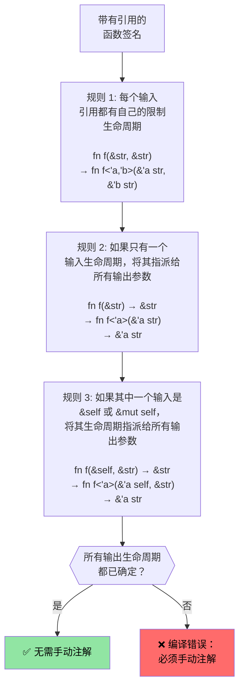

[English Original](../en/ch07-1-lifetimes-and-borrowing-deep-dive.md)

# Rust 生命周期与借用深度解析

> **你将学到：** Rust 的生命周期系统如何确保引用永远不会悬空 —— 从隐式生命周期到显式注解，再到让大多数代码无需注解的三大省略规则。在进入下一节智能指针的学习之前，深入理解生命周期是至关重要的。

- Rust 强制执行单一可变引用或任意数量的不可变引用规则。
    - 任何引用的生命周期必须至少与原始拥有者的生命周期一样长。这些是隐式生命周期，由编译器自动推导（参见 [生命周期省略](https://doc.rust-lang.org/nomicon/lifetime-elision.html)）。
```rust
fn borrow_mut(x: &mut u32) {
    *x = 43;
}
fn main() {
    let mut x = 42;
    let y = &mut x;
    borrow_mut(y);
    let _z = &x; // 允许，因为编译器知道 y 在之后不再被使用
    //println!("{y}"); // 如果取消这行注释，将无法通过编译
    borrow_mut(&mut x); // 允许，因为 _z 不再被使用 
    let z = &x; // OK -- 对 x 的可变借用在 borrow_mut() 返回后结束
    println!("{z}");
}
```

---

# Rust 生命周期注解 (Lifetime Annotations)
- 在处理多个生命周期时，需要显示地使用注解。
    - 生命周期由 `'` 符号后跟标示符表示（如 `'a`, `'b`, `'static` 等）。
    - 当编译器无法确定引用应该存活多久时，它需要开发者提供帮助。
- **常见场景**：函数返回一个引用，但这个引用来自哪个输入参数？
```rust
#[derive(Debug)]
struct Point {x: u32, y: u32}

// 没有生命周期注解时，下行无法通过编译：
// fn left_or_right(pick_left: bool, left: &Point, right: &Point) -> &Point

// 带有生命周期注解 —— 所有引用共用同一个生命周期 'a
fn left_or_right<'a>(pick_left: bool, left: &'a Point, right: &'a Point) -> &'a Point {
    if pick_left { left } else { right }
}

// 更复杂的情况：输入参数有不同的生命周期
fn get_x_coordinate<'a, 'b>(p1: &'a Point, _p2: &'b Point) -> &'a u32 {
    &p1.x  // 返回值的生命周期与 p1 绑定，而不是 p2
}

fn main() {
    let p1 = Point {x: 20, y: 30};
    let result;
    {
        let p2 = Point {x: 42, y: 50};
        result = left_or_right(true, &p1, &p2);
        // 这行有效，因为我们在 p2 超出作用域之前使用了 result
        println!("选择了: {result:?}");
    }
    // 这行无效 —— result 引用的 p2 已经失效了：
    // println!("在作用域之外: {result:?}");
}
```

# Rust 生命周期注解的应用
- 数据结构中的引用也需要生命周期注解。
```rust
use std::collections::HashMap;
#[derive(Debug)]
struct Point {x: u32, y: u32}
struct Lookup<'a> {
    map: HashMap<u32, &'a Point>,
}
fn main() {
    let p = Point{x: 42, y: 42};
    let p1 = Point{x: 50, y: 60};
    let mut m = Lookup {map : HashMap::new()};
    m.map.insert(0, &p);
    m.map.insert(1, &p1);
    {
        let p3 = Point{x: 60, y:70};
        //m.map.insert(3, &p3); // 无法通过编译
        // p3 在此处被销毁，但 m 的生存期比它长
    }
    for (k, v) in m.map {
        println!("{v:?}");
    }
    // m 在此处被销毁
    // p1 和 p 按顺序在此处被销毁
} 
```

---

# 练习：利用生命周期获取首个单词

🟢 **入门级** —— 实践生命周期省略 (Elision)

编写一个函数 `fn first_word(s: &str) -> &str`，返回字符串中第一个由空格分隔的单词。思考一下为什么这段代码在没有显式生命周期注解的情况下也能通过编译（提示：参考省略规则 #1 和 #2）。

<details><summary>参考答案 (点击展开)</summary>

```rust
fn first_word(s: &str) -> &str {
    // 编译器会自动应用生命周期省略规则：
    // 规则 1: 输入的 &str 获得生命周期 'a → fn first_word(s: &'a str) -> &str
    // 规则 2: 只有一个输入生命周期参数 → 输出获得相同的生命周期 → fn first_word(s: &'a str) -> &'a str
    match s.find(' ') {
        Some(pos) => &s[..pos],
        None => s,
    }
}

fn main() {
    let text = "hello world foo";
    let word = first_word(text);
    println!("第一个单词: {word}");  // "hello"
    
    let single = "onlyone";
    println!("第一个单词: {}", first_word(single));  // "onlyone"
}
```

</details>

---

# 练习：利用生命周期存储切片

🟡 **中级** —— 首次尝试编写生命周期注解

- 创建一个存储 `&str` 切片引用的结构体：
    - 创建一个长字符串 `&str`，并将从中提取的切片引用存入该结构体中。
    - 编写一个接收该结构体并返回其中所存切片的函数。
```rust
// TODO: 创建一个存储切片引用的结构体
struct SliceStore {

}
fn main() {
    let s = "这是一段很长的字符串";
    let s1 = &s[0..];
    let s2 = &s[1..2];
    // let slice = struct SliceStore {...};
    // let slice2 = struct SliceStore {...};
}
```

<details><summary>参考答案 (点击展开)</summary>

```rust
struct SliceStore<'a> {
    slice: &'a str,
}

impl<'a> SliceStore<'a> {
    fn new(slice: &'a str) -> Self {
        SliceStore { slice }
    }

    fn get_slice(&self) -> &'a str {
        self.slice
    }
}

fn main() {
    let s = "这是一段很长的字符串";
    let store1 = SliceStore::new(&s[0..6]);   // "这是一段"
    let store2 = SliceStore::new(&s[6..12]);  // "很长的"
    println!("store1: {}", store1.get_slice());
    println!("store2: {}", store2.get_slice());
}
```

</details>

---

## 生命周期省略规则深度解析

C 程序员经常问：“如果生命周期如此重要，为什么大多数 Rust 函数不需要写 `'a` 注解呢？”答案就是 **生命周期省略 (Lifetime Elision)** —— 编译器会自动应用三条确定性的规则来推断生命周期。

### 三条省略规则

Rust 编译器会**按顺序**将这些规则应用到函数签名中。如果在应用规则后，所有的输出生命周期都能被确定，那么就不需要手动注解。



---

### 逐条规则示例

**规则 1** —— 每个输入引用都会获得自己的生命周期参数：
```rust
// 你所编写的代码：
fn first_word(s: &str) -> &str { ... }

// 编译器在应用规则 1 后看到的：
fn first_word<'a>(s: &'a str) -> &str { ... }
// 只有一个输入生命周期参数 → 适用规则 2
```

**规则 2** —— 唯一的输入生命周期参数会传播到所有输出：
```rust
// 应用规则 2 后：
fn first_word<'a>(s: &'a str) -> &'a str { ... }
// ✅ 所有的输出生命周期都已确定 —— 无需手动注解！
```

**规则 3** —— `&self` 的生命周期会传播到输出：
```rust
// 你所编写的代码：
impl SliceStore<'_> {
    fn get_slice(&self) -> &str { self.slice }
}

// 编译器在应用规则 1 和 3 后看到的：
impl SliceStore<'_> {
    fn get_slice<'a>(&'a self) -> &'a str { self.slice }
}
// ✅ 无需手动注解 —— 输出使用了 &self 的生命周期
```

**当省略失效时** —— 你必须手动注解：
```rust
// 有两个输入引用，且没有 &self → 规则 2 和规则 3 都不适用
// fn longest(a: &str, b: &str) -> &str  ← 下行无法通过编译

// 解决方案：告诉编译器输出的借用来自于哪个输入参数
fn longest<'a>(a: &'a str, b: &'a str) -> &'a str {
    if a.len() >= b.len() { a } else { b }
}
```

---

### C 程序员的心智模型

在 C 语言中，每个指针都是独立的 —— 程序员需要在脑海中跟踪每个指针所指向的内存分配，而编译器则完全信任你。而在 Rust 中，生命周期让这种跟踪变成了**显式的且经过编译器校验的**行为：

| C | Rust | 背后发生了什么 |
|---|------|-------------|
| `char* get_name(struct User* u)` | `fn get_name(&self) -> &str` | 规则 3 判定：输出从 `self` 借用 |
| `char* concat(char* a, char* b)` | `fn concat<'a>(a: &'a str, b: &'a str) -> &'a str` | 必须手动注解 —— 有两个输入参数 |
| `void process(char* in, char* out)` | `fn process(input: &str, output: &mut String)` | 无返回引用 —— 无需生命周期注解 |
| `char* buf; /* 谁拥有这里？ */` | 如果生命周期错误会报错 | 编译器会捕捉到悬空指针 |

### `'static` 生命周期

`'static` 意味着引用的有效期贯穿**整个程序运行期间**。它是 Rust 中等效于 C 语言全局变量或字符串字面量的概念：

```rust
// 字符串字面量始终是 'static 的 —— 它们存储在二进制文件的只读区域
let s: &'static str = "hello";  // 等同于 C 中的 static const char* s = "hello";

// 常量也是 'static 的
static GREETING: &str = "hello";

// 在线程派生的 Trait 约束中很常见：
fn spawn<F: FnOnce() + Send + 'static>(f: F) { /* ... */ }
// 这里的 'static 意味着：“闭包不得借用任何局部变量”
// （要么将变量移动到闭包内，要么仅使用 'static 的数据）
```

---

### 练习：预测省略结果

🟡 **中级**

请预测下述每个 function 签名是否可以通过编译器的生命周期省略。如果不能，请添加必要的注解：

```rust
// 1. 编译器能否省略？
fn trim_prefix(s: &str) -> &str { &s[1..] }

// 2. 编译器能否省略？
fn pick(flag: bool, a: &str, b: &str) -> &str {
    if flag { a } else { b }
}

// 3. 编译器能否省略？
struct Parser { data: String }
impl Parser {
    fn next_token(&self) -> &str { &self.data[..5] }
}

// 4. 编译器能否省略？
fn split_at(s: &str, pos: usize) -> (&str, &str) {
    (&s[..pos], &s[pos..])
}
```

<details><summary>参考答案 (点击展开)</summary>

```rust,ignore
// 1. 可以 —— 规则 1 为 s 指派 'a，规则 2 传播到输出
fn trim_prefix(s: &str) -> &str { &s[1..] }

// 2. 不可以 —— 有两个输入引用，且没有 &self。必须手动注解：
fn pick<'a>(flag: bool, a: &'a str, b: &'a str) -> &'a str {
    if flag { a } else { b }
}

// 3. 可以 —— 规则 1 为 &self 指派 'a，规则 3 传播到输出
impl Parser {
    fn next_token(&self) -> &str { &self.data[..5] }
}

// 4. 可以 —— 规则 1 为 s 指派 'a（只有一个输入引用），
//    规则 2 将其传播到两个输出。两个切片都从 s 借用。
fn split_at(s: &str, pos: usize) -> (&str, &str) {
    (&s[..pos], &s[pos..])
}
```

</details>

---
