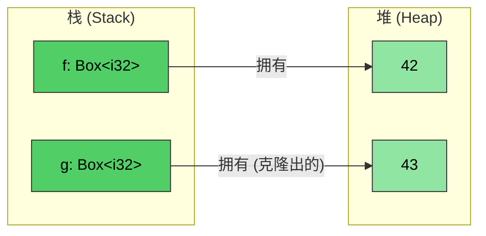
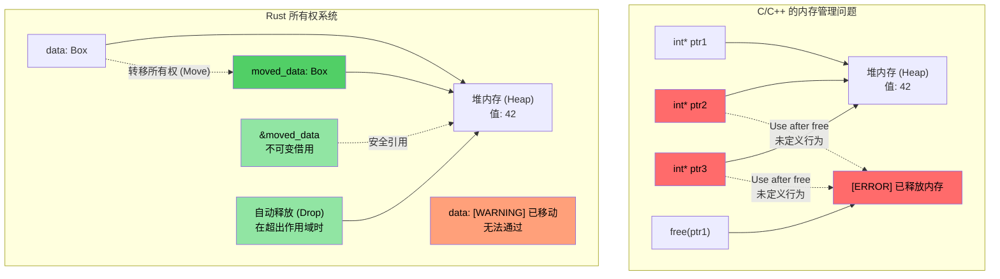
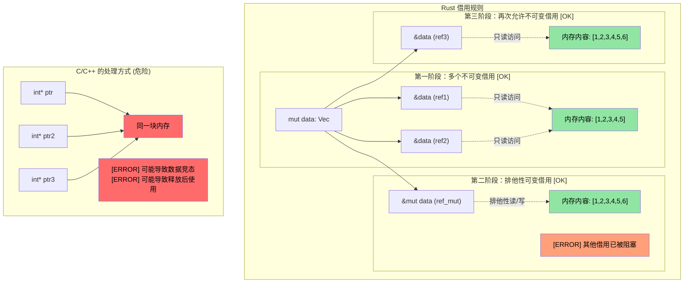

[English Original](../en/ch07-2-smart-pointers-and-interior-mutability.md)

# Rust `Box<T>`

> **你将学到：** Rust 的智能指针类型 —— 用于堆分配的 `Box<T>`、用于共享所有权的 `Rc<T>`，以及用于内部可变性 (Interior Mutability) 的 `Cell<T>`/`RefCell<T>`。这些概念均建立在上一节的所有权与生命周期基础之上。你还将简要了解用于打破引用循环的 `Weak<T>`。

**为什么要用 `Box<T>`？** 在 C 语言中，你使用 `malloc`/`free` 进行堆分配。在 C++ 中，`std::unique_ptr<T>` 封装了 `new`/`delete`。Rust 的 `Box<T>` 就是其等效物 —— 一个堆分配的、单一所有者的指针，在超出作用域时会自动释放。与 `malloc` 不同的是，这里没有配套的 `free` 需要你去费心记忆。与 `unique_ptr` 不同的是，这里不存在“移动后使用”的情况 —— 编译器会完全杜绝此类行为。

**何时使用 `Box` 而非栈分配：**
- 包含的类型体量巨大，你不希望在栈上进行拷贝。
- 你需要定义递归类型（例如：一个包含自身类型的链表节点）。
- 你需要使用 Trait 对象 (`Box<dyn Trait>`)。

- `Box<T>` 可用于创建一个指向堆分配类型的指针。无论 `<T>` 的具体类型为何，该指针的大小始终是固定的。
```rust
fn main() {
    // 在堆上创建一个指向整数（值为 42）的指针
    let f = Box::new(42);
    println!("{} {}", *f, f);
    // 克隆一个 Box 会在堆上创建一个新的分配
    let mut g = f.clone();
    *g = 43;
    println!("{f} {g}");
    // g 和 f 在此处超出作用域并被自动释放
}
```


---

## 所有权与借用的可视化对比

### C/C++ vs Rust：指针与所有权管理

```c
// C - 手动管理内存，存在潜在问题
void c_pointer_problems() {
    int* ptr1 = malloc(sizeof(int));
    *ptr1 = 42;
    
    int* ptr2 = ptr1;  // 两者都指向相同的内存
    int* ptr3 = ptr1;  // 三者都指向相同的内存
    
    free(ptr1);        // 释放该内存
    
    *ptr2 = 43;        // [重大错误] 释放后使用 (Use after free) - 未定义行为！
    *ptr3 = 44;        // [重大错误] 释放后使用 (Use after free) - 未定义行为！
}
```

> **针对 C++ 开发者**：虽然智能指针有所帮助，但并不能防止所有问题：
>
> ```cpp
> // C++ - 智能指针有所帮助，但不能解决所有问题
> void cpp_pointer_issues() {
>     auto ptr1 = std::make_unique<int>(42);
>     
>     // auto ptr2 = ptr1;  // 编译错误：unique_ptr 不可拷贝
>     auto ptr2 = std::move(ptr1);  // OK: 所有权已转移
>     
>     // 但是 C++ 依然允许移动后使用 (Use-after-move)：
>     // std::cout << *ptr1;  // 能够编译！但是导致未定义行为！
>     
>     // shared_ptr 别名问题：
>     auto shared1 = std::make_shared<int>(42);
>     auto shared2 = shared1;  // 两者共同拥有数据
>     // 到底谁才算是“真正”的所有者？谁也不是。引用计数开销无处不在。
> }
> ```

---

```rust
// Rust - 所有权系统杜绝了上述问题
fn rust_ownership_safety() {
    let data = Box::new(42);  // data 拥有了堆上的内存分配
    
    let moved_data = data;    // 所有权转移给了 moved_data
    // data 此时无法再被通过 —— 如果使用，将导致编译错误
    
    let borrowed = &moved_data;  // 不可变借用
    println!("{}", borrowed);    // 能够安全使用
    
    // moved_data 在超出作用域时会自动触发释放
}
```



---

### 借用规则的可视化展示

```rust
fn borrowing_rules_example() {
    let mut data = vec![1, 2, 3, 4, 5];
    
    // 多个不可变借用 —— OK
    let ref1 = &data;
    let ref2 = &data;
    println!("{:?} {:?}", ref1, ref2);  // 二者均可被使用
    
    // 可变借用 —— 独占式访问
    let ref_mut = &mut data;
    ref_mut.push(6);
    // 当 ref_mut 处于活跃状态时，ref1 和 ref2 无法被使用
    
    // 在 ref_mut 结束之后，不可变借用再次生效
    let ref3 = &data;
    println!("{:?}", ref3);
}
```



---

## 内部可变性 (Interior Mutability)：`Cell<T>` 与 `RefCell<T>`

回想一下，开发者在 Rust 中定义的变量默认是不可变的。但有时我们希望类型的大部分字段是只读的，同时允许对其中某个特定字段进行写操作。

```rust
struct Employee {
    employee_id : u64,   // 该字段必须是不可变的
    on_vacation: bool,   // 如果我们想允许对该字段进行写操作，同时保持 employee_id 不可变，该怎么办？
}
```

- 回想一下，Rust 仅允许对变量存在**单一可变**引用或任意数量的**不可变**引用 —— 这在**编译时**强制执行。
- 如果我们想传递一个包含员工信息的不可变向量（Vector），但允许更新 `on_vacation` 字段，同时确保 `employee_id` 无法被修改，该怎么办？

### `Cell<T>` —— 针对 Copy 类型的内部可变性

- `Cell<T>` 提供了**内部可变性**，即：即便引用本身是只读的，也可以对其特定元素获得写权限。
- 它通过值的拷贝（In/Out）来工作（调用 `.get()` 要求 `T: Copy`）。

### `RefCell<T>` —— 带有运行时借用检查的内部可变性

- `RefCell<T>` 提供了一种基于引用的变体。
    - 它在 **运行时** 而非编译时强制执行 Rust 的借用检查。
    - 它允许单一的**可变**借用，但如果同时存在其他活跃引用，则会导致 **程序崩溃 (Panic)**。
    - 使用 `.borrow()` 进行不可变访问，使用 `.borrow_mut()` 进行可变访问。

### 如何选择 `Cell` 还是 `RefCell`

| 判定标准 | `Cell<T>` | `RefCell<T>` |
|-----------|-----------|-------------|
| 适用类型 | `Copy` 类型（整数, 布尔, 浮点数等） | 任意类型（`String`, `Vec`, 结构体等） |
| 访问模式 | 值的拷贝 (`.get()`, `.set()`) | 原地借用 (`.borrow()`, `.borrow_mut()`) |
| 失败模式 | 绝不会失败 —— 无运行时检查 | 如果在已有借用时再次进行可变借用，会触发 **Panic** |
| 运行时开销 | 零开销 —— 仅执行字节拷贝 | 极小开销 —— 在运行时追踪借用状态 |
| 使用场景 | 在不可变结构体中需要可变标志、计数器或小数值时 | 在不可变结构体中需要修改 `String`, `Vec` 或复杂类型时 |

---

## 共享所有权：`Rc<T>`

`Rc<T>` 允许通过引用计数对**不可变**数据进行所有权的共享。如果我们想在多个地方存储同一个 `Employee` 且不进行拷贝，该怎么办？

```rust
#[derive(Debug)]
struct Employee {
    employee_id: u64,
}
fn main() {
    let mut us_employees = vec![];
    let mut all_global_employees = Vec::<Employee>::new();
    let employee = Employee { employee_id: 42 };
    us_employees.push(employee);
    // [编译失败] —— employee 已经被移动 (Moved) 了
    //all_global_employees.push(employee);
}
```

`Rc<T>` 通过允许共享的**不可变**访问来解决这个问题：
- 指向的类型会自动解引用。
- 当引用计数减为 0 时，该类型会被释放。

```rust
use std::rc::Rc;
#[derive(Debug)]
struct Employee {employee_id: u64}
fn main() {
    let mut us_employees = vec![];
    let mut all_global_employees = vec![];
    let employee = Employee { employee_id: 42 };
    let employee_rc = Rc::new(employee);
    us_employees.push(employee_rc.clone());  // 增加引用计数，而非拷贝数据
    all_global_employees.push(employee_rc.clone());
    let employee_one = all_global_employees.get(0); // 共享的不可变引用
    for e in us_employees {
        println!("{}", e.employee_id);  // 共享的不可变引用
    }
    println!("{employee_one:?}");
}
```

> **针对 C++ 开发者：智能指针映射关系**
>
> | **C++ 智能指针** | **Rust 等价物** | **关键区别** |
> |---|---|---|
> | `std::unique_ptr<T>` | `Box<T>` | Rust 版是默认行为 —— 移动是语言层面的，而非可选的 |
> | `std::shared_ptr<T>` | `Rc<T>` (单线程) / `Arc<T>` (多线程) | `Rc` 没有原子性开销；仅在跨线程共享时才需要使用 `Arc` |
> | `std::weak_ptr<T>` | `Weak<T>` (通过 `Rc::downgrade()` 或 `Arc::downgrade()`) | 用途一致：用于打破引用循环 |
>
> **关键区别**：在 C++ 中，你**选择**使用智能指针。而在 Rust 中，拥有值 (`T`) and 借用 (`&T`) 涵盖了绝大多数场景 —— 只有在确实需要堆分配或共享所有权时，才会去诉诸 `Box`/`Rc`/`Arc`。

---

### 利用 `Weak<T>` 打破引用循环

`Rc<T>` 采用引用计数机制 —— 如果两个 `Rc` 值相互指向对方，那么它们永远不会被释放（即产生循环引用）。`Weak<T>` 可以解决这个问题：

```rust
use std::rc::{Rc, Weak};

struct Node {
    value: i32,
    parent: Option<Weak<Node>>,  // 弱引用 —— 不会阻止对象被释放
}

fn main() {
    let parent = Rc::new(Node { value: 1, parent: None });
    let child = Rc::new(Node {
        value: 2,
        parent: Some(Rc::downgrade(&parent)),  // 指向父节点的弱引用
    });

    // 若要使用 Weak，需先尝试将其升级 —— 返回 Option<Rc<T>>
    if let Some(parent_rc) = child.parent.as_ref().unwrap().upgrade() {
        println!("父节点的值: {}", parent_rc.value);
    }
    println!("父节点的强引用计数: {}", Rc::strong_count(&parent)); // 结果为 1，而非 2
}
```

> 更多关于 `Weak<T>` 的深度内容请参阅 [避免过度的 clone()](ch17-1-avoiding-exhaustive-clone.md)。目前只需记住一个核心点：**在树形或图形结构中，使用 `Weak` 来实现“父节点引用 (Back-references)”，以避免内存泄漏。**

---

## 将 `Rc` 与内部可变性结合使用

当我们将 `Rc<T>`（共享所有权）与 `Cell<T>` 或 `RefCell<T>`（内部可变性）结合时，真正的威力就显现出来了。这使得多个所有者可以同时**读取并修改**共享数据：

| 模式组合 | 使用场景 |
|---------|----------|
| `Rc<RefCell<T>>` | 共享的可变数据 (单线程) |
| `Arc<Mutex<T>>` | 共享的可变数据 (多线程 —— 详见 [第 13 章](ch13-concurrency.md)) |
| `Rc<Cell<T>>` | 共享的可变 Copy 类型 (简单的标志、计数器) |

---

# 练习：共享所有权与内部可变性

🟡 **中级**

- **第一阶段 (Rc)**：创建一个拥有 `employee_id: u64` 和 `name: String` 字段的 `Employee` 结构体。将其封装在 `Rc<Employee>` 中，并克隆到两个独立的向量中（`us_employees` 和 `global_employees`）。从这两个向量中打印数据，以此证明它们共享同一份数据。
- **第二阶段 (Cell)**：为 `Employee` 添加一个 `on_vacation: Cell<bool>` 字段。编写一个函数，接收一个不可变的 `&Employee` 引用，并从函数内部切换 `on_vacation` 的状态 —— 注意，无需将引用设为可变。
- **第三阶段 (RefCell)**：将 `name: String` 替换为 `name: RefCell<String>`。编写一个函数，通过 `&Employee`（不可变引用）在员工姓名后追加一个后缀。

**初始代码：**
```rust
use std::cell::{Cell, RefCell};
use std::rc::Rc;

#[derive(Debug)]
struct Employee {
    employee_id: u64,
    name: RefCell<String>,
    on_vacation: Cell<bool>,
}

fn toggle_vacation(emp: &Employee) {
    // TODO: 利用 Cell::set() 切换 on_vacation 的状态
}

fn append_title(emp: &Employee, title: &str) {
    // TODO: 通过 RefCell 进行可变借用，并使用 push_str 追加标题
}

fn main() {
    // TODO: 创建一名员工，封装在 Rc 中，并克隆到两个 Vec 中，
    // 调用 toggle_vacation 和 append_title，最后打印结果
}
```

<details><summary>参考答案 (点击展开)</summary>

```rust
use std::cell::{Cell, RefCell};
use std::rc::Rc;

#[derive(Debug)]
struct Employee {
    employee_id: u64,
    name: RefCell<String>,
    on_vacation: Cell<bool>,
}

fn toggle_vacation(emp: &Employee) {
    emp.on_vacation.set(!emp.on_vacation.get());
}

fn append_title(emp: &Employee, title: &str) {
    emp.name.borrow_mut().push_str(title);
}

fn main() {
    let emp = Rc::new(Employee {
        employee_id: 42,
        name: RefCell::new("Alice".to_string()),
        on_vacation: Cell::new(false),
    });

    let mut us_employees = vec![];
    let mut global_employees = vec![];
    us_employees.push(Rc::clone(&emp));
    global_employees.push(Rc::clone(&emp));

    // 通过不可变引用切换假期状态
    toggle_vacation(&emp);
    println!("休假中: {}", emp.on_vacation.get()); // true

    // 通过不可变引用追加标题
    append_title(&emp, ", 资深工程师");
    println!("姓名: {}", emp.name.borrow()); // "Alice, 资深工程师"

    // 两个向量看到的是同一份数据（Rc 共享了所有权）
    println!("美国分部: {:?}", us_employees[0].name.borrow());
    println!("全球分部: {:?}", global_employees[0].name.borrow());
    println!("Rc 强引用计数: {}", Rc::strong_count(&emp));
}
```
**输出示例：**
```text
休假中: true
姓名: Alice, 资深工程师
美国分部: "Alice, 资深工程师"
全球分部: "Alice, 资深工程师"
Rc 强引用计数: 3
```

</details>

---
