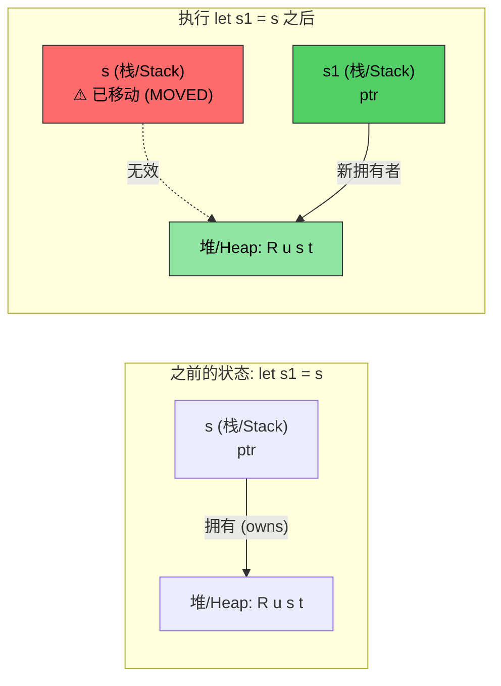
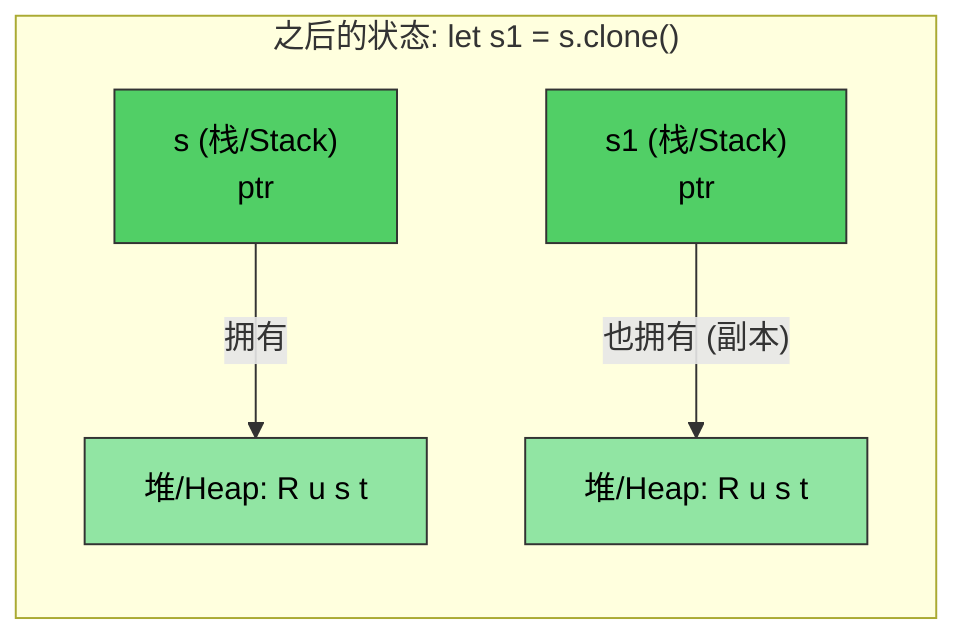

[English Original](../en/ch07-ownership-and-borrowing.md)

# Rust 内存管理

> **你将学到：** Rust 的所有权系统 (Ownership System) —— 它是该语言中唯一最重要的概念。在本章之后，你将理解移动语义 (Move Semantics)、借用规则以及 `Drop` trait。如果你掌握了本章内容，Rust 的其余部分将顺理成章。如果你感到吃力，请多读几遍 —— 对于大多数 C/C++ 开发者来说，所有权通常在读第二遍时才会真正领悟。

- C/C++ 中的内存管理一直是 Bug 的滋生地：
    - 在 C 中：内存通过 `malloc()` 分配并使用 `free()` 释放。没有针对悬空指针、使用后释放 (Use-after-free) 或二次释放 (Double-free) 的检查机制。
    - 在 C++ 中：RAII (资源获取即初始化) 和智能指针有所帮助，但在 `std::move(ptr)` 之后代码依然能通过编译 —— 移动后使用 (Use-after-move) 属于未定义行为 (UB)。
- Rust 使 RAII 变得**万无一失**：
    - 移动是**破坏性**的 —— 编译器拒绝让你触碰已经移动的原变量。
    - 无需“五法则 (Rule of Five)”（不需要手动定义拷贝构造、移动构造、拷贝赋值、移动赋值、析构函数）。
    - Rust 让你可以完全控制内存分配，但在**编译时**强制执行安全性。
    - 这一切是通过所有权、借用、可变性及生命周期等机制的结合来实现的。
    - Rust 的运行时分配可以同时发生在栈 (Stack) 和堆 (Heap) 上。

> **针对 C++ 开发者 —— 智能指针对应关系：**
>
> | **C++** | **Rust** | **安全性提升** |
> |---------|----------|----------------------|
> | `std::unique_ptr<T>` | `Box<T>` | 不可能出现移动后使用 |
> | `std::shared_ptr<T>` | `Rc<T>` (单线程) | 默认不存在引用循环 |
> | `std::shared_ptr<T>` (线程安全) | `Arc<T>` | 显式的线程安全保证 |
> | `std::weak_ptr<T>` | `Weak<T>` | 必须显式检查有效性 |
> | 原始指针 | `*const T` / `*mut T` | 仅限于 `unsafe` 块中使用 |
>
> 对于 C 开发者：`Box<T>` 取代了 `malloc`/`free` 对。`Rc<T>` 取代了手动引用计数。原始指针依然存在，但被限制在 `unsafe` 块中。

---

# Rust 所有权、借用与生命周期
- 回想一下，Rust 仅允许对变量存在单一的可变引用或多个只读引用。
    - 变量的初始声明确立了**所有权 (Ownership)**。
    - 之后的引用是从原始所有者那里进行的**借用 (Borrow)**。其规则是：借用的作用域绝不能超过拥有者的作用域。换句话说，借用的**生命周期 (Lifetime)** 不能超过拥有者的生命周期。
```rust
fn main() {
    let a = 42; // 所有者 (Owner)
    let b = &a; // 第一个借用
    {
        let aa = 42;
        let c = &a; // 第二个借用；a 依然在作用域内
        // OK: c 在这里超出作用域
        // aa 在这里超出作用域
    }
    // let d = &aa; // 无法通过编译，除非将 aa 的所有权移到外部作用域
    // b 隐式地在 a 之前超出作用域
    // a 最后超出作用域
}
```

- Rust 可以通过几种不同的机制将参数传递给方法：
    - **传值 (By value / Copy)**：通常是那些可以容易地被拷贝的类型（例如：u8, u32, i8, i32）。
    - **传引用 (By reference)**：等效于传递一个指向实际值的指针。这也被通俗地称为借用 (Borrowing)，引用可以是不可变的 (`&`)，或可变的 (`&mut`)。
    - **通过移动 (By moving)**：这会将值的所有权转移给函数。调用者将不再引用原始值。
```rust
fn foo(x: &u32) {
    println!("{x}");
}
fn bar(x: u32) {
    println!("{x}");
}
fn main() {
    let a = 42;
    foo(&a);    // 传引用
    bar(a);     // 传值 (拷贝)
}
```

- Rust 禁止从方法返回悬空引用 (Dangling References)：
    - 方法返回的引用必须依然在有效作用域内。
    - 当变量超出作用域时，Rust 会自动将其 **释放 (Drop)**。
```rust
fn no_dangling() -> &u32 {
    // a 的生命周期在这里开始
    let a = 42;
    // 无法通过编译。a 的生命周期在这里结束
    &a
}

fn ok_reference(a: &u32) -> &u32 {
    // OK：因为 a 的生命周期总是超过 ok_reference()
    a
}
fn main() {
    let a = 42;     // a 的生命周期在这里开始
    let b = ok_reference(&a);
    // b 的生命周期在这里结束
    // a 的生命周期在这里结束
}
```

---

# Rust 移动语义 (Move Semantics)
- 默认情况下，Rust 的赋值操作会转移所有权：
```rust
fn main() {
    let s = String::from("Rust");    // 从堆中分配一个字符串
    let s1 = s; // 将所有权转移给 s1。此时 s 已失效
    println!("{s1}");
    // 下行将无法通过编译
    //println!("{s}");
    // s1 在这里超出作用域，其占用的内存被释放
    // s 在这里超出作用域，但因为它不再拥有任何资产，所以没有任何影响
}
```

*在 `let s1 = s` 之后，所有权转移到了 `s1`。堆上的数据保持不变 —— 只有栈指针发生了移动。`s` 现在已无资产，处于失效状态。*

---

# 移动语义与借用 (Borrowing)
```rust
fn foo(s : String) {
    println!("{s}");
    // s 指向的堆内存将在此处释放
}
fn bar(s : &String) {
    println!("{s}");
    // 这里没有任何操作 —— s 是被借用的
}
fn main() {
    let s = String::from("Rust string 移动案例");    // 从堆中分配字符串
    foo(s); // 转移所有权；s 此时已失效
    // println!("{s}");  // 无法通过编译
    let t = String::from("Rust string 借用案例");
    bar(&t);    // t 继续保留所有权
    println!("{t}"); 
}
```

# 移动语义与所有权 (Ownership)
- 可以通过移动操作来转移所有权：
    - 在移动完成后，引用原变量的行为是非法的。
    - 如果不希望进行移动，请考虑使用借用。
```rust
struct Point {
    x: u32,
    y: u32,
}
fn consume_point(p: Point) {
    println!("{} {}", p.x, p.y);
}
fn borrow_point(p: &Point) {
    println!("{} {}", p.x, p.y);
}
fn main() {
    let p = Point {x: 10, y: 20};
    // 试着调换下面两行的顺序
    borrow_point(&p);
    consume_point(p);
}
```

---

# Rust 克隆 (Clone)
- `clone()` 方法可以用于拷贝原始内存。原引用依然有效（代价是我们分配了 2 倍的内存）。
```rust
fn main() {
    let s = String::from("Rust");    // 在堆上分配一个字符串
    let s1 = s.clone(); // 拷贝字符串；这会在堆上创建一个新的分配
    println!("{s1}");  
    println!("{s}");
    // s1 这里超出作用域并被释放
    // s 这里超出作用域并被释放
}
```

*`clone()` 会创建一个**独立的**堆分配。`s` 和 `s1` 都是有效的 —— 每个变量都拥有的一个自己的副本。*

---

# Rust Copy Trait
- Rust 通过 `Copy` trait 为内建类型实现了拷贝语义 (Copy Semantics)：
    - 示例包括 u8, u32, i8, i32 等。拷贝语义使用“按值传递”。
    - 用户定义的数据类型可以通过 `derive` 宏自动实现 `Copy` trait，从而选择加入拷贝语义。
    - 编译器会在每次赋值时为副本分配空间。
```rust
// 试着注释掉下面这行，观察 let p1 = p; 带来的变化
#[derive(Copy, Clone, Debug)]
struct Point{x: u32, y:u32}
fn main() {
    let p = Point {x: 42, y: 40};
    let p1 = p;     // 由于实现了 Copy，这里会执行拷贝而非移动
    println!("p: {p:?}");
    println!("p1: {p:?}");
    let p2 = p1.clone();    // 语义上等同于拷贝
}
```

---

# Rust Drop Trait

- Rust 会在作用域结束时自动调用 `drop()` 方法：
    - `drop` 是 `Drop` 这一通用 Trait 的一部分。编译器为所有类型提供了一个默认的空操作 (NOP) 实现，但具体类型可以复写它。例如，`String` 类型复写了 `drop` 以释放堆分配的内存。
    - 对于 C 开发者：这取代了手动调用 `free()` 的需要 —— 资源在超出作用域时会自动释放 (RAII)。
- **关键安全性**：你不能直接手动调用 `.drop()`（编译器禁止这样做）。相反，应该使用 `drop(obj)` 函数，它会将值移动到函数内部，运行其析构函数，并阻止后续的任何访问 —— 从而根除了二次释放 (Double-free) Bug。

> **针对 C++ 开发者**：`Drop` 可以直接对应到 C++ 的析构函数 (`~ClassName()`)：
>
> | | **C++ 析构函数** | **Rust `Drop`** |
> |---|---|---|
> | **语法** | `~MyClass() { ... }` | `impl Drop for MyType { fn drop(&mut self) { ... } }` |
> | **何时调用** | 作用域结束时 (RAII) | 作用域结束时 (相同) |
> | **在移动时调用** | 原对象处于“有效但未指定”的僵尸状态 —— 析构函数依然会在原对象上运行 | 原对象**消失了** —— 不会在已移动的值上运行析构函数 |
> | **手动调用** | `obj.~MyClass()` (危险，极少使用) | `drop(obj)` (安全 —— 获取所有权，调用 `drop`，阻止后续使用) |
> | **执行顺序** | 与声明顺序相反 | 与声明顺序相反 (相同) |
> | **五法则** | 必须管理拷贝/移动构造、拷贝/移动赋值、析构函数 | 仅需 `Drop` —— 编译器处理移动语义，且 `Clone` 是显式选用的 |
> | **是否需要虚析构** | 是，如果通过基类指针删除 | 不需要 —— 没继承，所以不存在切片 (Slicing) 问题 |

```rust
struct Point {x: u32, y:u32}

// 等效于：~Point() { printf("Goodbye point x:%u, y:%u\n", x, y); }
impl Drop for Point {
    fn drop(&mut self) {
        println!("再见 Point x:{}, y:{}", self.x, self.y);
    }
}
fn main() {
    let p = Point{x: 42, y: 42};
    {
        let p1 = Point{x:43, y: 43};
        println!("正在退出内部代码块");
        // p1.drop() 在此处被调用 — 类似于 C++ 作用域结束时的析构函数
    }
    println!("正在退出 main");
    // p.drop() 在此处被调用
}
```

---

# 练习：移动 (Move)、拷贝 (Copy) 与 释放 (Drop)

🟡 **中级** —— 尽管放手实验；编译器会指引你。
- 使用 `Point` 来创建你自己的实验，对比在 `#[derive(Debug)]` 中带有和不带有 `Copy` 时的区别，确保你理解了其中的差异。这个练习的目的是为了让你对移动还是拷贝有深入的理解，如果有疑问请务必提问。
- 为 `Point` 实现一个自定义的 `Drop`，在其中将 x 和 y 设置为 0。这是一种很有用的模式，例如可用于释放锁或其他资源。
```rust
struct Point{x: u32, y: u32}
fn main() {
    // 创建 Point，将其赋值给不同的变量，创建新的作用域，
    // 将 point 传递给函数，等等。
}
```

<details><summary>参考答案 (点击展开)</summary>

```rust
#[derive(Debug)]
struct Point { x: u32, y: u32 }

impl Drop for Point {
    fn drop(&mut self) {
        println!("正在释放 Point({}, {})", self.x, self.y);
        self.x = 0;
        self.y = 0;
        // 注意：在 drop 中将其设为 0 是为了演示这种模式，
        // 但在 drop 完成后你就无法再观察到这些值了
    }
}

fn consume(p: Point) {
    println!("正在消耗: {:?}", p);
    // p 在此处被释放
}

fn main() {
    let p1 = Point { x: 10, y: 20 };
    let p2 = p1;  // 移动 (Move) — p1 不再有效
    // println!("{:?}", p1);  // 无法编译：p1 已被移动

    {
        let p3 = Point { x: 30, y: 40 };
        println!("内部作用域中的 p3: {:?}", p3);
        // p3 在此处释放 (作用域结束)
    }

    consume(p2);  // p2 移动到 consume 函数中并在此释放
    // println!("{:?}", p2);  // 无法编译：p2 已被移动

    // 接下来尝试：为 Point 添加 #[derive(Copy, Clone)] (并移除 Drop 实现)
    // 观察在 let p2 = p1; 之后 p1 是否依然有效
}
```
**输出示例：**
```text
内部作用域中的 p3: Point { x: 30, y: 40 }
正在释放 Point(30, 40)
正在消耗: Point { x: 10, y: 20 }
正在释放 Point(10, 20)
```

</details>

---
