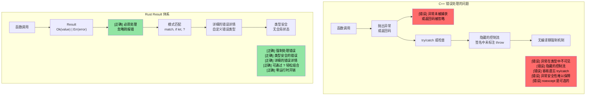
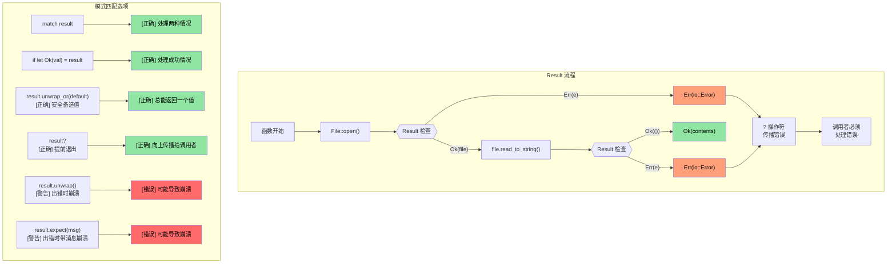

[English Original](../en/ch09-error-handling.md)

## 将枚举与 Option 和 Result 联系起来

> **你将学到：** Rust 如何用 `Option<T>` 取代空指针，用 `Result<T, E>` 取代异常，以及 `?` 操作符如何使错误传播变得简洁。这是 Rust 最具特色的模式 —— 错误是可处理的值，而非隐藏的控制流。

- 还记得我们之前学过的 `enum` 类型吗？Rust 的 `Option` 和 `Result` 实际上就是标准库中定义的简单枚举：
```rust
// 这几乎就是 Option 在 std 中的定义方式：
enum Option<T> {
    Some(T),  // 包含一个值
    None,     // 无值
}

// 以及 Result：
enum Result<T, E> {
    Ok(T),    // 成功，包含结果值
    Err(E),   // 失败，包含错误细节
}
```
- 这意味着你学过的关于 `match` 模式匹配的一切知识都可以直接应用于 `Option` 和 `Result`。
- Rust 中**没有空指针 (null pointer)** —— `Option<T>` 是替代方案，且编译器会强制你处理 `None` 的情况。

### C++ 对比：异常 vs Result
| **C++ 模式** | **Rust 等价物** | **优势** |
|----------------|--------------------|--------------|
| `throw std::runtime_error(msg)` | `Err(MyError::Runtime(msg))` | 错误体现在返回类型中 —— 不会忘记处理 |
| `try { } catch (...) { }` | `match result { Ok(v) => ..., Err(e) => ... }` | 没有隐藏的控制流 |
| `std::optional<T>` | `Option<T>` | 必须进行穷尽匹配 —— 不会忘记 `None` 的处理 |
| `noexcept` 注解 | 默认 —— 所有 Rust 函数都是 "noexcept" | 异常根本不存在 |
| `errno` / 返回码 | `Result<T, E>` | 类型安全，无法被忽略 |

---

# Rust `Option` 类型
- Rust 的 `Option` 类型是一个只有两个变体的枚举：`Some<T>` 和 `None`。
    - 它的核心理念是表示一个**可为空 (nullable)** 的类型。换言之，它要么包含一个该类型的有效值 (`Some<T>`)，要么不含任何有效值 (`None`)。
    - 在那些操作结果可能成功（返回有效值）或可能失败（由于特定错误无关紧要而无需详情）的 API 中，`Option` 类型非常有用。例如，在字符串中查找某个值的索引：
```rust
fn main() {
    // 返回 Option<usize>
    let a = "1234".find("1");
    match a {
        Some(a) => println!("在索引 {a} 处找到了 '1'"),
        None => println!("未找到 '1'")
    }
}
```

- 可以通过多种方式处理 Rust 的 `Option`：
    - `unwrap()`：如果 `Option<T>` 是 `None`，则会触发程序崩溃 (Panic)；否则返回 `T`。这是**最不被推荐**的方法。
    - `or()`：用于返回一个备用值。
    - `if let`：一种测试 `Some<T>` 变体的便捷语法。

> **生产环境模式**：关于生产环境中 Rust 代码的真实示例，请参阅 [使用 unwrap_or 安全提取值](ch17-2-avoiding-unchecked-indexing.md#safe-value-extraction-with-unwrap_or) 以及 [函数式变换：map, map_err, find_map](ch17-2-avoiding-unchecked-indexing.md#functional-transforms-map-map_err-find_map)。

```rust
fn main() {
  // 返回 Option<usize>
  let a = "1234".find("1");
  println!("{a:?} {}", a.unwrap());
  let a = "1234".find("5").or(Some(42));
  println!("{a:?}");
  if let Some(a) = "1234".find("1") {
      println!("{a}");
  } else {
    println!("字符串中未找到目标");
  }
  // 这会触发程序崩溃 (Panic)
  // "1234".find("5").unwrap();
}
```

---

# Rust `Result` 类型
- `Result` 是一个类似于 `Option` 的枚举类型，带有两个变体：`Ok<T>` 或 `Err<E>`。
    - 在 Rust API 中，`Result` 被广泛用于可能失败的操作。其核心理念是：函数在成功时返回 `Ok<T>`，而在失败时返回包含具体错误信息的 `Err<E>`。
```rust
  use std::num::ParseIntError;
  fn main() {
  let a : Result<i32, ParseIntError>  = "1234z".parse();
  match a {
      Ok(n) => println!("解析成功 {n}"),
      Err(e) => println!("解析失败 {e:?}"),
  }
  let a : Result<i32, ParseIntError>  = "1234z".parse().or(Ok(-1));
  println!("{a:?}");
  if let Ok(a) = "1234".parse::<i32>() {
    println!("成功解析为 {a}");  
  }
  // 这会触发程序崩溃 (Panic)
  //"1234z".parse().unwrap();
}
```

---

## Option 与 Result：同根同源

`Option` 和 `Result` 之间有着极深的渊源 —— `Option<T>` 本质上相当于 `Result<T, ()>`（即一个错误信息为空的 Result）：

| `Option<T>` | `Result<T, E>` | 含义 |
|-------------|---------------|---------|
| `Some(value)` | `Ok(value)` | 成功 —— 存在有效值 |
| `None` | `Err(error)` | 失败 —— 无值 (Option) 或包含错误详情 (Result) |

**相互转换：**

```rust
fn main() {
    let opt: Option<i32> = Some(42);
    let res: Result<i32, &str> = opt.ok_or("值为 None");  // Option → Result
    
    let res: Result<i32, &str> = Ok(42);
    let opt: Option<i32> = res.ok();  // Result → Option (丢弃错误详情)
    
    // 它们共享许多相同的方法：
    // .map(), .and_then(), .unwrap_or(), .unwrap_or_else(), .is_some()/is_ok()
}
```

> **经验法则**：当“缺失”是一种正常现象时（例如查找某个 Key），使用 `Option`。当“失败”需要解释时（例如文件 I/O、解析），使用 `Result`。

---

# 练习：利用 `Option` 实现 `log()` 函数

🟢 **初学**

- 实现一个接受 `Option<&str>` 参数的 `log()` 函数。如果参数为 `None`，它应当打印一条默认字符串。
- 该函数应当返回一个在成功和出错时均为 `()` 的 `Result` 类型（在本练习中我们暂不处理错误情况）。

<details><summary>参考答案 (点击展开)</summary>

```rust
fn log(message: Option<&str>) -> Result<(), ()> {
    match message {
        Some(msg) => println!("LOG: {msg}"),
        None => println!("LOG: (未提供任何信息)"),
    }
    Ok(())
}

fn main() {
    let _ = log(Some("系统已初始化"));
    let _ = log(None);
    
    // 或者使用 unwrap_or 的替代方案：
    let msg: Option<&str> = None;
    println!("LOG: {}", msg.unwrap_or("(默认信息)"));
}
```
**输出示例：**
```text
LOG: 系统已初始化
LOG: (未提供任何信息)
LOG: (默认信息)
```

</details>

---

# Rust 错误处理机制

 - Rust 的错误分为**不可恢复 (Irrecoverable)**（致命）和**可恢复 (Recoverable)** 两种。致命错误会导致程序崩溃 (Panic)。
    - 通常应当尽量避免会导致 `panic` 的情况。`panic` 常由程序逻辑 Bug 引起，例如数组越界、对 `Option<None>` 调用 `unwrap()` 等。
    - 对于那些“理应不可能发生”的条件，使用显式的 `panic` 是可以接受的。`panic!` 或 `assert!` 宏常用于此类完整性检查。

```rust
fn main() {
   let x : Option<u32> = None;
   // println!("{}", x.unwrap()); // 会导致程序崩溃 (Panic)
   println!("{}", x.unwrap_or(0));  // 正常 —— 打印 0
   let x = 41;
   //assert!(x == 42); // 会导致程序崩溃 (Panic)
   //panic!("出错了"); // 无条件触发崩溃 (Panic)
   let _a = vec![0, 1];
   // println!("{}", _a[2]); // 越界崩溃；应使用 a.get(2)，它会返回 Option<T>
}
```

---

## 错误处理：C++ vs Rust

### C++ 基于异常的错误处理存在的问题

```cpp
// C++ 错误处理 —— 异常产生了“隐藏”的控制流
#include <fstream>
#include <stdexcept>

std::string read_config(const std::string& path) {
    std::ifstream file(path);
    if (!file.is_open()) {
        throw std::runtime_error("无法打开文件: " + path);
    }
    std::string content;
    // 如果 getline 抛出异常怎么办？文件是否正确关闭？
    // 虽然 RAII 保证了文件关闭，但其他资源呢？
    std::getline(file, content);
    return content;  // 如果调用者忘记 try/catch 怎么办？
}

int main() {
    // 错误：忘记包裹在 try/catch 中了！
    auto config = read_config("nonexistent.txt");
    // 异常会悄无声息地向上传播，导致程序崩溃
    // 函数签名中没有任何关于异常的警示
    return 0;
}
```



---

### `Result<T, E>` 的可视化

```rust
// Rust 错误处理 —— 全面且强制
use std::fs::File;
use std::io::Read;

fn read_file_content(filename: &str) -> Result<String, std::io::Error> {
    let mut file = File::open(filename)?;  // ? 会自动传播错误
    let mut contents = String::new();
    file.read_to_string(&mut contents)?;
    Ok(contents)  // 成功的情况
}

fn main() {
    match read_file_content("example.txt") {
        Ok(content) => println!("文件内容: {}", content),
        Err(error) => println!("读取文件失败: {}", error),
        // 编译器强制我们处理这两种情况！
    }
}
```



---

# Rust 错误处理

- Rust 使用 `enum Result<T, E>` 枚举来进行可恢复的错误处理。
    - `Ok<T>` 变元包含成功时的结果，而 `Err<E>` 变元包含错误信息。
```rust
fn main() {
    let x = "1234x".parse::<u32>();
    match x {
        Ok(x) => println!("成功解析数字 {x}"),
        Err(e) => println!("解析错误 {e:?}"),
    }
    let x  = "1234".parse::<u32>();
    // 与上方相同，但针对有效数字
    if let Ok(x) = &x {
        println!("成功解析数字 {x}")
    } else if let Err(e) = &x {
        println!("错误: {e:?}");
    }
}
```

- 尝试操作符 `?` 是 `match Ok / Err` 模式的一种便捷简写方式。
    - 注意：使用 `?` 的方法必须返回 `Result<T, E>`。
    - `Result<T, E>` 的类型可以更改。在下方示例中，我们返回了与 `str::parse()` 相同的错误类型 (`std::num::ParseIntError`)。
```rust
fn double_string_number(s : &str) -> Result<u32, std::num::ParseIntError> {
   let x = s.parse::<u32>()?; // 出错时立即返回
   Ok(x*2)
}
fn main() {
    let result = double_string_number("1234");
    println!("{result:?}");
    let result = double_string_number("1234x");
    println!("{result:?}");
}
```

---

# Rust 错误处理

- 错误可以映射到其他类型，或映射到默认值 (参考：[unwrap_or_default](https://doc.rust-lang.org/std/result/enum.Result.html#method.unwrap_or_default))。
```rust
// 如果出错，则将错误类型转换为 ()
fn double_string_number(s : &str) -> Result<u32, ()> {
   let x = s.parse::<u32>().map_err(|_|())?; // 出错时立即返回
   Ok(x*2)
}
```
```rust
fn double_string_number(s : &str) -> Result<u32, ()> {
   let x = s.parse::<u32>().unwrap_or_default(); // 解析出错时默认为 0
   Ok(x*2)
}
```
```rust
fn double_optional_number(x : Option<u32>) -> Result<u32, ()> {
    // 下方示例中，ok_or 会将 Option<None> 转换为 Result<u32, ()>
    x.ok_or(()).map(|x|x*2) // .map() 仅作用于 Ok(u32)
}
```

---

# 练习：错误处理

🟡 **中级**

- 实现一个仅接受单个 `u32` 参数的 `log()` 函数。如果参数不等于 42，则返回错误。成功和错误的 `Result<>` 类型均为 `()`。
- 调用 `log()` 函数，如果 `log()` 返回错误，则以相同的 `Result<>` 类型立即退出。否则打印一条消息，说明 `log` 已成功调用。

```rust
fn log(x: u32) -> ?? {

}

fn call_log(x: u32) -> ?? {
    // 调用 log(x)，如果解析出错则立即退出
    println!("log 已成功调用");
}

fn main() {
    call_log(42);
    call_log(43);
}
``` 

<details><summary>参考答案 (点击展开)</summary>

```rust
fn log(x: u32) -> Result<(), ()> {
    if x == 42 {
        Ok(())
    } else {
        Err(())
    }
}

fn call_log(x: u32) -> Result<(), ()> {
    log(x)?;  // 如果 log() 返回错误则立即退出
    println!("log 已成功调用，参数为 {x}");
    Ok(())
}

fn main() {
    let _ = call_log(42);  // 打印：log 已成功调用，参数为 42
    let _ = call_log(43);  // 返回 Err(())，不打印任何内容
}
```
**输出示例：**
```text
log 已成功调用，参数为 42
```

</details>

---
