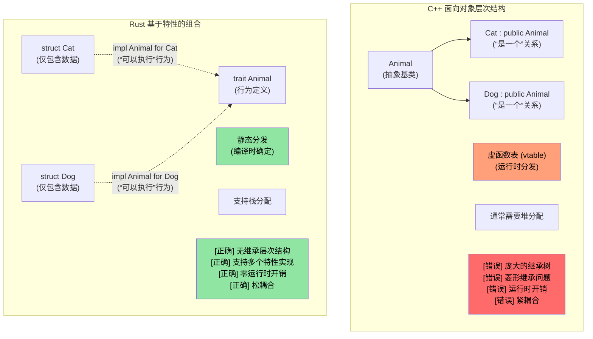
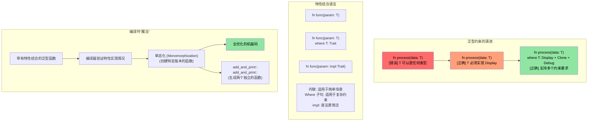

[English Original](../en/ch10-traits.md)

# Rust 特性 (Traits)

> **你将学到：** 特性 (Traits) —— Rust 对接口、抽象基类及运算符重载的解决方案。你将学习如何定义特性、为你的类型实现它们，以及如何使用动态分发 (`dyn Trait`) 与静态分发（泛型）。对于 C++ 开发者：特性取代了虚函数、CRTP 以及 Concepts。对于 C 开发者：特性是 Rust 实现多态的结构化方式。

- Rust 的特性类似于其他语言中的接口 (Interfaces)。
    - 特性定义了实现该特性的类型必须具备的方法。
```rust
fn main() {
    trait Pet {
        fn speak(&self);
    }
    struct Cat;
    struct Dog;
    impl Pet for Cat {
        fn speak(&self) {
            println!("喵");
        }
    }
    impl Pet for Dog {
        fn speak(&self) {
            println!("汪！")
        }
    }
    let c = Cat{};
    let d = Dog{};
    c.speak();  // Cat 和 Dog 之间不存在“是一个 (is-a)”的关系
    d.speak();  // Cat 和 Dog 之间不存在“是一个 (is-a)”的关系
}
```

---

## 特性 vs C++ Concepts 和接口

### 传统的 C++ 继承 vs Rust 特性

```cpp
// C++ - 基于继承的多态
class Animal {
public:
    virtual void speak() = 0;  // 纯虚函数
    virtual ~Animal() = default;
};

class Cat : public Animal {  // "Cat 是一个 (IS-A) Animal"
public:
    void speak() override {
        std::cout << "喵" << std::endl;
    }
};

void make_sound(Animal* animal) {  // 运行时多态
    animal->speak();  // 虚函数调用
}
```

```rust
// Rust - 组合优于继承，使用特性
trait Animal {
    fn speak(&self);
}

struct Cat;  // Cat 不是 Animal，但实现了 (IMPLEMENTS) Animal 的行为

impl Animal for Cat {  // "Cat 可以执行 (CAN-DO) Animal 的行为"
    fn speak(&self) {
        println!("喵");
    }
}

fn make_sound<T: Animal>(animal: &T) {  // 静态多态
    animal.speak();  // 直接调用函数（零开销）
}
```

---



---

### 特性结合 (Trait Bounds) 与泛型约束

```rust
use std::fmt::Display;
use std::ops::Add;

// C++ 模板等价物（约束较少）
// template<typename T>
// T add_and_print(T a, T b) {
//     // 无法保证 T 支持 + 运算或打印
//     return a + b;  // 可能会在编译时失败
// }

// Rust - 显式的特性结合 (Trait Bounds)
fn add_and_print<T>(a: T, b: T) -> T 
where 
    T: Display + Add<Output = T> + Copy,
{
    println!("正在计算 {} + {}", a, b);  // Display 特性
    a + b  // Add 特性
}
```

---



---

### C++ 运算符重载 → Rust `std::ops` 特性

在 C++ 中，你通过编写具有特殊名称（如 `operator+`、`operator<<`、`operator[]` 等）的普通函数或成员函数来实现运算符重载。在 Rust 中，每个运算符都对应 `std::ops`（或用于输出的 `std::fmt`）中的一个特性。你通过**实现该特性**来代替编写魔术名称的函数。

#### 侧面对比：`+` 运算符

```cpp
// C++: 运算符重载作为成员函数或普通函数
struct Vec2 {
    double x, y;
    Vec2 operator+(const Vec2& rhs) const {
        return {x + rhs.x, y + rhs.y};
    }
};

Vec2 a{1.0, 2.0}, b{3.0, 4.0};
Vec2 c = a + b;  // 调用 a.operator+(b)
```

```rust
use std::ops::Add;

#[derive(Debug, Clone, Copy)]
struct Vec2 { x: f64, y: f64 }

impl Add for Vec2 {
    type Output = Vec2;                     // 关联类型 —— + 运算的结果
    fn add(self, rhs: Vec2) -> Vec2 {
        Vec2 { x: self.x + rhs.x, y: self.y + rhs.y }
    }
}

let a = Vec2 { x: 1.0, y: 2.0 };
let b = Vec2 { x: 3.0, y: 4.0 };
let c = a + b;  // 调用 <Vec2 as Add>::add(a, b)
println!("{c:?}"); // Vec2 { x: 4.0, y: 6.0 }
```

---

#### 与 C++ 的关键区别

| 维度 | C++ | Rust |
|--------|-----|------|
| **机制** | 魔术名称的函数 (`operator+`) | 实现一个特性 (`impl Add for T`) |
| **可发现性** | 全局搜索 `operator+` 或阅读头文件 | 查看特性的实现情况 —— IDE 支持极佳 |
| **返回类型** | 自由选择 | 由 `Output` 关联类型固定 |
| **接收端** | 通常通过 `const T&`（借用） | 默认通过 `self` 以值 (Value) 方式获取（移动！） |
| **对称性** | 可以编写 `impl operator+(int, Vec2)` | 必须添加 `impl Add<Vec2> for i32` (受孤儿规则约束) |
| **用于打印的 `<<`** | `operator<<(ostream&, T)` —— 针对任意流进行重载 | `impl fmt::Display for T` —— 唯一规范的 `to_string` 表示 |

#### 关于 `self` 传值的陷阱

在 Rust 中，`Add::add(self, rhs)` 默认以**值 (Value)** 方式接收 `self`。对于 `Copy` 类型（如上文派生了 `Copy` 的 `Vec2`）这没有问题 —— 编译器会自动进行复制。但对于非 `Copy` 类型，`+` 运算符会**消耗 (Consume)** 操作数：

```rust
let s1 = String::from("hello ");
let s2 = String::from("world");
let s3 = s1 + &s2;  // s1 被 移动 (MOVE) 到了 s3 中！
// println!("{s1}");  // ❌ 编译错误：值在发生移动后被使用
println!("{s2}");     // ✅ s2 仅被借用 (&s2)
```

这就是为什么 `String + &str` 可以工作，而 `&str + &str` 却不行的原因 —— `Add` 仅为 `String + &str` 实现了重载，它会消耗左侧的 `String` 以复用其缓冲区。而在 C++ 中没有类似的机制：`std::string::operator+` 总是会创建一个新的字符串。

---

#### 完整对照表：C++ 运算符 → Rust 特性

| C++ 运算符 | Rust 特性 | 备注 |
|-------------|-----------|-------|
| `operator+` | `std::ops::Add` | `Output` 关联类型 |
| `operator-` | `std::ops::Sub` | |
| `operator*` | `std::ops::Mul` | 非指针解引用 —— 对应的是 `Deref` |
| `operator/` | `std::ops::Div` | |
| `operator%` | `std::ops::Rem` | |
| `operator-` (一元) | `std::ops::Neg` | |
| `operator!` / `operator~` | `std::ops::Not` | Rust 对逻辑和按位取反均使用 `!`（无 `~` 运算符） |
| `operator&`, `|`, `^` | `BitAnd`, `BitOr`, `BitXor` | |
| `operator<<`, `>>` (位移) | `Shl`, `Shr` | **非**流式 I/O！ |
| `operator+=` | `std::ops::AddAssign` | 接收 `&mut self`（而非 `self`） |
| `operator[]` | `std::ops::Index` / `IndexMut` | 返回 `&Output` / `&mut Output` |
| `operator()` | `Fn` / `FnMut` / `FnOnce` | 闭包实现了这些特性；你不能直接调用 `impl Fn` |
| `operator==` | `PartialEq` (+ `Eq`) | 位于 `std::cmp` 中，而非 `std::ops` |
| `operator<` | `PartialOrd` (+ `Ord`) | 位于 `std::cmp` 中 |
| `operator<<` (流) | `fmt::Display` | 用于 `println!("{}", x)` |
| `operator<<` (调试) | `fmt::Debug` | 用于 `println!("{:?}", x)` |
| `operator bool` | 无直接等价物 | 使用 `impl From<T> for bool` 或命名方法（如 `.is_empty()`） |
| `operator T()` (隐式转换) | 无隐式转换 | 使用 `From`/`Into` 特性（显式调用） |

#### 防护栏：Rust 禁止的行为

1. **禁止隐式转换**：C++ 的 `operator int()` 可能会导致意外的静默类型转换。Rust 不支持隐式转换运算符 —— 必须显式使用 `From`/`Into` 并调用 `.into()`。
2. **禁止重载 `&&` / `||`**：C++ 允许这样做（但这会破坏短路逻辑！）。Rust 则禁止。
3. **禁止重载 `=`**：赋值操作要么是移动，要么是复制，永远不能由用户自定义。复合赋值（如 `+=`）可以通过 `AddAssign` 等进行重载。
4. **禁止重载 `,`**：C++ 允许重载 `operator,()` —— 这是 C++ 中最臭名昭著的坑点之一。Rust 不支持。
5. **禁止重载 `&` (取地址)**：这是另一个 C++ 的坑点（为此 C++ 专门提供了 `std::addressof` 避坑）。Rust 的 `&` 永远代表“借用”。
6. **相干性 (Coherence) 规则**：你只能为你自己的类型实现外部特性，或者为外部类型实现你自己的特性 —— 绝不能为外部类型实现外部特性。这防止了不同单元包之间发生运算符重载冲突。

> **核心结论**：在 C++ 中，运算符重载虽然强大但缺乏监管 —— 只要你想，几乎可以重载任何东西（包括逗号和取地址符），且隐式转换可能会静默触发。Rust 通过特性在算术和比较运算方面提供了同等的表现力，但**封锁了历史上被证明危险的重载行为**，并强制所有转换必须显式进行。

---

# Rust 特性

- Rust 允许在内置类型（如本例中的 `u32`）上实现用户定义的特性。但是，特性或类型本身必须至少有一个属于当前的单元包（Crate）。
```rust
trait IsSecret {
    fn is_secret(&self);
}
// IsSecret 特性属于当前单元包，所以这样做是合法的
impl IsSecret for u32 {
    fn is_secret(&self) {
        if *self == 42 {
            println!("这是生命的秘密");
        }
    }
}

fn main() {
    42u32.is_secret();
    43u32.is_secret();
}
```

---

# Rust 特性

- 特性支持接口继承与默认实现。
```rust
trait Animal {
  // 默认实现
  fn is_mammal(&self) -> bool {
    true
  }
}
trait Feline : Animal {
  // 默认实现
  fn is_feline(&self) -> bool {
    true
  }
}

struct Cat;
// 使用默认实现。请注意，所有的父特性 (Supertrait) 都必须被单独实现。
impl Feline for Cat {}
impl Animal for Cat {}

fn main() {
  let c = Cat{};
  println!("是哺乳动物：{} 是猫科动物：{}", c.is_mammal(), c.is_feline());
}
```

---

# 练习：实现 Logger 特性

🟡 **中级**

- 实现一个名为 `Log` 的特性，包含一个名为 `log()` 且接收一个 `u64` 参数的方法。
    - 实现两个不同的记录器：`SimpleLogger` 和 `ComplexLogger`。它们都需实现 `Log` 特性。
    - 前者应输出 "Simple logger" 以及传入的 `u64` 值；后者应输出 "Complex logger" 连同该 `u64` 值及其十六进制、二进制格式。

<details><summary>参考答案 (点击展开)</summary>

```rust
trait Log {
    fn log(&self, value: u64);
}

struct SimpleLogger;
struct ComplexLogger;

impl Log for SimpleLogger {
    fn log(&self, value: u64) {
        println!("Simple logger: {value}");
    }
}

impl Log for ComplexLogger {
    fn log(&self, value: u64) {
        println!("Complex logger: {value} (十六进制: 0x{value:x}, 二进制: {value:b})");
    }
}

fn main() {
    let simple = SimpleLogger;
    let complex = ComplexLogger;
    simple.log(42);
    complex.log(42);
}
```
**输出示例：**
```text
Simple logger: 42
Complex logger: 42 (十六进制: 0x2a, 二进制: 101010)
```

</details>

---

# Rust 特性关联类型 (Associated Types)
```rust
#[derive(Debug)]
struct Small(u32);
#[derive(Debug)]
struct Big(u32);
trait Double {
    type T;
    fn double(&self) -> Self::T;
}

impl Double for Small {
    type T = Big;
    fn double(&self) -> Self::T {
        Big(self.0 * 2)
    }
}
fn main() {
    let a = Small(42);
    println!("{:?}", a.double());
}
```

---

# Rust 特性实现 (Trait `impl`)
- `impl` 关键字可以与特性结合使用，通过 `&impl Trait` 来接收任何实现了指定特性的类型。
```rust
trait Pet {
    fn speak(&self);
}
struct Dog {}
struct Cat {}
impl Pet for Dog {
    fn speak(&self) {println!("汪！")}
}
impl Pet for Cat {
    fn speak(&self) {println!("喵")}
}
fn pet_speak(p: &impl Pet) {
    p.speak();
}
fn main() {
    let c = Cat {};
    let d = Dog {};
    pet_speak(&c);
    pet_speak(&d);
}
```

---

# Rust 特性实现 (Trait `impl`)
- `impl` 关键字亦可用于返回值。
```rust
trait Pet {}
struct Dog;
struct Cat;
impl Pet for Cat {}
impl Pet for Dog {}
fn cat_as_pet() -> impl Pet {
    let c = Cat {};
    c
}
fn dog_as_pet() -> impl Pet {
    let d = Dog {};
    d
}
fn main() {
    let _p = cat_as_pet();
    let _d = dog_as_pet();
}
```

---

# Rust 动态特性 (Dynamic Traits)
- 动态特性可用于在不了解具体底层类型的情况下调用特性的功能。这种机制被称为“类型擦除 (Type Erasure)”。
```rust
trait Pet {
    fn speak(&self);
}
struct Dog {}
struct Cat {x: u32}
impl Pet for Dog {
    fn speak(&self) {println!("汪！")}
}
impl Pet for Cat {
    fn speak(&self) {println!("喵")}
}
fn pet_speak(p: &dyn Pet) {
    p.speak();
}
fn main() {
    let c = Cat {x: 42};
    let d = Dog {};
    pet_speak(&c);
    pet_speak(&d);
}
```

---

## 在 `impl Trait`、`dyn Trait` 和枚举之间进行选择

这三种方法都能实现多态，但各有权衡：

| 方法 | 分发方式 | 性能 | 异构集合？ | 适用场景 |
|----------|----------|-------------|---------------------------|-------------|
| `impl Trait` / 泛型 | 静态 (单态化) | 零开销 —— 在编译时内联 | 不支持 —— 每个位置只能是单一具体类型 | 默认方案。函数参数、返回值 |
| `dyn Trait` | 动态 (虚函数表) | 每次调用有微小开销（约 1 次指针寻址） | **支持** —— 如 `Vec<Box<dyn Trait>>` | 需要在集合中存放混合类型，或支持插件式扩展时 |
| `enum` | 类型匹配 (Match) | 零开销 —— 编译时变元已知 | **支持** —— 但变元必须已知 | 当变元集合是**封闭**且在编译时已知时 |

```rust
trait Shape {
    fn area(&self) -> f64;
}
struct Circle { radius: f64 }
struct Rect { w: f64, h: f64 }
impl Shape for Circle { fn area(&self) -> f64 { std::f64::consts::PI * self.radius * self.radius } }
impl Shape for Rect   { fn area(&self) -> f64 { self.w * self.h } }

// 静态分发 —— 编译器为每种类型生成独立的代码
fn print_area(s: &impl Shape) { println!("{}", s.area()); }

// 动态分发 —— 只有一个函数，通过指针处理任何形状 (Shape)
fn print_area_dyn(s: &dyn Shape) { println!("{}", s.area()); }

// 枚举 —— 变元集合封闭，无需特性
enum ShapeEnum { Circle(f64), Rect(f64, f64) }
impl ShapeEnum {
    fn area(&self) -> f64 {
        match self {
            ShapeEnum::Circle(r) => std::f64::consts::PI * r * r,
            ShapeEnum::Rect(w, h) => w * h,
        }
    }
}
```

> **对于 C++ 开发者**：`impl Trait` 类似于 C++ 模板（单态化、零开销）。`dyn Trait` 类似于 C++ 虚函数（虚表分发）。Rust 带有 `match` 的枚举类似于 `std::variant` 结合 `std::visit` —— 但 Rust 编译器会强制要求进行穷尽性匹配。

> **经验法则**：优先使用 `impl Trait`（静态分发）。只有当你需要异构集合，或者在编译时无法确定具体类型时，才考虑使用 `dyn Trait`。而在你拥有（并控制）所有可能的变元时，请使用 `enum`。

---
