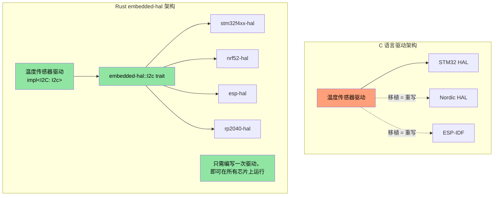
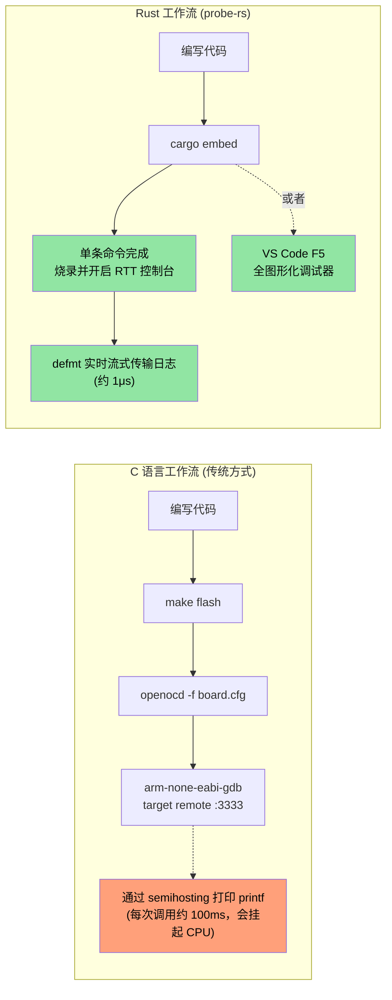

[English Original](../en/ch15-1-embedded-deep-dive.md)

## MMIO 与 Volatile 寄存器访问

> **你将学到：** 嵌入式 Rust 中类型安全的硬件寄存器访问 —— volatile MMIO 模式、寄存器抽象 crate，以及 Rust 的类型系统如何编码 C 语言 `volatile` 关键字无法实现的寄存器权限。

在 C 语言固件中，你通过指向特定内存地址的 `volatile` 指针来访问硬件寄存器。Rust 也有类似的机制 —— 但具备类型安全性。

### C 语言 volatile 对比 Rust volatile

```c
// C — 典型的 MMIO 寄存器访问
#define GPIO_BASE     0x40020000
#define GPIO_MODER    (*(volatile uint32_t*)(GPIO_BASE + 0x00))
#define GPIO_ODR      (*(volatile uint32_t*)(GPIO_BASE + 0x14))

void toggle_led(void) {
    GPIO_ODR ^= (1 << 5);  // 翻转第 5 引脚
}
```

```rust
// Rust — 原始 volatile（底层机制，极少直接使用）
use core::ptr;

const GPIO_BASE: usize = 0x4002_0000;
const GPIO_ODR: *mut u32 = (GPIO_BASE + 0x14) as *mut u32;

/// # 安全性 (Safety)
/// 调用者必须确保 GPIO_BASE 是一个有效的已映射外设地址。
unsafe fn toggle_led() {
    // 安全性：GPIO_ODR 是一个有效的内存映射寄存器地址。
    let current = unsafe { ptr::read_volatile(GPIO_ODR) };
    unsafe { ptr::write_volatile(GPIO_ODR, current ^ (1 << 5)) };
}
```

---

### svd2rust —— 类型安全的寄存器访问（Rust 方式）

在实践中，你**绝不会**直接编写原始 volatile 指针。相反，`svd2rust` 会根据芯片的 SVD 文件（即 IDE 调试视图所使用的同一个 XML 文件）生成一个**外设访问 Crate (PAC)**：

```rust
// 生成的 PAC 代码（您无需编写 —— 由 svd2rust 完成）
// PAC 将无效的寄存器访问变为编译错误

// 使用 PAC：
use stm32f4::stm32f401;  // 针对您芯片的 PAC crate

fn configure_gpio(dp: stm32f401::Peripherals) {
    // 启用 GPIOA 时钟 —— 类型安全，无魔法数字
    dp.RCC.ahb1enr.modify(|_, w| w.gpioaen().enabled());

    // 将第 5 引脚设为输出 —— 不会意外写入只读字段
    dp.GPIOA.moder.modify(|_, w| w.moder5().output());

    // 翻转第 5 引脚 —— 经过类型检查的字段访问
    dp.GPIOA.odr.modify(|r, w| {
        // 安全性：翻转有效寄存器字段中的单个位。
        unsafe { w.bits(r.bits() ^ (1 << 5)) }
    });
}
```

| C 语言寄存器访问 | Rust PAC 等效操作 |
|-------------------|---------------------|
| `#define REG (*(volatile uint32_t*)ADDR)` | 由 `svd2rust` 生成的 PAC crate |
| `REG |= BITMASK;` | `periph.reg.modify(\|_, w\| w.field().variant())` |
| `value = REG;` | `let val = periph.reg.read().field().bits()` |
| 错误的寄存器字段 → 静默 UB | 编译错误 —— 字段不存在 |
| 错误的寄存器宽度 → 静默 UB | 类型检查 —— u8 vs u16 vs u32 |

---

## 中断处理与临界区 (Critical Sections)

C 语言固件使用 `__disable_irq()` / `__enable_irq()` 函数以及返回值为 `void` 的 ISR（中断服务例程）函数。Rust 提供了对应的类型安全等效功能。

### C 对比 Rust 的中断模式

```c
// C — 传统中断处理程序
volatile uint32_t tick_count = 0;

void SysTick_Handler(void) {   // 命名约定至关重要 —— 弄错会导致 HardFault
    tick_count++;
}

uint32_t get_ticks(void) {
    __disable_irq();
    uint32_t t = tick_count;   // 在临界区内读取
    __enable_irq();
    return t;
}
```

```rust
// Rust — 使用 cortex-m 和临界区
use core::cell::Cell;
use cortex_m::interrupt::{self, Mutex};

// 受临界区 Mutex 保护的共享状态
static TICK_COUNT: Mutex<Cell<u32>> = Mutex::new(Cell::new(0));

#[cortex_m_rt::exception]     // 属性确保在中断向量表中正确放置
fn SysTick() {                // 如果名称与有效的异常不匹配，则会报错
    interrupt::free(|cs| {    // cs = 临界区 Token（证明已禁用中断）
        let count = TICK_COUNT.borrow(cs).get();
        TICK_COUNT.borrow(cs).set(count + 1);
    });
}

fn get_ticks() -> u32 {
    interrupt::free(|cs| TICK_COUNT.borrow(cs).get())
}
```

---

### RTIC —— 实时中断驱动并发 (Real-Time Interrupt-driven Concurrency)

对于具有多个中断优先级的复杂固件，RTIC（原名为 RTFM）提供**零成本开销的编译时任务调度**：

```rust
#[rtic::app(device = stm32f4xx_hal::pac, dispatchers = [USART1])]
mod app {
    use stm32f4xx_hal::prelude::*;

    #[shared]
    struct Shared {
        temperature: f32,   // 在任务间共享 —— RTIC 负责管理锁定
    }

    #[local]
    struct Local {
        led: stm32f4xx_hal::gpio::Pin<'A', 5, stm32f4xx_hal::gpio::Output>,
    }

    #[init]
    fn init(cx: init::Context) -> (Shared, Local) {
        let dp = cx.device;
        let gpioa = dp.GPIOA.split();
        let led = gpioa.pa5.into_push_pull_output();
        (Shared { temperature: 25.0 }, Local { led })
    }

    // 硬件任务：在 SysTick 中断时运行
    #[task(binds = SysTick, shared = [temperature], local = [led])]
    fn tick(mut cx: tick::Context) {
        cx.local.led.toggle();
        cx.shared.temperature.lock(|temp| {
            // RTIC 保证此处是独占访问 —— 不需要手动加锁
            *temp += 0.1;
        });
    }
}
```

**为什么 RTIC 对于 C 语言固件开发者很重要：**
- `#[shared]` 注解取代了手动的互斥锁管理。
- 基于优先级的抢占式调度在编译时完成配置 —— 无运行时开销。
- 借由框架设计，在编译时即可证明不存在死锁。
- ISR 的命名错误在编译阶段报错，而不是在运行时引发 HardFault。

---

## Panic 句柄策略

在 C 语言中，当固件出错时，你通常会选择复位或让 LED 闪烁。Rust 的 panic 句柄则提供了更为结构化的控制：

```rust
// 策略 1：挂起（用于调试 —— 连接调试器，检查状态）
use panic_halt as _;  // 发生 panic 时进入无限循环

// 策略 2：复位 MCU
use panic_reset as _;  // 触发系统复位

// 策略 3：通过调试器探针记录（开发阶段）
use panic_probe as _;  // 通过调试探针发送 panic 信息（需配合 defmt）

// 策略 4：通过 defmt 记录并挂起
use defmt_panic as _;  // 通过 ITM/RTT 发送丰富的 panic 信息

// 策略 5：自定义句柄（生产环节固件）
use core::panic::PanicInfo;

#[panic_handler]
fn panic(info: &PanicInfo) -> ! {
    // 1. 禁用中断以防止进一步破坏
    cortex_m::interrupt::disable();

    // 2. 将 panic 信息写入预留的 RAM 区域（复位后仍然保留）
    // 安全性：PANIC_LOG 是链接脚本中定义的预留内存区域。
    unsafe {
        let log = 0x2000_0000 as *mut [u8; 256];
        // 写入截断后的 panic 信息
        use core::fmt::Write;
        let mut writer = FixedWriter::new(&mut *log);
        let _ = write!(writer, "{}", info);
    }

    // 3. 触发看门狗复位（或者让错误 LED 闪烁）
    loop {
        cortex_m::asm::wfi();  // 等待中断（挂起期间保持低功耗）
    }
}
```

---

## 链接脚本与内存布局

C 语言固件开发者通过编写链接脚本（Linker Scripts）来定义 FLASH/RAM 区域。嵌入式 Rust 借由 `memory.x` 实现了同样的概念：

```ld
/* memory.x —— 置于 crate 根部，由 cortex-m-rt 使用 */
MEMORY
{
  /* 针对您的 MCU 进行调整 —— 这里是 STM32F401 的取值 */
  FLASH : ORIGIN = 0x08000000, LENGTH = 512K
  RAM   : ORIGIN = 0x20000000, LENGTH = 96K
}

/* 可选：为 panic 日志预留空间（参见上方的 panic 句柄） */
_panic_log_start = ORIGIN(RAM);
_panic_log_size  = 256;
```

```toml
# .cargo/config.toml —— 设置目标平台及链接器标志
[target.thumbv7em-none-eabihf]
runner = "probe-rs run --chip STM32F401RE"  # 通过调试探针进行烧录并运行
rustflags = [
    "-C", "link-arg=-Tlink.x",              # cortex-m-rt 链接脚本
]

[build]
target = "thumbv7em-none-eabihf"            # 带有硬件 FPU 的 Cortex-M4F
```

| C 链接脚本 | Rust 等效项 |
|-----------------|-----------------|
| `MEMORY { FLASH ..., RAM ... }` | crate 根部的 `memory.x` |
| `__attribute__((section(".data")))` | `#[link_section = ".data"]` |
| Makefile 中的 `-T linker.ld` | `.cargo/config.toml` 中的 `-C link-arg=-Tlink.x` |
| `__bss_start__`, `__bss_end__` | 由 `cortex-m-rt` 自动处理 |
| 启动汇编 (`startup.s`) | `cortex-m-rt` 的 `#[entry]` 宏 |

---

## 编写 `embedded-hal` 驱动程序

`embedded-hal` crate 为 SPI、I2C、GPIO、UART 等定义了 Trait。基于这些 Trait 编写的驱动程序可以运行在**任意 MCU** 上 —— 这正是 Rust 在嵌入式领域实现代码复用的“杀手锏”。

### C 语言对比 Rust：温度传感器驱动程序

```c
// C — 驱动代码与 STM32 HAL 库紧密耦合
#include "stm32f4xx_hal.h"

float read_temperature(I2C_HandleTypeDef* hi2c, uint8_t addr) {
    uint8_t buf[2];
    HAL_I2C_Mem_Read(hi2c, addr << 1, 0x00, I2C_MEMADD_SIZE_8BIT,
                     buf, 2, HAL_MAX_DELAY);
    int16_t raw = ((int16_t)buf[0] << 4) | (buf[1] >> 4);
    return raw * 0.0625;
}
// 问题：该驱动仅能配合 STM32 HAL 运行。若要移植到 Nordic 平台，必须重写。
```

```rust
// Rust — 只要是实现了 embedded-hal 的 MCU，该驱动均可运行
use embedded_hal::i2c::I2c;

pub struct Tmp102<I2C> {
    i2c: I2C,
    address: u8,
}

impl<I2C: I2c> Tmp102<I2C> {
    pub fn new(i2c: I2C, address: u8) -> Self {
        Self { i2c, address }
    }

    pub fn read_temperature(&mut self) -> Result<f32, I2C::Error> {
        let mut buf = [0u8; 2];
        self.i2c.write_read(self.address, &[0x00], &mut buf)?;
        let raw = ((buf[0] as i16) << 4) | ((buf[1] as i16) >> 4);
        Ok(raw as f32 * 0.0625)
    }
}

// 可运行于 STM32、Nordic nRF、ESP32、RP2040 —— 任何带有 embedded-hal I2C 实现的芯片
```

---



---

## 全局分配器设置

`alloc` crate 为您提供了 `Vec`、`String`、`Box` 等功能 —— 但您需要告知 Rust 堆内存（heap memory）的来源。这等同于为您的平台实现 `malloc()`：

```rust
#![no_std]
extern crate alloc;

use alloc::vec::Vec;
use alloc::string::String;
use embedded_alloc::LlffHeap as Heap;

#[global_allocator]
static HEAP: Heap = Heap::empty();

#[cortex_m_rt::entry]
fn main() -> ! {
    // 使用一块内存区域初始化分配器
    // （通常是 RAM 中未被栈或静态数据占用的部分）
    {
        const HEAP_SIZE: usize = 4096;
        static mut HEAP_MEM: [u8; HEAP_SIZE] = [0; HEAP_SIZE];
        // 安全性：HEAP_MEM 仅在此初始化期间被访问，且位于任何分配操作发生之前。
        unsafe { HEAP.init(HEAP_MEM.as_ptr() as usize, HEAP_SIZE) }
    }

    // 现在可以使用堆类型了！
    let mut log_buffer: Vec<u8> = Vec::with_capacity(256);
    let name: String = String::from("sensor_01");
    // ...

    loop {}
}
```

| C 堆设置 | Rust 等效项 |
|-------------|-----------------|
| `_sbrk()` / 自定义 `malloc()` | `#[global_allocator]` + `Heap::init()` |
| `configTOTAL_HEAP_SIZE` (FreeRTOS) | `HEAP_SIZE` 常量 |
| `pvPortMalloc()` | `alloc::vec::Vec::new()` —— 自动完成 |
| 堆耗尽 → 未定义行为 | `alloc_error_handler` → 可控的 panic |

---

## `no_std` 与 `std` 混合的工作空间 (Workspaces)

真实项目（如大型 Rust 工作空间）通常包含以下结构：
- 用于硬件无关逻辑的 `no_std` 库 Crate
- 用于 Linux 应用层的 `std` 二进制 Crate

```text
workspace_root/
├── Cargo.toml              # [workspace] members = [...]
├── protocol/               # no_std — 有线协议、解析
│   ├── Cargo.toml          # 禁用默认特性 (no default-features)，无 std
│   └── src/lib.rs          # #![no_std]
├── driver/                 # no_std — 硬件抽象
│   ├── Cargo.toml
│   └── src/lib.rs          # #![no_std]，使用 embedded-hal trait
├── firmware/               # no_std — MCU 二进制文件
│   ├── Cargo.toml          # 依赖 protocol 与 driver
│   └── src/main.rs         # #![no_std] #![no_main]
└── host_tool/              # std — Linux 命令行工具
    ├── Cargo.toml          # 依赖 protocol（同一个 crate！）
    └── src/main.rs         # 使用 std::fs、std::net 等
```

关键模式：`protocol` crate 使用 `#![no_std]`，因此它既可以为 MCU 固件编译，也可以为 Linux 主机工具编译。代码共享，零重复。

```toml
# protocol/Cargo.toml
[package]
name = "protocol"

[features]
default = []
std = []  # 可选：为主机构建时启用特定于 std 的功能

[dependencies]
serde = { version = "1", default-features = false, features = ["derive"] }
# 注意：default-features = false 会丢弃 serde 对 std 的依赖
```

---

```rust
// protocol/src/lib.rs
#![cfg_attr(not(feature = "std"), no_std)]

#[cfg(feature = "std")]
extern crate std;

extern crate alloc;
use alloc::vec::Vec;
use serde::{Serialize, Deserialize};

#[derive(Debug, Serialize, Deserialize)]
pub struct DiagPacket {
    pub sensor_id: u16,
    pub value: i32,
    pub fault_code: u16,
}

// 该函数在 no_std 和 std 上下文中均可正常工作
pub fn parse_packet(data: &[u8]) -> Result<DiagPacket, &'static str> {
    if data.len() < 8 {
        return Err("数据包太短");
    }
    Ok(DiagPacket {
        sensor_id: u16::from_le_bytes([data[0], data[1]]),
        value: i32::from_le_bytes([data[2], data[3], data[4], data[5]]),
        fault_code: u16::from_le_bytes([data[6], data[7]]),
    })
}
```

---

## 练习：硬件抽象层 (HAL) 驱动程序

为假想的、通过 SPI 进行通信的 LED 控制器实现一个 `no_std` 驱动程序。该驱动程序应对使用 `embedded-hal` 的任何 SPI 实现进行泛型化。

**要求：**
1. 定义一个 `LedController<SPI>` 结构体。
2. 实现 `new()`、`set_brightness(led: u8, brightness: u8)` 以及 `all_off()` 函数。
3. SPI 协议：将 `[led_index, brightness_value]` 作为 2 字节事务发送。
4. 使用模拟 (mock) SPI 实现编写测试。

```rust
// 初始代码
#![no_std]
use embedded_hal::spi::SpiDevice;

pub struct LedController<SPI> {
    spi: SPI,
    num_leds: u8,
}

// 待办：实现 new(), set_brightness(), all_off()
// 待办：创建用于测试的 MockSpi
```

---

<details><summary>参考答案 (点击展开)</summary>

```rust
#![no_std]
use embedded_hal::spi::SpiDevice;

pub struct LedController<SPI> {
    spi: SPI,
    num_leds: u8,
}

impl<SPI: SpiDevice> LedController<SPI> {
    pub fn new(spi: SPI, num_leds: u8) -> Self {
        Self { spi, num_leds }
    }

    pub fn set_brightness(&mut self, led: u8, brightness: u8) -> Result<(), SPI::Error> {
        if led >= self.num_leds {
            return Ok(()); // 静默忽略超出范围的 LED
        }
        self.spi.write(&[led, brightness])
    }

    pub fn all_off(&mut self) -> Result<(), SPI::Error> {
        for led in 0..self.num_leds {
            self.spi.write(&[led, 0])?;
        }
        Ok(())
    }
}

#[cfg(test)]
mod tests {
    use super::*;

    // 记录所有事务的 Mock SPI
    struct MockSpi {
        transactions: Vec<Vec<u8>>,
    }

    // 针对 mock 的最小化错误类型
    #[derive(Debug)]
    struct MockError;
    impl embedded_hal::spi::Error for MockError {
        fn kind(&self) -> embedded_hal::spi::ErrorKind {
            embedded_hal::spi::ErrorKind::Other
        }
    }

    impl embedded_hal::spi::ErrorType for MockSpi {
        type Error = MockError;
    }

    impl SpiDevice for MockSpi {
        fn write(&mut self, buf: &[u8]) -> Result<(), Self::Error> {
            self.transactions.push(buf.to_vec());
            Ok(())
        }
        fn read(&mut self, _buf: &mut [u8]) -> Result<(), Self::Error> { Ok(()) }
        fn transfer(&mut self, _r: &mut [u8], _w: &[u8]) -> Result<(), Self::Error> { Ok(()) }
        fn transfer_in_place(&mut self, _buf: &mut [u8]) -> Result<(), Self::Error> { Ok(()) }
        fn transaction(&mut self, _ops: &mut [embedded_hal::spi::Operation<'_, u8>]) -> Result<(), Self::Error> { Ok(()) }
    }

    #[test]
    fn test_set_brightness() {
        let mock = MockSpi { transactions: vec![] };
        let mut ctrl = LedController::new(mock, 4);
        ctrl.set_brightness(2, 128).unwrap();
        assert_eq!(ctrl.spi.transactions, vec![vec![2, 128]]);
    }

    #[test]
    fn test_all_off() {
        let mock = MockSpi { transactions: vec![] };
        let mut ctrl = LedController::new(mock, 3);
        ctrl.all_off().unwrap();
        assert_eq!(ctrl.spi.transactions, vec![
            vec![0, 0], vec![1, 0], vec![2, 0],
        ]);
    }

    #[test]
    fn test_out_of_range_led() {
        let mock = MockSpi { transactions: vec![] };
        let mut ctrl = LedController::new(mock, 2);
        ctrl.set_brightness(5, 255).unwrap(); // 超出范围 —— 被忽略
        assert!(ctrl.spi.transactions.is_empty());
    }
}
```

</details>

---

## 调试嵌入式 Rust —— probe-rs、defmt 以及 VS Code

C 语言固件开发者通常使用 OpenOCD + GDB 或厂商特定的 IDE（如 Keil、IAR、Segger Ozone）进行调试。Rust 嵌入式生态系统已经收敛于使用 **probe-rs** 作为统一的调试探针接口，用单一的 Rust 原生工具取代了 OpenOCD + GDB 组合。

### probe-rs —— 全能型调试探针工具

`probe-rs` 取代了 OpenOCD + GDB。它开箱即用地支持 CMSIS-DAP、ST-Link、J-Link 以及其他多种调试探针：

```bash
# 安装 probe-rs (包含 cargo-flash 和 cargo-embed)
cargo install probe-rs-tools

# 烧录并运行您的固件
cargo flash --chip STM32F401RE --release

# 烧录、运行并开启 RTT (Real-Time Transfer) 控制台
cargo embed --chip STM32F401RE
```

**probe-rs 对比 OpenOCD + GDB**：

| 特性 | OpenOCD + GDB | probe-rs |
|--------|--------------|----------|
| 安装 | 2 个独立的包 + 脚本文件 | `cargo install probe-rs-tools` |
| 配置 | 每个板卡/探针对应 `.cfg` 文件 | `--chip` 标志或 `Embed.toml` |
| 控制台输出 | Semihosting (速度非常慢) | RTT (快约 10 倍) |
| 日志框架 | `printf` | `defmt` (结构化，零成本开销) |
| 烧录算法 | XML 包文件 | 内建支持 1000 多种芯片 |
| GDB 支持 | 原生支持 | `probe-rs gdb` 适配器 |

---

### `Embed.toml` —— 项目配置

probe-rs 不再需要繁琐的 `.cfg` 和 `.gdbinit` 文件，而是使用单一配置：

```toml
# Embed.toml —— 放置在项目根目录下
[default.general]
chip = "STM32F401RETx"

[default.rtt]
enabled = true           # 开启 Real-Time Transfer 控制台
channels = [
    { up = 0, mode = "BlockIfFull", name = "Terminal" },
]

[default.flashing]
enabled = true           # 运行前进行烧录
restore_unwritten_bytes = false

[default.reset]
halt_afterwards = false  # 烧录后立即复位并运行

[default.gdb]
enabled = false          # 设为 true 可将 GDB 服务器开启在 :1337 端口
gdb_connection_string = "127.0.0.1:1337"
```

```bash
# 配置好 Embed.toml 后，只需运行：
cargo embed              # 烧录 + RTT 控制台 —— 无需额外参数
cargo embed --release    # Release 版本构建
```

---

### defmt —— 面向嵌入式日志的延迟格式化

`defmt` (deferred formatting) 取代了原来的 `printf` 调试方式。格式化字符串存储在 ELF 文件中，而不是 FLASH 里面。这样，目标芯片在执行日志调用时，仅需发送一个索引 + 对应的参数字节。这使得日志记录速度比 `printf` 快 **10–100 倍**，且仅消耗极小比例的 FLASH 空间：

```rust
#![no_std]
#![no_main]

use defmt::{info, warn, error, debug, trace};
use defmt_rtt as _; // RTT 传输层 —— 将 defmt 的输出链接至 probe-rs

#[cortex_m_rt::entry]
fn main() -> ! {
    info!("启动完成，固件版本 v{}", env!("CARGO_PKG_VERSION"));

    let sensor_id: u16 = 0x4A;
    let temperature: f32 = 23.5;

    // 格式化字符串存储在 ELF 文件中，而非 FLASH —— 实现近乎于零的运行负担
    debug!("传感器 {:#06X}: {:.1}°C", sensor_id, temperature);

    if temperature > 80.0 {
        warn!("传感器 {:#06X} 过热: {:.1}°C", sensor_id, temperature);
    }

    loop {
        cortex_m::asm::wfi(); // 等待中断
    }
}

// 自定义类型 —— 派生 defmt::Format 而非 Debug
#[derive(defmt::Format)]
struct SensorReading {
    id: u16,
    value: i32,
    status: SensorStatus,
}

#[derive(defmt::Format)]
enum SensorStatus {
    Ok,
    Warning,
    Fault(u8),
}

// 用法示例：
// info!("读取结果：{:?}", reading);  // <-- 使用的是 defmt::Format，而非 std 中的 Debug
```

**defmt 对比 `printf` 对比 `log`**：

| 特性 | C 语言 `printf` (semihosting) | Rust `log` crate | `defmt` |
|---------|-------------------------|-------------------|---------|
| 速度 | 每次调用约 100ms | N/A (需要 `std`) | 每次调用约 1μs |
| FLASH 占用 | 包含完整的格式化字符串 | 包含完整的格式化字符串 | 仅索引（字节） |
| 传输方式 | Semihosting (挂起 CPU) | 串口/UART | RTT (非阻塞) |
| 结构化输出 | 否 | 仅文本 | 强类型、二进制编码 |
| `no_std` 支持 | 通过 semihosting 支持 | 仅提供 Facade (后端需要 `std`) | ✅ 原生支持 |
| 过滤级别 | 手动 `#ifdef` | `RUST_LOG=debug` | `defmt::println` + features |

---

### VS Code 调试配置

配合 `probe-rs` 的 VS Code 插件，您可以获得完整的图形化调试体验 —— 包括断点设置、变量检查、调用栈查看以及寄存器视图：

```jsonc
// .vscode/launch.json
{
    "version": "0.2.0",
    "configurations": [
        {
            "type": "probe-rs-debug",
            "request": "launch",
            "name": "烧录并调试 (probe-rs)",
            "chip": "STM32F401RETx",
            "coreConfigs": [
                {
                    "programBinary": "target/thumbv7em-none-eabihf/debug/${workspaceFolderBasename}",
                    "rttEnabled": true,
                    "rttChannelFormats": [
                        {
                            "channelNumber": 0,
                            "dataFormat": "Defmt",
                            "showTimestamps": true
                        }
                    ]
                }
            ],
            "connectUnderReset": true,
            "speed": 4000
        }
    ]
}
```

安装该插件：
```rust
ext install probe-rs.probe-rs-debugger
```

---

### C 语言调试工作流对比 Rust 嵌入式调试



| C 语言调试操作 | Rust 等效操作 |
|---------------|-----------------|
| `openocd -f board/st_nucleo_f4.cfg` | `probe-rs info` (自动检测探针与芯片) |
| `arm-none-eabi-gdb -x .gdbinit` | `probe-rs gdb --chip STM32F401RE` |
| `target remote :3333` | GDB 连接至 `localhost:1337` |
| `monitor reset halt` | `probe-rs reset --chip ...` |
| `load firmware.elf` | `cargo flash --chip ...` |
| `printf("debug: %d\n", val)` (semihosting) | `defmt::info!("debug: {}", val)` (RTT) |
| Keil/IAR 图形化调试器 | VS Code + `probe-rs-debugger` 插件 |
| Segger SystemView | `defmt` + `probe-rs` RTT 查看器 |

> **交叉引用**：关于在嵌入式驱动中使用的进阶不安全模式（如引脚投影、自定义 arena/slab 分配器），请参阅配套的《Rust 设计模式 (Rust Patterns)》指南中的“Pin 投影 —— 结构化 Pinning”以及“自定义分配器 —— Arena 与 Slab 模式”章节。

---
