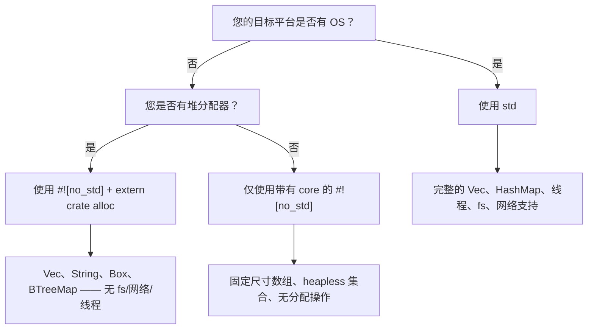

[English Original](../en/ch15-no_std-rust-without-the-standard-library.md)

# `no_std` —— 不依赖标准库的 Rust

> **你将学到：** 如何使用 `#![no_std]` 为裸机和嵌入式目标编写 Rust 代码 —— `core` 与 `alloc` crate 的拆分、panic 句柄，以及这与不带 `libc` 的嵌入式 C 的对比。

如果你拥有嵌入式 C 开发背景，想必已经习惯了在没有 `libc` 或只有极简运行时的环境下工作。Rust 也有一个同等级别的原生功能：**`#![no_std]`** 属性。

## 什么是 `no_std`？

当你在 crate 根部添加 `#![no_std]` 时，编译器会移除隐式的 `extern crate std;`，并仅链接至 **`core`**（以及可选的 **`alloc`**）。

| 层次 | 提供的内容 | 是否需要 OS / 堆？ |
|-------|-----------------|---------------------|
| `core` | 基础类型、`Option`、`Result`、`Iterator`、数学运算、`slice`、`str`、原子操作、`fmt` | **不需要** —— 运行于裸机之上 |
| `alloc` | `Vec`、`String`、`Box`、`Rc`、`Arc`、`BTreeMap` | 需要全局分配器，但**不需要 OS** |
| `std` | `HashMap`、`fs`、`net`、`thread`、`io`、`env`、`process` | **需要** —— 必须有 OS 支持 |

> **面向嵌入式开发者的经验准则：** 如果你的 C 项目链接了 `-lc` 并使用了 `malloc`，那么你大概可以使用 `core` + `alloc`。如果它是在没有 `malloc` 的裸机上运行，请仅坚持使用 `core`。

---

## 声明 `no_std`

```rust
// src/lib.rs （或带有 #![no_main] 的二进制程序 src/main.rs）
#![no_std]

// 你仍然可以从 `core` 获得所有内容：
use core::fmt;
use core::result::Result;
use core::option::Option;

// 如果有分配器，选择使用堆类型：
extern crate alloc;
use alloc::vec::Vec;
use alloc::string::String;
```

对于裸机二进制程序，你还需要 `#![no_main]` 和一个 panic 句柄：

```rust
#![no_std]
#![no_main]

use core::panic::PanicInfo;

#[panic_handler]
fn panic(_info: &PanicInfo) -> ! {
    loop {} // 在发生 panic 时挂起 —— 替换为您开发板的复位/LED 闪烁逻辑
}

// 入口点取决于您的 HAL / 链接器脚本
```

---

## 权衡与替代方案

| `std` 功能 | `no_std` 替代方案 |
|---------------|---------------------|
| `println!` | `core::write!` 输出到 UART / `defmt` |
| `HashMap` | `heapless::FnvIndexMap` (固定容量) 或 `BTreeMap` (通过 `alloc`) |
| `Vec` | `heapless::Vec` (栈分配，固定容量) |
| `String` | `heapless::String` 或 `&str` |
| `std::io::Read/Write` | `embedded_io::Read/Write` |
| `thread::spawn` | 中断处理程序、RTIC 任务 |
| `std::time` | 硬件定时器外设 |
| `std::fs` | Flash / EEPROM 驱动 |

---

## 值得关注的嵌入式 `no_std` Crates

| Crate | 用途 | 备注 |
|-------|---------|-------|
| [`heapless`](https://crates.io/crates/heapless) | 固定容量的 `Vec`、`String`、`Queue`、`Map` | 无需分配器 —— 全部位于栈上 |
| [`defmt`](https://crates.io/crates/defmt) | 通过 probe/ITM 进行高效日志记录 | 类似于 `printf`，但格式化工作推迟到主机端完成 |
| [`embedded-hal`](https://crates.io/crates/embedded-hal) | 硬件抽象层 Trait（SPI、I²C、GPIO、UART） | 一次实现，随处运行（在任何 MCU 上） |
| [`cortex-m`](https://crates.io/crates/cortex-m) | ARM Cortex-M 内部指令与寄存器访问 | 低级接口，类似于 CMSIS |
| [`cortex-m-rt`](https://crates.io/crates/cortex-m-rt) | Cortex-M 的运行时/启动代码 | 替代您的 `startup.s` |
| [`rtic`](https://crates.io/crates/rtic) | 实时中断驱动并发（Real-Time Interrupt-driven Concurrency） | 编译时任务调度，零成本开销 |
| [`embassy`](https://crates.io/crates/embassy-executor) | 嵌入式异步执行器 | 在裸机上实现 `async/await` |
| [`postcard`](https://crates.io/crates/postcard) | `no_std` 环境下的 serde 序列化 (二进制) | 当您无法负担字符串开销时，用于替代 `serde_json` |
| [`thiserror`](https://crates.io/crates/thiserror) | 为 `Error` Trait 提供派生宏 | 自 v2 版本起支持 `no_std`；推荐优于 `anyhow` |
| [`smoltcp`](https://crates.io/crates/smoltcp) | `no_std` TCP/IP 协议栈 | 用于在没有 OS 的情况下进行网络通信 |

---

## C 语言与 Rust：裸机对比

一个典型的嵌入式 C 语言 Blinky（闪灯程序）：

```c
// C — 裸机运行，厂商 HAL 库
#include "stm32f4xx_hal.h"

void SysTick_Handler(void) {
    HAL_GPIO_TogglePin(GPIOA, GPIO_PIN_5);
}

int main(void) {
    HAL_Init();
    __HAL_RCC_GPIOA_CLK_ENABLE();
    GPIO_InitTypeDef gpio = { .Pin = GPIO_PIN_5, .Mode = GPIO_MODE_OUTPUT_PP };
    HAL_GPIO_Init(GPIOA, &gpio);
    HAL_SYSTICK_Config(HAL_RCC_GetHCLKFreq() / 1000);
    while (1) {}
}
```

Rust 的等效程序（使用 `embedded-hal` + 开发板 crate）：

```rust
#![no_std]
#![no_main]

use cortex_m_rt::entry;
use panic_halt as _; // panic 句柄：死循环
use stm32f4xx_hal::{pac, prelude::*};

#[entry]
fn main() -> ! {
    let dp = pac::Peripherals::take().unwrap();
    let gpioa = dp.GPIOA.split();
    let mut led = gpioa.pa5.into_push_pull_output();

    let rcc = dp.RCC.constrain();
    let clocks = rcc.cfgr.freeze();
    let mut delay = dp.TIM2.delay_ms(&clocks);

    loop {
        led.toggle();
        delay.delay_ms(500u32);
    }
}
```

---

**面向 C 语言开发者的关键差异：**
- `Peripherals::take()` 返回 `Option` —— 这在编译时确保了单例模式（排除了双重初始化导致的 Bug）。
- `.split()` 转移了各引脚的所有权 —— 不会发生两个模块同时驱动同一个引脚的风险。
- 所有寄存器访问均经过类型检查 —— 您不会意外地向只读寄存器执行写操作。
- 借用检查协议防止了 `main` 与中断处理程序之间发生数据竞争（配合 RTIC 使用）。

## 何时使用 `no_std` 与 `std`



---

# 练习：`no_std` 环形缓冲区 (Ring Buffer)

🔴 **挑战** —— 在 `no_std` 上下文中融合泛型、`MaybeUninit` 和 `#[cfg(test)]`。

在嵌入式系统中，您通常需要一个永远不请求分配且尺寸固定的环形缓冲区（循环缓冲区）。请仅使用 `core`（不使用 `alloc` 或 `std`）来实现一个环形缓冲区。

**要求：**
- 对元素类型 `T: Copy` 泛型化。
- 固定容量 `N`（常量泛型，const generic）。
- `push(&mut self, item: T)` —— 若已满，则覆盖最旧的元素。
- `pop(&mut self) -> Option<T>` —— 返回最旧的元素。
- `len(&self) -> usize`
- `is_empty(&self) -> bool`
- 必须支持以 `#![no_std]` 方式编译。

```rust
// 初始代码
#![no_std]

use core::mem::MaybeUninit;

pub struct RingBuffer<T: Copy, const N: usize> {
    buf: [MaybeUninit<T>; N],
    head: usize,  // 下一个写入位置
    tail: usize,  // 下一个读取位置
    count: usize,
}

impl<T: Copy, const N: usize> RingBuffer<T, N> {
    pub const fn new() -> Self {
        todo!()
    }
    pub fn push(&mut self, item: T) {
        todo!()
    }
    pub fn pop(&mut self) -> Option<T> {
        todo!()
    }
    pub fn len(&self) -> usize {
        todo!()
    }
    pub fn is_empty(&self) -> bool {
        todo!()
    }
}
```

---

<details>
<summary>参考答案</summary>

```rust
#![no_std]

use core::mem::MaybeUninit;

pub struct RingBuffer<T: Copy, const N: usize> {
    buf: [MaybeUninit<T>; N],
    head: usize,
    tail: usize,
    count: usize,
}

impl<T: Copy, const N: usize> RingBuffer<T, N> {
    pub const fn new() -> Self {
        Self {
            // 安全性：MaybeUninit 不需要进行初始化
            buf: unsafe { MaybeUninit::uninit().assume_init() },
            head: 0,
            tail: 0,
            count: 0,
        }
    }

    pub fn push(&mut self, item: T) {
        self.buf[self.head] = MaybeUninit::new(item);
        self.head = (self.head + 1) % N;
        if self.count == N {
            // 缓冲区已满 —— 覆盖最旧的元素，并推进尾部
            self.tail = (self.tail + 1) % N;
        } else {
            self.count += 1;
        }
    }

    pub fn pop(&mut self) -> Option<T> {
        if self.count == 0 {
            return None;
        }
        // 安全性：我们只读取先前通过 push() 写入的位置
        let item = unsafe { self.buf[self.tail].assume_init() };
        self.tail = (self.tail + 1) % N;
        self.count -= 1;
        Some(item)
    }

    pub fn len(&self) -> usize {
        self.count
    }

    pub fn is_empty(&self) -> bool {
        self.count == 0
    }
}
```

---

```rust
#[cfg(test)]
mod tests {
    use super::*;

    #[test]
    fn basic_push_pop() {
        let mut rb = RingBuffer::<u32, 4>::new();
        assert!(rb.is_empty());

        rb.push(10);
        rb.push(20);
        rb.push(30);
        assert_eq!(rb.len(), 3);

        assert_eq!(rb.pop(), Some(10));
        assert_eq!(rb.pop(), Some(20));
        assert_eq!(rb.pop(), Some(30));
        assert_eq!(rb.pop(), None);
    }

    #[test]
    fn overwrite_on_full() {
        let mut rb = RingBuffer::<u8, 3>::new();
        rb.push(1);
        rb.push(2);
        rb.push(3);
        // 缓冲区已满: [1, 2, 3]

        rb.push(4); // 覆盖 1 → [4, 2, 3], tail 推进
        assert_eq!(rb.len(), 3);
        assert_eq!(rb.pop(), Some(2)); // 最旧的幸存元素
        assert_eq!(rb.pop(), Some(3));
        assert_eq!(rb.pop(), Some(4));
        assert_eq!(rb.pop(), None);
    }
}
```

**为什么这对于嵌入式 C 语言开发者很重要：**
- `MaybeUninit` 是 Rust 对未初始化内存的等效表达 —— 编译器不会插入零填充（zero-fills），就像 C 语言中的 `char buf[N];` 一样。
- `unsafe` 块非常精简（仅 2 行），且每一行都附带了 `// 安全性:` 注释。
- `const fn new()` 意味着你可以在 `static` 变量中创建环形缓冲区，而无需运行时构造函数。
- 尽管代码是 `no_std` 的，各项测试仍可以在您的主机上通过 `cargo test` 运行。

</details>

---
