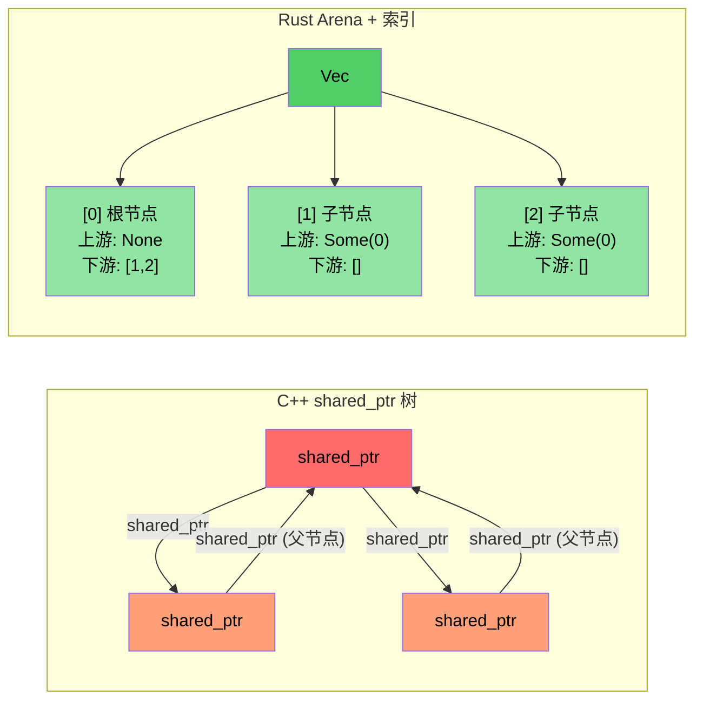

[English Original](../en/ch16-case-studies.md)

# 案例研究概览：C++ 到 Rust 的迁移实战

> **你将学到：** 将约 10 万行 C++ 代码迁移至分布在约 20 个 Crate 中的 9 万行 Rust 代码的实战经验。我们将探讨五种关键的转换模式以及背后的架构决策。

- 我们将一个大型 C++ 诊断系统（约 10 万行代码）迁移到了 Rust 实现（约 20 个 Crate，9 万行代码）。
- 本节将展示**真实的模式** —— 不是玩具示例，而是生产环境中的代码。
- 五大关键转型：

| **#** | **C++ 模式** | **Rust 模式** | **影响** |
|-------|----------------|-----------------|-----------|
| 1 | 类继承层次 + `dynamic_cast` | 枚举分发 (Enum dispatch) + `match` | `dynamic_cast` 从约 400 次降至 0 次 |
| 2 | `shared_ptr` / `enable_shared_from_this` 树 | Arena (池化) + 索引关联 | 彻底消除引用循环 |
| 3 | 每个模块中都有 `Framework*` 原始指针 | 带有生命周期借用的 `DiagContext<'a>` | 编译时保证有效性 |
| 4 | 上帝对象 (God object) | 可组合的状态结构体 | 可测试、模块化 |
| 5 | 到处都是 `vector<unique_ptr<Base>>` | **仅**在必要处使用 Trait 对象（约 25 处） | 默认采用静态分发 |

### 迁移前后的指标对比

| **指标** | **C++ (原始)** | **Rust (重写)** |
|------------|---------------------|------------------------|
| `dynamic_cast` / 类型向下转型 | 约 400 次 | 0 次 |
| `virtual` / `override` 方法 | 约 900 次 | 约 25 次 (`Box<dyn Trait>`) |
| 原始 `new` 分配 | 约 200 次 | 0 次 (全部使用所有权类型) |
| `shared_ptr` / 引用计数 | 约 10 次 (拓扑库) | 0 次 (仅在 FFI 边界使用 `Arc`) |
| `enum class` 定义 | 约 60 处 | 约 190 处 `pub enum` |
| 模式匹配表达式 | N/A | 约 750 处 `match` |
| 上帝对象 (超过 5000 行) | 2 个 | 0 个 |

---

# 案例研究 1：继承层次 → 枚举分发 (Enum Dispatch)

## C++ 模式：事件类继承层次
```cpp
// C++ 原始代码：每种 GPU 事件类型都是一个继承自 GpuEventBase 的类
class GpuEventBase {
public:
    virtual ~GpuEventBase() = default;
    virtual void Process(DiagFramework* fw) = 0;
    uint16_t m_recordId;
    uint8_t  m_sensorType;
    // ... 通用字段
};

class GpuPcieDegradeEvent : public GpuEventBase {
public:
    void Process(DiagFramework* fw) override;
    uint8_t m_linkSpeed;
    uint8_t m_linkWidth;
};

class GpuPcieFatalEvent : public GpuEventBase { /* ... */ };
class GpuBootEvent : public GpuEventBase { /* ... */ };
// ... 继承自 GpuEventBase 的 10 多个事件类

// 处理事件时需要使用 dynamic_cast：
void ProcessEvents(std::vector<std::unique_ptr<GpuEventBase>>& events,
                   DiagFramework* fw) {
    for (auto& event : events) {
        if (auto* degrade = dynamic_cast<GpuPcieDegradeEvent*>(event.get())) {
            // 处理降速事件...
        } else if (auto* fatal = dynamic_cast<GpuPcieFatalEvent*>(event.get())) {
            // 处理致命事件...
        }
        // ... 10 个以上的分支
    }
}
```

---

## Rust 解决方案：枚举分发

```rust
// 示例：types.rs —— 无继承、无虚函数表、无 dynamic_cast
#[derive(Debug, Clone, PartialEq, Eq, Serialize, Deserialize)]
pub enum GpuEventKind {
    PcieDegrade,
    PcieFatal,
    PcieUncorr,
    Boot,
    BaseboardState,
    EccError,
    OverTemp,
    PowerRail,
    ErotStatus,
    Unknown,
}
```

```rust
// 示例：manager.rs —— 分离的具名类型 Vec，无需向下转型
pub struct GpuEventManager {
    sku: SkuVariant,
    degrade_events: Vec<GpuPcieDegradeEvent>,   // 具体类型，而非 Box<dyn>
    fatal_events: Vec<GpuPcieFatalEvent>,
    uncorr_events: Vec<GpuPcieUncorrEvent>,
    boot_events: Vec<GpuBootEvent>,
    baseboard_events: Vec<GpuBaseboardEvent>,
    ecc_events: Vec<GpuEccEvent>,
    // ... 每一类事件都有其独立的 Vec 容器
}

// 访问函数返回具体的切片 —— 零歧义
impl GpuEventManager {
    pub fn degrade_events(&self) -> &[GpuPcieDegradeEvent] {
        &self.degrade_events
    }
    pub fn fatal_events(&self) -> &[GpuPcieFatalEvent] {
        &self.fatal_events
    }
}
```

### 为什么不直接使用 `Vec<Box<dyn GpuEvent>>`？
- **错误的方式**（生搬硬套）：将所有事件放在一个异构集合中，然后再进行向下转型 —— 这正是 C++ 使用 `vector<unique_ptr<Base>>` 所做的事。
- **正确的方式**：分离的具名 Vec 彻底消除了所有的向下转型。每个使用者仅请求其正是需要的对应事件类型。
- **性能优势**：分离的 Vec 提供更好的缓存局部性（所有的降速事件在内存中都是连续的）。

---

# 案例研究 2：shared_ptr 树 → Arena/索引 模式

## C++ 模式：引用计数树
```cpp
// C++ 拓扑库：PcieDevice 使用 enable_shared_from_this 
// 因为父节点和子节点都需要相互引用
class PcieDevice : public std::enable_shared_from_this<PcieDevice> {
public:
    std::shared_ptr<PcieDevice> m_upstream;
    std::vector<std::shared_ptr<PcieDevice>> m_downstream;
    // ... 设备数据
    
    void AddChild(std::shared_ptr<PcieDevice> child) {
        child->m_upstream = shared_from_this();  // 父节点 ↔ 子节点 循环引用！
        m_downstream.push_back(child);
    }
};
// 问题：父→子和子→父引用导致了循环引用。
// 需要 weak_ptr 来打破循环，但很容易被遗忘。
```

---

## Rust 解决方案：具有索引关联的 Arena

```rust
// 示例：components.rs —— 扁平化的 Vec 拥有所有设备
pub struct PcieDevice {
    pub base: PcieDeviceBase,
    pub kind: PcieDeviceKind,

    // 通过索引建立树形关联 —— 无引用计数、无循环引用
    pub upstream_idx: Option<usize>,      // 指向 arena Vec 中的索引
    pub downstream_idxs: Vec<usize>,      // 指向 arena Vec 中的索引
}

// “arena” 仅仅是由树所拥有的 Vec<PcieDevice>：
pub struct DeviceTree {
    devices: Vec<PcieDevice>,  // 扁平化的所有权 —— 一个 Vec 拥有所有内容
}

impl DeviceTree {
    pub fn parent(&self, device_idx: usize) -> Option<&PcieDevice> {
        self.devices[device_idx].upstream_idx
            .map(|idx| &self.devices[idx])
    }
    
    pub fn children(&self, device_idx: usize) -> Vec<&PcieDevice> {
        self.devices[device_idx].downstream_idxs
            .iter()
            .map(|&idx| &self.devices[idx])
            .collect()
    }
}
```

### 关键洞察
- **无需 `shared_ptr`、`weak_ptr` 或 `enable_shared_from_this`**。
- **不可能产生循环引用** —— 索引仅仅是 `usize` 数值。
- **更好的缓存性能** —— 所有的设备在内存中都是连续存放的。
- **更简洁的思维模型** —— 只有一个所有者（Vec），存在多处观察者（索引）。

---



----
