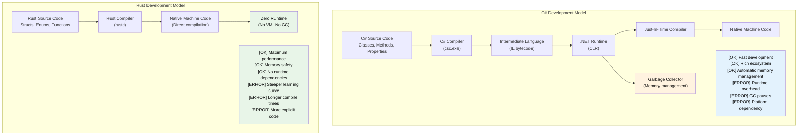

## Speaker Intro and General Approach / 讲师介绍与整体方法

- Speaker intro / 讲师介绍
    - Principal Firmware Architect in Microsoft SCHIE (Silicon and Cloud Hardware Infrastructure Engineering) team / Microsoft SCHIE（Silicon and Cloud Hardware Infrastructure Engineering）团队首席固件架构师
    - Industry veteran with expertise in security, systems programming (firmware, operating systems, hypervisors), CPU and platform architecture, and C++ systems / 在安全、系统编程（固件、操作系统、虚拟机监控器）、CPU 与平台架构以及 C++ 系统方面经验丰富
    - Started programming in Rust in 2017 (@AWS EC2), and have been in love with the language ever since / 2017 年在 AWS EC2 开始使用 Rust，此后长期深度投入
- This course is intended to be as interactive as possible / 本课程尽量采用高互动式教学
    - Assumption: You know C# and .NET development / 前提：你熟悉 C# 和 .NET 开发
    - Examples deliberately map C# concepts to Rust equivalents / 示例会刻意把 C# 概念映射到 Rust 对应概念
    - **Please feel free to ask clarifying questions at any point of time** / **任何时候都欢迎提出澄清性问题**

---

## The Case for Rust for C# Developers / Rust 对 C# 开发者的价值

> **What you'll learn / 你将学到：** Why Rust matters for C# developers - the performance gap between managed and native code, how Rust eliminates null-reference exceptions and hidden control flow at compile time, and the key scenarios where Rust complements or replaces C#.
>
> 为什么 Rust 值得 C# 开发者学习：托管代码与原生代码之间的性能差距，Rust 如何在编译期消除 null 引用异常和隐藏控制流，以及 Rust 适合作为 C# 补充或替代的核心场景。
>
> **Difficulty / 难度：** 🟢 Beginner / 初级

### Performance Without the Runtime Tax / 没有运行时税的性能
```csharp
// C# - Great productivity, runtime overhead
public class DataProcessor
{
    private List<int> data = new List<int>();
    
    public void ProcessLargeDataset()
    {
        // Allocations trigger GC
        for (int i = 0; i < 10_000_000; i++)
        {
            data.Add(i * 2); // GC pressure
        }
        // Unpredictable GC pauses during processing
    }
}
// Runtime: Variable (50-200ms due to GC)
// Memory: ~80MB (including GC overhead)
// Predictability: Low (GC pauses)
```

```rust
// Rust - Same expressiveness, zero runtime overhead
struct DataProcessor {
    data: Vec<i32>,
}

impl DataProcessor {
    fn process_large_dataset(&mut self) {
        // Zero-cost abstractions
        for i in 0..10_000_000 {
            self.data.push(i * 2); // No GC pressure
        }
        // Deterministic performance
    }
}
// Runtime: Consistent (~30ms)
// Memory: ~40MB (exact allocation)
// Predictability: High (no GC)
```

### Memory Safety Without Runtime Checks / 没有运行时额外负担的内存安全
```csharp
// C# - Runtime safety with overhead
public class RuntimeCheckedOperations
{
    public string? ProcessArray(int[] array)
    {
        // Runtime bounds checking on every access
        if (array.Length > 0)
        {
            return array[0].ToString(); // Safe – int is a value type, never null
        }
        return null; // Nullable return (string? with C# 8+ nullable reference types)
    }
    
    public void ProcessConcurrently()
    {
        var list = new List<int>();
        
        // Data races possible, requires careful locking
        Parallel.For(0, 1000, i =>
        {
            lock (list) // Runtime overhead
            {
                list.Add(i);
            }
        });
    }
}
```

```rust
// Rust - Compile-time safety with zero runtime cost
struct SafeOperations;

impl SafeOperations {
    // Compile-time null safety, no runtime checks
    fn process_array(array: &[i32]) -> Option<String> {
        array.first().map(|x| x.to_string())
        // No null references possible
        // Bounds checking optimized away when provably safe
    }
    
    fn process_concurrently() {
        use std::sync::{Arc, Mutex};
        use std::thread;
        
        let data = Arc::new(Mutex::new(Vec::new()));
        
        // Data races prevented at compile time
        let handles: Vec<_> = (0..1000).map(|i| {
            let data = Arc::clone(&data);
            thread::spawn(move || {
                data.lock().unwrap().push(i);
            })
        }).collect();
        
        for handle in handles {
            handle.join().unwrap();
        }
    }
}
```

***

## Common C# Pain Points That Rust Addresses / Rust 能解决的常见 C# 痛点

### 1. The Billion Dollar Mistake: Null References / 十亿美元错误：空引用
```csharp
// C# - Null reference exceptions are runtime bombs
public class UserService
{
    public string GetUserDisplayName(User user)
    {
        // Any of these could throw NullReferenceException
        return user.Profile.DisplayName.ToUpper();
        //     ^^^^^ ^^^^^^^ ^^^^^^^^^^^ ^^^^^^^
        //     Could be null at runtime
    }
    
    // Even with nullable reference types (C# 8+)
    public string GetDisplayName(User? user)
    {
        return user?.Profile?.DisplayName?.ToUpper() ?? "Unknown";
        // Still possible to have null at runtime
    }
}
```

```rust
// Rust - Null safety guaranteed at compile time
struct UserService;

impl UserService {
    fn get_user_display_name(user: &User) -> Option<String> {
        user.profile.as_ref()?
            .display_name.as_ref()
            .map(|name| name.to_uppercase())
        // Compiler forces you to handle None case
        // Impossible to have null pointer exceptions
    }
    
    fn get_display_name_safe(user: Option<&User>) -> String {
        user.and_then(|u| u.profile.as_ref())
            .and_then(|p| p.display_name.as_ref())
            .map(|name| name.to_uppercase())
            .unwrap_or_else(|| "Unknown".to_string())
        // Explicit handling, no surprises
    }
}
```

### 2. Hidden Exceptions and Control Flow / 隐藏的异常与控制流
```csharp
// C# - Exceptions can be thrown from anywhere
public async Task<UserData> GetUserDataAsync(int userId)
{
    // Each of these might throw different exceptions
    var user = await userRepository.GetAsync(userId);        // SqlException
    var permissions = await permissionService.GetAsync(user); // HttpRequestException  
    var preferences = await preferenceService.GetAsync(user); // TimeoutException
    
    return new UserData(user, permissions, preferences);
    // Caller has no idea what exceptions to expect
}
```

```rust
// Rust - All errors explicit in function signatures
#[derive(Debug)]
enum UserDataError {
    DatabaseError(String),
    NetworkError(String),
    Timeout,
    UserNotFound(i32),
}

async fn get_user_data(user_id: i32) -> Result<UserData, UserDataError> {
    // All errors explicit and handled
    let user = user_repository.get(user_id).await
        .map_err(UserDataError::DatabaseError)?;
    
    let permissions = permission_service.get(&user).await
        .map_err(UserDataError::NetworkError)?;
    
    let preferences = preference_service.get(&user).await
        .map_err(|_| UserDataError::Timeout)?;
    
    Ok(UserData::new(user, permissions, preferences))
    // Caller knows exactly what errors are possible
}
```

### 3. Correctness: The Type System as a Proof Engine / 正确性：把类型系统当作证明引擎

Rust's type system catches entire categories of logic bugs at compile time that C# can only catch at runtime - or not at all.

Rust 的类型系统能在编译期捕获整类逻辑错误，而这些问题在 C# 中通常只能在运行时发现，甚至可能根本发现不了。

#### ADTs vs Sealed-Class Workarounds / ADT 与 sealed class 变通方案
```csharp
// C# – Discriminated unions require sealed-class boilerplate.
// The compiler warns about missing cases (CS8524) ONLY when there's no _ catch-all.
// In practice, most C# code uses _ as a default, which silences the warning.
public abstract record Shape;
public sealed record Circle(double Radius)   : Shape;
public sealed record Rectangle(double W, double H) : Shape;
public sealed record Triangle(double A, double B, double C) : Shape;

public static double Area(Shape shape) => shape switch
{
    Circle c    => Math.PI * c.Radius * c.Radius,
    Rectangle r => r.W * r.H,
    // Forgot Triangle? The _ catch-all silences any compiler warning.
    _           => throw new ArgumentException("Unknown shape")
};
// Add a new variant six months later – the _ pattern hides the missing case.
// No compiler warning tells you about the 47 switch expressions you need to update.
```

```rust
// Rust – ADTs + exhaustive matching = compile-time proof
enum Shape {
    Circle { radius: f64 },
    Rectangle { w: f64, h: f64 },
    Triangle { a: f64, b: f64, c: f64 },
}

fn area(shape: &Shape) -> f64 {
    match shape {
        Shape::Circle { radius }    => std::f64::consts::PI * radius * radius,
        Shape::Rectangle { w, h }   => w * h,
        // Forget Triangle? ERROR: non-exhaustive pattern
        Shape::Triangle { a, b, c } => {
            let s = (a + b + c) / 2.0;
            (s * (s - a) * (s - b) * (s - c)).sqrt()
        }
    }
}
// Add a new variant -> compiler shows you EVERY match that needs updating.
```

#### Immutability by Default vs Opt-In Immutability / 默认不可变 与 选择性不可变
```csharp
// C# – Everything is mutable by default
public class Config
{
    public string Host { get; set; }   // Mutable by default
    public int Port { get; set; }
}

// "readonly" and "record" help, but don't prevent deep mutation:
public record ServerConfig(string Host, int Port, List<string> AllowedOrigins);

var config = new ServerConfig("localhost", 8080, new List<string> { "*.example.com" });
// Records are "immutable" but reference-type fields are NOT:
config.AllowedOrigins.Add("*.evil.com"); // Compiles and mutates! -> bug
// The compiler gives you no warning.
```

```rust
// Rust – Immutable by default, mutation is explicit and visible
struct Config {
    host: String,
    port: u16,
    allowed_origins: Vec<String>,
}

let config = Config {
    host: "localhost".into(),
    port: 8080,
    allowed_origins: vec!["*.example.com".into()],
};

// config.allowed_origins.push("*.evil.com".into()); // ERROR: cannot borrow as mutable

// Mutation requires explicit opt-in:
let mut config = config;
config.allowed_origins.push("*.safe.com".into()); // OK – visibly mutable

// "mut" in the signature tells every reader: "this function modifies data"
fn add_origin(config: &mut Config, origin: String) {
    config.allowed_origins.push(origin);
}
```

#### Functional Programming: First-Class vs Afterthought / 函数式编程：一等公民还是事后补丁
```csharp
// C# – FP bolted on; LINQ is expressive but the language fights you
public IEnumerable<Order> GetHighValueOrders(IEnumerable<Order> orders)
{
    return orders
        .Where(o => o.Total > 1000)   // Func<Order, bool> – heap-allocated delegate
        .Select(o => new OrderSummary  // Anonymous type or extra class
        {
            Id = o.Id,
            Total = o.Total
        })
        .OrderByDescending(o => o.Total);
    // No exhaustive matching on results
    // Null can sneak in anywhere in the pipeline
    // Can't enforce purity – any lambda might have side effects
}
```

```rust
// Rust – FP is a first-class citizen
fn get_high_value_orders(orders: &[Order]) -> Vec<OrderSummary> {
    orders.iter()
        .filter(|o| o.total > 1000)      // Zero-cost closure, no heap allocation
        .map(|o| OrderSummary {           // Type-checked struct
            id: o.id,
            total: o.total,
        })
        .sorted_by(|a, b| b.total.cmp(&a.total)) // itertools
        .collect()
    // No nulls anywhere in the pipeline
    // Closures are monomorphized – zero overhead vs hand-written loops
    // Purity enforced: &[Order] means the function CAN'T modify orders
}
```

#### Inheritance: Elegant in Theory, Fragile in Practice / 继承：理论优雅，实践脆弱
```csharp
// C# – The fragile base class problem
public class Animal
{
    public virtual string Speak() => "...";
    public void Greet() => Console.WriteLine($"I say: {Speak()}");
}

public class Dog : Animal
{
    public override string Speak() => "Woof!";
}

public class RobotDog : Dog
{
    // Which Speak() does Greet() call? What if Dog changes?
    // Diamond problem with interfaces + default methods
    // Tight coupling: changing Animal can break RobotDog silently
}

// Common C# anti-patterns:
// - God base classes with 20 virtual methods
// - Deep hierarchies (5+ levels) nobody can reason about
// - "protected" fields creating hidden coupling
// - Base class changes silently altering derived behavior
```

```rust
// Rust – Composition over inheritance, enforced by the language
trait Speaker {
    fn speak(&self) -> &str;
}

trait Greeter: Speaker {
    fn greet(&self) {
        println!("I say: {}", self.speak());
    }
}

struct Dog;
impl Speaker for Dog {
    fn speak(&self) -> &str { "Woof!" }
}
impl Greeter for Dog {} // Uses default greet()

struct RobotDog {
    voice: String, // Composition: owns its own data
}
impl Speaker for RobotDog {
    fn speak(&self) -> &str { &self.voice }
}
impl Greeter for RobotDog {} // Clear, explicit behavior

// No fragile base class problem – no base classes at all
// No hidden coupling – traits are explicit contracts
// No diamond problem – trait coherence rules prevent ambiguity
// Adding a method to Speaker? Compiler tells you everywhere to implement it.
```

> **Key insight / 核心洞见：** In C#, correctness is a discipline - you hope developers follow conventions, write tests, and catch edge cases in code review. In Rust, correctness is a **property of the type system** - entire categories of bugs (null derefs, forgotten variants, accidental mutation, data races) are structurally impossible.
>
> 在 C# 中，正确性更多是一种工程纪律：你希望开发者遵守约定、编写测试、并在代码评审中抓出边界情况。而在 Rust 中，正确性是**类型系统本身的属性**：某些类型的错误（空引用解引用、遗漏分支、意外可变性、数据竞争）在结构上就不可能出现。

***

### 4. Unpredictable Performance Due to GC / GC 带来的不可预测性能
```csharp
// C# - GC can pause at any time
public class HighFrequencyTrader
{
    private List<Trade> trades = new List<Trade>();
    
    public void ProcessMarketData(MarketTick tick)
    {
        // Allocations can trigger GC at worst possible moment
        var analysis = new MarketAnalysis(tick);
        trades.Add(new Trade(analysis.Signal, tick.Price));
        
        // GC might pause here during critical market moment
        // Pause duration: 1-100ms depending on heap size
    }
}
```

```rust
// Rust - Predictable, deterministic performance
struct HighFrequencyTrader {
    trades: Vec<Trade>,
}

impl HighFrequencyTrader {
    fn process_market_data(&mut self, tick: MarketTick) {
        // Zero allocations, predictable performance
        let analysis = MarketAnalysis::from(tick);
        self.trades.push(Trade::new(analysis.signal(), tick.price));
        
        // No GC pauses, consistent sub-microsecond latency
        // Performance guaranteed by type system
    }
}
```

***

## When to Choose Rust Over C# / 何时选择 Rust 而不是 C#

### Choose Rust When / 在这些场景下选择 Rust：
- **Correctness matters**: State machines, protocol implementations, financial logic - where a missed case is a production incident, not a test failure / **正确性极其重要**：状态机、协议实现、金融逻辑等，漏掉一个分支就是线上事故，而不是单纯测试失败
- **Performance is critical**: Real-time systems, high-frequency trading, game engines / **性能关键**：实时系统、高频交易、游戏引擎
- **Memory usage matters**: Embedded systems, cloud costs, mobile applications / **内存占用关键**：嵌入式系统、云成本控制、移动应用
- **Predictability required**: Medical devices, automotive, financial systems / **需要可预测性**：医疗设备、汽车、金融系统
- **Security is paramount**: Cryptography, network security, system-level code / **安全性优先级最高**：密码学、网络安全、系统级代码
- **Long-running services**: Where GC pauses cause issues / **长时间运行的服务**：GC 停顿会造成实际问题
- **Resource-constrained environments**: IoT, edge computing / **资源受限环境**：IoT、边缘计算
- **System programming**: CLI tools, databases, web servers, operating systems / **系统编程**：CLI 工具、数据库、Web 服务器、操作系统

### Stay with C# When / 在这些场景下继续使用 C#：
- **Rapid application development**: Business applications, CRUD applications / **快速应用开发**：业务系统、CRUD 应用
- **Large existing codebase**: When migration cost is prohibitive / **已有大型代码库**：迁移成本过高时
- **Team expertise**: When Rust learning curve doesn't justify benefits / **团队经验因素**：Rust 学习曲线带来的成本大于收益
- **Enterprise integrations**: Heavy .NET Framework/Windows dependencies / **企业集成场景**：强依赖 .NET Framework 或 Windows 生态
- **GUI applications**: WPF, WinUI, Blazor ecosystems / **GUI 应用**：WPF、WinUI、Blazor 生态
- **Time to market**: When development speed trumps performance / **上市速度更重要**：开发效率优先于极致性能

### Consider Both (Hybrid Approach) / 可以考虑混合方案：
- **Performance-critical components in Rust**: Called from C# via P/Invoke / **将性能关键组件用 Rust 编写**，通过 P/Invoke 从 C# 调用
- **Business logic in C#**: Familiar, productive development / **业务逻辑保留在 C#**，保持熟悉和高生产力
- **Gradual migration**: Start with new services in Rust / **渐进式迁移**：从新服务或新模块开始使用 Rust

***

## Real-World Impact: Why Companies Choose Rust / 真实世界影响：为什么公司选择 Rust

### Dropbox: Storage Infrastructure / Dropbox：存储基础设施
- **Before (Python)**: High CPU usage, memory overhead / **之前（Python）**：CPU 占用高、内存开销大
- **After (Rust)**: 10x performance improvement, 50% memory reduction / **之后（Rust）**：性能提升 10 倍，内存减少 50%
- **Result**: Millions saved in infrastructure costs / **结果**：节省了数百万基础设施成本

### Discord: Voice/Video Backend / Discord：语音视频后端
- **Before (Go)**: GC pauses causing audio drops / **之前（Go）**：GC 停顿导致音频卡顿
- **After (Rust)**: Consistent low-latency performance / **之后（Rust）**：持续稳定的低延迟表现
- **Result**: Better user experience, reduced server costs / **结果**：用户体验更好，服务器成本更低

### Microsoft: Windows Components / Microsoft：Windows 组件
- **Rust in Windows**: File system, networking stack components / **Windows 中的 Rust**：文件系统、网络栈组件
- **Benefit**: Memory safety without performance cost / **收益**：在不牺牲性能的前提下获得内存安全
- **Impact**: Fewer security vulnerabilities, same performance / **影响**：更少的安全漏洞，性能保持不变

### Why This Matters for C# Developers / 这对 C# 开发者意味着什么：
1. **Complementary skills**: Rust and C# solve different problems / **技能互补**：Rust 和 C# 解决的是不同类型的问题
2. **Career growth**: Systems programming expertise increasingly valuable / **职业成长**：系统编程能力越来越有价值
3. **Performance understanding**: Learn zero-cost abstractions / **性能理解**：学习零成本抽象背后的原理
4. **Safety mindset**: Apply ownership thinking to any language / **安全思维**：把所有权思维迁移到其他语言中
5. **Cloud costs**: Performance directly impacts infrastructure spend / **云成本**：性能会直接影响基础设施开销

***

## Language Philosophy Comparison / 语言设计理念对比

### C# Philosophy / C# 的理念
- **Productivity first**: Rich tooling, extensive framework, "pit of success" / **生产力优先**：工具丰富、框架完善、鼓励“走正确的路”
- **Managed runtime**: Garbage collection handles memory automatically / **托管运行时**：垃圾回收自动管理内存
- **Enterprise-focused**: Strong typing with reflection, extensive standard library / **企业导向**：强类型、反射能力、丰富标准库
- **Object-oriented**: Classes, inheritance, interfaces as primary abstractions / **面向对象**：类、继承、接口是主要抽象方式

### Rust Philosophy / Rust 的理念
- **Performance without sacrifice**: Zero-cost abstractions, no runtime overhead / **不牺牲性能**：零成本抽象、没有运行时负担
- **Memory safety**: Compile-time guarantees prevent crashes and security vulnerabilities / **内存安全**：编译期保证防止崩溃与安全漏洞
- **Systems programming**: Direct hardware access with high-level abstractions / **系统编程**：在高层抽象下仍可直接接近硬件
- **Functional + systems**: Immutability by default, ownership-based resource management / **函数式 + 系统编程结合**：默认不可变、基于所有权的资源管理



***

## Quick Reference: Rust vs C# / 速查：Rust 与 C# 对比

| **Concept / 概念** | **C#** | **Rust** | **Key Difference / 关键差异** |
|-------------|--------|----------|-------------------|
| Memory management / 内存管理 | Garbage collector / 垃圾回收 | Ownership system / 所有权系统 | Zero-cost, deterministic cleanup / 零成本、确定性释放 |
| Null references / 空引用 | `null` everywhere / `null` 到处可见 | `Option<T>` | Compile-time null safety / 编译期空安全 |
| Error handling / 错误处理 | Exceptions / 异常 | `Result<T, E>` | Explicit, no hidden control flow / 显式表达，没有隐藏控制流 |
| Mutability / 可变性 | Mutable by default / 默认可变 | Immutable by default / 默认不可变 | Opt-in to mutation / 必须显式选择可变 |
| Type system / 类型系统 | Reference/value types / 引用类型与值类型 | Ownership types / 所有权类型 | Move semantics, borrowing / 移动语义与借用 |
| Assemblies / 程序集 | GAC, app domains | Crates | Static linking, no runtime / 静态链接，无运行时依赖 |
| Namespaces / 命名空间 | `using System.IO` | `use std::fs` | Module system / 模块系统 |
| Interfaces / 接口 | `interface IFoo` | `trait Foo` | Default implementations / 支持默认实现 |
| Generics / 泛型 | `List<T>` where T : class | `Vec<T>` where T: Clone | Zero-cost abstractions / 零成本抽象 |
| Threading / 线程模型 | locks, async/await | Ownership + Send/Sync | Data race prevention / 防止数据竞争 |
| Performance / 性能 | JIT compilation / JIT 编译 | AOT compilation / AOT 编译 | Predictable, no GC pauses / 可预测、无 GC 停顿 |

***
