## True Immutability vs Record Illusions / 真正的不可变性与 Record 的“不可变幻觉”

> **What you'll learn / 你将学到：** Why C# `record` types aren't truly immutable (mutable fields, reflection bypass), how Rust enforces real immutability at compile time, and when to use interior mutability patterns.
>
> 为什么 C# 的 `record` 类型并不是真正不可变的（可变字段、反射绕过等），Rust 如何在编译期强制实现真正的不可变性，以及何时才应该使用内部可变性模式。
>
> **Difficulty / 难度：** 🟡 Intermediate / 中级

### C# Records - Immutability Theater / C# Record：看起来不可变，实际上未必
```csharp
// C# records look immutable but have escape hatches
public record Person(string Name, int Age, List<string> Hobbies);

var person = new Person("John", 30, new List<string> { "reading" });

// These all "look" like they create new instances:
var older = person with { Age = 31 };  // New record
var renamed = person with { Name = "Jonathan" };  // New record

// But the reference types are still mutable!
person.Hobbies.Add("gaming");  // Mutates the original!
Console.WriteLine(older.Hobbies.Count);  // 2 - older person affected!
Console.WriteLine(renamed.Hobbies.Count); // 2 - renamed person also affected!

// Init-only properties can still be set via reflection
typeof(Person).GetProperty("Age")?.SetValue(person, 25);

// Collection expressions help but don't solve the fundamental issue
public record BetterPerson(string Name, int Age, IReadOnlyList<string> Hobbies);

var betterPerson = new BetterPerson("Jane", 25, new List<string> { "painting" });
// Still mutable via casting: 
((List<string>)betterPerson.Hobbies).Add("hacking the system");

// Even "immutable" collections aren't truly immutable
using System.Collections.Immutable;
public record SafePerson(string Name, int Age, ImmutableList<string> Hobbies);
// This is better, but requires discipline and has performance overhead
```

### Rust - True Immutability by Default / Rust：默认即真正不可变
```rust
#[derive(Debug, Clone)]
struct Person {
    name: String,
    age: u32,
    hobbies: Vec<String>,
}

let person = Person {
    name: "John".to_string(),
    age: 30,
    hobbies: vec!["reading".to_string()],
};

// This simply won't compile:
// person.age = 31;  // ERROR: cannot assign to immutable field
// person.hobbies.push("gaming".to_string());  // ERROR: cannot borrow as mutable

// To modify, you must explicitly opt-in with 'mut':
let mut older_person = person.clone();
older_person.age = 31;  // Now it's clear this is mutation

// Or use functional update patterns:
let renamed = Person {
    name: "Jonathan".to_string(),
    ..person  // Copies other fields (move semantics apply)
};

// The original is guaranteed unchanged (until moved):
println!("{:?}", person.hobbies);  // Always ["reading"] - immutable

// Structural sharing with efficient immutable data structures
use std::rc::Rc;

#[derive(Debug, Clone)]
struct EfficientPerson {
    name: String,
    age: u32,
    hobbies: Rc<Vec<String>>,  // Shared, immutable reference
}

// Creating new versions shares data efficiently
let person1 = EfficientPerson {
    name: "Alice".to_string(),
    age: 30,
    hobbies: Rc::new(vec!["reading".to_string(), "cycling".to_string()]),
};

let person2 = EfficientPerson {
    name: "Bob".to_string(),
    age: 25,
    hobbies: Rc::clone(&person1.hobbies),  // Shared reference, no deep copy
};
```



```mermaid
graph TD
    subgraph "C# Records - Shallow Immutability"
        CS_RECORD["record Person(...)"]
        CS_WITH["with expressions"]
        CS_SHALLOW["Only top-level immutable"]
        CS_REF_MUT["Reference types still mutable"]
        CS_REFLECTION["Reflection can bypass"]
        CS_RUNTIME["Runtime surprises"]
        CS_DISCIPLINE["Requires team discipline"]
        
        CS_RECORD --> CS_WITH
        CS_WITH --> CS_SHALLOW
        CS_SHALLOW --> CS_REF_MUT
        CS_RECORD --> CS_REFLECTION
        CS_REF_MUT --> CS_RUNTIME
        CS_RUNTIME --> CS_DISCIPLINE
    end
    
    subgraph "Rust - True Immutability"
        RUST_STRUCT["struct Person { ... }"]
        RUST_DEFAULT["Immutable by default"]
        RUST_COMPILE["Compile-time enforcement"]
        RUST_MUT["Explicit 'mut' required"]
        RUST_MOVE["Move semantics"]
        RUST_ZERO["Zero runtime overhead"]
        RUST_SAFE["Memory safe"]
        
        RUST_STRUCT --> RUST_DEFAULT
        RUST_DEFAULT --> RUST_COMPILE
        RUST_COMPILE --> RUST_MUT
        RUST_MUT --> RUST_MOVE
        RUST_MOVE --> RUST_ZERO
        RUST_ZERO --> RUST_SAFE
    end
    
    style CS_REF_MUT fill:#ffcdd2,color:#000
    style CS_REFLECTION fill:#ffcdd2,color:#000
    style CS_RUNTIME fill:#ffcdd2,color:#000
    style RUST_COMPILE fill:#c8e6c9,color:#000
    style RUST_ZERO fill:#c8e6c9,color:#000
    style RUST_SAFE fill:#c8e6c9,color:#000
```

---

## Exercises / 练习

<details>
<summary><strong>Exercise: Prove the Immutability / 练习：证明它真的不可变</strong> (click to expand / 点击展开)</summary>

A C# colleague claims their `record` is immutable. Translate this C# code to Rust and explain why Rust's version is truly immutable:

有位 C# 同事坚持认为他们的 `record` 是不可变的。请把下面这段 C# 代码翻译成 Rust，并解释为什么 Rust 版本才是真正不可变：

```csharp
public record Config(string Host, int Port, List<string> AllowedOrigins);

var config = new Config("localhost", 8080, new List<string> { "example.com" });
// "Immutable" record... but:
config.AllowedOrigins.Add("evil.com"); // Compiles! List is mutable.
```

1. Create an equivalent Rust struct that is **truly** immutable  
   创建一个在 Rust 中**真正不可变**的等价结构体
2. Show that attempting to mutate `allowed_origins` is a **compile error**  
   展示尝试修改 `allowed_origins` 会直接成为**编译错误**
3. Write a function that creates a modified copy (new host) without mutation  
   编写一个不发生原地修改、而是创建带新 host 副本的函数

<details>
<summary>Solution / 参考答案</summary>

```rust
#[derive(Debug, Clone)]
struct Config {
    host: String,
    port: u16,
    allowed_origins: Vec<String>,
}

impl Config {
    fn with_host(&self, host: impl Into<String>) -> Self {
        Config {
            host: host.into(),
            ..self.clone()
        }
    }
}

fn main() {
    let config = Config {
        host: "localhost".into(),
        port: 8080,
        allowed_origins: vec!["example.com".into()],
    };

    // config.allowed_origins.push("evil.com".into());
    // ERROR: cannot borrow `config.allowed_origins` as mutable

    let production = config.with_host("prod.example.com");
    println!("Dev: {:?}", config);       // original unchanged
    println!("Prod: {:?}", production);  // new copy with different host
}
```

**Key insight / 核心洞见：** In Rust, `let config = ...` (no `mut`) makes the *entire value tree* immutable - including nested `Vec`. C# records only make the *reference* immutable, not the contents.

在 Rust 中，`let config = ...`（没有 `mut`）意味着整个值树都是不可变的，连内部的 `Vec` 也一样。C# 的 record 只是在“引用层面”看起来不可变，内部内容并没有自动变成真正不可变。

</details>
</details>

***
