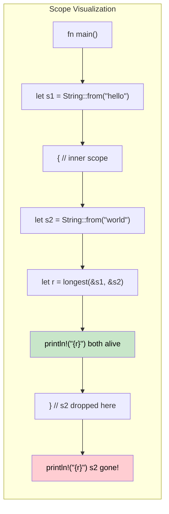

## Lifetimes: Telling the Compiler How Long References Live | 生命周期：告诉编译器引用能活多久

> **What you'll learn:** Why lifetimes exist (no GC means the compiler needs proof), lifetime annotation syntax,
> elision rules, struct lifetimes, the `'static` lifetime, and common borrow checker errors with fixes.
>
> **你将学到什么：** 为什么生命周期会存在（没有 GC 时，编译器必须拿到安全性证明）、生命周期标注语法、
> 生命周期省略规则、结构体中的生命周期、`'static` 生命周期，以及常见借用检查器报错及修复方式。
>
> **Difficulty:** Advanced
>
> **难度：** 高级

C# developers never think about reference lifetimes - the garbage collector handles reachability. In Rust, the compiler needs *proof* that every reference is valid for as long as it's used. Lifetimes are that proof.

C# 开发者通常不会思考“引用的生命周期”这个问题，因为垃圾回收器会负责对象可达性。而在 Rust 中，编译器必须拿到*证明*，确认每个引用在被使用期间都始终有效。生命周期就是这份证明。

### Why Lifetimes Exist | 为什么会有生命周期
```rust
// This won't compile - the compiler can't prove the returned reference is valid
fn longest(a: &str, b: &str) -> &str {
    if a.len() > b.len() { a } else { b }
}
// ERROR: missing lifetime specifier - the compiler doesn't know
// whether the return value borrows from `a` or `b`
```

```text
问题不在于 Rust “看不懂”这段代码，而在于它无法证明返回值到底依赖 `a` 还是 `b`，因此没法保证引用一定安全。
```

### Lifetime Annotations | 生命周期标注
```rust
// Lifetime 'a says: "the return value lives at least as long as BOTH inputs"
fn longest<'a>(a: &'a str, b: &'a str) -> &'a str {
    if a.len() > b.len() { a } else { b }
}

fn main() {
    let result;
    let string1 = String::from("long string");
    {
        let string2 = String::from("xyz");
        result = longest(&string1, &string2);
        println!("Longest: {result}"); // both references still valid here
    }
    // println!("{result}"); // ERROR: string2 doesn't live long enough
}
```

### C# Comparison | 与 C# 的对比
```csharp
// C# - the GC keeps objects alive as long as any reference exists
string Longest(string a, string b) => a.Length > b.Length ? a : b;

// No lifetime issues - GC tracks reachability automatically
// But: GC pauses, unpredictable memory usage, no compile-time proof
```

### Lifetime Elision Rules | 生命周期省略规则

Most of the time you **don't need to write lifetime annotations**. The compiler applies three rules automatically:

大多数时候你**不需要手写生命周期标注**。编译器会自动应用三条省略规则：

| Rule | Description | Example |
|------|-------------|---------|
| **Rule 1** | Each reference parameter gets its own lifetime | `fn foo(x: &str, y: &str)` -> `fn foo<'a, 'b>(x: &'a str, y: &'b str)` |
| **规则 1** | 每个引用参数都会获得各自独立的生命周期 | `fn foo(x: &str, y: &str)` -> `fn foo<'a, 'b>(x: &'a str, y: &'b str)` |
| **Rule 2** | If there's exactly one input lifetime, it's assigned to all output lifetimes | `fn first(s: &str) -> &str` -> `fn first<'a>(s: &'a str) -> &'a str` |
| **规则 2** | 如果只有一个输入生命周期，那么它会被赋给所有输出生命周期 | `fn first(s: &str) -> &str` -> `fn first<'a>(s: &'a str) -> &'a str` |
| **Rule 3** | If one input is `&self` or `&mut self`, that lifetime is assigned to all outputs | `fn name(&self) -> &str` -> works because of `&self` |
| **规则 3** | 如果某个输入是 `&self` 或 `&mut self`，那么该生命周期会被赋给所有输出 | `fn name(&self) -> &str` -> 因为有 `&self` 所以可以自动推断 |

```rust
// These are equivalent - the compiler adds lifetimes automatically:
fn first_word(s: &str) -> &str { /* ... */ }           // elided
fn first_word<'a>(s: &'a str) -> &'a str { /* ... */ } // explicit

// But this REQUIRES explicit annotation - two inputs, which one does output borrow?
fn longest<'a>(a: &'a str, b: &'a str) -> &'a str { /* ... */ }
```

### Struct Lifetimes | 结构体中的生命周期
```rust
// A struct that borrows data (instead of owning it)
struct Excerpt<'a> {
    text: &'a str,  // borrows from some String that must outlive this struct
}

impl<'a> Excerpt<'a> {
    fn new(text: &'a str) -> Self {
        Excerpt { text }
    }

    fn first_sentence(&self) -> &str {
        self.text.split('.').next().unwrap_or(self.text)
    }
}

fn main() {
    let novel = String::from("Call me Ishmael. Some years ago...");
    let excerpt = Excerpt::new(&novel); // excerpt borrows from novel
    println!("First sentence: {}", excerpt.first_sentence());
    // novel must stay alive as long as excerpt exists
}
```

```csharp
// C# equivalent - no lifetime concerns, but no compile-time guarantee either
class Excerpt
{
    public string Text { get; }
    public Excerpt(string text) => Text = text;
    public string FirstSentence() => Text.Split('.')[0];
}
// What if the string is mutated elsewhere? Runtime surprise.
```

```text
只要结构体里保存的是引用而不是拥有所有权的值，就必须明确告诉编译器：这些引用依赖谁活着。
```

### The `'static` Lifetime | `'static` 生命周期
```rust
// 'static means "lives for the entire program duration"
let s: &'static str = "I'm a string literal"; // stored in binary, always valid

// Common places you see 'static:
// 1. String literals
// 2. Global constants
// 3. Thread::spawn requires 'static (thread might outlive the caller)
std::thread::spawn(move || {
    // Closures sent to threads must own their data or use 'static references
    println!("{s}"); // OK: &'static str
});

// 'static does NOT mean "immortal" - it means "CAN live forever if needed"
let owned = String::from("hello");
// owned is NOT 'static, but it can be moved into a thread (ownership transfer)
```

### Common Borrow Checker Errors and Fixes | 常见借用检查器错误与修复方法

| Error | Cause | Fix |
|-------|-------|-----|
| `missing lifetime specifier` | Multiple input references, ambiguous output | Add `<'a>` annotation tying output to correct input |
| `missing lifetime specifier` | 多个输入引用导致输出来源不明确 | 添加 `<'a>` 之类的标注，把输出与正确输入关联起来 |
| `does not live long enough` | Reference outlives the data it points to | Extend the data's scope, or return owned data instead |
| `does not live long enough` | 引用活得比它指向的数据更久 | 延长原始数据的作用域，或者改为返回拥有所有权的数据 |
| `cannot borrow as mutable` | Immutable borrow still active | Use the immutable reference before mutating, or restructure |
| `cannot borrow as mutable` | 不可变借用仍然处于活动状态 | 先用完不可变借用，再进行修改，或者重构代码 |
| `cannot move out of borrowed content` | Trying to take ownership of borrowed data | Use `.clone()`, or restructure to avoid the move |
| `cannot move out of borrowed content` | 试图从借用内容中拿走所有权 | 使用 `.clone()`，或调整结构避免移动 |
| `lifetime may not live long enough` | Struct borrow outlives source | Ensure the source data's scope encompasses the struct's usage |
| `lifetime may not live long enough` | 结构体中的借用活得比源数据还久 | 确保源数据的作用域覆盖结构体的使用期 |

### Visualizing Lifetime Scopes | 生命周期作用域可视化



### Multiple Lifetime Parameters | 多个生命周期参数

Sometimes references come from different sources with different lifetimes:

有时候，不同的引用来自不同来源，它们拥有不同的生命周期：

```rust
// Two independent lifetimes: the return borrows only from 'a, not 'b
fn first_with_context<'a, 'b>(data: &'a str, _context: &'b str) -> &'a str {
    // Return borrows from 'data' only - 'context' can have a shorter lifetime
    data.split(',').next().unwrap_or(data)
}

fn main() {
    let data = String::from("alice,bob,charlie");
    let result;
    {
        let context = String::from("user lookup"); // shorter lifetime
        result = first_with_context(&data, &context);
    } // context dropped - but result borrows from data, not context
    println!("{result}");
}
```

```csharp
// C# - no lifetime tracking means you can't express "borrows from A but not B"
string FirstWithContext(string data, string context) => data.Split(',')[0];
// Fine for GC'd languages, but Rust can prove safety without a GC
```

### Real-World Lifetime Patterns | 真实项目中的生命周期模式

**Pattern 1: Iterator returning references**

**模式 1：返回引用的迭代/解析结果**

```rust
// A parser that yields borrowed slices from the input
struct CsvRow<'a> {
    fields: Vec<&'a str>,
}

fn parse_csv_line(line: &str) -> CsvRow<'_> {
    // '_ tells the compiler "infer the lifetime from the input"
    CsvRow {
        fields: line.split(',').collect(),
    }
}
```

**Pattern 2: "Return owned when in doubt"**

**模式 2：拿不准时就返回拥有所有权的值**

```rust
// When lifetimes get complex, returning owned data is the pragmatic fix
fn format_greeting(first: &str, last: &str) -> String {
    // Returns owned String - no lifetime annotation needed
    format!("Hello, {first} {last}!")
}

// Only borrow when:
// 1. Performance matters (avoiding allocation)
// 2. The relationship between input and output lifetime is clear
```

**Pattern 3: Lifetime bounds on generics**

**模式 3：泛型上的生命周期约束**

```rust
// "T must live at least as long as 'a"
fn store_reference<'a, T: 'a>(cache: &mut Vec<&'a T>, item: &'a T) {
    cache.push(item);
}

// Common in trait objects: Box<dyn Display + 'a>
fn make_printer<'a>(text: &'a str) -> Box<dyn std::fmt::Display + 'a> {
    Box::new(text)
}
```

### When to Reach for `'static` | 什么时候该用 `'static`

| Scenario | Use `'static`? | Alternative |
|----------|:-----------:|-------------|
| String literals | Yes - they’re always `'static` | - |
| 字符串字面量 | 是 - 它们天然就是 `'static` | - |
| `thread::spawn` closure | Often - thread outlives caller | Use `thread::scope` for borrowed data |
| `thread::spawn` 闭包 | 通常是 - 因为线程可能活得比调用者更久 | 对借用数据可使用 `thread::scope` |
| Global config | `lazy_static!` or `OnceLock` | Pass references through params |
| 全局配置 | 常见做法是 `lazy_static!` 或 `OnceLock` | 也可以通过参数传引用 |
| Trait objects stored long-term | Often - `Box<dyn Trait + 'static>` | Parameterize the container with `'a` |
| 长期保存的 trait 对象 | 通常需要 - 如 `Box<dyn Trait + 'static>` | 用 `'a` 给容器参数化 |
| Temporary borrowing | Never - over-constraining | Use the actual lifetime |
| 临时借用 | 不要 - 会把约束写得过死 | 使用真实生命周期即可 |

<details>
<summary><strong>Exercise: Lifetime Annotations | 练习：补全生命周期标注</strong> (click to expand / 点击展开)</summary>

**Challenge**: Add the correct lifetime annotations to make this compile:

**挑战：** 为下面代码补上正确的生命周期标注，使其能够编译：

```rust
struct Config {
    db_url: String,
    api_key: String,
}

// TODO: Add lifetime annotations
fn get_connection_info(config: &Config) -> (&str, &str) {
    (&config.db_url, &config.api_key)
}

// TODO: This struct borrows from Config - add lifetime parameter
struct ConnectionInfo {
    db_url: &str,
    api_key: &str,
}
```

<details>
<summary>Solution | 参考答案</summary>

```rust
struct Config {
    db_url: String,
    api_key: String,
}

// Rule 3 doesn't apply (no &self), Rule 2 applies (one input -> output)
// So the compiler handles this automatically - no annotation needed!
fn get_connection_info(config: &Config) -> (&str, &str) {
    (&config.db_url, &config.api_key)
}

// Struct lifetime annotation needed:
struct ConnectionInfo<'a> {
    db_url: &'a str,
    api_key: &'a str,
}

fn make_info<'a>(config: &'a Config) -> ConnectionInfo<'a> {
    ConnectionInfo {
        db_url: &config.db_url,
        api_key: &config.api_key,
    }
}
```

**Key takeaway**: Lifetime elision often saves you from writing annotations on functions, but structs that borrow data always need explicit `<'a>`.

**关键结论：** 函数中的生命周期常常能依赖省略规则自动推断，但只要结构体里保存的是借用数据，就必须显式写出 `<'a>`。

</details>
</details>

***
