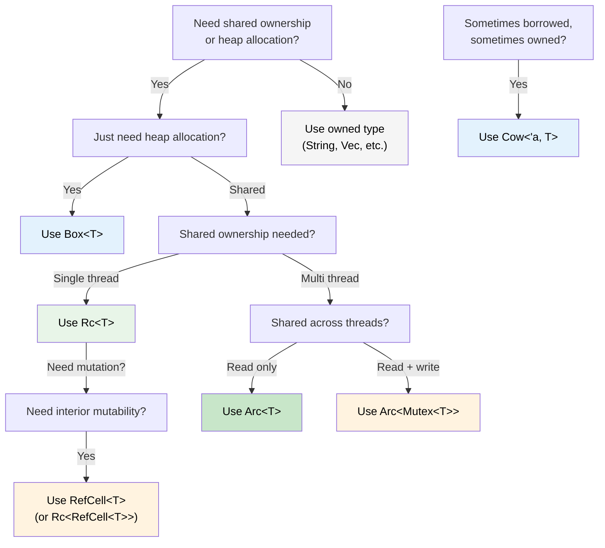

## Smart Pointers: When Single Ownership Isn't Enough | 智能指针：当单一所有权不够用时

> **What you'll learn:** `Box<T>`, `Rc<T>`, `Arc<T>`, `Cell<T>`, `RefCell<T>`, and `Cow<'a, T>` -
> when to use each, how they compare to C#'s GC-managed references, `Drop` as Rust's `IDisposable`,
> `Deref` coercion, and a decision tree for choosing the right smart pointer.
>
> **你将学到什么：** `Box<T>`、`Rc<T>`、`Arc<T>`、`Cell<T>`、`RefCell<T>` 和 `Cow<'a, T>` 的使用场景，
> 它们与 C# 中由 GC 管理的引用有什么区别，`Drop` 如何对应 Rust 版的 `IDisposable`，
> 什么是 `Deref` 强制转换，以及如何通过决策树选出合适的智能指针。
>
> **Difficulty:** Advanced
>
> **难度：** 高级

In C#, every object is essentially reference-counted by the GC. In Rust, single ownership is the default - but sometimes you need shared ownership, heap allocation, or interior mutability. That's where smart pointers come in.

在 C# 里，几乎所有对象都处在 GC 管理下，可以被多个引用指向。而在 Rust 中，默认模型是单一所有权；但有些时候你确实需要共享所有权、显式堆分配，或者内部可变性。这就是智能指针登场的地方。

### Box&lt;T&gt; - Simple Heap Allocation | `Box<T>`：最简单的堆分配
```rust
// Stack allocation (default in Rust)
let x = 42;           // on the stack

// Heap allocation with Box
let y = Box::new(42); // on the heap, like C# `new int(42)` (boxed)
println!("{}", y);     // auto-derefs: prints 42

// Common use: recursive types (can't know size at compile time)
#[derive(Debug)]
enum List {
    Cons(i32, Box<List>),  // Box gives a known pointer size
    Nil,
}

let list = List::Cons(1, Box::new(List::Cons(2, Box::new(List::Nil))));
```

```csharp
// C# - everything on the heap already (reference types)
// Box<T> is only needed in Rust because stack is the default
var list = new LinkedListNode<int>(1);  // always heap-allocated
```

### Rc&lt;T&gt; - Shared Ownership (Single Thread) | `Rc<T>`：共享所有权（单线程）
```rust
use std::rc::Rc;

// Multiple owners of the same data - like multiple C# references
let shared = Rc::new(vec![1, 2, 3]);
let clone1 = Rc::clone(&shared); // reference count: 2
let clone2 = Rc::clone(&shared); // reference count: 3

println!("Count: {}", Rc::strong_count(&shared)); // 3
// Data is dropped when last Rc goes out of scope

// Common use: shared configuration, graph nodes, tree structures
```

### Arc&lt;T&gt; - Shared Ownership (Thread-Safe) | `Arc<T>`：共享所有权（线程安全）
```rust
use std::sync::Arc;
use std::thread;

// Arc = Atomic Reference Counting - safe to share across threads
let data = Arc::new(vec![1, 2, 3]);

let handles: Vec<_> = (0..3).map(|i| {
    let data = Arc::clone(&data);
    thread::spawn(move || {
        println!("Thread {i}: {:?}", data);
    })
}).collect();

for h in handles { h.join().unwrap(); }
```

```csharp
// C# - all references are thread-safe by default (GC handles it)
var data = new List<int> { 1, 2, 3 };
// Can share freely across threads (but mutation is still unsafe!)
```

### Cell&lt;T&gt; and RefCell&lt;T&gt; - Interior Mutability | `Cell<T>` 与 `RefCell<T>`：内部可变性
```rust
use std::cell::RefCell;

// Sometimes you need to mutate data behind a shared reference.
// RefCell moves borrow checking from compile time to runtime.
struct Logger {
    entries: RefCell<Vec<String>>,
}

impl Logger {
    fn new() -> Self {
        Logger { entries: RefCell::new(Vec::new()) }
    }

    fn log(&self, msg: &str) { // &self, not &mut self!
        self.entries.borrow_mut().push(msg.to_string());
    }

    fn dump(&self) {
        for entry in self.entries.borrow().iter() {
            println!("{entry}");
        }
    }
}
// RefCell panics at runtime if borrow rules are violated
// Use sparingly - prefer compile-time checking when possible
```

```text
`RefCell<T>` 的本质是：你用运行时检查换取更灵活的可变性。它不是“更高级”，而是“更宽松但代价更高”。
```

### Cow&lt;'a, str&gt; - Clone on Write | `Cow<'a, str>`：写时克隆
```rust
use std::borrow::Cow;

// Sometimes you have a &str that MIGHT need to become a String
fn normalize(input: &str) -> Cow<'_, str> {
    if input.contains('\t') {
        // Only allocate when we need to modify
        Cow::Owned(input.replace('\t', "    "))
    } else {
        // Borrow the original - zero allocation
        Cow::Borrowed(input)
    }
}

let clean = normalize("hello");           // Cow::Borrowed - no allocation
let dirty = normalize("hello\tworld");    // Cow::Owned - allocated
// Both can be used as &str via Deref
println!("{clean} / {dirty}");
```

### Drop: Rust's `IDisposable` | `Drop`：Rust 版的 `IDisposable`

In C#, `IDisposable` + `using` handles resource cleanup. Rust's equivalent is the `Drop` trait - but it's **automatic**, not opt-in:

在 C# 中，资源清理通常依赖 `IDisposable` 加 `using`。Rust 中的对应机制是 `Drop` trait，但它是**自动触发**的，而不是可选约定：

```csharp
// C# - must remember to use 'using' or call Dispose()
using var file = File.OpenRead("data.bin");
// Dispose() called at end of scope

// Forgetting 'using' is a resource leak!
var file2 = File.OpenRead("data.bin");
// GC will *eventually* finalize, but timing is unpredictable
```

```rust
// Rust - Drop runs automatically when value goes out of scope
{
    let file = File::open("data.bin")?;
    // use file...
}   // file.drop() called HERE, deterministically - no 'using' needed

// Custom Drop (like implementing IDisposable)
struct TempFile {
    path: std::path::PathBuf,
}

impl Drop for TempFile {
    fn drop(&mut self) {
        // Guaranteed to run when TempFile goes out of scope
        let _ = std::fs::remove_file(&self.path);
        println!("Cleaned up {:?}", self.path);
    }
}

fn main() {
    let tmp = TempFile { path: "scratch.tmp".into() };
    // ... use tmp ...
}   // scratch.tmp deleted automatically here
```

**Key difference from C#:** In Rust, *every* type can have deterministic cleanup. You never forget `using` because there's nothing to forget - `Drop` runs when the owner goes out of scope. This pattern is called **RAII** (Resource Acquisition Is Initialization).

**与 C# 的关键差异：** 在 Rust 中，*每一种类型*都可以拥有确定性的清理逻辑。你不会忘记写 `using`，因为根本不需要手动记住这件事；只要所有者离开作用域，`Drop` 就会执行。这种模式叫 **RAII**（资源获取即初始化）。

> **Rule**: If your type holds a resource (file handle, network connection, lock guard, temp file), implement `Drop`. The ownership system guarantees it runs exactly once.
>
> **规则：** 如果你的类型持有某种资源（文件句柄、网络连接、锁守卫、临时文件等），就考虑实现 `Drop`。所有权系统会保证它只执行一次。

### Deref Coercion: Automatic Smart Pointer Unwrapping | Deref 强制转换：自动解开智能指针

Rust automatically "unwraps" smart pointers when you call methods or pass them to functions. This is called **Deref coercion**:

当你调用方法或把值传给函数时，Rust 会自动“解开”智能指针，这种行为称为 **Deref coercion（Deref 强制转换）**：

```rust
let boxed: Box<String> = Box::new(String::from("hello"));

// Deref coercion chain: Box<String> -> String -> str
println!("Length: {}", boxed.len());   // calls str::len() - auto-deref!

fn greet(name: &str) {
    println!("Hello, {name}");
}

let s = String::from("Alice");
greet(&s);       // &String -> &str via Deref coercion
greet(&boxed);   // &Box<String> -> &String -> &str - two levels!
```

```csharp
// C# has no equivalent - you'd need explicit casts or .ToString()
// Closest: implicit conversion operators, but those require explicit definition
```

**Why this matters:** You can pass `&String` where `&str` is expected, `&Vec<T>` where `&[T]` is expected, and `&Box<T>` where `&T` is expected - all without explicit conversion. This is why Rust APIs typically accept `&str` and `&[T]` rather than `&String` and `&Vec<T>`.

**这为什么重要：** 你可以在需要 `&str` 的地方传 `&String`，在需要 `&[T]` 的地方传 `&Vec<T>`，在需要 `&T` 的地方传 `&Box<T>`，而不需要手动转换。所以 Rust API 通常更倾向于接收 `&str` 和 `&[T]`，而不是更具体的 `&String` 和 `&Vec<T>`。

### Rc vs Arc: When to Use Which | `Rc` 和 `Arc` 什么时候该用哪个

| | `Rc<T>` | `Arc<T>` |
|---|---|---|
| **Thread safety** | Single-thread only | Thread-safe (atomic ops) |
| **线程安全** | 仅限单线程 | 线程安全（原子操作） |
| **Overhead** | Lower (non-atomic refcount) | Higher (atomic refcount) |
| **开销** | 更低（非原子引用计数） | 更高（原子引用计数） |
| **Compiler enforced** | Won't compile across `thread::spawn` | Works everywhere |
| **编译器约束** | 不能跨 `thread::spawn` 使用 | 跨线程可用 |
| **Combine with** | `RefCell<T>` for mutation | `Mutex<T>` or `RwLock<T>` for mutation |
| **常见搭配** | 需要修改时搭配 `RefCell<T>` | 需要修改时搭配 `Mutex<T>` 或 `RwLock<T>` |

**Rule of thumb:** Start with `Rc`. The compiler will tell you if you need `Arc`.

**经验法则：** 先用 `Rc`。如果场景涉及跨线程共享，编译器会明确告诉你该换成 `Arc`。

### Decision Tree: Which Smart Pointer? | 决策树：该选哪种智能指针？



<details>
<summary><strong>Exercise: Choose the Right Smart Pointer | 练习：为场景选择正确的智能指针</strong> (click to expand / 点击展开)</summary>

**Challenge**: For each scenario, choose the correct smart pointer and explain why.

**挑战：** 针对下面每个场景，选择最合适的智能指针，并说明原因。

1. A recursive tree data structure
1. 递归树形数据结构
2. A shared configuration object read by multiple components (single thread)
2. 被多个组件读取的共享配置对象（单线程）
3. A request counter shared across HTTP handler threads
3. 在多个 HTTP 处理线程之间共享的请求计数器
4. A cache that might return borrowed or owned strings
4. 一个可能返回借用字符串也可能返回拥有所有权字符串的缓存
5. A logging buffer that needs mutation through a shared reference
5. 一个需要通过共享引用进行修改的日志缓冲区

<details>
<summary>Solution | 参考答案</summary>

1. **`Box<T>`** - recursive types need indirection for known size at compile time
1. **`Box<T>`** - 递归类型需要一层间接引用，编译器才能知道大小
2. **`Rc<T>`** - shared read-only access, single thread, no `Arc` overhead needed
2. **`Rc<T>`** - 单线程下的共享只读访问，不需要 `Arc` 的额外原子开销
3. **`Arc<Mutex<u64>>`** - shared across threads (`Arc`) with mutation (`Mutex`)
3. **`Arc<Mutex<u64>>`** - 既要跨线程共享（`Arc`），又要可变（`Mutex`）
4. **`Cow<'a, str>`** - sometimes returns `&str` (cache hit), sometimes `String` (cache miss)
4. **`Cow<'a, str>`** - 命中缓存时可返回 `&str`，未命中或需改写时返回 `String`
5. **`RefCell<Vec<String>>`** - interior mutability behind `&self` (single thread)
5. **`RefCell<Vec<String>>`** - 在单线程中通过 `&self` 提供内部可变性

**Rule of thumb**: Start with owned types. Reach for `Box` when you need indirection, `Rc`/`Arc` when you need sharing, `RefCell`/`Mutex` when you need interior mutability, `Cow` when you want zero-copy for the common case.

**经验法则：** 默认先从拥有所有权的普通类型开始。需要间接层时用 `Box`，需要共享时用 `Rc`/`Arc`，需要内部可变性时用 `RefCell`/`Mutex`，希望常见路径零拷贝时用 `Cow`。

</details>
</details>

***
