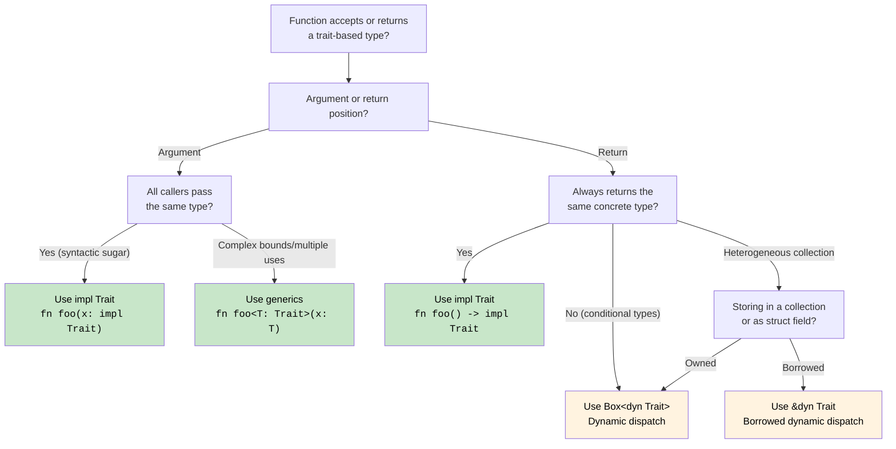

## Traits - Rust's Interfaces | Trait：Rust 的接口机制

> **What you'll learn:** Traits vs C# interfaces, default method implementations, trait objects (`dyn Trait`)
> vs generic bounds (`impl Trait`), derived traits, common standard library traits, associated types,
> and operator overloading via traits.
>
> **你将学到什么：** Trait 与 C# 接口的对应关系、默认方法实现、trait object（`dyn Trait`）
> 与泛型约束（`impl Trait`）的区别、派生 trait、标准库中的常见 trait、关联类型，
> 以及如何通过 trait 实现运算符重载。
>
> **Difficulty:** Intermediate
>
> **难度：** 中级

Traits are Rust's way of defining shared behavior, similar to interfaces in C# but more powerful.

Trait 是 Rust 中定义共享行为的方式，和 C# 的接口很像，但表达能力更强。

### C# Interface Comparison | 与 C# 接口对比
```csharp
// C# interface definition
public interface IAnimal
{
    string Name { get; }
    void MakeSound();
    
    // Default implementation (C# 8+)
    string Describe()
    {
        return $"{Name} makes a sound";
    }
}

// C# interface implementation
public class Dog : IAnimal
{
    public string Name { get; }
    
    public Dog(string name)
    {
        Name = name;
    }
    
    public void MakeSound()
    {
        Console.WriteLine("Woof!");
    }
    
    // Can override default implementation
    public string Describe()
    {
        return $"{Name} is a loyal dog";
    }
}

// Generic constraints
public void ProcessAnimal<T>(T animal) where T : IAnimal
{
    animal.MakeSound();
    Console.WriteLine(animal.Describe());
}
```

### Rust Trait Definition and Implementation | Rust Trait 的定义与实现
```rust
// Trait definition
trait Animal {
    fn name(&self) -> &str;
    fn make_sound(&self);
    
    // Default implementation
    fn describe(&self) -> String {
        format!("{} makes a sound", self.name())
    }
    
    // Default implementation using other trait methods
    fn introduce(&self) {
        println!("Hi, I'm {}", self.name());
        self.make_sound();
    }
}

// Struct definition
#[derive(Debug)]
struct Dog {
    name: String,
    breed: String,
}

impl Dog {
    fn new(name: String, breed: String) -> Dog {
        Dog { name, breed }
    }
}

// Trait implementation
impl Animal for Dog {
    fn name(&self) -> &str {
        &self.name
    }
    
    fn make_sound(&self) {
        println!("Woof!");
    }
    
    // Override default implementation
    fn describe(&self) -> String {
        format!("{} is a loyal {} dog", self.name, self.breed)
    }
}

// Another implementation
#[derive(Debug)]
struct Cat {
    name: String,
    indoor: bool,
}

impl Animal for Cat {
    fn name(&self) -> &str {
        &self.name
    }
    
    fn make_sound(&self) {
        println!("Meow!");
    }
    
    // Use default describe() implementation
}

// Generic function with trait bounds
fn process_animal<T: Animal>(animal: &T) {
    animal.make_sound();
    println!("{}", animal.describe());
    animal.introduce();
}

// Multiple trait bounds
fn process_animal_debug<T: Animal + std::fmt::Debug>(animal: &T) {
    println!("Debug: {:?}", animal);
    process_animal(animal);
}

fn main() {
    let dog = Dog::new("Buddy".to_string(), "Golden Retriever".to_string());
    let cat = Cat { name: "Whiskers".to_string(), indoor: true };
    
    process_animal(&dog);
    process_animal(&cat);
    
    process_animal_debug(&dog);
}
```

### Trait Objects and Dynamic Dispatch | Trait Object 与动态分发
```csharp
// C# dynamic polymorphism
public void ProcessAnimals(List<IAnimal> animals)
{
    foreach (var animal in animals)
    {
        animal.MakeSound(); // Dynamic dispatch
        Console.WriteLine(animal.Describe());
    }
}

// Usage
var animals = new List<IAnimal>
{
    new Dog("Buddy"),
    new Cat("Whiskers"),
    new Dog("Rex")
};

ProcessAnimals(animals);
```

```rust
// Rust trait objects for dynamic dispatch
fn process_animals(animals: &[Box<dyn Animal>]) {
    for animal in animals {
        animal.make_sound(); // Dynamic dispatch
        println!("{}", animal.describe());
    }
}

// Alternative: using references
fn process_animal_refs(animals: &[&dyn Animal]) {
    for animal in animals {
        animal.make_sound();
        println!("{}", animal.describe());
    }
}

fn main() {
    // Using Box<dyn Trait>
    let animals: Vec<Box<dyn Animal>> = vec![
        Box::new(Dog::new("Buddy".to_string(), "Golden Retriever".to_string())),
        Box::new(Cat { name: "Whiskers".to_string(), indoor: true }),
        Box::new(Dog::new("Rex".to_string(), "German Shepherd".to_string())),
    ];
    
    process_animals(&animals);
    
    // Using references
    let dog = Dog::new("Buddy".to_string(), "Golden Retriever".to_string());
    let cat = Cat { name: "Whiskers".to_string(), indoor: true };
    
    let animal_refs: Vec<&dyn Animal> = vec![&dog, &cat];
    process_animal_refs(&animal_refs);
}
```

### Derived Traits | 派生 Trait
```rust
// Automatically derive common traits
#[derive(Debug, Clone, PartialEq, Eq, Hash)]
struct Person {
    name: String,
    age: u32,
}

// What this generates (simplified):
impl std::fmt::Debug for Person {
    fn fmt(&self, f: &mut std::fmt::Formatter<'_>) -> std::fmt::Result {
        f.debug_struct("Person")
            .field("name", &self.name)
            .field("age", &self.age)
            .finish()
    }
}

impl Clone for Person {
    fn clone(&self) -> Self {
        Person {
            name: self.name.clone(),
            age: self.age,
        }
    }
}

impl PartialEq for Person {
    fn eq(&self, other: &Self) -> bool {
        self.name == other.name && self.age == other.age
    }
}

// Usage
fn main() {
    let person1 = Person {
        name: "Alice".to_string(),
        age: 30,
    };
    
    let person2 = person1.clone(); // Clone trait
    
    println!("{:?}", person1); // Debug trait
    println!("Equal: {}", person1 == person2); // PartialEq trait
}
```

### Common Standard Library Traits | 标准库中的常见 Trait
```rust
use std::collections::HashMap;

// Display trait for user-friendly output
impl std::fmt::Display for Person {
    fn fmt(&self, f: &mut std::fmt::Formatter<'_>) -> std::fmt::Result {
        write!(f, "{} (age {})", self.name, self.age)
    }
}

// From trait for conversions
impl From<(String, u32)> for Person {
    fn from((name, age): (String, u32)) -> Self {
        Person { name, age }
    }
}

// Into trait is automatically implemented when From is implemented
fn create_person() {
    let person: Person = ("Alice".to_string(), 30).into();
    println!("{}", person);
}

// Iterator trait implementation
struct PersonIterator {
    people: Vec<Person>,
    index: usize,
}

impl Iterator for PersonIterator {
    type Item = Person;
    
    fn next(&mut self) -> Option<Self::Item> {
        if self.index < self.people.len() {
            let person = self.people[self.index].clone();
            self.index += 1;
            Some(person)
        } else {
            None
        }
    }
}

impl Person {
    fn iterator(people: Vec<Person>) -> PersonIterator {
        PersonIterator { people, index: 0 }
    }
}

fn main() {
    let people = vec![
        Person::from(("Alice".to_string(), 30)),
        Person::from(("Bob".to_string(), 25)),
        Person::from(("Charlie".to_string(), 35)),
    ];
    
    // Use our custom iterator
    for person in Person::iterator(people.clone()) {
        println!("{}", person); // Uses Display trait
    }
}
```

***

<details>
<summary><strong>Exercise: Trait-Based Drawing System | 练习：基于 Trait 的绘图系统</strong> (click to expand / 点击展开)</summary>

**Challenge**: Implement a `Drawable` trait with an `area()` method and a `draw()` default method. Create `Circle` and `Rect` structs. Write a function that accepts `&[Box<dyn Drawable>]` and prints total area.

**挑战：** 实现一个 `Drawable` trait，包含 `area()` 方法和默认的 `draw()` 方法。创建 `Circle` 和 `Rect` 结构体，再写一个函数接收 `&[Box<dyn Drawable>]` 并输出总面积。

<details>
<summary>Solution | 参考答案</summary>

```rust
use std::f64::consts::PI;

trait Drawable {
    fn area(&self) -> f64;

    fn draw(&self) {
        println!("Drawing shape with area {:.2}", self.area());
    }
}

struct Circle { radius: f64 }
struct Rect   { w: f64, h: f64 }

impl Drawable for Circle {
    fn area(&self) -> f64 { PI * self.radius * self.radius }
}

impl Drawable for Rect {
    fn area(&self) -> f64 { self.w * self.h }
}

fn total_area(shapes: &[Box<dyn Drawable>]) -> f64 {
    shapes.iter().map(|s| s.area()).sum()
}

fn main() {
    let shapes: Vec<Box<dyn Drawable>> = vec![
        Box::new(Circle { radius: 5.0 }),
        Box::new(Rect { w: 4.0, h: 6.0 }),
        Box::new(Circle { radius: 2.0 }),
    ];
    for s in &shapes { s.draw(); }
    println!("Total area: {:.2}", total_area(&shapes));
}
```

**Key takeaways**:
- `dyn Trait` gives runtime polymorphism (like C# `IDrawable`)
- `Box<dyn Trait>` is heap-allocated, needed for heterogeneous collections
- Default methods work exactly like C# 8+ default interface methods

**关键要点：**
- `dyn Trait` 提供运行时多态，作用上类似 C# 的 `IDrawable`
- `Box<dyn Trait>` 会进行堆分配，适合存放异构类型集合
- 默认方法的用法和 C# 8+ 的默认接口方法非常接近

</details>
</details>

### Associated Types: Traits With Type Members | 关联类型：带类型成员的 Trait

C# interfaces don't have associated types - Rust traits do. This is how `Iterator` works:

C# 接口没有“关联类型”这个机制，而 Rust trait 有。`Iterator` 就是典型例子：

```rust
// The Iterator trait has an associated type 'Item'
trait Iterator {
    type Item;                         // Each implementor defines what Item is
    fn next(&mut self) -> Option<Self::Item>;
}

struct Counter { max: u32, current: u32 }

impl Iterator for Counter {
    type Item = u32;                   // This Counter yields u32 values
    fn next(&mut self) -> Option<u32> {
        if self.current < self.max {
            self.current += 1;
            Some(self.current)
        } else {
            None
        }
    }
}
```

In C#, `IEnumerator<T>` uses a generic parameter (`T`) for this purpose. Rust's associated types are different: `Iterator` has *one* `Item` type per implementation, not a generic parameter at the trait level. This makes trait bounds simpler: `impl Iterator<Item = u32>` vs C#'s `IEnumerable<int>`.

在 C# 中，`IEnumerator<T>` 用泛型参数 `T` 表达这一点。Rust 的关联类型不同：`Iterator` 对于每个实现者都只有*一个*确定的 `Item` 类型，而不是在 trait 层再挂一个泛型参数。这会让 trait bound 的表达更简洁，例如 `impl Iterator<Item = u32>`。

### Operator Overloading via Traits | 通过 Trait 实现运算符重载

In C#, you define `public static MyType operator+(MyType a, MyType b)`. In Rust, every operator maps to a trait in `std::ops`:

在 C# 中，你会写 `public static MyType operator+(MyType a, MyType b)`。而在 Rust 中，每个运算符都对应 `std::ops` 里的一个 trait：

```rust
use std::ops::Add;

#[derive(Debug, Clone, Copy)]
struct Vec2 { x: f64, y: f64 }

impl Add for Vec2 {
    type Output = Vec2;
    fn add(self, rhs: Vec2) -> Vec2 {
        Vec2 { x: self.x + rhs.x, y: self.y + rhs.y }
    }
}

let a = Vec2 { x: 1.0, y: 2.0 };
let b = Vec2 { x: 3.0, y: 4.0 };
let c = a + b;  // calls <Vec2 as Add>::add(a, b)
```

| C# | Rust | Notes |
|----|------|-------|
| `operator+` | `impl Add` | `self` by value - consumes for non-`Copy` types |
| `operator+` | `impl Add` | `self` 按值传递，对非 `Copy` 类型意味着会消耗所有权 |
| `operator==` | `impl PartialEq` | Usually `#[derive(PartialEq)]` |
| `operator==` | `impl PartialEq` | 通常直接 `#[derive(PartialEq)]` |
| `operator<` | `impl PartialOrd` | Usually `#[derive(PartialOrd)]` |
| `operator<` | `impl PartialOrd` | 通常直接 `#[derive(PartialOrd)]` |
| `ToString()` | `impl fmt::Display` | Used by `println!("{}", x)` |
| `ToString()` | `impl fmt::Display` | 会被 `println!("{}", x)` 使用 |
| Implicit conversion | No equivalent | Rust has no implicit conversions - use `From`/`Into` |
| 隐式转换 | 没有完全对应物 | Rust 没有隐式转换，通常使用 `From`/`Into` |

### Coherence: The Orphan Rule | 一致性规则：孤儿规则

You can only implement a trait if you own either the trait or the type. This prevents conflicting implementations across crates:

只有在“trait 是你的”或“类型是你的”两者至少满足其一时，你才能写实现。这样可以避免不同 crate 之间出现冲突实现：

```rust
// OK - you own MyType
impl Display for MyType { ... }

// OK - you own MyTrait
impl MyTrait for String { ... }

// ERROR - you own neither Display nor String
impl Display for String { ... }
```

C# has no equivalent restriction - any code can add extension methods to any type, which can lead to ambiguity.

C# 没有完全对应的限制，任何代码都可以给任意类型增加扩展方法，这也更容易带来歧义。

## `impl Trait`: Returning Traits Without Boxing | `impl Trait`：不装箱地返回 Trait

C# interfaces can always be used as return types. In Rust, returning a trait requires a decision: static dispatch (`impl Trait`) or dynamic dispatch (`dyn Trait`).

C# 接口总能直接作为返回类型使用。但在 Rust 里，返回 trait 时你必须做出选择：是用静态分发（`impl Trait`），还是动态分发（`dyn Trait`）。

### `impl Trait` in Argument Position (Shorthand for Generics) | 参数位置的 `impl Trait`（泛型简写）
```rust
// These two are equivalent:
fn print_animal(animal: &impl Animal) { animal.make_sound(); }
fn print_animal<T: Animal>(animal: &T)  { animal.make_sound(); }

// impl Trait is just syntactic sugar for a generic parameter
// The compiler generates a specialized copy for each concrete type (monomorphization)
```

### `impl Trait` in Return Position (The Key Difference) | 返回值位置的 `impl Trait`（关键区别）
```rust
// Return an iterator without exposing the concrete type
fn even_squares(limit: u32) -> impl Iterator<Item = u32> {
    (0..limit)
        .filter(|n| n % 2 == 0)
        .map(|n| n * n)
}
// The caller sees "some type that implements Iterator<Item = u32>"
// The actual type (Filter<Map<Range<u32>, ...>>) is unnameable - impl Trait solves this.

fn main() {
    for n in even_squares(20) {
        print!("{n} ");
    }
    // Output: 0 4 16 36 64 100 144 196 256 324
}
```

```csharp
// C# - returning an interface (always dynamic dispatch, heap-allocated iterator object)
public IEnumerable<int> EvenSquares(int limit) =>
    Enumerable.Range(0, limit)
        .Where(n => n % 2 == 0)
        .Select(n => n * n);
// The return type hides the concrete iterator behind the IEnumerable interface
// Unlike Rust's Box<dyn Trait>, C# doesn't explicitly box - the runtime handles allocation
```

### Returning Closures: `impl Fn` vs `Box<dyn Fn>` | 返回闭包：`impl Fn` vs `Box<dyn Fn>`
```rust
// Return a closure - you CANNOT name the closure type, so impl Fn is essential
fn make_adder(x: i32) -> impl Fn(i32) -> i32 {
    move |y| x + y
}

let add5 = make_adder(5);
println!("{}", add5(3)); // 8

// If you need to return DIFFERENT closures conditionally, you need Box:
fn choose_op(add: bool) -> Box<dyn Fn(i32, i32) -> i32> {
    if add {
        Box::new(|a, b| a + b)
    } else {
        Box::new(|a, b| a * b)
    }
}
// impl Trait requires a SINGLE concrete type; different closures are different types
```

```csharp
// C# - delegates handle this naturally (always heap-allocated)
Func<int, int> MakeAdder(int x) => y => x + y;
Func<int, int, int> ChooseOp(bool add) => add ? (a, b) => a + b : (a, b) => a * b;
```

### The Dispatch Decision: `impl Trait` vs `dyn Trait` vs Generics | 分发决策：`impl Trait`、`dyn Trait` 还是泛型

This is an architectural decision C# developers face immediately in Rust. Here's the complete guide:

这是 C# 开发者进入 Rust 后很快就会遇到的架构决策。下面是完整判断思路：



| Approach | Dispatch | Allocation | When to Use |
|----------|----------|------------|-------------|
| `fn foo<T: Trait>(x: T)` | Static (monomorphized) | Stack | Multiple trait bounds, turbofish needed, same type reused |
| `fn foo<T: Trait>(x: T)` | 静态分发（单态化） | 栈上 | 多个 trait 约束、需要复用同一类型参数 |
| `fn foo(x: impl Trait)` | Static (monomorphized) | Stack | Simple bounds, cleaner syntax, one-off parameters |
| `fn foo(x: impl Trait)` | 静态分发（单态化） | 栈上 | 约束简单、语法更简洁、一次性参数 |
| `fn foo() -> impl Trait` | Static | Stack | Single concrete return type, iterators, closures |
| `fn foo() -> impl Trait` | 静态分发 | 栈上 | 单一具体返回类型、迭代器、闭包 |
| `fn foo() -> Box<dyn Trait>` | Dynamic (vtable) | **Heap** | Different return types, trait objects in collections |
| `fn foo() -> Box<dyn Trait>` | 动态分发（vtable） | **堆上** | 多种可能返回类型、需要把 trait object 放进集合 |
| `&dyn Trait` / `&mut dyn Trait` | Dynamic (vtable) | No alloc | Borrowed heterogeneous references, function parameters |
| `&dyn Trait` / `&mut dyn Trait` | 动态分发（vtable） | 无需分配 | 借用的异构引用、函数参数 |

```rust
// Summary: from fastest to most flexible
fn static_dispatch(x: impl Display)              { /* fastest, no alloc */ }
fn generic_dispatch<T: Display + Clone>(x: T)    { /* fastest, multiple bounds */ }
fn dynamic_dispatch(x: &dyn Display)             { /* vtable lookup, no alloc */ }
fn boxed_dispatch(x: Box<dyn Display>)           { /* vtable lookup + heap alloc */ }
```

***
