## Thread Safety: Convention vs Type System Guarantees | 线程安全：约定式做法 vs 类型系统保证

> **What you'll learn:** How Rust enforces thread safety at compile time vs C#'s convention-based approach,
> `Arc<Mutex<T>>` vs `lock`, channels vs `ConcurrentQueue`, `Send`/`Sync` traits,
> scoped threads, and the bridge to async/await.
>
> **你将学到什么：** Rust 如何在编译期强制保证线程安全，而 C# 更多依赖约定式做法；
> `Arc<Mutex<T>>` 与 `lock` 的对比，channel 与 `ConcurrentQueue` 的对比，`Send`/`Sync` trait，
> 作用域线程，以及它们与 async/await 的衔接方式。
>
> **Difficulty:** Advanced
>
> **难度：** 高级

> **Deep dive**: For production async patterns (stream processing, graceful shutdown, connection pooling, cancellation safety), see the companion [Async Rust Training](../../async-book/src/summary.md) guide.
>
> **深入阅读：** 如果你想看生产环境里的 async 模式（流处理、优雅关闭、连接池、取消安全等），可参考配套的 [Async Rust Training](../../async-book/src/summary.md)。
>
> **Prerequisites**: [Ownership & Borrowing](ch07-ownership-and-borrowing.md) and [Smart Pointers](ch07-3-smart-pointers-beyond-single-ownership.md) (Rc vs Arc decision tree).
>
> **前置章节：** [所有权与借用](ch07-ownership-and-borrowing.md) 与 [智能指针](ch07-3-smart-pointers-beyond-single-ownership.md)（尤其是 Rc vs Arc 的选择逻辑）。

### C# - Thread Safety by Convention | C#：依赖约定的线程安全
```csharp
// C# collections aren't thread-safe by default
public class UserService
{
    private readonly List<string> items = new();
    private readonly Dictionary<int, User> cache = new();

    // This can cause data races:
    public void AddItem(string item)
    {
        items.Add(item);  // Not thread-safe!
    }

    // Must use locks manually:
    private readonly object lockObject = new();

    public void SafeAddItem(string item)
    {
        lock (lockObject)
        {
            items.Add(item);  // Safe, but runtime overhead
        }
        // Easy to forget the lock elsewhere
    }

    // ConcurrentCollection helps but limited:
    private readonly ConcurrentBag<string> safeItems = new();
    
    public void ConcurrentAdd(string item)
    {
        safeItems.Add(item);  // Thread-safe but limited operations
    }

    // Complex shared state management
    private readonly ConcurrentDictionary<int, User> threadSafeCache = new();
    private volatile bool isShutdown = false;
    
    public async Task ProcessUser(int userId)
    {
        if (isShutdown) return;  // Race condition possible!
        
        var user = await GetUser(userId);
        threadSafeCache.TryAdd(userId, user);  // Must remember which collections are safe
    }

    // Thread-local storage requires careful management
    private static readonly ThreadLocal<Random> threadLocalRandom = 
        new ThreadLocal<Random>(() => new Random());
        
    public int GetRandomNumber()
    {
        return threadLocalRandom.Value.Next();  // Safe but manual management
    }
}

// Event handling with potential race conditions
public class EventProcessor
{
    public event Action<string> DataReceived;
    private readonly List<string> eventLog = new();
    
    public void OnDataReceived(string data)
    {
        // Race condition - event might be null between check and invocation
        if (DataReceived != null)
        {
            DataReceived(data);
        }
        
        // Another race condition - list not thread-safe
        eventLog.Add($"Processed: {data}");
    }
}
```

### Rust - Thread Safety Guaranteed by Type System | Rust：由类型系统保证线程安全
```rust
use std::sync::{Arc, Mutex, RwLock};
use std::thread;
use std::collections::HashMap;
use tokio::sync::{mpsc, broadcast};

// Rust prevents data races at compile time
pub struct UserService {
    items: Arc<Mutex<Vec<String>>>,
    cache: Arc<RwLock<HashMap<i32, User>>>,
}

impl UserService {
    pub fn new() -> Self {
        UserService {
            items: Arc::new(Mutex::new(Vec::new())),
            cache: Arc::new(RwLock::new(HashMap::new())),
        }
    }
    
    pub fn add_item(&self, item: String) {
        let mut items = self.items.lock().unwrap();
        items.push(item);
        // Lock automatically released when `items` goes out of scope
    }
    
    // Multiple readers, single writer - automatically enforced
    pub async fn get_user(&self, user_id: i32) -> Option<User> {
        let cache = self.cache.read().unwrap();
        cache.get(&user_id).cloned()
    }
    
    pub async fn cache_user(&self, user_id: i32, user: User) {
        let mut cache = self.cache.write().unwrap();
        cache.insert(user_id, user);
    }
    
    // Clone the Arc for thread sharing
    pub fn process_in_background(&self) {
        let items = Arc::clone(&self.items);
        
        thread::spawn(move || {
            let items = items.lock().unwrap();
            for item in items.iter() {
                println!("Processing: {}", item);
            }
        });
    }
}

// Channel-based communication - no shared state needed
pub struct MessageProcessor {
    sender: mpsc::UnboundedSender<String>,
}

impl MessageProcessor {
    pub fn new() -> (Self, mpsc::UnboundedReceiver<String>) {
        let (tx, rx) = mpsc::unbounded_channel();
        (MessageProcessor { sender: tx }, rx)
    }
    
    pub fn send_message(&self, message: String) -> Result<(), mpsc::error::SendError<String>> {
        self.sender.send(message)
    }
}

// This won't compile - Rust prevents sharing mutable data unsafely:
fn impossible_data_race() {
    let mut items = vec![1, 2, 3];
    
    // This won't compile - cannot move `items` into multiple closures
    /*
    thread::spawn(move || {
        items.push(4);  // ERROR: use of moved value
    });
    
    thread::spawn(move || {
        items.push(5);  // ERROR: use of moved value  
    });
    */
}

// Safe concurrent data processing
use rayon::prelude::*;

fn parallel_processing() {
    let data = vec![1, 2, 3, 4, 5];
    
    // Parallel iteration - guaranteed thread-safe
    let results: Vec<i32> = data
        .par_iter()
        .map(|&x| x * x)
        .collect();
        
    println!("{:?}", results);
}

// Async concurrency with message passing
async fn async_message_passing() {
    let (tx, mut rx) = mpsc::channel(100);
    
    // Producer task
    let producer = tokio::spawn(async move {
        for i in 0..10 {
            if tx.send(i).await.is_err() {
                break;
            }
        }
    });
    
    // Consumer task  
    let consumer = tokio::spawn(async move {
        while let Some(value) = rx.recv().await {
            println!("Received: {}", value);
        }
    });
    
    // Wait for both tasks
    let (producer_result, consumer_result) = tokio::join!(producer, consumer);
    producer_result.unwrap();
    consumer_result.unwrap();
}

#[derive(Clone)]
struct User {
    id: i32,
    name: String,
}
```



```mermaid
graph TD
    subgraph "C# Thread Safety Challenges"
        CS_MANUAL["Manual synchronization"]
        CS_LOCKS["lock statements"]
        CS_CONCURRENT["ConcurrentCollections"]
        CS_VOLATILE["volatile fields"]
        CS_FORGET["Easy to forget locks"]
        CS_DEADLOCK["Deadlock possible"]
        CS_RACE["Race conditions"]
        CS_OVERHEAD["Runtime overhead"]
        
        CS_MANUAL --> CS_LOCKS
        CS_MANUAL --> CS_CONCURRENT
        CS_MANUAL --> CS_VOLATILE
        CS_LOCKS --> CS_FORGET
        CS_LOCKS --> CS_DEADLOCK
        CS_FORGET --> CS_RACE
        CS_LOCKS --> CS_OVERHEAD
    end
    
    subgraph "Rust Type System Guarantees"
        RUST_OWNERSHIP["Ownership system"]
        RUST_BORROWING["Borrow checker"]
        RUST_SEND["Send trait"]
        RUST_SYNC["Sync trait"]
        RUST_ARC["Arc<Mutex<T>>"]
        RUST_CHANNELS["Message passing"]
        RUST_SAFE["Data races impossible"]
        RUST_FAST["Zero-cost abstractions"]
        
        RUST_OWNERSHIP --> RUST_BORROWING
        RUST_BORROWING --> RUST_SEND
        RUST_SEND --> RUST_SYNC
        RUST_SYNC --> RUST_ARC
        RUST_ARC --> RUST_CHANNELS
        RUST_CHANNELS --> RUST_SAFE
        RUST_SAFE --> RUST_FAST
    end
    
    style CS_FORGET fill:#ffcdd2,color:#000
    style CS_DEADLOCK fill:#ffcdd2,color:#000
    style CS_RACE fill:#ffcdd2,color:#000
    style RUST_SAFE fill:#c8e6c9,color:#000
    style RUST_FAST fill:#c8e6c9,color:#000
```

***

<details>
<summary><strong>Exercise: Thread-Safe Counter | 练习：线程安全计数器</strong> (click to expand / 点击展开)</summary>

**Challenge**: Implement a thread-safe counter that can be incremented from 10 threads simultaneously. Each thread increments 1000 times. The final count should be exactly 10,000.

**挑战：** 实现一个线程安全计数器，让 10 个线程同时对它进行递增。每个线程递增 1000 次，最终结果必须精确等于 10,000。

<details>
<summary>Solution | 参考答案</summary>

```rust
use std::sync::{Arc, Mutex};
use std::thread;

fn main() {
    let counter = Arc::new(Mutex::new(0u64));
    let mut handles = vec![];

    for _ in 0..10 {
        let counter = Arc::clone(&counter);
        handles.push(thread::spawn(move || {
            for _ in 0..1000 {
                let mut count = counter.lock().unwrap();
                *count += 1;
            }
        }));
    }

    for h in handles { h.join().unwrap(); }
    assert_eq!(*counter.lock().unwrap(), 10_000);
    println!("Final count: {}", counter.lock().unwrap());
}
```

**Or with atomics (faster, no locking):**

**或者使用原子类型（更快，无需加锁）：**

```rust
use std::sync::atomic::{AtomicU64, Ordering};
use std::sync::Arc;
use std::thread;

fn main() {
    let counter = Arc::new(AtomicU64::new(0));
    let handles: Vec<_> = (0..10).map(|_| {
        let counter = Arc::clone(&counter);
        thread::spawn(move || {
            for _ in 0..1000 {
                counter.fetch_add(1, Ordering::Relaxed);
            }
        })
    }).collect();

    for h in handles { h.join().unwrap(); }
    assert_eq!(counter.load(Ordering::SeqCst), 10_000);
}
```

**Key takeaway**: `Arc<Mutex<T>>` is the general pattern. For simple counters, `AtomicU64` avoids lock overhead entirely.

**关键结论：** `Arc<Mutex<T>>` 是通用的共享可变状态模式；如果只是简单计数，`AtomicU64` 可以完全绕开锁开销。

</details>
</details>

### Why Rust prevents data races: Send and Sync | Rust 为什么能阻止数据竞争：`Send` 与 `Sync`

Rust uses two marker traits to enforce thread safety **at compile time** - there is no C# equivalent:

Rust 使用两个标记 trait 在**编译期**强制线程安全，这在 C# 里没有完全对应的机制：

- `Send`: A type can be safely **transferred** to another thread (e.g., moved into a closure passed to `thread::spawn`)
- `Send`：表示一个类型可以被安全地**转移**到另一个线程，例如被 move 进 `thread::spawn` 的闭包里
- `Sync`: A type can be safely **shared** (via `&T`) between threads
- `Sync`：表示一个类型可以通过共享引用 `&T` 被多个线程安全地**共享**

Most types are automatically `Send + Sync`. Notable exceptions:

大多数类型会自动实现 `Send + Sync`。常见例外包括：

- `Rc<T>` is **neither** Send nor Sync - the compiler will refuse to let you pass it to `thread::spawn` (use `Arc<T>` instead)
- `Rc<T>` **既不是** `Send` 也不是 `Sync`，编译器会拒绝你把它传进 `thread::spawn`（应改用 `Arc<T>`）
- `Cell<T>` and `RefCell<T>` are **not** Sync - use `Mutex<T>` or `RwLock<T>` for thread-safe interior mutability
- `Cell<T>` 与 `RefCell<T>` **不是** `Sync`，需要线程安全内部可变性时应用 `Mutex<T>` 或 `RwLock<T>`
- Raw pointers (`*const T`, `*mut T`) are **neither** Send nor Sync
- 原始指针（`*const T`、`*mut T`）**既不是** `Send` 也不是 `Sync`

In C#, `List<T>` is not thread-safe but the compiler won't stop you from sharing it across threads. In Rust, the equivalent mistake is a **compile error**, not a runtime race condition.

在 C# 中，`List<T>` 不是线程安全的，但编译器不会阻止你跨线程共享它。在 Rust 中，等价错误通常会直接变成**编译错误**，而不是运行时的数据竞争。

### Scoped threads: borrowing from the stack | 作用域线程：从栈上借用数据

`thread::scope()` lets spawned threads borrow local variables - no `Arc` needed:

`thread::scope()` 允许新线程借用局部变量，而不必一定把数据放进 `Arc`：

```rust
use std::thread;

fn main() {
    let data = vec![1, 2, 3, 4, 5];
    
    // Scoped threads can borrow 'data' - scope waits for all threads to finish
    thread::scope(|s| {
        s.spawn(|| println!("Thread 1: {data:?}"));
        s.spawn(|| println!("Thread 2: sum = {}", data.iter().sum::<i32>()));
    });
    // 'data' is still valid here - threads are guaranteed to have finished
}
```

This is similar to C#'s `Parallel.ForEach` in that the calling code waits for completion, but Rust's borrow checker **proves** there are no data races at compile time.

它和 C# 的 `Parallel.ForEach` 有点像，都是调用方等待并发任务结束；但 Rust 的借用检查器还能在编译期**证明**不存在数据竞争。

### Bridging to async/await | 连接到 async/await

C# developers typically reach for `Task` and `async/await` rather than raw threads. Rust has both paradigms:

C# 开发者通常更习惯优先使用 `Task` 和 `async/await`，而不是直接操作线程。Rust 同时支持这两套并发模型：

| C# | Rust | When to use |
|----|------|-------------|
| `Thread` | `std::thread::spawn` | CPU-bound work, OS thread per task |
| `Thread` | `std::thread::spawn` | CPU 密集型任务，每个任务对应一个 OS 线程 |
| `Task.Run` | `tokio::spawn` | Async task on a runtime |
| `Task.Run` | `tokio::spawn` | 运行时上的异步任务 |
| `async/await` | `async/await` | I/O-bound concurrency |
| `async/await` | `async/await` | I/O 密集型并发 |
| `lock` | `Mutex<T>` | Sync mutual exclusion |
| `lock` | `Mutex<T>` | 同步互斥 |
| `SemaphoreSlim` | `tokio::sync::Semaphore` | Async concurrency limiting |
| `SemaphoreSlim` | `tokio::sync::Semaphore` | 异步并发限流 |
| `Interlocked` | `std::sync::atomic` | Lock-free atomic operations |
| `Interlocked` | `std::sync::atomic` | 无锁原子操作 |
| `CancellationToken` | `tokio_util::sync::CancellationToken` | Cooperative cancellation |
| `CancellationToken` | `tokio_util::sync::CancellationToken` | 协作式取消 |

> The next chapter ([Async/Await Deep Dive](ch13-1-asyncawait-deep-dive.md)) covers Rust's async model in detail - including how it differs from C#'s `Task`-based model.
>
> 下一章（[Async/Await 深入讲解](ch13-1-asyncawait-deep-dive.md)）会详细展开 Rust 的 async 模型，以及它和 C# 基于 `Task` 的模型到底有什么不同。
