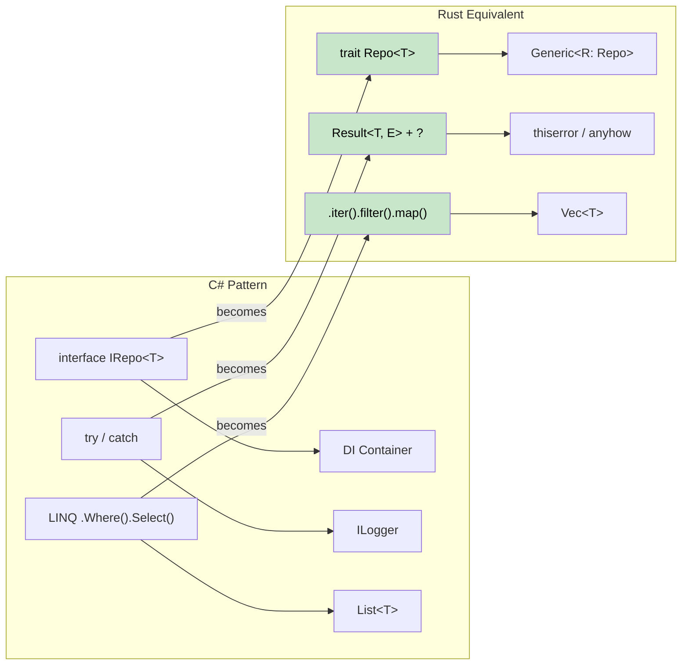

## Common C# Patterns in Rust | Rust 中常见的 C# 模式映射

> **What you'll learn:** How to translate the Repository pattern, Builder pattern, dependency injection,
> LINQ chains, Entity Framework queries, and configuration patterns from C# to idiomatic Rust.
>
> **你将学到什么：** 如何把 Repository 模式、Builder 模式、依赖注入、LINQ 链式操作、
> Entity Framework 查询以及配置模式，从 C# 迁移到惯用的 Rust 写法。
>
> **Difficulty:** Intermediate
>
> **难度：** 中级



### Repository Pattern | Repository 模式
```csharp
// C# Repository Pattern
public interface IRepository<T> where T : IEntity
{
    Task<T> GetByIdAsync(int id);
    Task<IEnumerable<T>> GetAllAsync();
    Task<T> AddAsync(T entity);
    Task UpdateAsync(T entity);
    Task DeleteAsync(int id);
}

public class UserRepository : IRepository<User>
{
    private readonly DbContext _context;
    
    public UserRepository(DbContext context)
    {
        _context = context;
    }
    
    public async Task<User> GetByIdAsync(int id)
    {
        return await _context.Users.FindAsync(id);
    }
    
    // ... other implementations
}
```

```rust
// Rust Repository Pattern with traits and generics
use async_trait::async_trait;
use std::fmt::Debug;

#[async_trait]
pub trait Repository<T, E> 
where 
    T: Clone + Debug + Send + Sync,
    E: std::error::Error + Send + Sync,
{
    async fn get_by_id(&self, id: u64) -> Result<Option<T>, E>;
    async fn get_all(&self) -> Result<Vec<T>, E>;
    async fn add(&self, entity: T) -> Result<T, E>;
    async fn update(&self, entity: T) -> Result<T, E>;
    async fn delete(&self, id: u64) -> Result<(), E>;
}

#[derive(Debug, Clone)]
pub struct User {
    pub id: u64,
    pub name: String,
    pub email: String,
}

#[derive(Debug)]
pub enum RepositoryError {
    NotFound(u64),
    DatabaseError(String),
    ValidationError(String),
}

impl std::fmt::Display for RepositoryError {
    fn fmt(&self, f: &mut std::fmt::Formatter<'_>) -> std::fmt::Result {
        match self {
            RepositoryError::NotFound(id) => write!(f, "Entity with id {} not found", id),
            RepositoryError::DatabaseError(msg) => write!(f, "Database error: {}", msg),
            RepositoryError::ValidationError(msg) => write!(f, "Validation error: {}", msg),
        }
    }
}

impl std::error::Error for RepositoryError {}

pub struct UserRepository {
    // database connection pool, etc.
}

#[async_trait]
impl Repository<User, RepositoryError> for UserRepository {
    async fn get_by_id(&self, id: u64) -> Result<Option<User>, RepositoryError> {
        // Simulate database lookup
        if id == 0 {
            return Ok(None);
        }
        
        Ok(Some(User {
            id,
            name: format!("User {}", id),
            email: format!("user{}@example.com", id),
        }))
    }
    
    async fn get_all(&self) -> Result<Vec<User>, RepositoryError> {
        // Implementation here
        Ok(vec![])
    }
    
    async fn add(&self, entity: User) -> Result<User, RepositoryError> {
        // Validation and database insertion
        if entity.name.is_empty() {
            return Err(RepositoryError::ValidationError("Name cannot be empty".to_string()));
        }
        Ok(entity)
    }
    
    async fn update(&self, entity: User) -> Result<User, RepositoryError> {
        // Implementation here
        Ok(entity)
    }
    
    async fn delete(&self, id: u64) -> Result<(), RepositoryError> {
        // Implementation here
        Ok(())
    }
}
```

### Builder Pattern | Builder 模式
```csharp
// C# Builder Pattern (fluent interface)
public class HttpClientBuilder
{
    private TimeSpan? _timeout;
    private string _baseAddress;
    private Dictionary<string, string> _headers = new();
    
    public HttpClientBuilder WithTimeout(TimeSpan timeout)
    {
        _timeout = timeout;
        return this;
    }
    
    public HttpClientBuilder WithBaseAddress(string baseAddress)
    {
        _baseAddress = baseAddress;
        return this;
    }
    
    public HttpClientBuilder WithHeader(string name, string value)
    {
        _headers[name] = value;
        return this;
    }
    
    public HttpClient Build()
    {
        var client = new HttpClient();
        if (_timeout.HasValue)
            client.Timeout = _timeout.Value;
        if (!string.IsNullOrEmpty(_baseAddress))
            client.BaseAddress = new Uri(_baseAddress);
        foreach (var header in _headers)
            client.DefaultRequestHeaders.Add(header.Key, header.Value);
        return client;
    }
}

// Usage
var client = new HttpClientBuilder()
    .WithTimeout(TimeSpan.FromSeconds(30))
    .WithBaseAddress("https://api.example.com")
    .WithHeader("Accept", "application/json")
    .Build();
```

```rust
// Rust Builder Pattern (consuming builder)
use std::collections::HashMap;
use std::time::Duration;

#[derive(Debug)]
pub struct HttpClient {
    timeout: Duration,
    base_address: String,
    headers: HashMap<String, String>,
}

pub struct HttpClientBuilder {
    timeout: Option<Duration>,
    base_address: Option<String>,
    headers: HashMap<String, String>,
}

impl HttpClientBuilder {
    pub fn new() -> Self {
        HttpClientBuilder {
            timeout: None,
            base_address: None,
            headers: HashMap::new(),
        }
    }
    
    pub fn with_timeout(mut self, timeout: Duration) -> Self {
        self.timeout = Some(timeout);
        self
    }
    
    pub fn with_base_address<S: Into<String>>(mut self, base_address: S) -> Self {
        self.base_address = Some(base_address.into());
        self
    }
    
    pub fn with_header<K: Into<String>, V: Into<String>>(mut self, name: K, value: V) -> Self {
        self.headers.insert(name.into(), value.into());
        self
    }
    
    pub fn build(self) -> Result<HttpClient, String> {
        let base_address = self.base_address.ok_or("Base address is required")?;
        
        Ok(HttpClient {
            timeout: self.timeout.unwrap_or(Duration::from_secs(30)),
            base_address,
            headers: self.headers,
        })
    }
}

// Usage
let client = HttpClientBuilder::new()
    .with_timeout(Duration::from_secs(30))
    .with_base_address("https://api.example.com")
    .with_header("Accept", "application/json")
    .build()?;

// Alternative: Using Default trait for common cases
impl Default for HttpClientBuilder {
    fn default() -> Self {
        Self::new()
    }
}
```

***

## C# to Rust Concept Mapping | C# 到 Rust 的概念映射

### Dependency Injection -> Constructor Injection + Traits | 依赖注入 -> 构造函数注入 + Trait
```csharp
// C# with DI container
services.AddScoped<IUserRepository, UserRepository>();
services.AddScoped<IUserService, UserService>();

public class UserService
{
    private readonly IUserRepository _repository;
    
    public UserService(IUserRepository repository)
    {
        _repository = repository;
    }
}
```

```rust
// Rust: Constructor injection with traits
pub trait UserRepository {
    async fn find_by_id(&self, id: Uuid) -> Result<Option<User>, Error>;
    async fn save(&self, user: &User) -> Result<(), Error>;
}

pub struct UserService<R> 
where 
    R: UserRepository,
{
    repository: R,
}

impl<R> UserService<R> 
where 
    R: UserRepository,
{
    pub fn new(repository: R) -> Self {
        Self { repository }
    }
    
    pub async fn get_user(&self, id: Uuid) -> Result<Option<User>, Error> {
        self.repository.find_by_id(id).await
    }
}

// Usage
let repository = PostgresUserRepository::new(pool);
let service = UserService::new(repository);
```

### LINQ -> Iterator Chains | LINQ -> 迭代器链
```csharp
// C# LINQ
var result = users
    .Where(u => u.Age > 18)
    .Select(u => u.Name.ToUpper())
    .OrderBy(name => name)
    .Take(10)
    .ToList();
```

```rust
// Rust: Iterator chains (zero-cost!)
let result: Vec<String> = users
    .iter()
    .filter(|u| u.age > 18)
    .map(|u| u.name.to_uppercase())
    .collect::<Vec<_>>()
    .into_iter()
    .sorted()
    .take(10)
    .collect();

// Or with itertools crate for more LINQ-like operations
use itertools::Itertools;

let result: Vec<String> = users
    .iter()
    .filter(|u| u.age > 18)
    .map(|u| u.name.to_uppercase())
    .sorted()
    .take(10)
    .collect();
```

### Entity Framework -> SQLx + Migrations | Entity Framework -> SQLx + Migration
```csharp
// C# Entity Framework
public class ApplicationDbContext : DbContext
{
    public DbSet<User> Users { get; set; }
}

var user = await context.Users
    .Where(u => u.Email == email)
    .FirstOrDefaultAsync();
```

```rust
// Rust: SQLx with compile-time checked queries
use sqlx::{PgPool, FromRow};

#[derive(FromRow)]
struct User {
    id: Uuid,
    email: String,
    name: String,
}

// Compile-time checked query
let user = sqlx::query_as!(
    User,
    "SELECT id, email, name FROM users WHERE email = $1",
    email
)
.fetch_optional(&pool)
.await?;

// Or with dynamic queries
let user = sqlx::query_as::<_, User>(
    "SELECT id, email, name FROM users WHERE email = $1"
)
.bind(email)
.fetch_optional(&pool)
.await?;
```

### Configuration -> Config Crates | 配置 -> Config Crate
```csharp
// C# Configuration
public class AppSettings
{
    public string DatabaseUrl { get; set; }
    public int Port { get; set; }
}

var config = builder.Configuration.Get<AppSettings>();
```

```rust
// Rust: Config with serde
use config::{Config, ConfigError, Environment, File};
use serde::Deserialize;

#[derive(Debug, Deserialize)]
struct AppSettings {
    database_url: String,
    port: u16,
}

impl AppSettings {
    pub fn new() -> Result<Self, ConfigError> {
        let s = Config::builder()
            .add_source(File::with_name("config/default"))
            .add_source(Environment::with_prefix("APP"))
            .build()?;

        s.try_deserialize()
    }
}

// Usage
let settings = AppSettings::new()?;
```

---

## Case Studies | 案例研究

### Case Study 1: CLI Tool Migration (csvtool) | 案例 1：CLI 工具迁移（csvtool）

**Background**: A team maintained a C# console app (`CsvProcessor`) that read large CSV files, applied transformations, and wrote output. At 500 MB files, memory usage spiked to 4 GB and GC pauses caused 30-second stalls.

**背景：** 某团队维护着一个 C# 控制台程序 `CsvProcessor`，用于读取大体积 CSV、执行转换并写出结果。处理 500 MB 文件时，内存会飙到 4 GB，GC 暂停甚至会造成 30 秒卡顿。

**Migration approach**: Rewrote in Rust over 2 weeks, one module at a time.

**迁移方式：** 用 2 周时间逐模块改写为 Rust。

| Step | What Changed | C# -> Rust |
|------|-------------|-----------|
| 1 | CSV parsing | `CsvHelper` -> `csv` crate (streaming `Reader`) |
| 1 | CSV 解析 | `CsvHelper` -> `csv` crate（流式 `Reader`） |
| 2 | Data model | `class Record` -> `struct Record` (stack-allocated, `#[derive(Deserialize)]`) |
| 2 | 数据模型 | `class Record` -> `struct Record`（栈上值，`#[derive(Deserialize)]`） |
| 3 | Transformations | LINQ `.Select().Where()` -> `.iter().map().filter()` |
| 3 | 转换逻辑 | LINQ `.Select().Where()` -> `.iter().map().filter()` |
| 4 | File I/O | `StreamReader` -> `BufReader<File>` with `?` error propagation |
| 4 | 文件 I/O | `StreamReader` -> `BufReader<File>`，并使用 `?` 传播错误 |
| 5 | CLI args | `System.CommandLine` -> `clap` with derive macros |
| 5 | 命令行参数 | `System.CommandLine` -> 带 derive 宏的 `clap` |
| 6 | Parallel processing | `Parallel.ForEach` -> `rayon`'s `.par_iter()` |
| 6 | 并行处理 | `Parallel.ForEach` -> `rayon` 的 `.par_iter()` |

**Results**:
- Memory: 4 GB -> 12 MB (streaming instead of loading entire file)
- Speed: 45s -> 3s for 500 MB file
- Binary size: single 2 MB executable, no runtime dependency

**结果：**
- 内存：4 GB -> 12 MB（因为改成了流式处理，而不是一次性读入整个文件）
- 速度：处理 500 MB 文件从 45 秒降到 3 秒
- 二进制体积：单文件 2 MB，可执行文件无额外运行时依赖

**Key lesson**: The biggest win wasn't Rust itself - it was that Rust's ownership model *forced* a streaming design. In C#, it was easy to `.ToList()` everything into memory. In Rust, the borrow checker naturally steered toward `Iterator`-based processing.

**关键启发：** 最大收益不只是“换成 Rust”，而是 Rust 的所有权模型*逼迫*设计走向流式处理。在 C# 中，把所有东西 `.ToList()` 进内存太容易了；而在 Rust 里，借用检查器会自然把你推向基于 `Iterator` 的处理方式。

### Case Study 2: Microservice Replacement (auth-gateway) | 案例 2：微服务替换（auth-gateway）

**Background**: A C# ASP.NET Core authentication gateway handled JWT validation and rate limiting for 50+ backend services. At 10K req/s, p99 latency hit 200ms with GC spikes.

**背景：** 一个基于 C# ASP.NET Core 的认证网关负责为 50 多个后端服务做 JWT 校验和限流。在 10K req/s 下，p99 延迟会因为 GC 抖动飙到 200ms。

**Migration approach**: Replaced with a Rust service using `axum` + `tower`, keeping the API contract identical.

**迁移方式：** 使用 `axum` + `tower` 重写为 Rust 服务，同时保持 API 协议完全一致。

```rust
// Before (C#):  services.AddAuthentication().AddJwtBearer(...)
// After (Rust):  tower middleware layer

use axum::{Router, middleware};
use tower::ServiceBuilder;

let app = Router::new()
    .route("/api/*path", any(proxy_handler))
    .layer(
        ServiceBuilder::new()
            .layer(middleware::from_fn(validate_jwt))
            .layer(middleware::from_fn(rate_limit))
    );
```

| Metric | C# (ASP.NET Core) | Rust (axum) |
|--------|-------------------|-------------|
| p50 latency | 5ms | 0.8ms |
| p50 延迟 | 5ms | 0.8ms |
| p99 latency | 200ms (GC spikes) | 4ms |
| p99 延迟 | 200ms（有 GC 抖动） | 4ms |
| Memory | 300 MB | 8 MB |
| 内存 | 300 MB | 8 MB |
| Docker image | 210 MB (.NET runtime) | 12 MB (static binary) |
| Docker 镜像 | 210 MB（含 .NET runtime） | 12 MB（静态二进制） |
| Cold start | 2.1s | 0.05s |
| 冷启动 | 2.1s | 0.05s |

**Key lessons**:
1. **Keep the same API contract** - no client changes needed. Rust service was a drop-in replacement.
2. **Start with the hot path** - JWT validation was the bottleneck. Migrating just that one middleware would have captured 80% of the win.
3. **Use `tower` middleware** - it mirrors ASP.NET Core's middleware pipeline pattern, so C# developers found the Rust architecture familiar.
4. **p99 latency improvement** came from eliminating GC pauses, not from faster code - Rust's steady-state throughput was only 2x faster, but the absence of GC made the tail latency predictable.

**关键经验：**
1. **保持 API 协议不变**。这样无需改客户端，Rust 服务可以直接替换原实现。
2. **优先迁移热点路径**。JWT 校验是瓶颈，哪怕只迁这一个中间件，也可能先拿到 80% 的收益。
3. **使用 `tower` 中间件**。它和 ASP.NET Core 的中间件流水线很像，C# 团队更容易理解和接受。
4. **p99 延迟改善主要来自消除 GC 暂停**，而不是单纯代码“更快”。Rust 的稳态吞吐可能只提升 2 倍，但没有 GC 抖动后，尾延迟会稳定得多。

---

## Exercises | 练习

<details>
<summary><strong>Exercise: Migrate a C# Service | 练习：迁移一个 C# 服务</strong> (click to expand / 点击展开)</summary>

Translate this C# service to idiomatic Rust:

把下面这个 C# 服务翻译成惯用的 Rust 写法：

```csharp
public interface IUserService
{
    Task<User?> GetByIdAsync(int id);
    Task<List<User>> SearchAsync(string query);
}

public class UserService : IUserService
{
    private readonly IDatabase _db;
    public UserService(IDatabase db) { _db = db; }

    public async Task<User?> GetByIdAsync(int id)
    {
        try { return await _db.QuerySingleAsync<User>(id); }
        catch (NotFoundException) { return null; }
    }

    public async Task<List<User>> SearchAsync(string query)
    {
        return await _db.QueryAsync<User>($"SELECT * WHERE name LIKE '%{query}%'");
    }
}
```

**Hints**: Use a trait, `Option<User>` instead of null, `Result` instead of try/catch, and fix the SQL injection vulnerability.

**提示：** 使用 trait，用 `Option<User>` 替代 null，用 `Result` 替代 try/catch，并修复 SQL 注入漏洞。

<details>
<summary>Solution | 参考答案</summary>

```rust
use async_trait::async_trait;

#[derive(Debug, Clone)]
struct User { id: i64, name: String }

#[async_trait]
trait Database: Send + Sync {
    async fn get_user(&self, id: i64) -> Result<Option<User>, sqlx::Error>;
    async fn search_users(&self, query: &str) -> Result<Vec<User>, sqlx::Error>;
}

#[async_trait]
trait UserService: Send + Sync {
    async fn get_by_id(&self, id: i64) -> Result<Option<User>, AppError>;
    async fn search(&self, query: &str) -> Result<Vec<User>, AppError>;
}

struct UserServiceImpl<D: Database> {
    db: D,  // No Arc needed - Rust's ownership handles it
}

#[async_trait]
impl<D: Database> UserService for UserServiceImpl<D> {
    async fn get_by_id(&self, id: i64) -> Result<Option<User>, AppError> {
        // Option instead of null; Result instead of try/catch
        Ok(self.db.get_user(id).await?)
    }

    async fn search(&self, query: &str) -> Result<Vec<User>, AppError> {
        // Parameterized query - NO SQL injection!
        // (sqlx uses $1 placeholders, not string interpolation)
        self.db.search_users(query).await.map_err(Into::into)
    }
}
```

**Key changes from C#**:
- `null` -> `Option<User>` (compile-time null safety)
- `try/catch` -> `Result` + `?` (explicit error propagation)
- SQL injection fixed: parameterized queries, not string interpolation
- `IDatabase _db` -> generic `D: Database` (static dispatch, no boxing)

**与 C# 相比的关键变化：**
- `null` -> `Option<User>`（编译期空值安全）
- `try/catch` -> `Result` + `?`（显式错误传播）
- SQL 注入问题修复：改用参数化查询，不再拼接字符串
- `IDatabase _db` -> 泛型 `D: Database`（静态分发，无需装箱）

</details>
</details>

***
