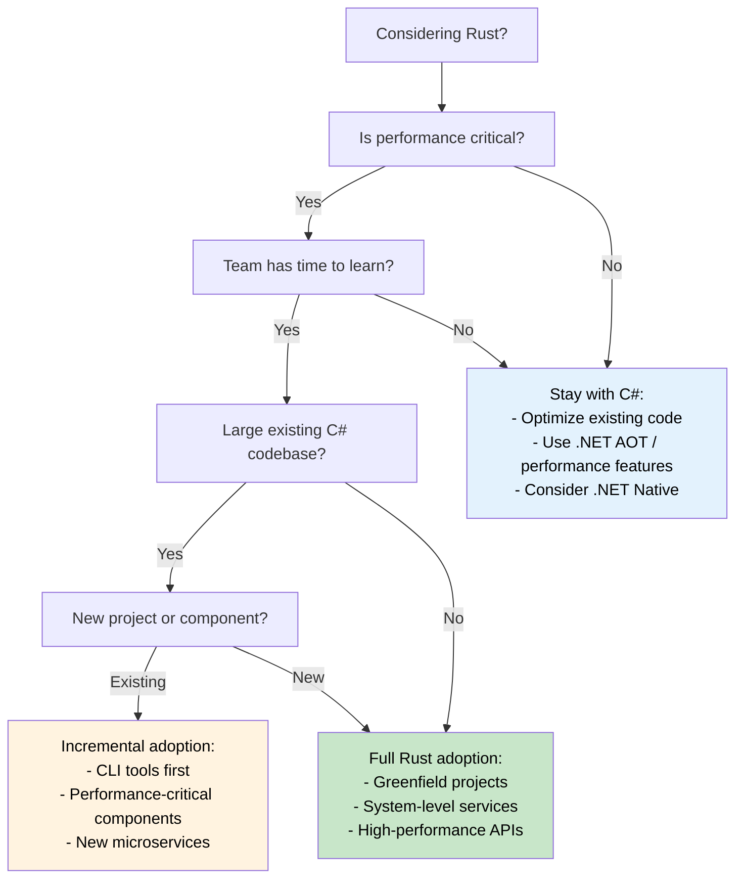

## Performance Comparison: Managed vs Native | 性能对比：托管运行时 vs 原生执行

> **What you'll learn:** Real-world performance differences between C# and Rust - startup time,
> memory usage, throughput benchmarks, CPU-intensive workloads, and a decision tree
> for when to migrate vs when to stay in C#.
>
> **你将学到什么：** C# 与 Rust 在真实场景中的性能差异，包括启动时间、
> 内存占用、吞吐基准、CPU 密集型工作负载，以及什么时候该迁移、什么时候继续留在 C# 的决策思路。
>
> **Difficulty:** Intermediate
>
> **难度：** 中级

### Real-World Performance Characteristics | 真实世界中的性能特征

| **Aspect** | **C# (.NET)** | **Rust** | **Performance Impact** |
|------------|---------------|----------|------------------------|
| **Startup Time** | 100-500ms (JIT); 5-30ms (.NET 8 AOT) | 1-10ms (native binary) | **10-50x faster** (vs JIT) |
| **启动时间** | 100-500ms（JIT）；5-30ms（.NET 8 AOT） | 1-10ms（原生二进制） | **相对 JIT 可快 10-50 倍** |
| **Memory Usage** | +30-100% (GC overhead + metadata) | Baseline (minimal runtime) | **30-50% less RAM** |
| **内存占用** | 额外增加 30-100%（GC 开销 + 元数据） | 接近基线（运行时极小） | **通常少 30-50% 内存** |
| **GC Pauses** | 1-100ms periodic pauses | Never (no GC) | **Consistent latency** |
| **GC 暂停** | 周期性暂停 1-100ms | 不存在（无 GC） | **延迟更稳定** |
| **CPU Usage** | +10-20% (GC + JIT overhead) | Baseline (direct execution) | **10-20% better efficiency** |
| **CPU 占用** | 额外增加 10-20%（GC + JIT 开销） | 接近基线（直接执行） | **通常提升 10-20% 效率** |
| **Binary Size** | 30-200MB (with runtime); 10-30MB (AOT trimmed) | 1-20MB (static binary) | **Smaller deployments** |
| **二进制大小** | 30-200MB（含运行时）；10-30MB（AOT 裁剪后） | 1-20MB（静态二进制） | **部署体积更小** |
| **Memory Safety** | Runtime checks | Compile-time proofs | **Zero overhead safety** |
| **内存安全** | 运行时检查 | 编译期证明 | **零额外运行时成本的安全性** |
| **Concurrent Performance** | Good (with careful synchronization) | Excellent (fearless concurrency) | **Superior scalability** |
| **并发表现** | 不错（前提是仔细同步） | 很强（fearless concurrency） | **扩展性通常更强** |

> **Note on .NET 8+ AOT**: Native AOT compilation closes the startup gap significantly (5-30ms). For throughput and memory, GC overhead and pauses remain. When evaluating a migration, benchmark your *specific workload* - headline numbers can be misleading.
>
> **关于 .NET 8+ AOT 的说明：** Native AOT 已经显著缩小了启动时间差距（约 5-30ms）。但在吞吐和内存方面，GC 开销与暂停仍然存在。评估是否迁移时，一定要基于你自己的*真实工作负载*做基准，不能只看宣传数字。

### Benchmark Examples | 基准示例

```csharp
// C# - JSON processing benchmark
public class JsonProcessor
{
    public async Task<List<User>> ProcessJsonFile(string path)
    {
        var json = await File.ReadAllTextAsync(path);
        var users = JsonSerializer.Deserialize<List<User>>(json);
        
        return users.Where(u => u.Age > 18)
                   .OrderBy(u => u.Name)
                   .Take(1000)
                   .ToList();
    }
}

// Typical performance: ~200ms for 100MB file
// Memory usage: ~500MB peak (GC overhead)
// Binary size: ~80MB (self-contained)
```

```rust
// Rust - Equivalent JSON processing
use serde::{Deserialize, Serialize};
use tokio::fs;

#[derive(Deserialize, Serialize)]
struct User {
    name: String,
    age: u32,
}

pub async fn process_json_file(path: &str) -> Result<Vec<User>, Box<dyn std::error::Error>> {
    let json = fs::read_to_string(path).await?;
    let mut users: Vec<User> = serde_json::from_str(&json)?;
    
    users.retain(|u| u.age > 18);
    users.sort_by(|a, b| a.name.cmp(&b.name));
    users.truncate(1000);
    
    Ok(users)
}

// Typical performance: ~120ms for same 100MB file
// Memory usage: ~200MB peak (no GC overhead)
// Binary size: ~8MB (static binary)
```

### CPU-Intensive Workloads | CPU 密集型工作负载

```csharp
// C# - Mathematical computation
public class Mandelbrot
{
    public static int[,] Generate(int width, int height, int maxIterations)
    {
        var result = new int[height, width];
        
        Parallel.For(0, height, y =>
        {
            for (int x = 0; x < width; x++)
            {
                var c = new Complex(
                    (x - width / 2.0) * 4.0 / width,
                    (y - height / 2.0) * 4.0 / height);
                
                result[y, x] = CalculateIterations(c, maxIterations);
            }
        });
        
        return result;
    }
}

// Performance: ~2.3 seconds (8-core machine)
// Memory: ~500MB
```

```rust
// Rust - Same computation with Rayon
use rayon::prelude::*;
use num_complex::Complex;

pub fn generate_mandelbrot(width: usize, height: usize, max_iterations: u32) -> Vec<Vec<u32>> {
    (0..height)
        .into_par_iter()
        .map(|y| {
            (0..width)
                .map(|x| {
                    let c = Complex::new(
                        (x as f64 - width as f64 / 2.0) * 4.0 / width as f64,
                        (y as f64 - height as f64 / 2.0) * 4.0 / height as f64,
                    );
                    calculate_iterations(c, max_iterations)
                })
                .collect()
        })
        .collect()
}

// Performance: ~1.1 seconds (same 8-core machine)
// Memory: ~200MB
// 2x faster with 60% less memory usage
```

### When to Choose Each Language | 什么时候该选哪种语言

**Choose C# when:**
- **Rapid development is crucial** - Rich tooling ecosystem
- **Team expertise in .NET** - Existing knowledge and skills
- **Enterprise integration** - Heavy use of Microsoft ecosystem
- **Moderate performance requirements** - Performance is adequate
- **Rich UI applications** - WPF, WinUI, Blazor applications
- **Prototyping and MVPs** - Fast time to market

**选择 C# 的场景：**
- **开发速度是第一优先级**，因为工具链与生态成熟
- **团队已经深度掌握 .NET**
- **强依赖微软生态的企业集成**
- **性能需求中等，当前性能已经够用**
- **富客户端 UI 应用**，如 WPF、WinUI、Blazor
- **原型和 MVP 阶段**，希望尽快上线

**Choose Rust when:**
- **Performance is critical** - CPU/memory-intensive applications
- **Resource constraints matter** - Embedded, edge computing, serverless
- **Long-running services** - Web servers, databases, system services
- **System-level programming** - OS components, drivers, network tools
- **High reliability requirements** - Financial systems, safety-critical applications
- **Concurrent/parallel workloads** - High-throughput data processing

**选择 Rust 的场景：**
- **性能是核心指标**，尤其是 CPU / 内存密集型应用
- **资源受限明显**，如嵌入式、边缘计算、serverless
- **长时间运行的服务**，如 Web 服务、数据库、系统服务
- **系统级编程**，如驱动、网络工具、操作系统组件
- **可靠性要求极高**，如金融系统、安全关键系统
- **并发/并行负载很重**，如高吞吐数据处理

### Migration Strategy Decision Tree | 迁移策略决策树



***
