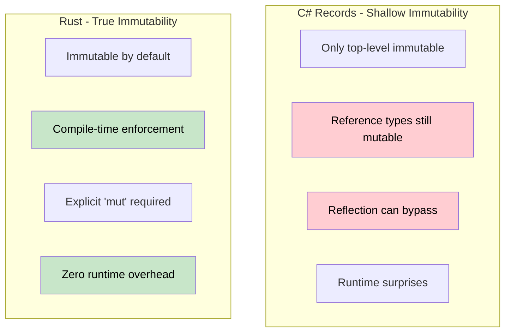

# True Immutability vs Record Illusions

> **What you'll learn:** Why C# `record` types aren't truly immutable (mutable fields, reflection bypass), how Rust enforces real immutability at compile time, and when to use interior mutability patterns.
>
> **Difficulty:** 🟡 Intermediate

### C# Records - Immutability Theater
C# records look immutable but have escape hatches that can lead to runtime surprises.

```csharp
public record Person(string Name, int Age, List<string> Hobbies);

var person = new Person("John", 30, new List<string> { "reading" });
var older = person with { Age = 31 };

// The reference types are still mutable!
person.Hobbies.Add("gaming"); // Mutates the original!
Console.WriteLine(older.Hobbies.Count); // 2 - older person affected!
```

Even `init-only` properties can be bypassed via reflection, and "immutable" collections often require significant discipline and performance trade-offs.

---

### Rust - True Immutability by Default
In Rust, immutability is integrated into the type system and enforced at compile time.

```rust
struct Person {
    name: String,
    age: u32,
    hobbies: Vec<String>,
}

let person = Person {
    name: "John".to_string(),
    age: 30,
    hobbies: vec!["reading".to_string()],
};

// These simply won't compile:
// person.age = 31; 
// person.hobbies.push("gaming".to_string());
```

To modify, you must explicitly opt-in with `mut`. This makes it clear to every reader where mutation is possible.

---

### Structural Sharing
For efficient updates without deep copying, Rust uses smart pointers like `Rc` (Reference Counted).

```rust
use std::rc::Rc;

struct EfficientPerson {
    name: String,
    hobbies: Rc<Vec<String>>, // Shared, immutable reference
}

let person2 = EfficientPerson {
    name: "Bob".to_string(),
    hobbies: Rc::clone(&person1.hobbies), // Share data, no copy
};
```

---

### Comparison Diagram



---

### Key Insight
In Rust, `let config = ...` (without `mut`) makes the **entire value tree** immutable, including nested collections. C# records only provide shallow immutability, which requires constant developer discipline to maintain deep correctness.
