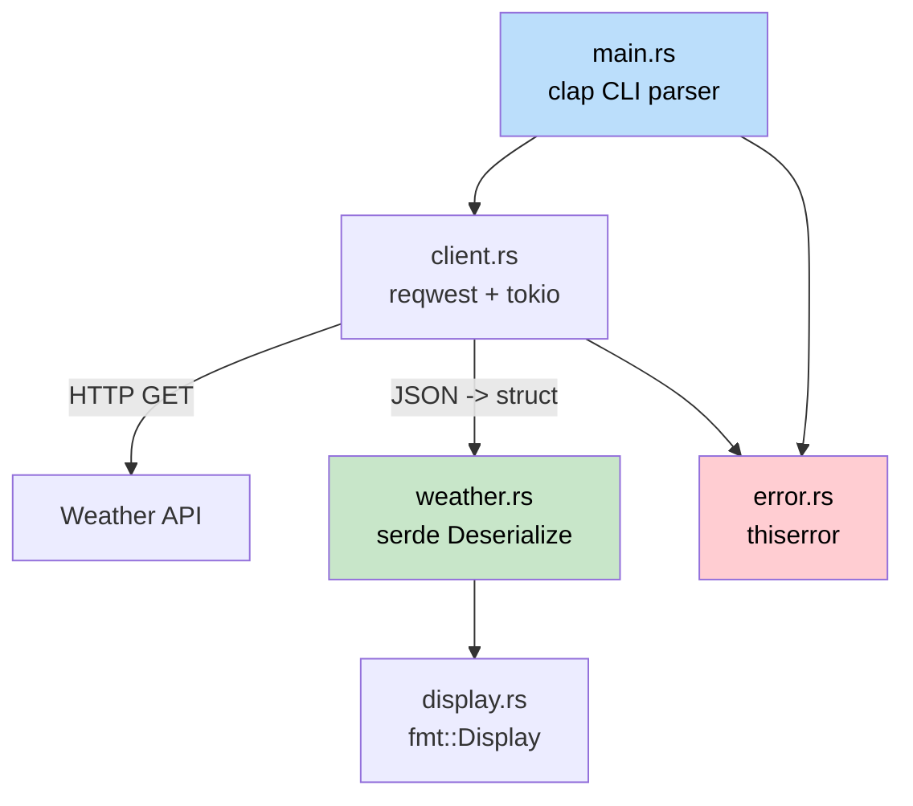

## Capstone Project: Build a CLI Weather Tool

> **What you'll learn:** How to combine everything - structs, traits, error handling, async, modules, serde, and CLI argument parsing - into a working Rust application. This mirrors the kind of tool a C# developer would build with `HttpClient`, `System.Text.Json`, and `System.CommandLine`.
>
> **Difficulty:** Intermediate

This capstone pulls together concepts from every part of the book. You'll build `weather-cli`, a command-line tool that fetches weather data from an API and displays it. The project is structured as a mini-crate with proper module layout, error types, and tests.

---

### Project Overview



**Executing the tool:**
```text
$ weather-cli --city "Seattle"
Seattle: 12 degC, Overcast clouds
    Humidity: 82%  Wind: 5.4 m/s
```

---

### Step 1: Project Setup

```bash
cargo new weather-cli
cd weather-cli
```

Add dependencies to `Cargo.toml`:
```toml
[dependencies]
clap = { version = "4", features = ["derive"] }
reqwest = { version = "0.12", features = ["json"] }
serde = { version = "1", features = ["derive"] }
serde_json = "1"
thiserror = "2"
tokio = { version = "1", features = ["full"] }
```

---

### Step 2: Define Data Types

```rust
use serde::Deserialize;

#[derive(Deserialize, Debug)]
pub struct ApiResponse {
    pub main: MainData,
    pub weather: Vec<WeatherCondition>,
    pub wind: WindData,
    pub name: String,
}

#[derive(Debug, Clone)]
pub struct WeatherReport {
    pub city: String,
    pub temp_celsius: f64,
    pub description: String,
}

impl From<ApiResponse> for WeatherReport {
    fn from(api: ApiResponse) -> Self {
        let description = api.weather.first()
            .map(|w| w.description.clone())
            .unwrap_or_else(|| "Unknown".to_string());

        WeatherReport {
            city: api.name,
            temp_celsius: api.main.temp,
            description,
        }
    }
}
```

---

### Final Comparison to C#

The Rust version is remarkably similar in structure to a well-architected C# app:
- `mod` declarations instead of namespaces.
- `Result<T, E>` instead of exceptions.
- `From` trait instead of AutoMapper.
- Explicit `#[tokio::main]` instead of a hidden async runtime.
