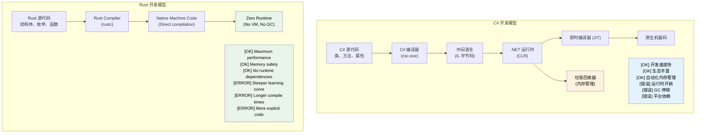

[English Original](../en/ch01-introduction-and-motivation.md)

## 讲师介绍与通用方法

- **讲师介绍**
    - 微软 SCHIE（芯片与云硬件基础设施工程）团队首席固件架构师
    - 行业资深专家，在安全、系统编程（固件、操作系统、虚拟机监控器）、CPU 与平台架构以及 C++ 系统方面拥有丰富经验
    - 2017 年在 AWS EC2 开始接触 Rust 编程，从此深爱这门语言
- **本课程旨在尽可能地保持互动性**
    - **前提假设**：你熟悉 C# 和 .NET 开发
    - **案例设计**：有意识地将 C# 概念映射到 Rust 对应概念
    - **欢迎随时提出澄清性的问题**

---

## 面向 C# 开发者的 Rust 理由

> **你将学到：** 为什么 Rust 值得 C# 开发者关注 —— 托管代码与原生代码之间的性能差距，Rust 如何在编译阶段消除空引用异常和隐藏的控制流，以及 Rust 补充或替代 C# 的关键场景。
>
> **难度：** 🟢 初级

### 没有运行时“税”的性能
```csharp
// C# - 高生产力，但有运行时开销
public class DataProcessor
{
    private List<int> data = new List<int>();
    
    public void ProcessLargeDataset()
    {
        // 内存分配会触发 GC
        for (int i = 0; i < 10_000_000; i++)
        {
            data.Add(i * 2); // GC 压力
        }
        // 处理过程中可能出现不可预测的 GC 停顿
    }
}
// 运行时间：波动 (由于 GC，50-200ms 不等)
// 内存占用：~80MB (包含 GC 开销)
// 可预测性：低 (受 GC 停顿影响)
```

```rust
// Rust - 同样的表达能力，零运行时开销
struct DataProcessor {
    data: Vec<i32>,
}

impl DataProcessor {
    fn process_large_dataset(&mut self) {
        // 零成本抽象
        for i in 0..10_000_000 {
            self.data.push(i * 2); // 无 GC 压力
        }
        // 确定性性能
    }
}
// 运行时间：稳定 (~30ms)
// 内存占用：~40MB (精确分配)
// 可预测性：高 (无 GC)
```

### 没有运行时检查的内存安全
```csharp
// C# - 带有开销的运行时安全
public class RuntimeCheckedOperations
{
    public string? ProcessArray(int[] array)
    {
        // 每次访问都会进行运行时边界检查
        if (array.Length > 0)
        {
            return array[0].ToString(); // 安全 — int 是值类型，绝不会为 null
        }
        return null; // 可为空的返回 (C# 8+ 可为空引用类型)
    }
    
    public void ProcessConcurrently()
    {
        var list = new List<int>();
        
        // 可能发生数据竞态，需要谨慎加锁
        Parallel.For(0, 1000, i =>
        {
            lock (list) // 运行时开销
            {
                list.Add(i);
            }
        });
    }
}
```

```rust
// Rust - 编译期安全，零运行时成本
struct SafeOperations;

impl SafeOperations {
    // 编译期空安全，无运行时检查
    fn process_array(array: &[i32]) -> Option<String> {
        array.first().map(|x| x.to_string())
        // 绝无引用空指针的可能
        // 当可证明安全时，边界检查会被优化掉
    }
    
    fn process_concurrently() {
        use std::sync::{Arc, Mutex};
        use std::thread;
        
        let data = Arc::new(Mutex::new(Vec::new()));
        
        // 编译期即防止了数据竞态
        let handles: Vec<_> = (0..1000).map(|i| {
            let data = Arc::clone(&data);
            thread::spawn(move || {
                data.lock().unwrap().push(i);
            })
        }).collect();
        
        for handle in handles {
            handle.join().unwrap();
        }
    }
}
```

***

## Rust 能解决的常见 C# 痛点

### 1. 十亿美元错误：空引用
```csharp
// C# - 空引用异常是运行时的炸弹
public class UserService
{
    public string GetUserDisplayName(User user)
    {
        // 其中任何一项都可能抛出 NullReferenceException
        return user.Profile.DisplayName.ToUpper();
        //     ^^^^^ ^^^^^^^ ^^^^^^^^^^^ ^^^^^^^
        //     在运行时可能为 null
    }
    
    // 可为空引用类型 (C# 8+) 有所帮助，但 null 仍可能漏过
    public string GetDisplayName(User? user)
    {
        return user?.Profile?.DisplayName?.ToUpper() ?? "Unknown";
        // 这一行借助 ?. 和 ?? 实现了空安全，
        // 但 NRTs 仅是建议性的 — 编译器可以被 `!` 强制覆盖
    }
}
```

```rust
// Rust - 编译期保证空安全
struct UserService;

impl UserService {
    fn get_user_display_name(user: &User) -> Option<String> {
        user.profile.as_ref()?
            .display_name.as_ref()
            .map(|name| name.to_uppercase())
        // 编译器强制你处理 None 的情况
        // 不可能出现空指针异常
    }
    
    fn get_display_name_safe(user: Option<&User>) -> String {
        user.and_then(|u| u.profile.as_ref())
            .and_then(|p| p.display_name.as_ref())
            .map(|name| name.to_uppercase())
            .unwrap_or_else(|| "Unknown".to_string())
        // 显式处理，没有惊喜
    }
}

### 2. 隐藏异常与控制流
```csharp
// C# - 异常可能从任何地方抛出
public async Task<UserData> GetUserDataAsync(int userId)
{
    // 每个环节都可能抛出不同的异常
    var user = await userRepository.GetAsync(userId);        // SqlException
    var permissions = await permissionService.GetAsync(user); // HttpRequestException  
    var preferences = await preferenceService.GetAsync(user); // TimeoutException
    
    return new UserData(user, permissions, preferences);
    // 调用者并不知道会有哪些异常
}
```

```rust
// Rust - 函数签名中显式声明所有错误
#[derive(Debug)]
enum UserDataError {
    DatabaseError(String),
    NetworkError(String),
    Timeout,
    UserNotFound(i32),
}

async fn get_user_data(user_id: i32) -> Result<UserData, UserDataError> {
    // 所有错误都是显式且已被处理的
    let user = user_repository.get(user_id).await
        .map_err(UserDataError::DatabaseError)?;
    
    let permissions = permission_service.get(&user).await
        .map_err(UserDataError::NetworkError)?;
    
    let preferences = preference_service.get(&user).await
        .map_err(|_| UserDataError::Timeout)?;
    
    Ok(UserData::new(user, permissions, preferences))
    // 调用者确切知道可能出现哪些错误
}
```

### 3. 正确性：类型系统作为证明引擎

Rust 的类型系统能在编译阶段捕获整类逻辑 Bug，而这些在 C# 中只能在运行时发现 —— 或者由于运气好而漏过。

#### ADTs vs 使用 Sealed Class 的权宜之计
```csharp
// C# — 辨识联合 (Discriminated unions) 需要繁琐的 sealed class 代码。
// 仅当没有 _ 捕获所有分支时，编译器才会警告缺失的情况 (CS8524)。
// 实践中，大多数 C# 代码使用 _ 作为默认值，这会掩盖警告。
public abstract record Shape;
public sealed record Circle(double Radius)   : Shape;
public sealed record Rectangle(double W, double H) : Shape;
public sealed record Triangle(double A, double B, double C) : Shape;

public static double Area(Shape shape) => shape switch
{
    Circle c    => Math.PI * c.Radius * c.Radius,
    Rectangle r => r.W * r.H,
    // 忘记了 Triangle？ _ 捕获所有分支模式会掩盖编译器警告。
    _           => throw new ArgumentException("Unknown shape")
};
// 半年后新增一个变体 — _ 模式会掩盖缺失的情况。
// 编译器并不会提示你需要更新 47 处 switch 表达式。
```

```rust
// Rust — ADTs + 穷尽匹配 = 编译期证明
enum Shape {
    Circle { radius: f64 },
    Rectangle { w: f64, h: f64 },
    Triangle { a: f64, b: f64, c: f64 },
}

fn area(shape: &Shape) -> f64 {
    match shape {
        Shape::Circle { radius }    => std::f64::consts::PI * radius * radius,
        Shape::Rectangle { w, h }   => w * h,
        // 忘记了 Triangle？会报 ERROR: non-exhaustive pattern（非穷尽匹配错误）
        Shape::Triangle { a, b, c } => {
            let s = (a + b + c) / 2.0;
            (s * (s - a) * (s - b) * (s - c)).sqrt()
        }
    }
}
// 新增一个变体 → 编译器会展示每一处需要更新的 match 语句。
```

#### 默认不可变 vs 可选不可变
```csharp
// C# — 所有内容默认都是可变的
public class Config
{
    public string Host { get; set; }   // 默认可变
    public int Port { get; set; }
}

// "readonly" 和 "record" 有所帮助，但无法防止深层修改：
public record ServerConfig(string Host, int Port, List<string> AllowedOrigins);

var config = new ServerConfig("localhost", 8080, new List<string> { "*.example.com" });
// Record 是“不可变”的，但引用类型的字段并不是：
config.AllowedOrigins.Add("*.evil.com"); // 能通过编译并修改内容！← 这是一个 Bug
// 编译器不会给你任何警告。
```

```rust
// Rust — 默认不可变，修改是显式且可见的
struct Config {
    host: String,
    port: u16,
    allowed_origins: Vec<String>,
}

let config = Config {
    host: "localhost".into(),
    port: 8080,
    allowed_origins: vec!["*.example.com".into()],
};

// config.allowed_origins.push("*.evil.com".into()); // ERROR: cannot borrow as mutable

// 修改需要显式声明：
let mut config = config;
config.allowed_origins.push("*.safe.com".into()); // OK — 显式声明为可变

// 签名中的 "mut" 告诉每位读者：“这个函数会修改数据”
fn add_origin(config: &mut Config, origin: String) {
    config.allowed_origins.push(origin);
}
```

#### 函数式编程：一等公民 vs 事后补充
```csharp
// C# — 函数式编程是嫁接的；LINQ 虽有表现力但语言本身在与之博弈
public IEnumerable<Order> GetHighValueOrders(IEnumerable<Order> orders)
{
    return orders
        .Where(o => o.Total > 1000)   // Func<Order, bool> — 堆上分配的委托
        .Select(o => new OrderSummary  // 匿名类型或额外的类
        {
            Id = o.Id,
            Total = o.Total
        })
        .OrderByDescending(o => o.Total);
    // 无法对结果进行穷尽匹配
    // 在流水线的任何地方都可能溜进 null 值
    // 无法强制执行纯度 — 任何 lambda 都可能有副作用
}
```

```rust
// Rust — 函数式编程是一等公民
fn get_high_value_orders(orders: &[Order]) -> Vec<OrderSummary> {
    orders.iter()
        .filter(|o| o.total > 1000)      // 零成本闭包，无堆分配
        .map(|o| OrderSummary {           // 经过类型检查的结构体
            id: o.id,
            total: o.total,
        })
        .sorted_by(|a, b| b.total.cmp(&a.total)) // itertools
        .collect()
    // 流水线的任何地方都不会有 null 值
    // 闭包被单态化 (monomorphized) — 与手动编写的循环相比零开销
    // 强制执行纯度：&[Order] 意味着该函数无法修改订单
}
```

#### 继承：理论上很优雅，实践中很脆弱
```csharp
// C# — 脆弱的基类问题
public class Animal
{
    public virtual string Speak() => "...";
    public void Greet() => Console.WriteLine($"I say: {Speak()}");
}

public class Dog : Animal
{
    public override string Speak() => "Woof!";
}

public class RobotDog : Dog
{
    // Greet() 到底调用哪个 Speak()？如果 Dog 类改变了呢？
    // 接口 + 默认方法带来的“菱形继承”问题
    // 紧耦合：修改 Animal 类可能会在无感知的情况下破坏 RobotDog 类
}

// 常见的 C# 反模式：
// - 带有 20 个虚方法的“上帝基类”
// - 无人能搞清的深度继承层级（5 层以上）
// - "protected" 字段创建的隐蔽耦合
// - 基类的更改默默地改变了派生类的行为
```

```rust
// Rust — 语言层面提倡的“组合优于继承”
trait Speaker {
    fn speak(&self) -> &str;
}

trait Greeter: Speaker {
    fn greet(&self) {
        println!("I say: {}", self.speak());
    }
}

struct Dog;
impl Speaker for Dog {
    fn speak(&self) -> &str { "Woof!" }
}
impl Greeter for Dog {} // 使用默认的 greet()

struct RobotDog {
    voice: String, // 组合：拥有自己的数据
}
impl Speaker for RobotDog {
    fn speak(&self) -> &str { &self.voice }
}
impl Greeter for RobotDog {} // 清晰、显式的行为描述
```

> **核心洞见**：在 C# 中，正确性是一种“纪律” —— 你寄希望于开发人员遵循约定、编写测试并在代码审查中发现边界情况。在 Rust 中，正确性是 **类型系统的属性** —— 许多类别的 Bug（空指针解引用、被遗忘的变体、意外的修改、数据竞态）在结构上就是不可能发生的。

***

### 4. 垃圾回收引发的不可预测性能
```csharp
// C# - GC 可能在任何时候停顿
public class HighFrequencyTrader
{
    private List<Trade> trades = new List<Trade>();
    
    public void ProcessMarketData(MarketTick tick)
    {
        // 内存分配可能在最糟糕的时刻触发 GC
        var analysis = new MarketAnalysis(tick);
        trades.Add(new Trade(analysis.Signal, tick.Price));
        
        // 在关键的市场时刻，GC 可能在这里停顿
        // 停顿持续时间：取决于堆的大小，1-100ms 不等
    }
}
```

```rust
// Rust - 预测性强且确定性的性能
struct HighFrequencyTrader {
    trades: Vec<Trade>,
}

impl HighFrequencyTrader {
    fn process_market_data(&mut self, tick: MarketTick) {
        // 零分配，可预测的性能
        let analysis = MarketAnalysis::from(tick);
        self.trades.push(Trade::new(analysis.signal(), tick.price));
        
        // 没有 GC 停顿，持续保持亚微秒级的延迟
        // 性能由类型系统保证
    }
}
```

***

## 何时选择 Rust 而非 C#

### ✅ 在以下情况下选择 Rust：
- **正确性至关重要**：状态机、协议实现、金融逻辑 —— 在这些场景中，遗漏一个情况就是一个生产事故，而不仅仅是一个测试失败。
- **性能至关重要**：实时系统、高频交易、游戏引擎。
- **内存占用很重要**：嵌入式系统、云端成本、移动端应用。
- **需要可预测性**：医疗设备、汽车、金融系统。
- **安全性至高无上**：加密、网络安全、系统级代码。
- **长期运行的服务**：GC 停顿会导致问题的场景。
- **资源受限的环境**：物联网 (IoT)、边缘计算。
- **系统编程**：命令行工具、数据库、Web 服务器、操作系统。

### ✅ 在以下情况下继续使用 C#：
- **快速应用开发**：业务应用、CRUD 应用。
- **现存的大型代码库**：当迁移成本过高时。
- **团队专长**：当 Rust 的学习曲线无法抵消其带来的收益时。
- **企业级集成**：严重依赖 .NET Framework 或 Windows。
- **GUI 应用**：WPF、WinUI、Blazor 生态系统。
- **上市时间**：当开发速度比性能更重要时。

### 🔄 考虑两者结合（混合方法）：
- **性能关键组件使用 Rust**：通过 P/Invoke 从 C# 调用。
- **业务逻辑使用 C#**：熟悉且高效的开发体验。
- **渐进式迁移**：从使用 Rust 编写新服务开始。

***

## 现实世界的影响：为什么公司选择 Rust

### Dropbox：存储基础设施
- **之前（Python）**：高 CPU 占用，内存开销大。
- **之后（Rust）**：性能提升 10 倍，内存减少 50%。
- **结果**：节省了数百万美元的基础设施成本。

### Discord：语音/视频后端
- **之前（Go）**：GC 停顿导致音频中断。
- **之后（Rust）**：持续的低延迟性能。
- **结果**：更好的用户体验，降低了服务器成本。

### 微软：Windows 组件
- **Windows 中的 Rust**：文件系统、网络栈组件。
- **收益**：无需牺牲性能的内存安全。
- **影响**：更少的安全漏洞，同样的性能。

### 为什么这对 C# 开发者很重要：
1. **技能互补**：Rust 和 C# 解决不同的问题。
2. **职业成长**：系统编程专长日益受到重视。
3. **性能理解**：学习零成本抽象。
4. **安全思维**：将所有权思维应用到任何语言中。
5. **云端成本**：性能直接影响基础设施的支出。

***

## 语言哲学对比

### C# 哲学
- **生产力优先**：丰富的工具、广泛的框架、“成功的捷径”。
- **托管运行时**：垃圾回收自动处理内存。
- **面向企业**：带有反射的强类型，广泛的标准库。
- **面向对象**：类、继承、接口作为主要抽象。

### Rust 哲学
- **不妥协的性能**：零成本抽象，无运行时开销。
- **内存安全**：编译期保证，防止崩溃和安全漏洞。
- **系统编程**：通过高级抽象直接访问硬件。
- **函数式 + 系统级**：默认不可变，基于所有权的资源管理。



***

## 快速参考：Rust vs C#

| **概念** | **C#** | **Rust** | **关键差异** |
|-------------|--------|----------|-------------------|
| 内存管理 | 垃圾回收器 (GC) | 所有权系统 | 零成本、确定性的清理 |
| 空引用 | 随处可见的 `null` | `Option<T>` | 编译期空安全 |
| 错误处理 | 异常 (Exceptions) | `Result<T, E>` | 显式声明，无隐藏控制流 |
| 可变性 | 默认可变 | 默认不可变 | 显式开启可变性 |
| 类型系统 | 引用/值类型 | 所有权类型 | 移动语义、借用 |
| 程序集 (Assemblies) | GAC, App Domains; Side-by-side (.NET 5+) | Crates | 静态链接，无运行时 |
| 命名空间 | `using System.IO` | `use std::fs` | 模块系统 |
| 接口 | `interface IFoo` | `trait Foo` | 默认实现 |
| 泛型 | `List<T>` (通过 `where` 可选约束) | `Vec<T>` (Trait 约束，如 `T: Clone`) | 零成本抽象 |
| 线程 | locks, async/await | 所有权 + Send/Sync | 防止数据竞态 |
| 性能 | JIT 编译 | AOT 编译 | 可预测，无 GC 停顿 |

***
```
