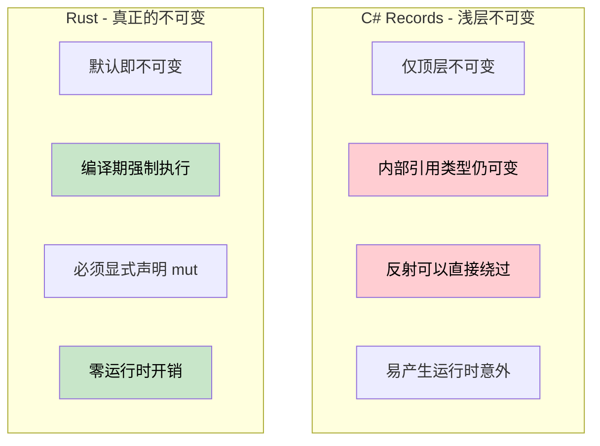

# 真正的不可变性与 Record 的“不可变幻觉”

> **你将学到什么：** 为什么 C# 的 `record` 类型并不是真正不可变的（可变字段、反射绕过等），Rust 如何在编译期强制实现真正的不可变性，以及何时才应该使用内部可变性模式。
>
> **难度：** 🟡 中级

### C# Record：看起来不可变，实际上未必
C# 的 `record` 提供了浅层不可变性，但这种设计模式存在许多“后门”，可能导致各种运行时意外。

```csharp
public record Person(string Name, int Age, List<string> Hobbies);

var person = new Person("John", 30, new List<string> { "reading" });
var older = person with { Age = 31 };

// 内部的引用类型（如 List）依然是可变的！
person.Hobbies.Add("gaming"); // 修改了原始对象！
Console.WriteLine(older.Hobbies.Count); // 2 - 新对象也受影响！
```

即使是 `init-only` 属性，也可能被反射机制绕过。相比之下，C# 的不可变集合虽然更可靠，但通常也会伴随不小的性能负担和团队纪律压力。

---

### Rust：默认即真正不可变
在 Rust 中，不可变性被直接集成在类型系统中，并由编译器强制执行。

```rust
struct Person {
    name: String,
    age: u32,
    hobbies: Vec<String>,
}

let person = Person {
    name: "John".to_string(),
    age: 30,
    hobbies: vec!["reading".to_string()],
};

// 下面这段代码根本无法编译。
// person.age = 31; 
// person.hobbies.push("gaming".to_string());
```

如果你确实需要修改，则必须显式声明为 `mut`。这让任何代码阅读者都能够一眼看出，哪些数据在哪些地方是有可能发生变化的。

---

### 结构共享
为了实现在不发生深度拷贝的情况下进行高效的数据更新，Rust 中常使用 `Rc`（引用计数）等智能指针。

```rust
use std::rc::Rc;

struct EfficientPerson {
    name: String,
    hobbies: Rc<Vec<String>>, // 共享的、不可变的引用
}

let person2 = EfficientPerson {
    name: "Bob".to_string(),
    hobbies: Rc::clone(&person1.hobbies), // 共享数据，无需拷贝
};
```

---

### 对比图示



---

### 核心洞见
在 Rust 中，`let config = ...`（不带 `mut`）使得**整个值树**都具备不可变性，包括嵌套的集合。而 C# 的 record 仅提供一种扁平的浅层不可变性，实现深层的正确性仍极度依赖团队的代码纪律。
