[English Original](../en/ch03-1-true-immutability-vs-record-illusions.md)

## 真正的不可变性 vs Record 的“不可变幻觉”

> **你将学到：** 为什么 C# 的 `record` 类型并不是真正的不可变（成员字段仍可变、反射可绕过），Rust 如何在编译期强制执行真正的不可变性，以及何时使用内部可变性模式 (Interior mutability patterns)。
>
> **难度：** 🟡 中级

### C# Record — 不可变性的“伪装”
```csharp
// C# record 看起来是不可变的，但其实留有“逃生门”
public record Person(string Name, int Age, List<string> Hobbies);

var person = new Person("John", 30, new List<string> { "reading" });

// 下面这些操作“看起来”像是创建了新实例：
var older = person with { Age = 31 };  // 新 record
var renamed = person with { Name = "Jonathan" };  // 新 record

// 但其中的引用类型仍然是可变的！
person.Hobbies.Add("gaming");  // 原对象的内容被修改了！
Console.WriteLine(older.Hobbies.Count);  // 输出 2 — older 对象也受影响了！
Console.WriteLine(renamed.Hobbies.Count); // 输出 2 — renamed 对象同样受影响！

// Init-only 属性仍然可以通过反射被改变
typeof(Person).GetProperty("Age")?.SetValue(person, 25);

// 使用集合表达式 (Collection expressions) 有所帮助，但不能从根本解决问题
public record BetterPerson(string Name, int Age, IReadOnlyList<string> Hobbies);

var betterPerson = new BetterPerson("Jane", 25, new List<string> { "painting" });
// 仍然可以通过强制类型转换来修改：
((List<string>)betterPerson.Hobbies).Add("hacking the system");

// 即便使用所谓的“不可变”集合，也不是绝对安全的
using System.Collections.Immutable;
public record SafePerson(string Name, int Age, ImmutableList<string> Hobbies);
// 这虽然好一些，但需要开发团队的高度自觉 (discipline)，且有一定的性能开销 (overhead)
```

### Rust — 默认真正的不可变性
```rust
#[derive(Debug, Clone)]
struct Person {
    name: String,
    age: u32,
    hobbies: Vec<String>,
}

let person = Person {
    name: "John".to_string(),
    age: 30,
    hobbies: vec!["reading".to_string()],
};

// 下面这些代码根本无法通过编译：
// person.age = 31;  // ERROR: 无法对不可变字段进行赋值
// person.hobbies.push("gaming".to_string());  // ERROR: 无法进行可变借用

// 若要修改，你必须显式地使用 'mut'：
let mut older_person = person.clone();
older_person.age = 31;  // 现在这行代码清晰地表达了“修改 (mutation)”的意图

// 或者使用函数式的更新模式 (functional update patterns)：
let renamed = Person {
    name: "Jonathan".to_string(),
    ..person  // 复制其他字段 (注意：此处会涉及移动语义/move semantics)
};

// 原始数据保证不会被改变 (除非被移动/moved)：
println!("{:?}", person.hobbies);  // 永远是 ["reading"] — 绝对不可变
```

#### 使用高效的不可变数据结构进行结构共享 (Structural sharing)
```rust
use std::rc::Rc;

#[derive(Debug, Clone)]
struct EfficientPerson {
    name: String,
    age: u32,
    hobbies: Rc<Vec<String>>,  // 共享的、不可变的引用
}

// 创建新版本时可以高效地共享数据
let person1 = EfficientPerson {
    name: "Alice".to_string(),
    age: 30,
    hobbies: Rc::new(vec!["reading".to_string(), "cycling".to_string()]),
};

let person2 = EfficientPerson {
    name: "Bob".to_string(),
    age: 25,
    hobbies: Rc::clone(&person1.hobbies),  // 共享引用，无需深拷贝 (deep copy)
};
```



```mermaid
graph TD
    subgraph "C# Record — 浅层不可变性"
        CS_RECORD["record Person(...)"]
        CS_WITH["with 表达式"]
        CS_SHALLOW["⚠️ 仅顶层是不可变的"]
        CS_REF_MUT["❌ 引用类型仍然可变"]
        CS_REFLECTION["❌ 反射可绕过限制"]
        CS_RUNTIME["❌ 存在运行时意外状况"]
        CS_DISCIPLINE["😓 需要开发团队高度自觉"]
        
        CS_RECORD --> CS_WITH
        CS_WITH --> CS_SHALLOW
        CS_SHALLOW --> CS_REF_MUT
        CS_RECORD --> CS_REFLECTION
        CS_REF_MUT --> CS_RUNTIME
        CS_RUNTIME --> CS_DISCIPLINE
    end
    
    subgraph "Rust — 真正的不可变性"
        RUST_STRUCT["struct Person { ... }"]
        RUST_DEFAULT["✅ 默认即不可变"]
        RUST_COMPILE["✅ 编译期强制执行"]
        RUST_MUT["🔒 必须显式使用 'mut'"]
        RUST_MOVE["🔄 移动语义 (Move semantics)"]
        RUST_ZERO["⚡ 零运行时开销"]
        RUST_SAFE["🛡️ 内存安全保证"]
        
        RUST_STRUCT --> RUST_DEFAULT
        RUST_DEFAULT --> RUST_COMPILE
        RUST_COMPILE --> RUST_MUT
        RUST_MUT --> RUST_MOVE
        RUST_MOVE --> RUST_ZERO
        RUST_ZERO --> RUST_SAFE
    end
    
    style CS_REF_MUT fill:#ffcdd2,color:#000
    style CS_REFLECTION fill:#ffcdd2,color:#000
    style CS_RUNTIME fill:#ffcdd2,color:#000
    style RUST_COMPILE fill:#c8e6c9,color:#000
    style RUST_ZERO fill:#c8e6c9,color:#000
    style RUST_SAFE fill:#c8e6c9,color:#000
```

---

## 练习

<details>
<summary><strong>🏋️ 练习：证明不可变性</strong> (点击展开)</summary>

一位 C# 同事声称他们的 `record` 是不可变的。请将这段 C# 代码翻译为 Rust，并解释为什么 Rust 版本才是真正不可变的：

```csharp
public record Config(string Host, int Port, List<string> AllowedOrigins);

var config = new Config("localhost", 8080, new List<string> { "example.com" });
// 这是一个“不可变”的 record... 但是：
config.AllowedOrigins.Add("evil.com"); // 竟然能通过编译！List 是可变的。
```

1. 创建一个等效的 Rust 结构体，且该结构体是 **真正** 不可变的。
2. 展示尝试修改 `allowed_origins` 时会导致 **编译错误**。
3. 编写一个函数，在不通过直接修改的情况下，创建一个修改后的副本（新的 host）。

<details>
<summary>🔑 参考答案</summary>

```rust
#[derive(Debug, Clone)]
struct Config {
    host: String,
    port: u16,
    allowed_origins: Vec<String>,
}

impl Config {
    // 使用 with_host 来创建包含新 host 的副本
    fn with_host(&self, host: impl Into<String>) -> Self {
        Config {
            host: host.into(),
            ..self.clone()
        }
    }
}

fn main() {
    let config = Config {
        host: "localhost".into(),
        port: 8080,
        allowed_origins: vec!["example.com".into()],
    };

    // config.allowed_origins.push("evil.com".into());
    // ❌ ERROR: 无法对 `config.allowed_origins` 进行可变借用

    let production = config.with_host("prod.example.com");
    println!("Dev: {:?}", config);       // 原始数据保持不变
    println!("Prod: {:?}", production);  // 具有不同 host 的新副本
}
```

**核心洞见**：在 Rust 中，`let config = ...` (没有 `mut`) 会使 **整个值树** 都变为不可变 —— 包含嵌套在内部的 `Vec`。而 C# 的 record 仅使 **引用** 变为不可变，而无法约束引用的具体内容。

</details>
</details>

***
