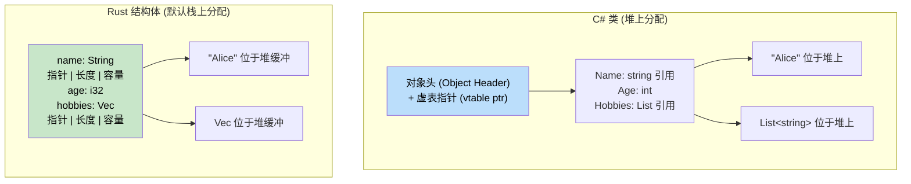

[English Original](../en/ch05-data-structures-and-collections.md)

## 元组与解构

> **你将学到：** Rust 元组与 C# `ValueTuple` 的对比，数组与切片（Slices），结构体与类的区别，用于领域建模（Domain modeling）且具有零成本类型安全优势的 Newtype 模式，以及解构语法。
>
> **难度：** 🟢 初级

C# 拥有 `ValueTuple`（自 C# 7 起）。Rust 的元组与之类似，但与语言结合得更深。

### C# 元组
```csharp
// C# ValueTuple (C# 7+)
var point = (10, 20);                         // 类型为 (int, int)
var named = (X: 10, Y: 20);                   // 具名元素
Console.WriteLine($"{named.X}, {named.Y}");

// 将元组作为返回值
public (int Quotient, int Remainder) Divide(int a, int b)
{
    return (a / b, a % b);
}

var (q, r) = Divide(10, 3);    // 解构
Console.WriteLine($"{q} 余数为 {r}");

// 使用丢弃符号 (Discards)
var (_, remainder) = Divide(10, 3);  // 忽略商
```

### Rust 元组
```rust
// Rust 元组 — 默认不可变，不支持具名元素
let point = (10, 20);                // 类型为 (i32, i32)
let point3d: (f64, f64, f64) = (1.0, 2.0, 3.0);

// 通过索引访问 (从 0 开始)
println!("x={}, y={}", point.0, point.1);

// 将元组作为返回值
fn divide(a: i32, b: i32) -> (i32, i32) {
    (a / b, a % b)
}

let (q, r) = divide(10, 3);       // 解构 (Destructuring)
println!("{q} 余数为 {r}");

// 使用 _ 丢弃不需要的值
let (_, remainder) = divide(10, 3);

// 单元类型 () — “空元组” (类似于 C# 的 void)
fn greet() {          // 隐式返回类型为 ()
    println!("hi");
}
```

### 关键差异

| 特性 | C# `ValueTuple` | Rust 元组 |
|---------|-----------------|------------|
| 具名元素 | `(int X, int Y)` | 不支持 — 请使用结构体 |
| 最大元素数量 | ~8 (更多则需要嵌套) | 无限制 (实际建议限制在 12 个左右) |
| 比较运算 | 自动支持 | 为 12 个元素以内的元组自动支持 |
| 用作字典键 | 支持 | 支持 (若元素实现了 `Hash`) |
| 返回值场景 | 常用 | 常用 |
| 可变性 | 始终可变 | 仅通过 `let mut` 开启 |

### 元组结构体 (Tuple Structs / Newtypes)
```rust
// 当普通元组不够直观时，请使用元组结构体：
struct Meters(f64);     // 单个字段的 "newtype" 包装器
struct Celsius(f64);
struct Fahrenheit(f64);

// 编译器将它们视为“不同”的类型：
let distance = Meters(100.0);
let temp = Celsius(36.6);
// distance == temp;  // ❌ ERROR: 无法将 Meters 与 Celsius 进行比较

// Newtype 模式在编译阶段就防止了单位混淆 Bug！
// 在 C# 中，你需要创建一个完整的类/结构体才能获得同样的安全性。
```

### 深入 Newtype 模式：零成本的领域建模

Newtype 的作用远不止防止单位混淆。它是 Rust 中**将业务规则编码进类型系统**的核心工具 —— 它可以替代 C# 中常见的“卫语句 (Guard clauses)”和“验证类”模式。

#### C# 验证方法：运行时卫语句
```csharp
// C# — 验证发生在运行时，且每次调用都要验证
public class UserService
{
    public User CreateUser(string email, int age)
    {
        if (string.IsNullOrWhiteSpace(email) || !email.Contains('@'))
            throw new ArgumentException("Invalid email");
        if (age < 0 || age > 150)
            throw new ArgumentException("Invalid age");

        return new User { Email = email, Age = age };
    }

    public void SendEmail(string email)
    {
        // 必须重新验证 —— 或者完全信任调用者？
        if (!email.Contains('@')) throw new ArgumentException("Invalid email");
        // ...
    }
}
```

#### Rust Newtype 方法：编译期证明
```rust
/// 一个经过验证的电子邮件地址 —— 类型本身就是有效性的“证明”。
#[derive(Debug, Clone, PartialEq, Eq, Hash)]
pub struct Email(String);

impl Email {
    /// 创建 Email 的唯一方式 —— 验证仅在构造时发生一次。
    pub fn new(raw: &str) -> Result<Self, &'static str> {
        if raw.contains('@') && raw.len() > 3 {
            Ok(Email(raw.to_lowercase()))
        } else {
            Err("无效的邮件格式")
        }
    }

    /// 安全地访问内部值
    pub fn as_str(&self) -> &str { &self.0 }
}

/// 一个经过验证的年龄 —— 不可能创建无效的年龄实例。
#[derive(Debug, Clone, Copy, PartialEq, Eq, PartialOrd, Ord)]
pub struct Age(u8);

impl Age {
    pub fn new(raw: u8) -> Result<Self, &'static str> {
        if raw <= 150 { Ok(Age(raw)) } else { Err("年龄超出范围") }
    }
    pub fn value(&self) -> u8 { self.0 }
}

// 现在的函数接受的是“经过验证”的类型 —— 无需重复验证！
fn create_user(email: Email, age: Age) -> User {
    // email 保证是有效的 —— 这是类型的不变量 (invariant)
    User { email, age }
}

fn send_email(to: &Email) {
    // 无需验证 —— Email 类型本身就证明了它的有效性
    println!("正在发送至: {}", to.as_str());
}
```

#### C# 开发者的常用 Newtype 场景

| C# 模式 | Rust Newtype | 预防的问题 |
|------------|-------------|------------------|
| 用 `string` 表示 UserId, Email 等 | `struct UserId(Uuid)` | 防止将错误的字符串传给错误的参数 |
| 用 `int` 表示端口、计数、索引 | `struct Port(u16)` | 端口和计数不再能互换混合使用 |
| 随处可见的卫语句 (Guard clauses) | 在构造函数中做一次验证 | 避免重复验证或遗漏验证 |
| 用 `decimal` 表示 USD, EUR | `struct Usd(Decimal)` | 防止意外地将美元加到欧元上 |

```rust
// 零成本：Newtype 在编译后生成的指令与内部类型完全一致。
// 这段 Rust 代码：
struct UserId(u64);
fn lookup(id: UserId) -> Option<User> { /* ... */ }

// 会生成与下段代码完全相同的机器码：
fn lookup(id: u64) -> Option<User> { /* ... */ }
// 但却拥有编译时的完整类型安全保证！
```

***

## 数组与切片 (Slices)

理解数组、切片和向量 (Vector) 之间的区别至关重要。

### C# 数组
```csharp
// C# 数组
int[] numbers = new int[5];         // 固定大小，堆上分配
int[] initialized = { 1, 2, 3, 4, 5 }; // 数组字面量

// 访问
numbers[0] = 10;
int first = numbers[0];

// 长度
int length = numbers.Length;

// 将数组作为参数 (引用类型)
void ProcessArray(int[] array)
{
    array[0] = 99;  // 修改原始数据
}
```

### Rust 数组、切片与向量
```rust
// 1. 数组 (Arrays) - 固定大小，栈上分配
let numbers: [i32; 5] = [1, 2, 3, 4, 5];  // 类型：[i32; 5]
let zeros = [0; 10];                       // 包含 10 个 0 的数组

// 访问
let first = numbers[0];
// numbers[0] = 10;  // ❌ Error: 数组默认是不可变的

let mut mut_array = [1, 2, 3, 4, 5];
mut_array[0] = 10;  // ✅ 加上 mut 即可运行

// 2. 切片 (Slices) - 指向数组或向量一部分的视图
let slice: &[i32] = &numbers[1..4];  // 包含元素 1, 2, 3
let all_slice: &[i32] = &numbers;    // 将整个数组作为切片看待

// 3. 向量 (Vectors / Vec) - 动态大小，堆上分配
let mut vec = vec![1, 2, 3, 4, 5];
vec.push(6);  // 可以增长
```

### 切片作为函数参数
```csharp
// C# - 仅适用于数组的方法
public void ProcessNumbers(int[] numbers)
{
    for (int i = 0; i < numbers.Length; i++)
    {
        Console.WriteLine(numbers[i]);
    }
}

// 仅能处理数组类型
ProcessNumbers(new int[] { 1, 2, 3 });
```

```rust
// Rust - 适用于任何序列的函数
fn process_numbers(numbers: &[i32]) {  // 接受切片参数
    for (i, num) in numbers.iter().enumerate() {
        println!("Index {}: {}", i, num);
    }
}

fn main() {
    let array = [1, 2, 3, 4, 5];
    let vec = vec![1, 2, 3, 4, 5];
    
    // 同一个函数可以处理两者！
    process_numbers(&array);      // 将数组视作切片
    process_numbers(&vec);        // 将向量视作切片
    process_numbers(&vec[1..4]);  // 处理部分切片
}
```

***

## 结构体 (Structs) vs 类 (Classes)

Rust 中的结构体类似于 C# 中的类，但在所有权和方法处理上有一些关键差异。



> **核心洞见**：C# 类始终通过引用生活在堆上。Rust 结构体默认存放在**栈 (Stack)** 上 —— 仅有动态大小的数据（如 `String` 的内容）才会进入堆。这消除了小型、频繁创建对象的 GC 开销。

### C# 类定义
```csharp
// C# 带有属性和方法的类
public class Person
{
    public string Name { get; set; }
    public int Age { get; set; }
    public List<string> Hobbies { get; set; }
    
    public Person(string name, int age)
    {
        Name = name;
        Age = age;
        Hobbies = new List<string>();
    }
    
    public void AddHobby(string hobby)
    {
        Hobbies.Add(hobby);
    }
    
    public string GetInfo()
    {
        return $"{Name} is {Age} years old";
    }
}
```

### Rust 结构体定义
```rust
// Rust 结构体及其关联函数和方法
#[derive(Debug)]  // 自动实现 Debug 特性
pub struct Person {
    pub name: String,    // 公开字段
    pub age: u32,        // 公开字段
    hobbies: Vec<String>, // 私有字段 (不带 pub)
}

impl Person {
    // 关联函数 (类似于静态方法)
    pub fn new(name: String, age: u32) -> Person {
        Person {
            name,
            age,
            hobbies: Vec::new(),
        }
    }
    
    // 方法 (接收 &self, &mut self, 或 self)
    pub fn add_hobby(&mut self, hobby: String) {
        self.hobbies.push(hobby);
    }
    
    // 不可变借用的方法
    pub fn get_info(&self) -> String {
        format!("{} is {} years old", self.name, self.age)
    }
    
    // 私有字段的 Getter
    pub fn hobbies(&self) -> &Vec<String> {
        &self.hobbies
    }
}
```

### 创建与使用实例
```csharp
// C# 对象创建与使用
var person = new Person("Alice", 30);
person.AddHobby("Reading");
person.AddHobby("Swimming");

Console.WriteLine(person.GetInfo());
```

```rust
// Rust 结构体创建与使用
let mut person = Person::new("Alice".to_string(), 30);
person.add_hobby("Reading".to_string());
person.add_hobby("Swimming".to_string());

println!("{}", person.get_info());
println!("Hobbies: {:?}", person.hobbies());

// 直接修改公开字段
person.age = 31;

// Debug 打印整个结构体
println!("{:?}", person);
```

### 结构体初始化模式
```rust
// Rust 结构体直接初始化
let person = Person {
    name: "Bob".to_string(),
    age: 25,
    hobbies: vec!["Gaming".to_string(), "Coding".to_string()],
};

// 结构体更新语法 (类似于对象展开/Spread)
let older_person = Person {
    age: 26,
    ..person  // 使用来自 person 的其余字段 (这会导致 person 被移动！)
};

// 元组结构体 (类似于简化的匿名类型)
#[derive(Debug)]
struct Point(i32, i32);

let point = Point(10, 20);
println!("Point: ({}, {})", point.0, point.1);
```

***

## 方法与关联函数

理解方法（Methods）与关联函数（Associated Functions）之间的区别是关键。

### Rust 中的方法类型
```rust
#[derive(Debug)]
pub struct Calculator {
    memory: i32,
}

impl Calculator {
    // 关联函数 (类似于静态方法) - 不带 self 参数
    pub fn new() -> Calculator {
        Calculator { memory: 0 }
    }
    
    // 方法：不可变借用 (&self)
    // 当你只需要读取数据时使用
    pub fn add(&self, a: i32, b: i32) -> i32 {
        a + b
    }
    
    // 方法：可变借用 (&mut self)
    // 当你需要修改数据时使用
    pub fn store_in_memory(&mut self, value: i32) {
        self.memory = value;
    }
    
    // 方法：获取所有权 (self)
    // 当你想“消耗”掉结构体时使用
    pub fn into_memory(self) -> i32 {
        self.memory  // Calculator 实例在此之后不再可用
    }
}

fn main() {
    // 关联函数通过 :: 调用
    let mut calc = Calculator::new();
    
    // 方法通过 . 调用
    let result = calc.add(5, 3);
    calc.store_in_memory(result);
    
    // 消耗性的方法
    let memory_value = calc.into_memory(); // calc 到此结束生命周期
}
```

---

## 练习

<details>
<summary><strong>🏋️ 练习：切片窗口平均值</strong> (点击展开)</summary>

**挑战**：编写一个函数，接受一个 `f64` 值的切片和一个窗口大小，返回一个包含滚动平均值的 `Vec<f64>`。例如，`[1.0, 2.0, 3.0, 4.0, 5.0]` 且窗口大小为 3 时，应返回 `[2.0, 3.0, 4.0]`。

<details>
<summary>🔑 参考答案</summary>

```rust
fn rolling_average(data: &[f64], window: usize) -> Vec<f64> {
    data.windows(window)
        .map(|w| w.iter().sum::<f64>() / w.len() as f64)
        .collect()
}

fn main() {
    let data = vec![1.0, 2.0, 3.0, 4.0, 5.0];
    let avgs = rolling_average(&data, 3);
    assert_eq!(avgs, vec![2.0, 3.0, 4.0]);
    println!("{avgs:?}");
}
```

**核心总结**：切片拥有强大的内置方法，如 `.windows()`、`.chunks()` 和 `.split()`，它们可以替代手动索引计算。在 C# 中，你可能需要用到 `Enumerable.Range` 或 LINQ 的 `.Skip().Take()` 等组合。

</details>
</details>

<details>
<summary><strong>🏋️ 练习：迷你通讯录</strong> (点击展开)</summary>

利用结构体、枚举和方法构建一个小型通讯录：

1. 定义枚举 `PhoneType { Mobile, Home, Work }`。
2. 定义结构体 `Contact`，包含 `name: String` 和 `phones: Vec<(PhoneType, String)>`。
3. 实现 `Contact::new(name: impl Into<String>) -> Self`。
4. 实现 `Contact::add_phone(&mut self, kind: PhoneType, number: impl Into<String>)`。
5. 实现 `Contact::mobile_numbers(&self) -> Vec<&str>`，仅返回手机号码。
6. 在 `main` 中，创建一个联系人，添加两个电话，并打印其手机号码。

<details>
<summary>🔑 参考答案</summary>

```rust
#[derive(Debug, PartialEq)]
enum PhoneType { Mobile, Home, Work }

#[derive(Debug)]
struct Contact {
    name: String,
    phones: Vec<(PhoneType, String)>,
}

impl Contact {
    fn new(name: impl Into<String>) -> Self {
        Contact { name: name.into(), phones: Vec::new() }
    }

    fn add_phone(&mut self, kind: PhoneType, number: impl Into<String>) {
        self.phones.push((kind, number.into()));
    }

    fn mobile_numbers(&self) -> Vec<&str> {
        self.phones
            .iter()
            .filter(|(kind, _)| *kind == PhoneType::Mobile)
            .map(|(_, num)| num.as_str())
            .collect()
    }
}

fn main() {
    let mut alice = Contact::new("Alice");
    alice.add_phone(PhoneType::Mobile, "+1-555-0100");
    alice.add_phone(PhoneType::Work, "+1-555-0200");
    alice.add_phone(PhoneType::Mobile, "+1-555-0101");

    println!("{} 的手机号码有: {:?}", alice.name, alice.mobile_numbers());
}
```

</details>
</details>

***
