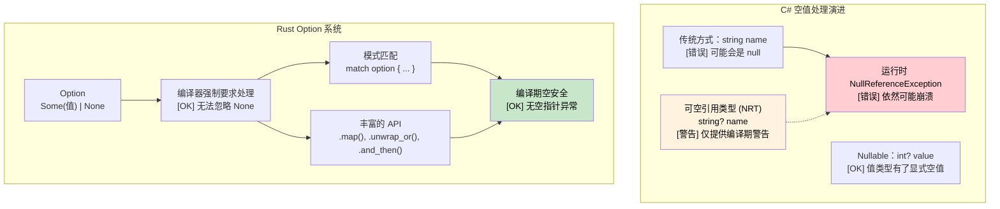

```mermaid
graph TD
    subgraph "C# 模式匹配的局限性"
        CS_SWITCH["switch 表达式"]
        CS_WARNING["⚠️ 仅提供编译器警告"]
        CS_COMPILE["✅ 依然能编译成功"]
        CS_RUNTIME["💥 导致运行时异常"]
        CS_DEPLOY["❌ Bug 流入生产环境"]
        CS_SILENT["😰 枚举变更时的哑失效率"]
        
        CS_SWITCH --> CS_WARNING
        CS_WARNING --> CS_COMPILE
        CS_COMPILE --> CS_RUNTIME
        CS_RUNTIME --> CS_DEPLOY
        CS_SWITCH --> CS_SILENT
    end
    
    subgraph "Rust 穷尽性匹配"
        RUST_MATCH["match 表达式"]
        RUST_ERROR["🛑 编译失败"]
        RUST_FIX["✅ 必须处理所有情况"]
        RUST_SAFE["✅ 零运行时意外状况"]
        RUST_EVOLUTION["🔄 枚举变更会导致编译中断"]
        RUST_REFACTOR["🛠️ 强制性重构保证安全"]
        
        RUST_MATCH --> RUST_ERROR
        RUST_ERROR --> RUST_FIX
        RUST_FIX --> RUST_SAFE
        RUST_MATCH --> RUST_EVOLUTION
        RUST_EVOLUTION --> RUST_REFACTOR
    end
    
    style CS_RUNTIME fill:#ffcdd2,color:#000
    style CS_DEPLOY fill:#ffcdd2,color:#000
    style CS_SILENT fill:#ffcdd2,color:#000
    style RUST_SAFE fill:#c8e6c9,color:#000
    style RUST_REFACTOR fill:#c8e6c9,color:#000
```

[English Original](../en/ch06-1-exhaustive-matching-and-null-safety.md)

## 穷尽性模式匹配：编译器保证 vs 运行时错误

> **你将学到：** 为什么 C# 的 `switch` 表达式会默不作声地遗漏某些情况，而 Rust 的 `match` 则会在编译期捕捉到这些遗漏；`Option<T>` 与 `Nullable<T>` 在空安全（null safety）方面的对比；以及如何使用 `Result<T, E>` 自定义错误类型。
>
> **难度：** 🟡 中级

### C# Switch 表达式 — 依然不够完整
```csharp
// C# switch 表达式看起来是穷尽的，但其实并没有强力保证
public enum HttpStatus { Ok, NotFound, ServerError, Unauthorized }

public string HandleResponse(HttpStatus status) => status switch
{
    HttpStatus.Ok => "Success",
    HttpStatus.NotFound => "Resource not found",
    HttpStatus.ServerError => "Internal error",
    // 遗漏了 Unauthorized 情况 —— 编译器仅给出警告 CS8524，而不是错误！
    // 运行时：如果 status 是 Unauthorized，会抛出 SwitchExpressionException
};

// 即便开启了可空引用类型警告，下面这段代码依然能通过编译：
public string ProcessUser(User? user) => user switch
{
    { IsActive: true } => $"Active: {user.Name}",
    { IsActive: false } => $"Inactive: {user.Name}",
    // 遗漏了 null 的情况 —— 编译器警告 CS8655，但依然不是错误！
    // 运行时：当 user 为 null 时抛出 SwitchExpressionException
};
```

### Rust 模式匹配 — 真正的穷尽性
```rust
#[derive(Debug)]
enum HttpStatus {
    Ok,
    NotFound, 
    ServerError,
    Unauthorized,
}

fn handle_response(status: HttpStatus) -> &'static str {
    match status {
        HttpStatus::Ok => "Success",
        HttpStatus::NotFound => "Resource not found", 
        HttpStatus::ServerError => "Internal error",
        HttpStatus::Unauthorized => "Authentication required",
        // 如果漏掉任何一种情况，都会发生【编译错误】！
        // 这段代码根本无法生成可执行文件
    }
}

// 稍后添加新的枚举变体，会使所有现存的 match 语句编译失败
#[derive(Debug)]
enum HttpStatus {
    // ... 原有变体 ...
    Forbidden,  // 添加这一行会使 handle_response() 编译报错
}
// 编译器会强制你处理所有（包含新增的）情况
```



***

## 空安全：`Nullable<T>` vs `Option<T>`

### Rust 的 `Option<T>` 系统
```rust
// Rust - 利用 Option<T> 进行显式的空值处理
#[derive(Debug)]
pub struct User {
    name: String,           // 绝不会为 null
    email: Option<String>,  // 显式的可选字段
}

impl User {
    pub fn get_display_name(&self) -> &str {
        &self.name  // 无需空检查 —— 保证存在
    }
    
    pub fn get_email_or_default(&self) -> String {
        self.email
            .as_ref()
            .map(|e| e.clone())
            .unwrap_or_else(|| "no-email@example.com".to_string())
    }
}
```



***

### 错误处理：`Option` 与 `Result` 类型
```rust
use std::collections::HashMap;

struct PersonService {
    people: HashMap<i32, String>,
}

impl PersonService {
    // 返回 Option<T> 而不是 null！
    fn find_person(&self, id: i32) -> Option<&String> {
        self.people.get(&id)
    }
    
    // 使用 Result<T, E> 进行错误处理
    fn save_person(&mut self, id: i32, name: String) -> Result<(), String> {
        if name.is_empty() {
            return Err("名称不能为空".to_string());
        }
        self.people.insert(id, name);
        Ok(())
    }
}

fn main() {
    let mut service = PersonService { people: HashMap::new() };
    
    // 问号运算符 (Question mark operator) 用于早期返回
    fn try_operation(service: &mut PersonService) -> Result<String, String> {
        service.save_person(2, "Bob".to_string())?; // 若发生错误则直接返回
        let name = service.find_person(2).ok_or("未找到人员")?; // 将 Option 转换为 Result
        Ok(format!("Hello, {}", name))
    }
}
```

### 自定义错误类型
```rust
// 定义自定义错误枚举
#[derive(Debug)]
enum PersonError {
    NotFound(i32),
    InvalidName(String),
    DatabaseError(String),
}

impl std::fmt::Display for PersonError {
    fn fmt(&self, f: &mut std::fmt::Formatter<'_>) -> std::fmt::Result {
        match self {
            PersonError::NotFound(id) => write!(f, "未找到 ID 为 {} 的人员", id),
            PersonError::InvalidName(name) => write!(f, "无效的名称: '{}'", name),
            PersonError::DatabaseError(msg) => write!(f, "数据库错误: {}", msg),
        }
    }
}

impl std::error::Error for PersonError {}
```

***

## 练习

<details>
<summary><strong>🏋️ 练习：Option 组合算子 (Combinators)</strong> (点击展开)</summary>

使用 Rust 的 `Option` 组合算子（`and_then`、`map`、`unwrap_or`）重写下面这段深层嵌套的 C# 空值检查代码：

```csharp
string GetCityName(User? user)
{
    if (user != null)
        if (user.Address != null)
            if (user.Address.City != null)
                return user.Address.City.ToUpper();
    return "UNKNOWN";
}
```

使用以下 Rust 类型：
```rust
struct User { address: Option<Address> }
struct Address { city: Option<String> }
```

请将其写成一个 **单一表达式**，且不使用 `if let` 或 `match`。

<details>
<summary>🔑 参考答案</summary>

```rust
struct User { address: Option<Address> }
struct Address { city: Option<String> }

fn get_city_name(user: Option<&User>) -> String {
    user.and_then(|u| u.address.as_ref())
        .and_then(|a| a.city.as_ref())
        .map(|c| c.to_uppercase())
        .unwrap_or_else(|| "UNKNOWN".to_string())
}

fn main() {
    let user = User {
        address: Some(Address { city: Some("seattle".to_string()) }),
    };
    assert_eq!(get_city_name(Some(&user)), "SEATTLE");
    assert_eq!(get_city_name(None), "UNKNOWN");
}
```

**核心洞见**：对于 `Option` 来说，`and_then` 就像 Rust 版本的 `?.` 运算符。每一步都会返回 `Option`，链条会在遇到第一个 `None` 时短路 —— 这与 C# 的空条件运算符 `?.` 逻辑完全一致，但更加显式且类型安全。

</details>
</details>

***
