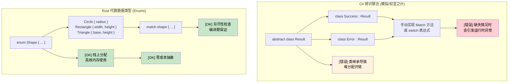

[English Original](../en/ch06-enums-and-pattern-matching.md)

## 代数数据类型 vs接口/继承

> **你将学到：** Rust 的代数数据类型（带有数据的枚举）与 C# 中有限的辨识联合（Discriminated unions）对比，具有穷尽性检查的 `match` 表达式，守卫条款（Guard clauses），以及嵌套模式的解构。
>
> **难度：** 🟡 中级

### C# 中的辨识联合 (模拟实现)
```csharp
// C# - 通过继承实现的有限联合支持
public abstract class Result
{
    public abstract T Match<T>(Func<Success, T> onSuccess, Func<Error, T> onError);
}

public class Success : Result
{
    public string Value { get; }
    public Success(string value) => Value = value;
    
    public override T Match<T>(Func<Success, T> onSuccess, Func<Error, T> onError)
        => onSuccess(this);
}

public class Error : Result
{
    public string Message { get; }
    public Error(string message) => Message = message;
    
    public override T Match<T>(Func<Success, T> onSuccess, Func<Error, T> onError)
        => onError(this);
}

// C# 9+ 的 Record 与模式匹配 (稍好一些)
public abstract record Shape;
public record Circle(double Radius) : Shape;
public record Rectangle(double Width, double Height) : Shape;

public static double Area(Shape shape) => shape switch
{
    Circle(var radius) => Math.PI * radius * radius,
    Rectangle(var width, var height) => width * height,
    _ => throw new ArgumentException("Unknown shape")  // [错误] 可能发生运行时错误
};
```

### Rust 的代数数据类型 (Enums)
```rust
// Rust - 真正的代数数据类型，且具有穷尽性模式匹配
#[derive(Debug, Clone)]
pub enum Result<T, E> {
    Ok(T),
    Err(E),
}

#[derive(Debug, Clone)]
pub enum Shape {
    Circle { radius: f64 },
    Rectangle { width: f64, height: f64 },
    Triangle { base: f64, height: f64 },
}

impl Shape {
    pub fn area(&self) -> f64 {
        match self {
            Shape::Circle { radius } => std::f64::consts::PI * radius * radius,
            Shape::Rectangle { width, height } => width * height,
            Shape::Triangle { base, height } => 0.5 * base * height,
            // [OK] 如果漏掉任何一个变体，编译器会报错！
        }
    }
}

// 进阶：枚举可以持有完全不同的类型
#[derive(Debug)]
pub enum Value {
    Integer(i64),
    Float(f64),
    Text(String),
    Boolean(bool),
    List(Vec<Value>),  // 递归类型！
}
```



***

## 枚举与模式匹配

Rust 的枚举远比 C# 的枚举强大 —— 它们可以持有数据，并且是类型安全编程的基石。

### C# 枚举的局限性
```csharp
// C# 枚举 - 仅仅是命名常量
public enum Status
{
    Pending,
    Approved,
    Rejected
}

// 对于复杂数据，需要依赖独立的类层级
public abstract class Result { ... }
```

### Rust 枚举的强大之处
```rust
// 简单项枚举 (类似于 C# 枚举)
#[derive(Debug, PartialEq)]
enum Status {
    Pending,
    Approved,
    Rejected,
}

// 带有数据的枚举 (这是 Rust 大显身手的地方！)
#[derive(Debug)]
enum Result<T, E> {
    Ok(T),      // 成功变体，持有 T 类型的值
    Err(E),     // 错误变体，持有 E 类型的错误信息
}

// 拥有不同数据类型的复杂枚举
#[derive(Debug)]
enum Message {
    Quit,                       // 不带数据
    Move { x: i32, y: i32 },   // 结构体风格变体
    Write(String),             // 元组风格变体
    ChangeColor(i32, i32, i32), // 多个数值
}

// 实际案例：HTTP 响应
#[derive(Debug)]
enum HttpResponse {
    Ok { body: String, headers: Vec<String> },
    NotFound { path: String },
    InternalError { message: String, code: u16 },
    Redirect { location: String },
}
```

### 利用 Match 进行模式匹配
```rust
// Rust match - 强制穷尽且功能强大
fn handle_status(status: Status) -> String {
    match status {
        Status::Pending => "等待批准".to_string(),
        Status::Approved => "请求已批准".to_string(),
        Status::Rejected => "请求已驳回".to_string(),
        // 无需 default 分支 - 编译器确保处理了所有情况
    }
}

// 带数据提取的模式匹配
fn handle_result<T, E>(result: Result<T, E>) -> String 
where 
    T: std::fmt::Debug,
    E: std::fmt::Debug,
{
    match result {
        Result::Ok(value) => format!("成功: {:?}", value),
        Result::Err(error) => format!("错误: {:?}", error),
    }
}
```

### 守卫 (Guards) 与高级模式
```rust
// 带守卫条件的模式匹配
fn describe_number(x: i32) -> String {
    match x {
        n if n < 0 => "负数".to_string(),
        0 => "零".to_string(),
        n if n < 10 => "个位数".to_string(),
        n if n < 100 => "两位数".to_string(),
        _ => "大数字".to_string(),
    }
}

// 匹配范围
fn describe_age(age: u32) -> String {
    match age {
        0..=12 => "儿童".to_string(),
        13..=19 => "青少年".to_string(),
        20..=64 => "成年人".to_string(),
        65.. => "老年人".to_string(),
    }
}
```

***

## 练习

<details>
<summary><strong>🏋️ 练习：命令解析器</strong> (点击展开)</summary>

**挑战**：利用 Rust 枚举建模一个 CLI 命令系统。将字符串输入解析为 `Command` 枚举，并执行每个变体。通过合理的错误处理来应对未知命令。

<details>
<summary>🔑 参考答案</summary>

```rust
#[derive(Debug)]
enum Command {
    Quit,
    Echo(String),
    Move { x: i32, y: i32 },
    Count(u32),
}

fn parse_command(input: &str) -> Result<Command, String> {
    let parts: Vec<&str> = input.splitn(2, ' ').collect();
    match parts[0] {
        "quit" => Ok(Command::Quit),
        "echo" => {
            let msg = parts.get(1).unwrap_or(&"").to_string();
            Ok(Command::Echo(msg))
        }
        "move" => {
            let args = parts.get(1).ok_or("move 命令需要 'x y' 参数")?;
            let coords: Vec<&str> = args.split_whitespace().collect();
            let x = coords.get(0).ok_or("缺失 x")?.parse::<i32>().map_err(|e| e.to_string())?;
            let y = coords.get(1).ok_or("缺失 y")?.parse::<i32>().map_err(|e| e.to_string())?;
            Ok(Command::Move { x, y })
        }
        "count" => {
            let n = parts.get(1).ok_or("count 命令需要一个数字")?
                .parse::<u32>().map_err(|e| e.to_string())?;
            Ok(Command::Count(n))
        }
        other => Err(format!("未知命令: {other}")),
    }
}

fn execute(cmd: &Command) -> String {
    match cmd {
        Command::Quit           => "再见！".to_string(),
        Command::Echo(msg)      => msg.clone(),
        Command::Move { x, y }  => format!("正在移动至 ({x}, {y})"),
        Command::Count(n)       => format!("计数至 {n}"),
    }
}

fn main() {
    let input = "move 10 20";
    if let Ok(cmd) = parse_command(input) {
        println!("{}", execute(&cmd));
    }
}
```

**关键总结**：
- 每个枚举变体可以持有不同的数据 —— 无需复杂的类层级。
- `match` 强制你处理每一种情况，有效防止遗漏。
- `?` 运算符可以优雅地链接错误传播 —— 告别深层嵌套的 try-catch。

</details>
</details>

***
