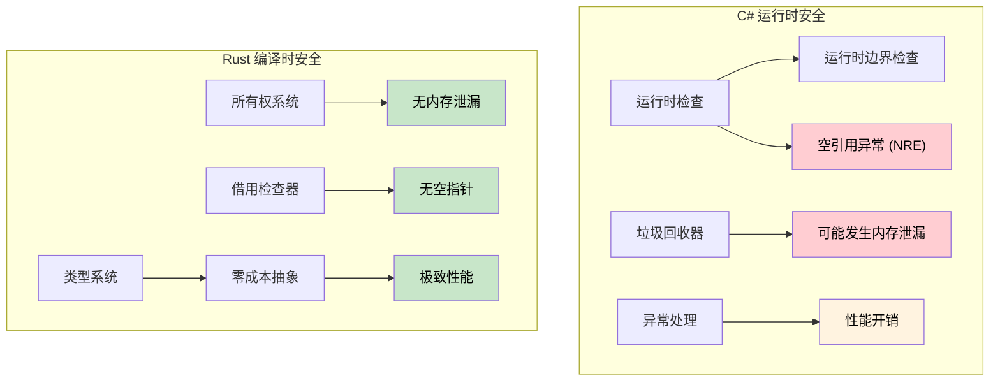

[English Original](../en/ch07-1-memory-safety-deep-dive.md)

## 引用 vs 指针

> **你将学到：** Rust 引用与 C# 指针及不安全上下文 (unsafe contexts) 的对比；生命周期基础；以及为什么编译时安全证明比 C# 的运行时检查（边界检查、空守卫）更强大。
>
> **难度：** 🟡 中级

### C# 指针 (不安全上下文)
```csharp
// C# 不安全指针 (极少使用)
unsafe void UnsafeExample()
{
    int value = 42;
    int* ptr = &value;  // 指向数值的指针
    *ptr = 100;         // 解引用并修改
    Console.WriteLine(value);  // 100
}
```

### Rust 引用 (默认安全)
```rust
// Rust 引用 (始终安全)
fn safe_example() {
    let mut value = 42;
    let ptr = &mut value;  // 可变引用
    *ptr = 100;           // 解引用并修改
    println!("{}", value); // 100
}

// 无需 "unsafe" 关键字 —— 借用检查器确保了安全性
```

### 为 C# 开发者准备的生命周期基础
```csharp
// C# - 可能会返回已失效的引用
public class LifetimeIssues
{
    public string GetFirstWord(string input)
    {
        return input.Split(' ')[0];  // 返回新字符串 (安全)
    }
    
    public unsafe char* GetFirstChar(string input)
    {
        // 这将非常危险 —— 返回一个指向托管内存的指针
        fixed (char* ptr = input)
            return ptr;  // ❌ 错误：方法结束后 ptr 就会失效
    }
}
```

```rust
// Rust - 生命周期检查防止悬垂引用 (Dangling References)
fn get_first_word(input: &str) -> &str {
    input.split_whitespace().next().unwrap_or("")
    // ✅ 安全：返回的引用与输入具有相同的生命周期
}

fn invalid_reference() -> &str {
    let temp = String::from("hello");
    &temp  // ❌ 编译错误：temp 的生命周期不够长
    // temp 会在函数结束时被丢弃 (Dropped)
}

fn valid_reference() -> String {
    let temp = String::from("hello");
    temp  // ✅ 正常：所有权转移给了调用者
}
```

---

## 内存安全：运行时检查 vs 编译时证明

### C# - 运行时安全网
```csharp
// C# 依赖运行时检查和 GC
public class Buffer
{
    private byte[] data;
    
    public Buffer(int size)
    {
        data = new byte[size];
    }
    
    public void ProcessData(int index)
    {
        // 运行时边界检查
        if (index >= data.Length)
            throw new IndexOutOfRangeException();
            
        data[index] = 42;  // 安全，但在运行时进行检查
    }
    
    // 即使有 GC，通过事件/静态引用仍可能导致内存泄漏
    public static event Action<string> GlobalEvent;
    
    public void Subscribe()
    {
        GlobalEvent += HandleEvent;  // 可能产生内存泄漏
        // 忘记取消订阅 —— 对象将无法被回收
    }
    
    private void HandleEvent(string message) { /* ... */ }
    
    // 空引用异常依然可能发生
    public void ProcessUser(User user)
    {
        Console.WriteLine(user.Name.ToUpper());  // 如果 user.Name 为 null 则抛出 NullReferenceException
    }
    
    // 数组访问可能在运行时失败
    public int GetValue(int[] array, int index)
    {
        return array[index];  // 可能抛出 IndexOutOfRangeException
    }
}
```

### Rust - 编译时保证
```rust
struct Buffer {
    data: Vec<u8>,
}

impl Buffer {
    fn new(size: usize) -> Self {
        Buffer {
            data: vec![0; size],
        }
    }
    
    fn process_data(&mut self, index: usize) {
        // 当可以证明安全时，编译器会优化掉边界检查
        if let Some(item) = self.data.get_mut(index) {
            *item = 42;  // 安全访问，在编译时得到证明
        }
        // 或者使用带显式边界检查的索引：
        // self.data[index] = 42;  // 在调试模式下会崩溃，但内存是安全的
    }
    
    // 不可能出现内存泄漏 —— 所有权系统防止了它们
    fn process_with_closure<F>(&mut self, processor: F) 
    where F: FnOnce(&mut Vec<u8>)
    {
        processor(&mut self.data);
        // 当 processor 离开作用域时，它会自动被清理
        // 无法创建悬垂引用或导致内存泄漏
    }
    
    // 不可能出现空指针解引用 —— 因为没有空指针！
    fn process_user(&self, user: &User) {
        println!("{}", user.name.to_uppercase());  // user.name 不可能为 null
    }
    
    // 数组访问带有边界检查或显式的不安全操作
    fn get_value(array: &[i32], index: usize) -> Option<i32> {
        array.get(index).copied()  // 如果越界则返回 None
    }
    
    // 或者如果你确切知道自己在做什么，可以使用显式不安全操作：
    /// # Safety
    /// `index` 必须小于 `array.len()`。
    unsafe fn get_value_unchecked(array: &[i32], index: usize) -> i32 {
        *array.get_unchecked(index)  // 速度极快，但必须手动证明边界安全
    }
}

struct User {
    name: String,  // 在 Rust 中 String 不可能为 null
}

// 所有权防止“释放后使用” (Use-after-free)
fn ownership_example() {
    let data = vec![1, 2, 3, 4, 5];
    let reference = &data[0];  // 借用数据
    
    // drop(data);  // ❌ 错误：在被借用期间不能丢弃
    println!("{}", reference);  // 保证在此处安全
}

// 借用防止数据竞态 (Data Races)
fn borrowing_example(data: &mut Vec<i32>) {
    let first = &data[0];  // 不可变借用
    // data.push(6);  // ❌ 错误：在存在不可变借用时不能进行可变借用
    println!("{}", first);  // 保证没有数据竞态
}
```



---

## 练习

<details>
<summary><strong>🏋️ 练习：找出安全 Bug</strong> (点击展开)</summary>

这段 C# 代码中有一个细微的安全 Bug。找出它，然后编写对应的 Rust 版本并解释为什么 Rust 版本**无法通过编译**：

```csharp
public List<int> GetEvenNumbers(List<int> numbers)
{
    var result = new List<int>();
    foreach (var n in numbers)
    {
        if (n % 2 == 0)
        {
            result.Add(n);
            numbers.Remove(n);  // Bug：在迭代时修改集合
        }
    }
    return result;
}
```

<details>
<summary>🔑 参考答案</summary>

**C# Bug**：在迭代时修改 `numbers` 会在**运行时**抛出 `InvalidOperationException`。这在代码审查中很容易被忽略。

```rust
fn get_even_numbers(numbers: &mut Vec<i32>) -> Vec<i32> {
    let mut result = Vec::new();
    for &n in numbers.iter() {
        if n % 2 == 0 {
            result.push(n);
            // numbers.retain(|&x| x != n);
            // ❌ 错误：不能将 `*numbers` 作为可变借用，
            //    因为它已经被作为不可变引用（由迭代器）借用了。
        }
    }
    result
}

// 惯用的 Rust 写法：使用 partition 或 retain
fn get_even_numbers_idiomatic(numbers: &mut Vec<i32>) -> Vec<i32> {
    let evens: Vec<i32> = numbers.iter().copied().filter(|n| n % 2 == 0).collect();
    numbers.retain(|n| n % 2 != 0); // 在迭代后删除偶数
    evens
}

fn main() {
    let mut nums = vec![1, 2, 3, 4, 5, 6];
    let evens = get_even_numbers_idiomatic(&mut nums);
    assert_eq!(evens, vec![2, 4, 6]);
    assert_eq!(nums, vec![1, 3, 5]);
}
```

**关键洞察**：Rust 的借用检查器在编译时就杜绝了整个“边迭代边修改”类别的 Bug。C# 在运行时捕获此类错误，而许多语言根本不捕获它们。

</details>
</details>
