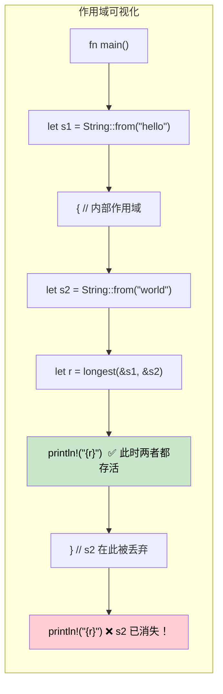

[English Original](../en/ch07-2-lifetimes-deep-dive.md)

## 生命周期 (Lifetimes)：告诉编译器引用能存活多久

> **你将学到：** 生命周期为什么存在（没有 GC 意味着编译器需要证明）；生命周期注解语法；省略规则 (Elision rules)；结构体生命周期；`'static` 生命周期；以及常见的借用检查器错误及其修复方法。
>
> **难度：** 🔴 高级

C# 开发者从来不需要考虑引用的生命周期 —— 垃圾回收器会处理可达性。而在 Rust 中，编译器需要**证据**来证明每个引用在被使用期间都是有效的。生命周期就是这份证据。

### 为什么需要生命周期
```rust
// 无法通过编译 —— 编译器无法证明返回的引用是有效的
fn longest(a: &str, b: &str) -> &str {
    if a.len() > b.len() { a } else { b }
}
// ❌ 错误：缺少生命周期限定符 —— 编译器不知道
// 返回值是借用自 `a` 还是 `b`
```

### 生命周期注解 (Lifetime Annotations)
```rust
// 生命周期 'a 的含义是：“返回值的存活时间至少与两个输入参数中较短的那个一样长”
fn longest<'a>(a: &'a str, b: &'a str) -> &'a str {
    if a.len() > b.len() { a } else { b }
}

fn main() {
    let result;
    let string1 = String::from("long string");
    {
        let string2 = String::from("xyz");
        result = longest(&string1, &string2);
        println!("最长的字符串是：{result}"); // ✅ 此时两个引用依然有效
    }
    // println!("{result}"); // ❌ 错误：string2 的存活时间不够长
}
```

### C# 对比
```csharp
// C# —— 只要存在任何引用，GC 就会保持对象存活
string Longest(string a, string b) => a.Length > b.Length ? a : b;

// 不存在生命周期问题 —— GC 自动跟踪可达性
// 但是：存在 GC 停顿，内存占用不可预测，且缺乏编译时证明
```

### 生命周期省略规则 (Lifetime Elision Rules)

在大多数情况下，你**不需要编写生命周期注解**。编译器会自动应用三条规则：

| 规则 | 描述 | 示例 |
|------|-------------|---------|
| **规则 1** | 每个引用参数都有自己的生命周期 | `fn foo(x: &str, y: &str)` → `fn foo<'a, 'b>(x: &'a str, y: &'b str)` |
| **规则 2** | 如果只有一个输入生命周期，它会被分配给所有输出生命周期 | `fn first(s: &str) -> &str` → `fn first<'a>(s: &'a str) -> &'a str` |
| **规则 3** | 如果输入包含 `&self` 或 `&mut self`，该生命周期将被分配给所有输出 | `fn name(&self) -> &str` → 借助于 &self 正常工作 |

```rust
// 下面两者是等价的 —— 编译器会自动添加生命周期：
fn first_word(s: &str) -> &str { /* ... */ }           // 省略写法
fn first_word<'a>(s: &'a str) -> &'a str { /* ... */ } // 显式写法

// 但这个函数必须显式注解 —— 两个输入，输出对应哪一个？
fn longest<'a>(a: &'a str, b: &'a str) -> &'a str { /* ... */ }
```

### 结构体生命周期 (Struct Lifetimes)
```rust
// 一个借用数据（而非拥有数据）的结构体
struct Excerpt<'a> {
    text: &'a str,  // 借用自某个必须比该结构体存活更久的 String
}

impl<'a> Excerpt<'a> {
    fn new(text: &'a str) -> Self {
        Excerpt { text }
    }

    fn first_sentence(&self) -> &str {
        self.text.split('.').next().unwrap_or(self.text)
    }
}

fn main() {
    let novel = String::from("Call me Ishmael. Some years ago...");
    let excerpt = Excerpt::new(&novel); // excerpt 借用自 novel
    println!("第一句：{}", excerpt.first_sentence());
    // 在 excerpt 存在期间，novel 必须保持存活
}
```

```csharp
// C# 等效代码 —— 无需考虑生命周期，但也无法提供编译时保证
class Excerpt
{
    public string Text { get; }
    public Excerpt(string text) => Text = text;
    public string FirstSentence() => Text.Split('.')[0];
}
// 如果字符串在其他地方被修改了怎么办？运行时会产生惊喜。
```

### `'static` 生命周期
```rust
// 'static 意味着“在整个程序运行期间都有效”
let s: &'static str = "我是一个字符串字面量"; // 存储在二进制文件中，始终有效

// 经常看到 'static 的场景：
// 1. 字符串字面量
// 2. 全局常量
// 3. Thread::spawn 要求 'static (线程可能比调用者存活更久)
std::thread::spawn(move || {
    // 发送到线程的闭包必须拥有其数据，或者使用 'static 引用
    println!("{s}"); // ✅ 正常：&'static str
});

// 'static 并不意味着“不朽” —— 它意味着“如果需要，可以永远存活”
let owned = String::from("hello");
// owned 本身不是 'static，但它可以被移动到线程中（所有权转移）
```

### 常见的借用检查器错误及修复

| 错误 | 原因 | 修复方法 |
|-------|-------|-----|
| `missing lifetime specifier` | 多个输入引用，输出指向不明确 | 添加 `<'a>` 注解，将输出绑定到正确的输入 |
| `does not live long enough` | 引用比它指向的数据存活更久 | 扩大数据的作用域，或者返回具有所有权的数据 |
| `cannot borrow as mutable` | 不可变借用依然处于活跃状态 | 在修改前完成不可变引用的使用，或者重构代码 |
| `cannot move out of borrowed content` | 尝试获取借用数据的所有权 | 使用 `.clone()`，或者重构以避免移动 |
| `lifetime may not live long enough` | 结构体借用的存活时间超过了数据源 | 确保数据源的作用域覆盖了结构体的使用范围 |

### 可视化生命周期作用域



### 多个生命周期参数

有时引用来自具有不同生命周期的不同源：

```rust
// 两个独立的生命周期：返回值仅借用自 'a，而非 'b
fn first_with_context<'a, 'b>(data: &'a str, _context: &'b str) -> &'a str {
    // 仅借用自 'data' —— 'context' 可以拥有更短的生命周期
    data.split(',').next().unwrap_or(data)
}

fn main() {
    let data = String::from("alice,bob,charlie");
    let result;
    {
        let context = String::from("user lookup"); // 较短的生命周期
        result = first_with_context(&data, &context);
    } // context 被丢弃 —— 但 result 借用自 data，而非 context ✅
    println!("{result}");
}
```

```csharp
// C# —— 缺乏生命周期跟踪意味着你无法表达“借用自 A 而非 B”
string FirstWithContext(string data, string context) => data.Split(',')[0];
// 对于有 GC 的语言来说没问题，但 Rust 可以在没有 GC 的情况下证明安全性
```

### 现实中的生命周期模式

**模式 1：返回引用的迭代器**
```rust
// 一个从输入中生成借用切片的解析器
struct CsvRow<'a> {
    fields: Vec<&'a str>,
}

fn parse_csv_line(line: &str) -> CsvRow<'_> {
    // '_ 告诉编译器“从输入中推导生命周期”
    CsvRow {
        fields: line.split(',').collect(),
    }
}
```

**模式 2：“有疑问时，返回所有权”**
```rust
// 当生命周期变得复杂时，返回具有所有权的数据是务实的修复方法
fn format_greeting(first: &str, last: &str) -> String {
    // 返回具有所有权的 String —— 无需生命周期注解
    format!("Hello, {first} {last}!")
}

// 仅在以下情况进行借用：
// 1. 性能至关重要（避免分配内存）
// 2. 输入与输出生命周期之间的关系非常明确
```

**模式 3：泛型上的生命周期约束**
```rust
// “T 的存活时间必须至少与 'a 一样长”
fn store_reference<'a, T: 'a>(cache: &mut Vec<&'a T>, item: &'a T) {
    cache.push(item);
}

// 在 trait 对象中很常见：Box<dyn Display + 'a>
fn make_printer<'a>(text: &'a str) -> Box<dyn std::fmt::Display + 'a> {
    Box::new(text)
}
```

### 何时使用 `'static`

| 场景 | 使用 `'static`？ | 替代方案 |
|----------|:-----------:|-------------|
| 字符串字面量 | ✅ 是 —— 它们始终是 `'static` | — |
| `thread::spawn` 闭包 | 经常使用 —— 线程可能比调用者存活更久 | 对借用数据使用 `thread::scope` |
| 全局配置 | ✅ `lazy_static!` 或 `OnceLock` | 通过参数传递引用 |
| 长期存储的 Trait 对象 | 经常使用 —— `Box<dyn Trait + 'static>` | 为容器参数化生命周期 `'a` |
| 临时借用 | ❌ 绝不 —— 约束过强 | 使用实际的生命周期 |

---

<details>
<summary><strong>🏋️ 练习：生命周期注解</strong> (点击展开)</summary>

**挑战**：添加正确的生命周期注解使代码能够编译：

```rust
struct Config {
    db_url: String,
    api_key: String,
}

// TODO: 添加生命周期注解
fn get_connection_info(config: &Config) -> (&str, &str) {
    (&config.db_url, &config.api_key)
}

// TODO: 该结构体借用自 Config —— 请添加生命周期参数
struct ConnectionInfo {
    db_url: &str,
    api_key: &str,
}
```

<details>
<summary>🔑 参考答案</summary>

```rust
struct Config {
    db_url: String,
    api_key: String,
}

// 规则 3 不适用（没有 &self），规则 2 适用（一个输入 → 分配给输出）
// 因此编译器会自动处理 —— 无需手动注解！
fn get_connection_info(config: &Config) -> (&str, &str) {
    (&config.db_url, &config.api_key)
}

// 结构体需要生命周期注解：
struct ConnectionInfo<'a> {
    db_url: &'a str,
    api_key: &'a str,
}

fn make_info<'a>(config: &'a Config) -> ConnectionInfo<'a> {
    ConnectionInfo {
        db_url: &config.db_url,
        api_key: &config.api_key,
    }
}
```

**关键收获**：生命周期省略规则通常让你在编写函数时免于注解，但借用数据的结构体始终需要显式的 `<'a>`。

</details>
</details>
