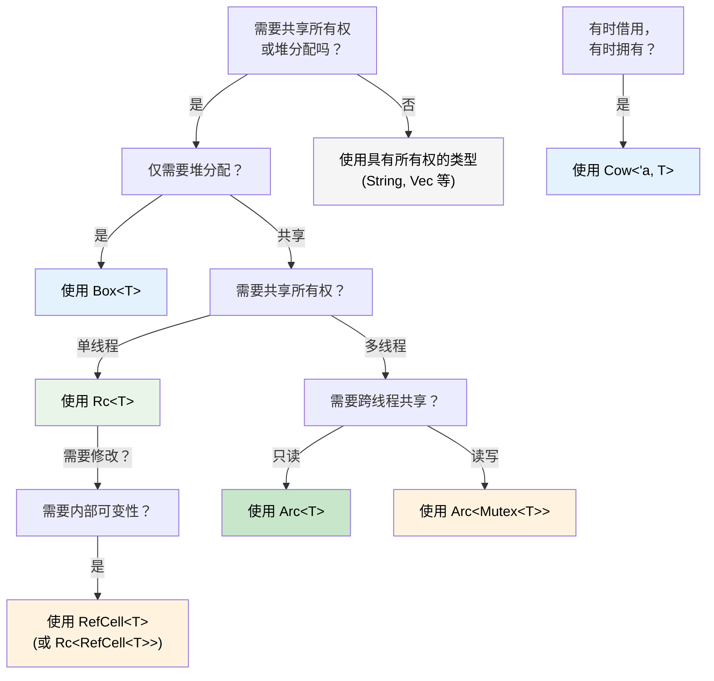

[English Original](../en/ch07-3-smart-pointers-beyond-single-ownership.md)

## 智能指针：当单一所有权不够用时

> **你将学到：** `Box<T>`, `Rc<T>`, `Arc<T>`, `Cell<T>`, `RefCell<T>` 以及 `Cow<'a, T>` —— 它们各自的适用场景；它们与 C# GC 托管引用的对比；`Drop` 作为 Rust 的 `IDisposable`；`Deref` 强制转换；以及选择正确智能指针的决策树。
>
> **难度：** 🔴 高级

在 C# 中，每个对象本质上都是由 GC 进行引用计数的。在 Rust 中，单一所有权是默认规则 —— 但有时你需要共享所有权、堆分配或内部可变性。这就是智能指针发挥作用的地方。

### Box&lt;T&gt; —— 简单的堆分配
```rust
// 栈分配 (Rust 的默认方式)
let x = 42;           // 在栈上

// 使用 Box 进行堆分配
let y = Box::new(42); // 在堆上，类似于 C# 的 `new int(42)` (装箱)
println!("{}", y);     // 自动解引用：打印 42

// 常见用途：递归类型 (在编译时无法确定大小)
#[derive(Debug)]
enum List {
    Cons(i32, Box<List>),  // Box 提供了已知的指针大小
    Nil,
}

let list = List::Cons(1, Box::new(List::Cons(2, Box::new(List::Nil))));
```

```csharp
// C# —— 所有内容已经在堆上了 (引用类型)
// Rust 仅因为默认在栈上才需要 Box<T>
var list = new LinkedListNode<int>(1);  // 始终在堆上分配
```

### Rc&lt;T&gt; —— 共享所有权 (单线程)
```rust
use std::rc::Rc;

// 同一份数据的多个所有者 —— 类似于多个 C# 引用
let shared = Rc::new(vec![1, 2, 3]);
let clone1 = Rc::clone(&shared); // 引用计数：2
let clone2 = Rc::clone(&shared); // 引用计数：3

println!("计数：{}", Rc::strong_count(&shared)); // 3
// 数据在最后一个 Rc 离开作用域时被丢弃 (Dropped)

// 常见用途：共享配置、图节点、树结构
```

### Arc&lt;T&gt; —— 共享所有权 (线程安全)
```rust
use std::sync::Arc;
use std::thread;

// Arc = 原子引用计数 (Atomic Reference Counting) —— 可在线程间安全共享
let data = Arc::new(vec![1, 2, 3]);

let handles: Vec<_> = (0..3).map(|i| {
    let data = Arc::clone(&data);
    thread::spawn(move || {
        println!("线程 {i}: {:?}", data);
    })
}).collect();

for h in handles { h.join().unwrap(); }
```

```csharp
// C# —— 所有引用默认都是线程安全的 (由 GC 处理)
var data = new List<int> { 1, 2, 3 };
// 可以跨线程自由共享 (但修改操作依然是不安全的！)
```

### Cell&lt;T&gt; 与 RefCell&lt;T&gt; —— 内部可变性 (Interior Mutability)
```rust
use std::cell::RefCell;

// 有时你需要在不可变引用后面修改数据。
// RefCell 将借用检查从编译时移到了运行时。
struct Logger {
    entries: RefCell<Vec<String>>,
}

impl Logger {
    fn new() -> Self {
        Logger { entries: RefCell::new(Vec::new()) }
    }

    fn log(&self, msg: &str) { // 注意是 &self，而非 &mut self！
        self.entries.borrow_mut().push(msg.to_string());
    }

    fn dump(&self) {
        for entry in self.entries.borrow().iter() {
            println!("{entry}");
        }
    }
}
// ⚠️ 如果违反了借用规则，RefCell 会在运行时崩溃 (Panic)
// 请谨慎使用 —— 尽可能优先选择编译时检查
```

### Cow&lt;'a, str&gt; —— 写时克隆 (Clone on Write)
```rust
use std::borrow::Cow;

// 有时你有一个 &str，但在某些情况下可能需要将其转换为 String
fn normalize(input: &str) -> Cow<'_, str> {
    if input.contains('\t') {
        // 仅在需要修改时才分配内存
        Cow::Owned(input.replace('\t', "    "))
    } else {
        // 借用原始数据 —— 零内存分配
        Cow::Borrowed(input)
    }
}

let clean = normalize("hello");           // Cow::Borrowed —— 无内存分配
let dirty = normalize("hello\tworld");    // Cow::Owned —— 已分配内存
// 两者都可以通过 Deref 作为 &str 使用
println!("{clean} / {dirty}");
```

### Drop：Rust 的 `IDisposable`

在 C# 中，`IDisposable` + `using` 负责资源清理。Rust 的等效项是 `Drop` 特性 —— 但它是**自动的**，而非选用的：

```csharp
// C# —— 必须记得使用 'using' 或调用 Dispose()
using var file = File.OpenRead("data.bin");
// Dispose() 在作用域结束时被调用

// 忘记 'using' 会导致资源泄漏！
var file2 = File.OpenRead("data.bin");
// GC *最终* 会进行终结 (finalize)，但时机不可预测
```

```rust
// Rust —— 当值离开作用域时，Drop 会自动运行
{
    let file = File::open("data.bin")?;
    // 使用文件...
}   // file.drop() 在此处被确定性地调用 —— 无需 'using'

// 自定义 Drop (类似于实现 IDisposable)
struct TempFile {
    path: std::path::PathBuf,
}

impl Drop for TempFile {
    fn drop(&mut self) {
        // 当 TempFile 离开作用域时保证运行
        let _ = std::fs::remove_file(&self.path);
        println!("已清理 {:?}", self.path);
    }
}

fn main() {
    let tmp = TempFile { path: "scratch.tmp".into() };
    // ... 使用 tmp ...
}   // scratch.tmp 在此处被自动删除
```

**与 C# 的关键区别：** 在 Rust 中，*每种* 类型都可以拥有确定的清理行为。你永远不会忘记 `using`，因为根本没有什么可以被忘记的 —— `Drop` 会在所有者离开作用域时自动运行。这种模式被称为 **RAII** (资源获取即初始化)。

> **规则**：如果你的类型持有某种资源（文件句柄、网络连接、锁、临时文件），请实现 `Drop`。所有权系统保证它会被且仅被运行一次。

### Deref 强制转换 (Deref Coercion)：自动解引用智能指针

当你调用方法或将智能指针传给函数时，Rust 会自动对其进行“解包”。这被称为 **Deref 强制转换**：

```rust
let boxed: Box<String> = Box::new(String::from("hello"));

// Deref 强制转换链：Box<String> → String → str
println!("长度：{}", boxed.len());   // 调用 str::len() —— 自动解引用！

fn greet(name: &str) {
    println!("你好，{name}");
}

let s = String::from("Alice");
greet(&s);       // 通过 Deref 强制转换：&String → &str
greet(&boxed);   // 通过两级转换：&Box<String> → &String → &str
```

```csharp
// C# 中没有等效功能 —— 你需要显式转换或调用 .ToString()
// 最接近的概念：隐式转换运算符，但这些都需要显式定义
```

**为什么这很重要：** 你可以在需要 `&str` 的地方传递 `&String`，在需要 `&[T]` 的地方传递 `&Vec<T>`，以及在需要 `&T` 的地方传递 `&Box<T>` —— 这一切都无需显式转换。这也是为什么 Rust API 通常接受 `&str` 和 `&[T]` 而非 `&String` 和 `&Vec<T>` 的原因。

### Rc vs Arc：如何选择

| | `Rc<T>` | `Arc<T>` |
|---|---|---|
| **线程安全** | ❌ 仅限单线程 | ✅ 线程安全 (原子操作) |
| **开销** | 较低 (非原子引用计数) | 较高 (原子引用计数) |
| **编译器强制** | 无法跨 `thread::spawn` 编译 | 随处可用 |
| **配合使用** | 使用 `RefCell<T>` 进行修改 | 使用 `Mutex<T>` 或 `RwLock<T>` 进行修改 |

**经验法则：** 从 `Rc` 开始。如果需要 `Arc`，编译器会通过报错告诉你。

### 决策树：该使用哪种智能指针？



<details>
<summary><strong>🏋️ 练习：选择正确的智能指针</strong> (点击展开)</summary>

**挑战**：针对以下每个场景，选择正确的智能指针并说明原因。

1. 递归树形数据结构
2. 由多个组件读取的共享配置对象 (单线程)
3. 在多个 HTTP 处理器线程间共享的请求计数器
4. 一个可能返回借用或具有所有权的字符串缓存
5. 一个需要通过不可变引用进行修改的日志缓冲区

<details>
<summary>🔑 参考答案</summary>

1. **`Box<T>`** —— 递归类型需要间接层，以便在编译时确定大小。
2. **`Rc<T>`** —— 单线程下的共享只读访问，无需 `Arc` 开销。
3. **`Arc<Mutex<u64>>`** —— 跨线程共享 (`Arc`) 且需要修改 (`Mutex`)。
4. **`Cow<'a, str>`** —— 命中缓存时返回 `&str`，未命中时返回 `String`。
5. **`RefCell<Vec<String>>`** —— 单线程下 &self 后面的内部可变性。

**经验法则**：优先使用具有所有权的普通类型。当需要间接层时使用 `Box`；当需要共享时使用 `Rc`/`Arc`；当需要在不可变引用后修改时使用 `RefCell`/`Mutex`；当希望在通用场景下实现零拷贝时使用 `Cow`。

</details>
</details>
