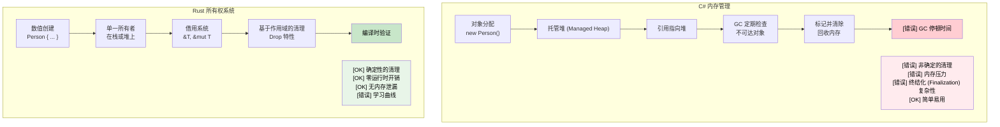

[English Original](../en/ch07-ownership-and-borrowing.md)

## 理解所有权 (Ownership)

> **你将学到：** Rust 的所有权系统 —— 为什么 `let s2 = s1` 会使 `s1` 失效（这与 C# 的引用拷贝不同）；所有权三大规则；`Copy` 与 `Move` 类型；使用 `&` 和 `&mut` 进行借用；以及借用检查器是如何替代垃圾回收 (GC) 的。
>
> **难度：** 🟡 中级

所有权是 Rust 最独特的特性，也是 C# 开发者面临的最大概念转变。让我们循序渐进地来理解它。

### C# 内存模型 (回顾)
```csharp
// C# - 自动内存管理
public void ProcessData()
{
    var data = new List<int> { 1, 2, 3, 4, 5 };
    ProcessList(data);
    // data 在此处依然可以访问
    Console.WriteLine(data.Count);  // 运行正常
    
    // 当不再有引用指向它时，GC 会负责清理
}

public void ProcessList(List<int> list)
{
    list.Add(6);  // 修改原始列表
}
```

### Rust 所有权规则
1. **每个值都有且只有一个所有者** (除非你通过 `Rc<T>`/`Arc<T>` 显式开启共享所有权 —— 详见 [智能指针](ch07-3-smart-pointers-beyond-single-ownership.md))
2. **当所有者离开作用域时，值会被丢弃 (Dropped)** (确定的清理过程 —— 详见 [Drop：Rust 的 IDisposable](ch07-3-smart-pointers-beyond-single-ownership.md#drop-rusts-idisposable))
3. **所有权可以被转移 (Move)**

```rust
// Rust - 显式的所有权管理
fn process_data() {
    let data = vec![1, 2, 3, 4, 5];  // data 拥有该向量 (vector)
    process_list(data);              // 所有权转移 (Move) 到了函数中
    // println!("{:?}", data);       // ❌ 错误：data 在此处不再拥有所有权
}

fn process_list(mut list: Vec<i32>) {  // list 现在拥有该向量
    list.push(6);
    // 当函数结束时，list 离开作用域并被丢弃 (Dropped)
}
```

### 为 C# 开发者解读“移动 (Move)”
```csharp
// C# - 拷贝的是引用，对象本身留在原地
// (仅限引用类型 —— 类 —— 是这种行为；
//  C# 的值类型如 struct 则行为不同)
var original = new List<int> { 1, 2, 3 };
var reference = original;  // 两个变量指向同一个对象
original.Add(4);
Console.WriteLine(reference.Count);  // 4 - 同一个对象
```

```rust
// Rust - 转移的是所有权
let original = vec![1, 2, 3];
let moved = original;       // 所有权发生了转移
// println!("{:?}", original);  // ❌ 错误：original 不再拥有数据
println!("{:?}", moved);    // ✅ 正常：moved 现在拥有数据
```

### Copy 类型 vs Move 类型
```rust
// Copy 类型 (类似于 C# 的值类型) - 执行拷贝而非移动
let x = 5;        // i32 实现了 Copy 特性
let y = x;        // x 的值被拷贝给了 y
println!("{}", x); // ✅ 正常：x 依然有效

// Move 类型 (类似于 C# 的引用类型) - 执行移动而非拷贝
let s1 = String::from("hello");  // String 未实现 Copy 特性
let s2 = s1;                     // s1 被移动到了 s2
// println!("{}", s1);           // ❌ 错误：s1 不再有效
```

### 实践案例：交换数值
```csharp
// C# - 简单的引用交换
public void SwapLists(ref List<int> a, ref List<int> b)
{
    var temp = a;
    a = b;
    b = temp;
}
```

```rust
// Rust - 考虑所有权的交换
fn swap_vectors(a: &mut Vec<i32>, b: &mut Vec<i32>) {
    std::mem::swap(a, b);  // 内置的交换函数
}

// 或者手动实现
fn manual_swap() {
    let mut a = vec![1, 2, 3];
    let mut b = vec![4, 5, 6];
    
    let temp = a;  // 将 a 移动到 temp
    a = b;         // 将 b 移动到 a
    b = temp;      // 将 temp 移动到 b
    
    println!("a: {:?}, b: {:?}", a, b);
}
```

---

## 借用 (Borrowing) 基础

借用类似于 C# 中的引用，但带有编译时安全保证。

### C# 引用参数
```csharp
// C# - ref 和 out 参数
public void ModifyValue(ref int value)
{
    value += 10;
}

public void ReadValue(in int value)  // 只读引用
{
    Console.WriteLine(value);
}

public bool TryParse(string input, out int result)
{
    return int.TryParse(input, out result);
}
```

### Rust 借用
```rust
// Rust - 使用 & 和 &mut 进行借用
fn modify_value(value: &mut i32) {  // 可变借用
    *value += 10;
}

fn read_value(value: &i32) {        // 不可变借用
    println!("{}", value);
}

fn main() {
    let mut x = 5;
    
    read_value(&x);      // 执行不可变借用
    modify_value(&mut x); // 执行可变借用
    
    println!("{}", x);   // x 在此处依然有效（所有权未转移）
}
```

### 借用规则 (由编译器强制执行！)
```rust
fn borrowing_rules() {
    let mut data = vec![1, 2, 3];
    
    // 规则 1：可以同时存在多个不可变借用
    let r1 = &data;
    let r2 = &data;
    println!("{:?} {:?}", r1, r2);  // ✅ 正常
    
    // 规则 2：同一时间只能存在一个可变借用
    let r3 = &mut data;
    // let r4 = &mut data;  // ❌ 错误：不能同时借用两次可变引用
    // let r5 = &data;      // ❌ 错误：在存在可变借用时不能进行不可变借用
    
    r3.push(4);  // 使用可变借用
    // r3 在此处离开作用域
    
    // 规则 3：在之前的借用结束后可以再次借用
    let r6 = &data;  // ✅ 现在正常了
    println!("{:?}", r6);
}
```

### C# vs Rust：引用安全性
```csharp
// C# - 潜在的运行时错误
public class ReferenceSafety
{
    private List<int> data = new List<int>();
    
    public List<int> GetData() => data;  // 返回内部数据的引用
    
    public void UnsafeExample()
    {
        var reference = GetData();
        
        // 另一个线程可能在此处修改 data！
        Thread.Sleep(1000);
        
        // reference 可能已失效或已被更改
        reference.Add(42);  // 潜在的竞态条件
    }
}
```

```rust
// Rust - 编译时安全性
pub struct SafeContainer {
    data: Vec<i32>,
}

impl SafeContainer {
    // 返回不可变借用 - 调用者无法修改
    // 建议使用 &[i32] 而非 &Vec<i32> —— 接受最广泛的类型
    pub fn get_data(&self) -> &[i32] {
        &self.data
    }
    
    // 返回可变借用 - 保证排他性访问
    pub fn get_data_mut(&mut self) -> &mut Vec<i32> {
        &mut self.data
    }
}

fn safe_example() {
    let mut container = SafeContainer { data: vec![1, 2, 3] };
    
    let reference = container.get_data();
    // container.get_data_mut();  // ❌ 错误：存在不可变借用时不能进行可变借用
    
    println!("{:?}", reference);  // 使用不可变引用
    // reference 在此处离开作用域
    
    let mut_reference = container.get_data_mut();  // ✅ 现在可以了
    mut_reference.push(4);
}
```

---

## 移动语义 (Move Semantics)

### C# 值类型 vs 引用类型
```csharp
// C# - 值类型执行拷贝
struct Point
{
    public int X { get; set; }
    public int Y { get; set; }
}

var p1 = new Point { X = 1, Y = 2 };
var p2 = p1;  // 执行拷贝
p2.X = 10;
Console.WriteLine(p1.X);  // 依然是 1

// C# - 引用类型共享对象
var list1 = new List<int> { 1, 2, 3 };
var list2 = list1;  // 引用拷贝 (指向同一个对象)
list2.Add(4);
Console.WriteLine(list1.Count);  // 4 - 同一个对象
```

### Rust 移动语义
```rust
// Rust - 非 Copy 类型默认执行移动
#[derive(Debug)]
struct Point {
    x: i32,
    y: i32,
}

fn move_example() {
    let p1 = Point { x: 1, y: 2 };
    let p2 = p1;  // 移动 (非拷贝)
    // println!("{:?}", p1);  // ❌ 错误：p1 已被移动
    println!("{:?}", p2);    // ✅ 正常
}

// 若要开启拷贝，请实现 Copy 特性
#[derive(Debug, Copy, Clone)]
struct CopyablePoint {
    x: i32,
    y: i32,
}

fn copy_example() {
    let p1 = CopyablePoint { x: 1, y: 2 };
    let p2 = p1;  // 拷贝 (因为它实现了 Copy)
    println!("{:?}", p1);  // ✅ 正常
    println!("{:?}", p2);  // ✅ 正常
}
```

### 何时发生数值移动
```rust
fn demonstrate_moves() {
    let s = String::from("hello");
    
    // 1. 赋值操作会触发移动
    let s2 = s;  // s 被移动到了 s2
    
    // 2. 函数调用会触发移动
    take_ownership(s2);  // s2 被移动到了函数内部
    
    // 3. 从函数返回会触发移动
    let s3 = give_ownership();  // 返回值被移动到了 s3
    
    println!("{}", s3);  // s3 是有效的
}

fn take_ownership(s: String) {
    println!("{}", s);
    // s 在此处被丢弃 (Dropped)
}

fn give_ownership() -> String {
    String::from("yours")  // 所有权移动给调用者
}
```

### 通过借用避免移动
```rust
fn demonstrate_borrowing() {
    let s = String::from("hello");
    
    // 借用而非移动
    let len = calculate_length(&s);  // s 被借用
    println!("'{}' 的长度是 {}", s, len);  // s 依然有效
}

fn calculate_length(s: &String) -> usize {
    s.len()  // s 并非所有者，因此不会被丢弃
}
```

---

## 内存管理：GC vs RAII

### C# 垃圾回收 (Garbage Collection)
```csharp
// C# - 自动内存管理
public class Person
{
    public string Name { get; set; }
    public List<string> Hobbies { get; set; } = new List<string>();
    
    public void AddHobby(string hobby)
    {
        Hobbies.Add(hobby);  // 自动分配内存
    }
    
    // 无需显式清理 - GC 会处理它
    // 但对于资源建议使用 IDisposable 模式
}

using var file = new FileStream("data.txt", FileMode.Open);
// 'using' 确保 Dispose() 被调用
```

### Rust 所有权与 RAII
```rust
// Rust - 编译时内存管理
pub struct Person {
    name: String,
    hobbies: Vec<String>,
}

impl Person {
    pub fn add_hobby(&mut self, hobby: String) {
        self.hobbies.push(hobby);  // 内存管理在编译时被跟踪
    }
    
    // 自动实现 Drop 特性 —— 保证执行清理
    // 对比 C# 的 IDisposable:
    //   C#:   using var file = new FileStream(...)    // 在 using 块结束时调用 Dispose()
    //   Rust: let file = File::open(...)?             // 在作用域结束时调用 drop() —— 无需 'using'
}

// RAII - 资源获取即初始化 (Resource Acquisition Is Initialization)
{
    let file = std::fs::File::open("data.txt")?;
    // 当 'file' 离开作用域时，文件自动关闭
    // 无需 'using' 语句 —— 由类型系统处理
}
```



---

<details>
<summary><strong>🏋️ 练习：修复借用检查器错误</strong> (点击展开)</summary>

**挑战**：以下每个代码片段都有一个借用检查器错误。在不改变输出结果的前提下修复它们。

```rust
// 1. 使用后移动 (Move after use)
fn problem_1() {
    let name = String::from("Alice");
    let greeting = format!("Hello, {name}!");
    let upper = name.to_uppercase();  // 提示：使用借用而非移动
    println!("{greeting} — {upper}");
}

// 2. 可变与不可变借用重叠
fn problem_2() {
    let mut numbers = vec![1, 2, 3];
    let first = &numbers[0];
    numbers.push(4);            // 提示：重新调整操作顺序
    println!("first = {first}");
}

// 3. 返回本地变量的引用
fn problem_3() -> String {
    let s = String::from("hello");
    s   // 提示：返回所有权数值，而非 &str
}
```

<details>
<summary>🔑 参考答案</summary>

```rust
// 1. format! 实际上会借用其参数 —— 这里的修复点在于 format! 使用了引用。
//    原始代码其实是可以编译的！但如果我们用了 `let greeting = name;`，
//    则通过 &name 修复：
fn solution_1() {
    let name = String::from("Alice");
    let greeting = format!("Hello, {}!", &name); // 执行借用
    let upper = name.to_uppercase();             // name 依然有效
    println!("{greeting} — {upper}");
}

// 2. 在可变操作之前使用不可变借用：
fn solution_2() {
    let mut numbers = vec![1, 2, 3];
    let first = numbers[0]; // 拷贝 i32 数值 (i32 实现了 Copy)
    numbers.push(4);
    println!("first = {first}");
}

// 3. 返回具有所有权的 String (本就应该是这样 —— 常见的初学者困惑点)：
fn solution_3() -> String {
    let s = String::from("hello");
    s // 所有权转移给调用者 —— 这是正确的模式
}
```

**关键收获**：
- `format!()` 借用它的参数 —— 而非移动它们。
- 像 `i32` 这样的原始类型实现了 `Copy`，因此通过索引访问会拷贝该值。
- 返回一个具有所有权的数值会将所有权转移给调用者 —— 不存在生命周期问题。

</details>
</details>
