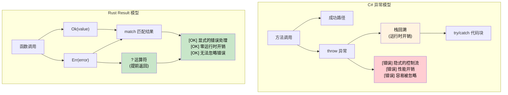

[English Original](../en/ch09-error-handling.md)

## 异常 vs `Result<T, E>`

> **你将学到：** 为什么 Rust 使用 `Result<T, E>` 和 `Option<T>` 替代了异常；用于简洁错误传播的 `?` 运算符；以及显式错误处理如何消除了困扰 C# `try`/`catch` 代码的隐式控制流。
>
> **难度：** 🟡 中级
>
> **另请参阅**：[Crate 级错误类型](ch09-1-crate-level-error-types-and-result-alias.md) 了解使用 `thiserror` 和 `anyhow` 的生产级错误处理模式，以及 [必备 Crate](ch15-1-essential-crates-for-c-developers.md) 了解错误处理相关的 Crate 生态。

### C# 基于异常的错误处理
```csharp
// C# - 基于异常的错误处理
public class UserService
{
    public User GetUser(int userId)
    {
        if (userId <= 0)
        {
            throw new ArgumentException("用户 ID 必须为正数");
        }
        
        var user = database.FindUser(userId);
        if (user == null)
        {
            throw new UserNotFoundException($"未找到用户 {userId}");
        }
        
        return user;
    }
    
    public async Task<string> GetUserEmailAsync(int userId)
    {
        try
        {
            var user = GetUser(userId);
            return user.Email ?? throw new InvalidOperationException("用户没有邮箱地址");
        }
        catch (UserNotFoundException ex)
        {
            logger.Warning("未找到用户：{UserId}", userId);
            return "noreply@company.com";
        }
        catch (Exception ex)
        {
            logger.Error(ex, "获取用户邮箱时发生意外错误");
            throw; // 重新抛出
        }
    }
}
```

### Rust 基于 Result 的错误处理
```rust
use std::fmt;

#[derive(Debug)]
pub enum UserError {
    InvalidId(i32),
    NotFound(i32),
    NoEmail,
    DatabaseError(String),
}

impl fmt::Display for UserError {
    fn fmt(&self, f: &mut fmt::Formatter<'_>) -> fmt::Result {
        match self {
            UserError::InvalidId(id) => write!(f, "无效的用户 ID: {}", id),
            UserError::NotFound(id) => write!(f, "未找到用户 {}", id),
            UserError::NoEmail => write!(f, "用户没有电子邮箱地址"),
            UserError::DatabaseError(msg) => write!(f, "数据库错误: {}", msg),
        }
    }
}

impl std::error::Error for UserError {}

#[derive(Debug, Clone)]
pub struct User {
    pub name: String,
    pub email: Option<String>,
}

pub struct UserService {
    users: Vec<User>,  // 模拟数据库
}

impl UserService {
    fn database_find_user(&self, user_id: i32) -> Option<User> {
        self.users.get(user_id as usize).cloned()
    }

    pub fn get_user(&self, user_id: i32) -> Result<User, UserError> {
        if user_id <= 0 {
            return Err(UserError::InvalidId(user_id));
        }
        
        // 模拟数据库查询
        self.database_find_user(user_id)
            .ok_or(UserError::NotFound(user_id))
    }
    
    pub fn get_user_email(&self, user_id: i32) -> Result<String, UserError> {
        let user = self.get_user(user_id)?; // ? 运算符传播错误
        
        user.email
            .ok_or(UserError::NoEmail)
    }
    
    pub fn get_user_email_or_default(&self, user_id: i32) -> String {
        match self.get_user_email(user_id) {
            Ok(email) => email,
            Err(UserError::NotFound(_)) => {
                log::warn!("未找到用户：{}", user_id);
                "noreply@company.com".to_string()
            }
            Err(err) => {
                log::error!("获取用户邮箱时发生错误：{}", err);
                "error@company.com".to_string()
            }
        }
    }
}
```



---

### ? 运算符：简洁地传播错误
```csharp
// C# - 异常传播 (隐式)
public async Task<string> ProcessFileAsync(string path)
{
    var content = await File.ReadAllTextAsync(path);  // 出错时抛出
    var processed = ProcessContent(content);          // 出错时抛出
    return processed;
}
```

```rust
// Rust - 使用 ? 进行错误传播
fn process_file(path: &str) -> Result<String, ConfigError> {
    let content = read_config(path)?;  // 如果是 Err 则通过 ? 传播错误
    let processed = process_content(&content)?;  // 如果是 Err 则通过 ? 传播错误
    Ok(processed)  // 将成功值封装在 Ok 中
}

fn process_content(content: &str) -> Result<String, ConfigError> {
    if content.is_empty() {
        Err(ConfigError::InvalidFormat)
    } else {
        Ok(content.to_uppercase())
    }
}
```

### `Option<T>` 处理可空值
```csharp
// C# - 可空引用类型
public string? FindUserName(int userId)
{
    var user = database.FindUser(userId);
    return user?.Name;  // 如果未找到用户则返回 null
}

public void ProcessUser(int userId)
{
    string? name = FindUserName(userId);
    if (name != null)
    {
        Console.WriteLine($"用户: {name}");
    }
    else
    {
        Console.WriteLine("未找到用户");
    }
}
```

```rust
// Rust - 使用 Option<T> 处理可选值
fn find_user_name(user_id: u32) -> Option<String> {
    // 模拟数据库查询
    if user_id == 1 {
        Some("Alice".to_string())
    } else {
        None
    }
}

fn process_user(user_id: u32) {
    match find_user_name(user_id) {
        Some(name) => println!("用户: {}", name),
        None => println!("未找到用户"),
    }
    
    // 或者使用 if let (模式匹配的简写形式)
    if let Some(name) = find_user_name(user_id) {
        println!("用户: {}", name);
    } else {
        println!("未找到用户");
    }
}
```

### 结合使用 Option 和 Result
```rust
fn safe_divide(a: f64, b: f64) -> Option<f64> {
    if b != 0.0 {
        Some(a / b)
    } else {
        None
    }
}

fn parse_and_divide(a_str: &str, b_str: &str) -> Result<Option<f64>, ParseFloatError> {
    let a: f64 = a_str.parse()?;  // 如果解析失败则返回解析错误
    let b: f64 = b_str.parse()?;  // 如果解析失败则返回解析错误
    Ok(safe_divide(a, b))         // 返回 Ok(Some(结果)) 或 Ok(None)
}

use std::num::ParseFloatError;

fn main() {
    match parse_and_divide("10.0", "2.0") {
        Ok(Some(result)) => println!("结果: {}", result),
        Ok(None) => println!("除以零错误"),
        Err(error) => println!("解析错误: {}", error),
    }
}
```

---

<details>
<summary><strong>🏋️ 练习：构建 Crate 级错误类型</strong> (点击展开)</summary>

**挑战**：为一个文件处理应用程序创建一个 `AppError` 枚举。该程序可能因 I/O 错误、JSON 解析错误以及验证错误而失败。实现 `From` 转换以支持自动的 `?` 错误传播。

```rust
// 初始代码
use std::io;

// TODO: 定义带有以下变体的 AppError:
//   Io(io::Error), Json(serde_json::Error), Validation(String)
// TODO: 实现 Display 和 Error trait
// TODO: 实现 From<io::Error> 和 From<serde_json::Error>
// TODO: 定义类型别名: type Result<T> = std::result::Result<T, AppError>;

fn load_config(path: &str) -> Result<Config> {
    let content = std::fs::read_to_string(path)?;  // io::Error → AppError
    let config: Config = serde_json::from_str(&content)?;  // serde error → AppError
    if config.name.is_empty() {
        return Err(AppError::Validation("名称不能为空".into()));
    }
    Ok(config)
}
```

<details>
<summary>🔑 参考答案</summary>

```rust
use std::io;
use thiserror::Error;

#[derive(Error, Debug)]
pub enum AppError {
    #[error("I/O 错误: {0}")]
    Io(#[from] io::Error),

    #[error("JSON 错误: {0}")]
    Json(#[from] serde_json::Error),

    #[error("验证错误: {0}")]
    Validation(String),
}

pub type Result<T> = std::result::Result<T, AppError>;

#[derive(serde::Deserialize)]
struct Config {
    name: String,
    port: u16,
}

fn load_config(path: &str) -> Result<Config> {
    let content = std::fs::read_to_string(path)?;
    let config: Config = serde_json::from_str(&content)?;
    if config.name.is_empty() {
        return Err(AppError::Validation("名称不能为空".into()));
    }
    Ok(config)
}
```

**关键收获**：
- `thiserror` 通过属性标签自动生成 `Display` 和 `Error` 实现。
- `#[from]` 自动生成 `From<T>` 实现，从而实现自动的 `?` 转换。
- `Result<T>` 别名可以消除整个 Crate 中重复的模板代码。
- 与 C# 异常不同，错误类型在每个函数签名中都是清晰可见的。

</details>
</details>
