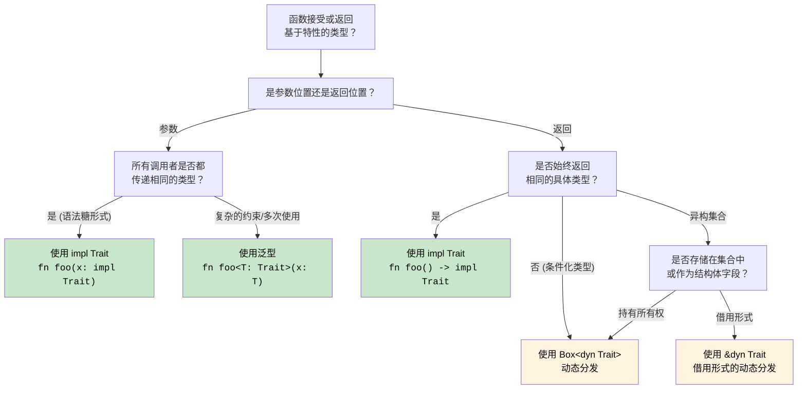

[English Original](../en/ch10-traits-and-generics.md)

## 特性 (Traits) - Rust 的接口

> **你将学到：** 特性与 C# 接口的对比；默认方法实现；特性对象 (`dyn Trait`) 与泛型约束 (`impl Trait`)；派生特性 (Derived traits)；常见的标准库特性；关联类型；以及通过特性实现的运算符重载。
>
> **难度：** 🟡 中级

特性是 Rust 定义共享行为的方式。虽然类似于 C# 中的接口，但其功能更为强大。

### C# 接口对比
```csharp
// C# 接口定义
public interface IAnimal
{
    string Name { get; }
    void MakeSound();
    
    // 默认实现 (C# 8+)
    string Describe()
    {
        return $"{Name} makes a sound";
    }
}

// C# 接口实现
public class Dog : IAnimal
{
    public string Name { get; }
    
    public Dog(string name)
    {
        Name = name;
    }
    
    public void MakeSound()
    {
        Console.WriteLine("Woof!");
    }
    
    // 可以重写默认实现
    public string Describe()
    {
        return $"{Name} is a loyal dog";
    }
}

// 泛型约束
public void ProcessAnimal<T>(T animal) where T : IAnimal
{
    animal.MakeSound();
    Console.WriteLine(animal.Describe());
}
```

### Rust 特性定义与实现
```rust
// 特性定义
trait Animal {
    fn name(&self) -> &str;
    fn make_sound(&self);
    
    // 默认实现
    fn describe(&self) -> String {
        format!("{} makes a sound", self.name())
    }
    
    // 使用其他特性方法的默认实现
    fn introduce(&self) {
        println!("Hi, I'm {}", self.name());
        self.make_sound();
    }
}

// 结构体定义
#[derive(Debug)]
struct Dog {
    name: String,
    breed: String,
}

impl Dog {
    fn new(name: String, breed: String) -> Dog {
        Dog { name, breed }
    }
}

// 实现特性
impl Animal for Dog {
    fn name(&self) -> &str {
        &self.name
    }
    
    fn make_sound(&self) {
        println!("Woof!");
    }
    
    // 重写默认实现
    fn describe(&self) -> String {
        format!("{} is a loyal {} dog", self.name, self.breed)
    }
}

// 另一个实现
#[derive(Debug)]
struct Cat {
    name: String,
    indoor: bool,
}

impl Animal for Cat {
    fn name(&self) -> &str {
        &self.name
    }
    
    fn make_sound(&self) {
        println!("Meow!");
    }
    
    // 使用默认的 describe() 实现
}

// 带有特性约束的泛型函数
fn process_animal<T: Animal>(animal: &T) {
    animal.make_sound();
    println!("{}", animal.describe());
    animal.introduce();
}

// 多重特性约束
fn process_animal_debug<T: Animal + std::fmt::Debug>(animal: &T) {
    println!("Debug: {:?}", animal);
    process_animal(animal);
}

fn main() {
    let dog = Dog::new("Buddy".to_string(), "Golden Retriever".to_string());
    let cat = Cat { name: "Whiskers".to_string(), indoor: true };
    
    process_animal(&dog);
    process_animal(&cat);
    
    process_animal_debug(&dog);
}
```

### 特性对象与动态分发 (Dynamic Dispatch)
```csharp
// C# 动态多态
public void ProcessAnimals(List<IAnimal> animals)
{
    foreach (var animal in animals)
    {
        animal.MakeSound(); // 动态分发
        Console.WriteLine(animal.Describe());
    }
}

// 用法
var animals = new List<IAnimal>
{
    new Dog("Buddy"),
    new Cat("Whiskers"),
    new Dog("Rex")
};

ProcessAnimals(animals);
```

```rust
// Rust 中用于动态分发的特性对象
fn process_animals(animals: &[Box<dyn Animal>]) {
    for animal in animals {
        animal.make_sound(); // 动态分发
        println!("{}", animal.describe());
    }
}

// 另一种方式：使用引用
fn process_animal_refs(animals: &[&dyn Animal]) {
    for animal in animals {
        animal.make_sound();
        println!("{}", animal.describe());
    }
}

fn main() {
    // 使用 Box<dyn Trait>
    let animals: Vec<Box<dyn Animal>> = vec![
        Box::new(Dog::new("Buddy".to_string(), "Golden Retriever".to_string())),
        Box::new(Cat { name: "Whiskers".to_string(), indoor: true }),
        Box::new(Dog::new("Rex".to_string(), "German Shepherd".to_string())),
    ];
    
    process_animals(&animals);
    
    // 使用引用
    let dog = Dog::new("Buddy".to_string(), "Golden Retriever".to_string());
    let cat = Cat { name: "Whiskers".to_string(), indoor: true };
    
    let animal_refs: Vec<&dyn Animal> = vec![&dog, &cat];
    process_animal_refs(&animal_refs);
}
```

### 派生特性 (Derived Traits)
```rust
// 自动派生常见的特性
#[derive(Debug, Clone, PartialEq, Eq, Hash)]
struct Person {
    name: String,
    age: u32,
}

// 以上代码生成的实现（简化版）：
impl std::fmt::Debug for Person {
    fn fmt(&self, f: &mut std::fmt::Formatter<'_>) -> std::fmt::Result {
        f.debug_struct("Person")
            .field("name", &self.name)
            .field("age", &self.age)
            .finish()
    }
}

impl Clone for Person {
    fn clone(&self) -> Self {
        Person {
            name: self.name.clone(),
            age: self.age,
        }
    }
}

impl PartialEq for Person {
    fn eq(&self, other: &Self) -> bool {
        self.name == other.name && self.age == other.age
    }
}

// 用法
fn main() {
    let person1 = Person {
        name: "Alice".to_string(),
        age: 30,
    };
    
    let person2 = person1.clone(); // Clone 特性
    
    println!("{:?}", person1); // Debug 特性
    println!("相等: {}", person1 == person2); // PartialEq 特性
}
```

### 常见的标准库特性
```rust
use std::collections::HashMap;

// 用于易读输出的 Display 特性
impl std::fmt::Display for Person {
    fn fmt(&self, f: &mut std::fmt::Formatter<'_>) -> std::fmt::Result {
        write!(f, "{} (年龄 {})", self.name, self.age)
    }
}

// 用于类型转换的 From 特性
impl From<(String, u32)> for Person {
    fn from((name, age): (String, u32)) -> Self {
        Person { name, age }
    }
}

// 当实现了 From 时，Into 特性会被自动实现
fn create_person() {
    let person: Person = ("Alice".to_string(), 30).into();
    println!("{}", person);
}

// 实现 Iterator 特性
struct PersonIterator {
    people: Vec<Person>,
    index: usize,
}

impl Iterator for PersonIterator {
    type Item = Person;
    
    fn next(&mut self) -> Option<Self::Item> {
        if self.index < self.people.len() {
            let person = self.people[self.index].clone();
            self.index += 1;
            Some(person)
        } else {
            None
        }
    }
}

impl Person {
    fn iterator(people: Vec<Person>) -> PersonIterator {
        PersonIterator { people, index: 0 }
    }
}

fn main() {
    let people = vec![
        Person::from(("Alice".to_string(), 30)),
        Person::from(("Bob".to_string(), 25)),
        Person::from(("Charlie".to_string(), 35)),
    ];
    
    // 使用我们的自定义迭代器
    for person in Person::iterator(people.clone()) {
        println!("{}", person); // 使用了 Display 特性
    }
}
```

---

<details>
<summary><strong>🏋️ 练习：基于特性的绘制系统</strong> (点击展开)</summary>

**挑战**：实现一个 `Drawable` 特性，包含一个 `area()` 方法和一个默认实现的 `draw()` 方法。创建 `Circle` 和 `Rect` 结构体。编写一个接受 `&[Box<dyn Drawable>]` 参数的函数并打印出总面积。

<details>
<summary>🔑 参考答案</summary>

```rust
use std::f64::consts::PI;

trait Drawable {
    fn area(&self) -> f64;

    fn draw(&self) {
        println!("正在绘制形状，面积为：{:.2}", self.area());
    }
}

struct Circle { radius: f64 }
struct Rect   { w: f64, h: f64 }

impl Drawable for Circle {
    fn area(&self) -> f64 { PI * self.radius * self.radius }
}

impl Drawable for Rect {
    fn area(&self) -> f64 { self.w * self.h }
}

fn total_area(shapes: &[Box<dyn Drawable>]) -> f64 {
    shapes.iter().map(|s| s.area()).sum()
}

fn main() {
    let shapes: Vec<Box<dyn Drawable>> = vec![
        Box::new(Circle { radius: 5.0 }),
        Box::new(Rect { w: 4.0, h: 6.0 }),
        Box::new(Circle { radius: 2.0 }),
    ];
    for s in &shapes { s.draw(); }
    println!("总面积：{:.2}", total_area(&shapes));
}
```

**关键收获**：
- `dyn Trait` 提供了运行时多态（类似于 C# 的 `IDrawable`）。
- `Box<dyn Trait>` 在堆上分配，是处理异构集合所必需的。
- 默认方法的工作方式与 C# 8+ 中的默认接口方法完全相同。

</details>
</details>

### 关联类型 (Associated Types)：带有类型成员的特性

C# 的接口没有关联类型 —— 而 Rust 的特性有。这就是 `Iterator` 的工作原理：

```rust
// Iterator 特性拥有一个关联类型 'Item'
trait Iterator {
    type Item;                         // 每个实现者定义其 Item 的具体类型
    fn next(&mut self) -> Option<Self::Item>;
}

struct Counter { max: u32, current: u32 }

impl Iterator for Counter {
    type Item = u32;                   // 此 Counter 生成 u32 数值
    fn next(&mut self) -> Option<u32> {
        if self.current < self.max {
            self.current += 1;
            Some(self.current)
        } else {
            None
        }
    }
}
```

在 C# 中，`IEnumerator<T>` 使用泛型参数 (`T`) 达到此目的。Rust 的关联类型与之不同：`Iterator` 在其**实现层级**上每种实现只有一个 `Item` 类型，而不是在特性层级上定义。这简化了特性约束：`impl Iterator<Item = u32>` 对比 C# 的 `IEnumerable<int>`。

### 通过特性实现运算符重载

在 C# 中，你会定义 `public static MyType operator+(MyType a, MyType b)`。而在 Rust 中，所有的运算符都会映射到 `std::ops` 中的一个特性：

```rust
use std::ops::Add;

#[derive(Debug, Clone, Copy)]
struct Vec2 { x: f64, y: f64 }

impl Add for Vec2 {
    type Output = Vec2;
    fn add(self, rhs: Vec2) -> Vec2 {
        Vec2 { x: self.x + rhs.x, y: self.y + rhs.y }
    }
}

let a = Vec2 { x: 1.0, y: 2.0 };
let b = Vec2 { x: 3.0, y: 4.0 };
let c = a + b;  // 调用了 <Vec2 as Add>::add(a, b)
```

| C# | Rust | 备注 |
|----|------|-------|
| `operator+` | `impl Add` | 按值传递 `self` —— 对于非 `Copy` 类型会消耗所有权 |
| `operator==` | `impl PartialEq` | 通常通过 `#[derive(PartialEq)]` 实现 |
| `operator<` | `impl PartialOrd` | 通常通过 `#[derive(PartialOrd)]` 实现 |
| `ToString()` | `impl fmt::Display` | 用于 `println!("{}", x)` |
| 隐式转换 | 无对应项 | Rust 不存在隐式转换 —— 请使用 `From`/`Into` |

### 一致性：孤儿规则 (The Orphan Rule)

你只能在拥有该特性或该类型的情况下实现一个特性。这防止了跨 Crate 的冲突实现：

```rust
// ✅ 正常 —— 你拥有 MyType
impl Display for MyType { ... }

// ✅ 正常 —— 你拥有 MyTrait
impl MyTrait for String { ... }

// ❌ 错误 —— 你既不拥有 Display 也不拥有 String
impl Display for String { ... }
```

C# 没有这种等效的限制 —— 任何代码都可以给任何类型添加扩展方法，这可能导致歧义。

## `impl Trait`：不使用装箱 (Boxing) 返回特性

C# 接口始终可以作为返回类型。而在 Rust 中，返回特性需要做出决定：静态分发 (`impl Trait`) 还是动态分发 (`dyn Trait`)。

### `impl Trait` 作为参数 (泛型的简写形式)
```rust
// 这两者是等价的：
fn print_animal(animal: &impl Animal) { animal.make_sound(); }
fn print_animal<T: Animal>(animal: &T)  { animal.make_sound(); }

// impl Trait 只是泛型参数的一种语法糖
// 编译器会为每个具体类型生成一份专门的代码拷贝（单态化 monomorphization）
```

### `impl Trait` 作为返回值 (关键区别)
```rust
// 返回一个迭代器而不暴露其具体类型
fn even_squares(limit: u32) -> impl Iterator<Item = u32> {
    (0..limit)
        .filter(|n| n % 2 == 0)
        .map(|n| n * n)
}
// 调用者看到的只是“某种实现了 Iterator<Item = u32> 的类型”
// 具体的实际类型 (Filter<Map<Range<u32>, ...>>) 非常复杂且难以命名 —— impl Trait 解决了这个问题。

fn main() {
    for n in even_squares(20) {
        print!("{n} ");
    }
}
```

```csharp
// C# —— 返回一个接口（始终是动态分发，在堆上分配迭代器对象）
public IEnumerable<int> EvenSquares(int limit) =>
    Enumerable.Range(0, limit)
        .Where(n => n % 2 == 0)
        .Select(n => n * n);
// 返回类型将具体的迭代器隐藏在 IEnumerable 接口后面
// 不同于 Rust 的 Box<dyn Trait>，C# 不会显式装箱 —— 运行时会自动处理分配
```

### 返回闭包：`impl Fn` vs `Box<dyn Fn>`
```rust
// 返回一个闭包 —— 你无法指明闭包的具体类型，因此 impl Fn 至关重要
fn make_adder(x: i32) -> impl Fn(i32) -> i32 {
    move |y| x + y
}

let add5 = make_adder(5);
println!("{}", add5(3)); // 8

// 如果你需要根据条件返回不同的闭包，则需要使用 Box：
fn choose_op(add: bool) -> Box<dyn Fn(i32, i32) -> i32> {
    if add {
        Box::new(|a, b| a + b)
    } else {
        Box::new(|a, b| a * b)
    }
}
// impl Trait 要求是单一的一种具体类型；不同的闭包属于不同的类型
```

```csharp
// C# —— 委托 (Delegates) 可以很自然地处理此问题（始终在堆上分配）
Func<int, int> MakeAdder(int x) => y => x + y;
Func<int, int, int> ChooseOp(bool add) => add ? (a, b) => a + b : (a, b) => a * b;
```

### 分发决策：`impl Trait` vs `dyn Trait` vs 泛型

这是 C# 开发者在 Rust 中需要立即面对的架构决策。以下是完整指南：



| 方法 | 分发方式 | 内存分配 | 适用场景 |
|----------|----------|------------|-------------|
| `fn foo<T: Trait>(x: T)` | 静态 (单态化) | 栈 | 多个特性约束、需要 turbofish、复用相同类型 |
| `fn foo(x: impl Trait)` | 静态 (单态化) | 栈 | 简单约束、语法更整洁、一次性参数 |
| `fn foo() -> impl Trait` | 静态 | 栈 | 唯一具体的返回类型、迭代器、闭包 |
| `fn foo() -> Box<dyn Trait>` | 动态 (虚表 vtable) | **堆** | 不同的返回类型、集合中的特性对象 |
| `&dyn Trait` / `&mut dyn Trait` | 动态 (虚表 vtable) | 无分配 | 借用异构引用、函数参数 |

```rust
// 总结：从最快到最灵活
fn static_dispatch(x: impl Display)             { /* 最快，无分配 */ }
fn generic_dispatch<T: Display + Clone>(x: T)    { /* 最快，支持多重约束 */ }
fn dynamic_dispatch(x: &dyn Display)             { /* 虚表查询，无分配 */ }
fn boxed_dispatch(x: Box<dyn Display>)           { /* 虚表查询 + 堆分配 */ }
```

---
