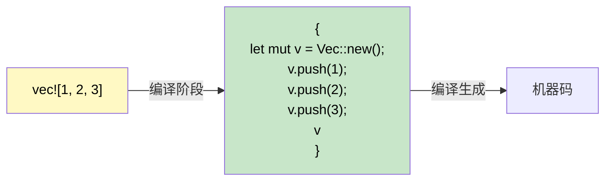

[English Original](../en/ch12-1-macros-primer.md)

## 宏 (Macros)：编写代码的代码

> **你将学到：** 为什么 Rust 需要宏（没有重载，没有变长参数）；`macro_rules!` 基础；`!` 后缀约定；常见的派生 (derive) 宏；以及用于快速调试的 `dbg!()`。
>
> **难度：** 🟡 中级

C# 没有与 Rust 宏直接对应的功能。理解宏为什么存在以及它是如何工作的，可以消除 C# 开发者的一个重大困惑源。

### 为什么 Rust 中存在宏



```csharp
// C# 拥有一些特性，使得宏变得不是那么必要：
Console.WriteLine("Hello");           // 方法重载 (支持 1-16 个参数)
Console.WriteLine("{0}, {1}", a, b);  // 通过 params 数组实现变长参数
var list = new List<int> { 1, 2, 3 }; // 集合初始化语法
```

```rust
// Rust “没有”函数重载，“没有”变长参数，“没有”特殊的集合初始化语法。
// 宏填补了这些空白：
println!("Hello");                    // 宏 —— 在编译时处理 0 个或多个参数
println!("{}, {}", a, b);             // 宏 —— 在编译时进行类型检查
let list = vec![1, 2, 3];            // 宏 —— 展开为 Vec::new() + push()
```

### 识别宏：`!` 后缀

每个宏调用都以 `!` 结尾。如果你看到 `!`，它就是一个宏，而不是普通函数：

```rust
println!("hello");     // 宏 —— 在编译时生成格式化字符串代码
format!("{x}");        // 宏 —— 返回 String，并进行编译时格式检查
vec![1, 2, 3];         // 宏 —— 创建并填充一个 Vec
todo!();               // 宏 —— 触发 panic，提示“尚未实现”
dbg!(expression);      // 宏 —— 打印文件名:行号 + 表达式 + 结果，并返回该结果
assert_eq!(a, b);      // 宏 —— 如果 a ≠ b，则打印差异并 panic
cfg!(target_os = "linux"); // 宏 —— 进行编译时平台检测
```

### 使用 `macro_rules!` 编写简单宏
```rust
// 定义一个从键值对创建 HashMap 的宏
macro_rules! hashmap {
    // 模式：由逗号分隔的 key => value 键值对
    ( $( $key:expr => $value:expr ),* $(,)? ) => {{
        let mut map = std::collections::HashMap::new();
        $( map.insert($key, $value); )*
        map
    }};
}

fn main() {
    let scores = hashmap! {
        "Alice" => 100,
        "Bob"   => 85,
        "Carol" => 92,
    };
    println!("{scores:?}");
}
```

### 派生宏 (Derive Macros)：自动实现特性
```rust
// #[derive] 是一种过程宏，用于生成特性 (trait) 的实现代码
#[derive(Debug, Clone, PartialEq, Eq, Hash)]
struct User {
    name: String,
    age: u32,
}
// 编译器通过检查结构体字段，
// 自动生成 Debug::fmt, Clone::clone, PartialEq::eq 等实现。
```

```csharp
// C# 等效项：无 —— 你通常需要手动实现 IEquatable, ICloneable 等。
// 或者使用 Record 类型：public record User(string Name, int Age);
// Record 会自动生成 Equals, GetHashCode, ToString —— 类似的理念！
```

### 常见的派生宏

| 派生项 | 用途 | C# 对应项 |
|--------|---------|---------------|
| `Debug` | `{:?}` 格式化输出 | 重写 `ToString()` |
| `Clone` | 通过 `.clone()` 进行深拷贝 | `ICloneable` |
| `Copy` | 隐式的位拷贝 (无需调用 `.clone()`) | 值类型 (`struct`) 语义 |
| `PartialEq`, `Eq` | `==` 相等性比较 | `IEquatable<T>` |
| `PartialOrd`, `Ord` | `<`, `>` 比较以及排序 | `IComparable<T>` |
| `Hash` | 为 `HashMap` 键生成哈希值 | `GetHashCode()` |
| `Default` | 通过 `Default::default()` 提供默认值 | 无参构造函数 |
| `Serialize`, `Deserialize` | JSON/TOML 等序列化 (serde) | `[JsonProperty]` 属性标签 |

> **经验法则：** 为每种类型都加上 `#[derive(Debug)]`。需要时添加 `Clone`, `PartialEq`。对于任何跨界（API、文件、数据库）的类型，请添加 `Serialize, Deserialize`。

### 过程宏与属性宏 (了解级别)

派生宏是**过程宏 (procedural macro)** 的一种 —— 过程宏是在编译时运行并生成代码的代码。你还会遇到另外两种形式：

**属性宏 (Attribute macros)** —— 通过 `#[...]` 附加到项上：
```rust
#[tokio::main]          // 将 main() 转换为异步运行时入口
async fn main() { }

#[test]                 // 将函数标记为单元测试
fn it_works() { assert_eq!(2 + 2, 4); }

#[cfg(test)]            // 仅在测试期间有条件地编译此模块
mod tests { /* ... */ }
```

**函数式宏 (Function-like macros)** —— 看起来像函数调用：
```rust
// sqlx::query! 会在编译时针对数据库验证你的 SQL 语句
let users = sqlx::query!("SELECT id, name FROM users WHERE active = $1", true)
    .fetch_all(&pool)
    .await?;
```

> **对 C# 开发者的关键洞察：** 你很少会去*编写*过程宏 —— 它们是高级库作者的工具。但你会经常*使用*它们（如 `#[derive(...)]`, `#[tokio::main]`, `#[test]`）。可以把它们看作 C# 的源代码生成器 (Source Generators)：你从中受益，但无需亲自实现它们。

### 使用 `#[cfg]` 进行条件编译

Rust 的 `#[cfg]` 属性类似于 C# 的 `#if DEBUG` 预处理器指令，但它是经过类型检查的：

```rust
// 仅在 Linux 上编译此函数
#[cfg(target_os = "linux")]
fn platform_specific() {
    println!("正在 Linux 上运行");
}

// 仅限调试阶段的断言 (类似于 C# 的 Debug.Assert)
#[cfg(debug_assertions)]
fn expensive_check(data: &[u8]) {
    assert!(data.len() < 1_000_000, "数据量意外过大");
}

// 特性标志 (类似于 C# 的 #if FEATURE_X，但在 Cargo.toml 中定义)
#[cfg(feature = "json")]
pub fn to_json<T: Serialize>(val: &T) -> String {
    serde_json::to_string(val).unwrap()
}
```

```csharp
// C# 等效写法
#if DEBUG
    Debug.Assert(data.Length < 1_000_000);
#endif
```

### `dbg!()` —— 调试时的好帮手
```rust
fn calculate(x: i32) -> i32 {
    let intermediate = dbg!(x * 2);     // 打印示例：[src/main.rs:3] x * 2 = 10
    let result = dbg!(intermediate + 1); // 打印示例：[src/main.rs:4] intermediate + 1 = 11
    result
}
// dbg! 将输出打印到 stderr，包含文件名和行号，并返回其数值。
// 比起使用 Console.WriteLine 调试，它好用得多！
```

---

<details>
<summary><strong>🏋️ 练习：编写 min! 宏</strong> (点击展开)</summary>

**挑战**：编写一个 `min!` 宏，接受 2 个或更多参数并返回最小值。

```rust
// 应如下运行：
let smallest = min!(5, 3, 8, 1, 4); // → 1
let pair = min!(10, 20);             // → 10
```

<details>
<summary>🔑 参考答案</summary>

```rust
macro_rules! min {
    // 基础情况：单个数值
    ($x:expr) => ($x);
    // 递归：比较第一个数值与剩余部分的最小值
    ($x:expr, $($rest:expr),+) => {{
        let first = $x;
        let rest = min!($($rest),+);
        if first < rest { first } else { rest }
    }};
}

fn main() {
    assert_eq!(min!(5, 3, 8, 1, 4), 1);
    assert_eq!(min!(10, 20), 10);
    assert_eq!(min!(42), 42);
    println!("所有断言已通过！");
}
```

**关键收获**：`macro_rules!` 使用对 Token 树的模式匹配 —— 这类似于 `match`，但它是针对代码结构而非具体的数值。

</details>
</details>
