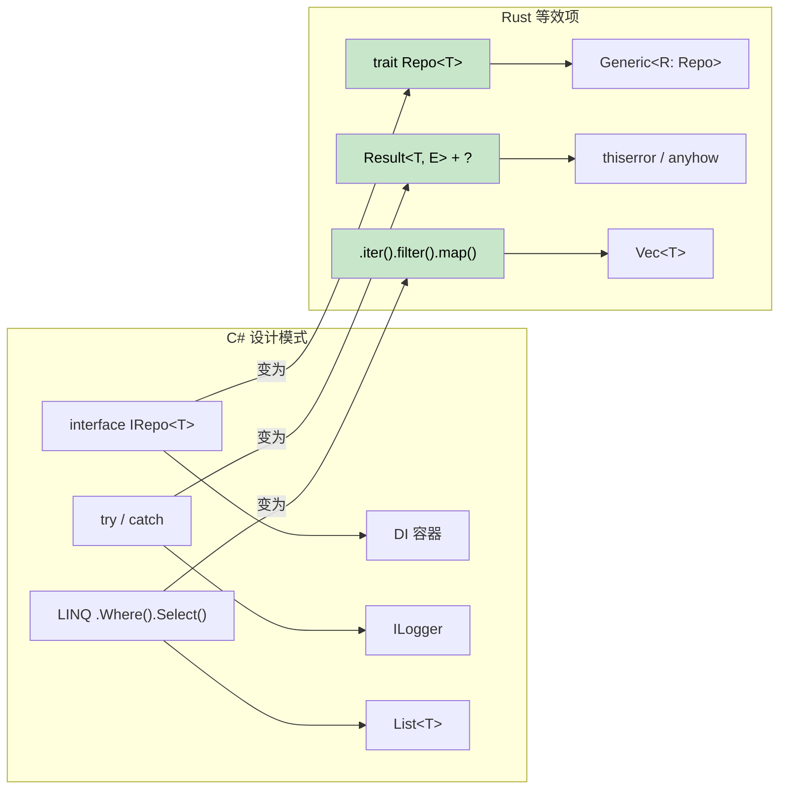

[English Original](../en/ch15-migration-patterns-and-case-studies.md)

## Rust 中的常用 C# 设计模式对照

> **你将学到：** 如何将 C# 中的仓储模式 (Repository)、构建器模式 (Builder)、依赖注入 (DI)、LINQ 链、Entity Framework 查询以及配置模式转换为惯用的 Rust 代码。
>
> **难度：** 🟡 中级



### 仓储模式 (Repository Pattern)
```csharp
// C# 仓储模式
public interface IRepository<T> where T : IEntity
{
    Task<T> GetByIdAsync(int id);
    Task<IEnumerable<T>> GetAllAsync();
    Task<T> AddAsync(T entity);
    Task UpdateAsync(T entity);
    Task DeleteAsync(int id);
}

public class UserRepository : IRepository<User>
{
    private readonly DbContext _context;
    
    public UserRepository(DbContext context)
    {
        _context = context;
    }
    
    public async Task<User> GetByIdAsync(int id)
    {
        return await _context.Users.FindAsync(id);
    }
    
    // ... 其他实现
}
```

```rust
// 使用 Trait 和泛型实现的 Rust 仓储模式
use async_trait::async_trait;
use std::fmt::Debug;

#[async_trait]
pub trait Repository<T, E> 
where 
    T: Clone + Debug + Send + Sync,
    E: std::error::Error + Send + Sync,
{
    async fn get_by_id(&self, id: u64) -> Result<Option<T>, E>;
    async fn get_all(&self) -> Result<Vec<T>, E>;
    async fn add(&self, entity: T) -> Result<T, E>;
    async fn update(&self, entity: T) -> Result<T, E>;
    async fn delete(&self, id: u64) -> Result<(), E>;
}

#[derive(Debug, Clone)]
pub struct User {
    pub id: u64,
    pub name: String,
    pub email: String,
}

#[derive(Debug)]
pub enum RepositoryError {
    NotFound(u64),
    DatabaseError(String),
    ValidationError(String),
}

impl std::fmt::Display for RepositoryError {
    fn fmt(&self, f: &mut std::fmt::Formatter<'_>) -> std::fmt::Result {
        match self {
            RepositoryError::NotFound(id) => write!(f, "未找到 ID 为 {} 的实体", id),
            RepositoryError::DatabaseError(msg) => write!(f, "数据库错误: {}", msg),
            RepositoryError::ValidationError(msg) => write!(f, "验证错误: {}", msg),
        }
    }
}

impl std::error::Error for RepositoryError {}

pub struct UserRepository {
    // 数据库连接池等
}

#[async_trait]
impl Repository<User, RepositoryError> for UserRepository {
    async fn get_by_id(&self, id: u64) -> Result<Option<User>, RepositoryError> {
        // 模拟数据库查询
        if id == 0 {
            return Ok(None);
        }
        
        Ok(Some(User {
            id,
            name: format!("用户 {}", id),
            email: format!("user{}@example.com", id),
        }))
    }
    
    async fn get_all(&self) -> Result<Vec<User>, RepositoryError> {
        // 逻辑实现过程
        Ok(vec![])
    }
    
    async fn add(&self, entity: User) -> Result<User, RepositoryError> {
        // 验证与数据库插入
        if entity.name.is_empty() {
            return Err(RepositoryError::ValidationError("名称不能为空".to_string()));
        }
        Ok(entity)
    }
    
    async fn update(&self, entity: User) -> Result<User, RepositoryError> {
        // 逻辑实现过程
        Ok(entity)
    }
    
    async fn delete(&self, id: u64) -> Result<(), RepositoryError> {
        // 逻辑实现过程
        Ok(())
    }
}
```

### 构建器模式 (Builder Pattern)
```csharp
// C# 构建器模式 (流式接口)
public class HttpClientBuilder
{
    private TimeSpan? _timeout;
    private string _baseAddress;
    private Dictionary<string, string> _headers = new();
    
    public HttpClientBuilder WithTimeout(TimeSpan timeout)
    {
        _timeout = timeout;
        return this;
    }
    
    public HttpClientBuilder WithBaseAddress(string baseAddress)
    {
        _baseAddress = baseAddress;
        return this;
    }
    
    public HttpClientBuilder WithHeader(string name, string value)
    {
        _headers[name] = value;
        return this;
    }
    
    public HttpClient Build()
    {
        var client = new HttpClient();
        if (_timeout.HasValue)
            client.Timeout = _timeout.Value;
        if (!string.IsNullOrEmpty(_baseAddress))
            client.BaseAddress = new Uri(_baseAddress);
        foreach (var header in _headers)
            client.DefaultRequestHeaders.Add(header.Key, header.Value);
        return client;
    }
}

// 用法
var client = new HttpClientBuilder()
    .WithTimeout(TimeSpan.FromSeconds(30))
    .WithBaseAddress("https://api.example.com")
    .WithHeader("Accept", "application/json")
    .Build();
```

```rust
// Rust 构建器模式 (消耗式构建器)
use std::collections::HashMap;
use std::time::Duration;

#[derive(Debug)]
pub struct HttpClient {
    timeout: Duration,
    base_address: String,
    headers: HashMap<String, String>,
}

pub struct HttpClientBuilder {
    timeout: Option<Duration>,
    base_address: Option<String>,
    headers: HashMap<String, String>,
}

impl HttpClientBuilder {
    pub fn new() -> Self {
        HttpClientBuilder {
            timeout: None,
            base_address: None,
            headers: HashMap::new(),
        }
    }
    
    pub fn with_timeout(mut self, timeout: Duration) -> Self {
        self.timeout = Some(timeout);
        self
    }
    
    pub fn with_base_address<S: Into<String>>(mut self, base_address: S) -> Self {
        self.base_address = Some(base_address.into());
        self
    }
    
    pub fn with_header<K: Into<String>, V: Into<String>>(mut self, name: K, value: V) -> Self {
        self.headers.insert(name.into(), value.into());
        self
    }
    
    pub fn build(self) -> Result<HttpClient, String> {
        let base_address = self.base_address.ok_or("基础地址必填")?;
        
        Ok(HttpClient {
            timeout: self.timeout.unwrap_or(Duration::from_secs(30)),
            base_address,
            headers: self.headers,
        })
    }
}

// 用法
let client = HttpClientBuilder::new()
    .with_timeout(Duration::from_secs(30))
    .with_base_address("https://api.example.com")
    .with_header("Accept", "application/json")
    .build()?;

// 进阶：为常见场景实现 Default 特性
impl Default for HttpClientBuilder {
    fn default() -> Self {
        Self::new()
    }
}
```

---

## C# 与 Rust 的概念映射

### 依赖注入 (DI) → 构造函数注入 + Trait
```csharp
// 带有 DI 容器的 C#
services.AddScoped<IUserRepository, UserRepository>();
services.AddScoped<IUserService, UserService>();

public class UserService
{
    private readonly IUserRepository _repository;
    
    public UserService(IUserRepository repository)
    {
        _repository = repository;
    }
}
```

```rust
// Rust：通过 Trait 实现的构造函数注入
pub trait UserRepository {
    async fn find_by_id(&self, id: Uuid) -> Result<Option<User>, Error>;
    async fn save(&self, user: &User) -> Result<(), Error>;
}

pub struct UserService<R> 
where 
    R: UserRepository,
{
    repository: R,
}

impl<R> UserService<R> 
where 
    R: UserRepository,
{
    pub fn new(repository: R) -> Self {
        Self { repository }
    }
    
    pub async fn get_user(&self, id: Uuid) -> Result<Option<User>, Error> {
        self.repository.find_by_id(id).await
    }
}

// 用法
let repository = PostgresUserRepository::new(pool);
let service = UserService::new(repository);
```

### LINQ → 迭代器链 (Iterator Chains)
```csharp
// C# LINQ
var result = users
    .Where(u => u.Age > 18)
    .Select(u => u.Name.ToUpper())
    .OrderBy(name => name)
    .Take(10)
    .ToList();
```

```rust
// Rust：迭代器链 (零成本抽象！)
let mut result: Vec<String> = users
    .iter()
    .filter(|u| u.age > 18)
    .map(|u| u.name.to_uppercase())
    .collect();
result.sort();
result.truncate(10);

// 或者通过 itertools crate 实现更接近 LINQ 的链式调用
use itertools::Itertools;

let result: Vec<String> = users
    .iter()
    .filter(|u| u.age > 18)
    .map(|u| u.name.to_uppercase())
    .sorted()
    .take(10)
    .collect();
```

### Entity Framework → SQLx + 迁移工具
```csharp
// C# Entity Framework
public class ApplicationDbContext : DbContext
{
    public DbSet<User> Users { get; set; }
}

var user = await context.Users
    .Where(u => u.Email == email)
    .FirstOrDefaultAsync();
```

```rust
// Rust：支持编译时 SQL 检查的 SQLx
use sqlx::{PgPool, FromRow};

#[derive(FromRow)]
struct User {
    id: Uuid,
    email: String,
    name: String,
}

// 编译时检查的查询
let user = sqlx::query_as!(
    User,
    "SELECT id, email, name FROM users WHERE email = $1",
    email
)
.fetch_optional(&pool)
.await?;

// 或者使用动态查询
let user = sqlx::query_as::<_, User>(
    "SELECT id, email, name FROM users WHERE email = $1"
)
.bind(email)
.fetch_optional(&pool)
.await?;
```

### 配置管理 → Config Crate
```csharp
// C# 配置管理
public class AppSettings
{
    public string DatabaseUrl { get; set; }
    public int Port { get; set; }
}

var config = builder.Configuration.Get<AppSettings>();
```

```rust
// Rust：配合 serde 使用的 Config
use config::{Config, ConfigError, Environment, File};
use serde::Deserialize;

#[derive(Debug, Deserialize)]
struct AppSettings {
    database_url: String,
    port: u16,
}

impl AppSettings {
    pub fn new() -> Result<Self, ConfigError> {
        let s = Config::builder()
            .add_source(File::with_name("config/default"))
            .add_source(Environment::with_prefix("APP"))
            .build()?;

        s.try_deserialize()
    }
}

// 用法
let settings = AppSettings::new()?;
```

---

## 案例研究

### 案例 1：CLI 工具迁移 (csvtool)

**背景**：某团队维护着一个 C# 控制台应用 (`CsvProcessor`)，用于读取大型 CSV 文件、执行转换并写入输出。处理 500 MB 的文件时，内存占用飙升至 4 GB，且 GC 停顿会导致 30 秒的卡顿。

**迁移方案**：用 2 周时间使用 Rust 完成重写，逐个模块替换。

| 步骤 | 变更内容 | C# → Rust |
|------|-------------|-----------|
| 1 | CSV 解析 | `CsvHelper` → `csv` crate (流式 `Reader`) |
| 2 | 数据模型 | `class Record` → `struct Record` (栈分配，`#[derive(Deserialize)]`) |
| 3 | 数据转换 | LINQ `.Select().Where()` → `.iter().map().filter()` |
| 4 | 文件 I/O | `StreamReader` → `BufReader<File>` (使用 `?` 进行错误传播) |
| 5 | 命令行参数 | `System.CommandLine` → 带有派生宏的 `clap` |
| 6 | 并行处理 | `Parallel.ForEach` → `rayon` 的 `.par_iter()` |

**结果**：
- 内存占用：4 GB → 12 MB (改为流式处理而非一次性加载全量文件)
- 处理速度：处理 500 MB 文件由 45s 缩短至 3s
- 二进制体积：单个 2 MB 可执行文件，无需运行时依赖

**关键教训**：最大的提升并非仅源于 Rust 本身，而是 Rust 的所有权模型“强制”采用了流式设计。在 C# 中，很容易不假思索地调用 `.ToList()` 将所有数据加载到内存，而 Rust 的借用检查器则会自然引导开发人员走向基于迭代器的处理方式。

### 案例 2：微服务替换 (auth-gateway)

**背景**：一个采用 C# ASP.NET Core 构建的身份验证网关，为 50 多个后端服务处理 JWT 验证和速率限制。在请求量达到 10K req/s 时，受 GC 峰值影响，p99 延迟达到了 200ms。

**迁移方案**：使用 `axum` + `tower` 替换为 Rust 服务，保持 API 契约完全一致。

```rust
// 迁移前 (C#):  services.AddAuthentication().AddJwtBearer(...)
// 迁移后 (Rust):  tower 中间件层

use axum::{Router, middleware};
use tower::ServiceBuilder;

let app = Router::new()
    .route("/api/*path", any(proxy_handler))
    .layer(
        ServiceBuilder::new()
            .layer(middleware::from_fn(validate_jwt))
            .layer(middleware::from_fn(rate_limit))
    );
```

| 指标 | C# (ASP.NET Core) | Rust (axum) |
|--------|-------------------|-------------|
| p50 延迟 | 5ms | 0.8ms |
| p99 延迟 | 200ms (GC 峰值) | 4ms |
| 内存占用 | 300 MB | 8 MB |
| Docker 镜像体积 | 210 MB (含 .NET 运行时) | 12 MB (静态二进制文件) |
| 冷启动时间 | 2.1s | 0.05s |

**关键教训**：
1. **保持 API 契约的一致性** —— 无需对客户端进行任何更改，Rust 服务实现了无缝替换。
2. **从核心路径入手** —— JWT 验证是瓶颈所在。仅迁移这一个中间件逻辑就能获得 80% 的收益。
3. **利用 `tower` 中间件** —— 它的设计镜像了 ASP.NET Core 的中间件管道模式，因此 C# 开发者会觉得 Rust 架构非常亲切。
4. **p99 延迟的显著改善** 源于消除了 GC 停顿，而不仅仅是代码执行速度的提升 —— Rust 的稳态吞吐量仅快了 2 倍，但由于没有 GC，长尾延迟变得非常可预测。

---

## 练习

<details>
<summary><strong>🏋️ 练习：迁移一个 C# 服务</strong> (点击展开)</summary>

将这段 C# 服务代码翻译为惯用的 Rust 代码：

```csharp
public interface IUserService
{
    Task<User?> GetByIdAsync(int id);
    Task<List<User>> SearchAsync(string query);
}

public class UserService : IUserService
{
    private readonly IDatabase _db;
    public UserService(IDatabase db) { _db = db; }

    public async Task<User?> GetByIdAsync(int id)
    {
        try { return await _db.QuerySingleAsync<User>(id); }
        catch (NotFoundException) { return null; }
    }

    public async Task<List<User>> SearchAsync(string query)
    {
        return await _db.QueryAsync<User>($"SELECT * WHERE name LIKE '%{query}%'");
    }
}
```

**提示**：使用 Trait，使用 `Option<User>` 替代 null，使用 `Result` 替代 try/catch，并修复 SQL 注入漏洞。

<details>
<summary>🔑 参考答案</summary>

```rust
use async_trait::async_trait;

#[derive(Debug, Clone)]
struct User { id: i64, name: String }

#[async_trait]
trait Database: Send + Sync {
    async fn get_user(&self, id: i64) -> Result<Option<User>, sqlx::Error>;
    async fn search_users(&self, query: &str) -> Result<Vec<User>, sqlx::Error>;
}

#[async_trait]
trait UserService: Send + Sync {
    async fn get_by_id(&self, id: i64) -> Result<Option<User>, AppError>;
    async fn search(&self, query: &str) -> Result<Vec<User>, AppError>;
}

struct UserServiceImpl<D: Database> {
    db: D,  // 无需 Arc —— Rust 的所有权体系会自动处理
}

#[async_trait]
impl<D: Database> UserService for UserServiceImpl<D> {
    async fn get_by_id(&self, id: i64) -> Result<Option<User>, AppError> {
        // 使用 Option 替代 null；使用 Result 替代 try/catch
        Ok(self.db.get_user(id).await?)
    }

    async fn search(&self, query: &str) -> Result<Vec<User>, AppError> {
        // 使用参数化查询 —— 杜绝 SQL 注入！
        // (sqlx 使用 $1 占位符，而不是字符串插值)
        self.db.search_users(query).await.map_err(Into::into)
    }
}
```

**对比 C# 的关键变化**：
- `null` → `Option<User>` (编译时 null 安全)
- `try/catch` → `Result` + `?` (显式的错误传播)
- 修复了 SQL 注入：采用参数化查询，而非字符串插值
- `IDatabase _db` → 泛型 `D: Database` (静态分发，无装箱开销)

</details>
</details>
