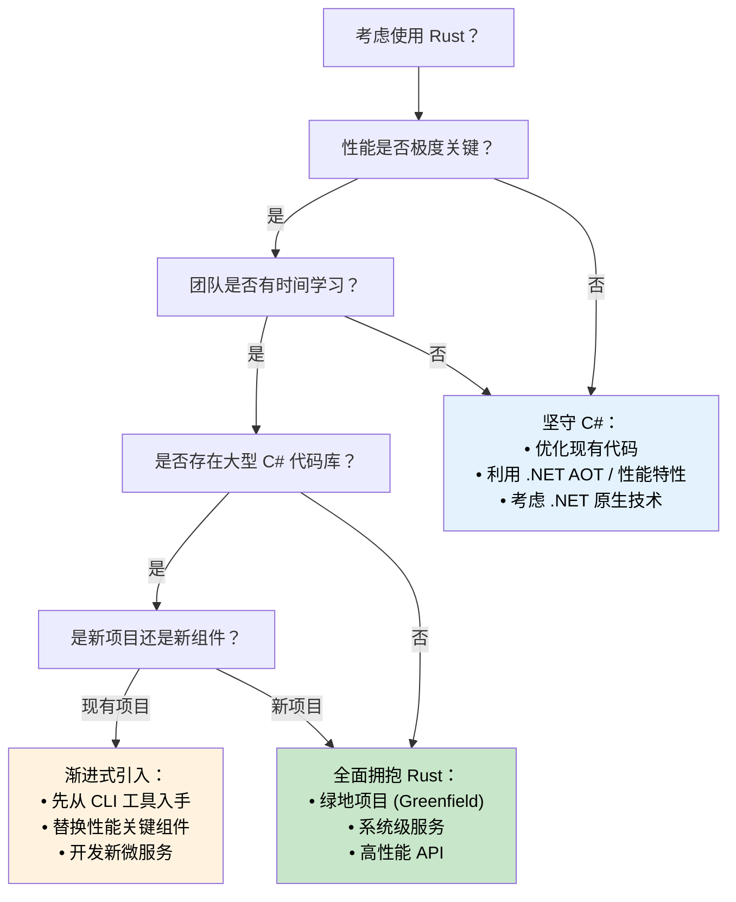

[English Original](../en/ch16-1-performance-comparison-and-migration.md)

## 性能对比：托管代码 vs 原生代码

> **你将学到：** C# 与 Rust 在现实场景中的性能差异 —— 启动时间、内存占用、吞吐量基准测试、CPU 密集型负载，以及决定何时迁移、何时坚守 C# 的决策树。
>
> **难度：** 🟡 中级

### 现实场景下的性能特性

| **维度** | **C# (.NET)** | **Rust** | **性能影响** |
|------------|---------------|----------|------------------------|
| **启动时间** | 100-500ms (JIT); 5-30ms (.NET 8 AOT) | 1-10ms (原生二进制) | 🚀 **快 10-50 倍** (对比 JIT) |
| **内存占用** | +30-100% (GC 开销 + 元数据) | 基准水平 (极简运行时) | 💾 **节省 30-50% RAM** |
| **GC 停顿** | 1-100ms 周期性停顿 | 无 (没有 GC) | ⚡ **极具一致性的延迟** |
| **CPU 占用** | +10-20% (GC + JIT 开销) | 基准水平 (直接执行) | 🔋 **能效比提升 10-20%** |
| **二进制体积** | 30-200MB (含运行时); 10-30MB (AOT 裁剪) | 1-20MB (静态二进制) | 📦 **分发体积更小** |
| **内存安全** | 运行时检查 | 编译时证明 | 🛡️ **零开销的安全性** |
| **并发性能** | 良好 (需谨慎同步) | 优秀 (无畏并发) | 🏃 **卓越的可扩展性** |

> **关于 .NET 8+ AOT 的说明**：原生 AOT 编译显著缩小了启动时间的差距 (5-30ms)。但在吞吐量和内存方面，GC 的开销和停顿依然存在。在评估迁移时，请针对你的*特定负载*进行基准测试 —— 标题数字有时会产生误导。

### 基准测试示例

```csharp
// C# - JSON 处理基准测试
public class JsonProcessor
{
    public async Task<List<User>> ProcessJsonFile(string path)
    {
        var json = await File.ReadAllTextAsync(path);
        var users = JsonSerializer.Deserialize<List<User>>(json);
        
        return users.Where(u => u.Age > 18)
                   .OrderBy(u => u.Name)
                   .Take(1000)
                   .ToList();
    }
}

// 典型表现：处理 100MB 文件约耗时 ~200ms
// 内存占用：峰值约 ~500MB (受 GC 影响)
// 二进制体积：约 ~80MB (独立分发模式)
```

```rust
// Rust - 等效的 JSON 处理
use serde::{Deserialize, Serialize};
use tokio::fs;

#[derive(Deserialize, Serialize)]
struct User {
    name: String,
    age: u32,
}

pub async fn process_json_file(path: &str) -> Result<Vec<User>, Box<dyn std::error::Error>> {
    let json = fs::read_to_string(path).await?;
    let mut users: Vec<User> = serde_json::from_str(&json)?;
    
    users.retain(|u| u.age > 18);
    users.sort_by(|a, b| a.name.cmp(&b.name));
    users.truncate(1000);
    
    Ok(users)
}

// 典型表现：处理同样的 100MB 文件约耗时 ~120ms
// 内存占用：峰值约 ~200MB (无 GC 开销)
// 二进制体积：约 ~8MB (静态二进制文件)
```

### CPU 密集型工作负载

```csharp
// C# - 数学计算 (Mandelbrot 集合)
public class Mandelbrot
{
    public static int[,] Generate(int width, int height, int maxIterations)
    {
        var result = new int[height, width];
        
        Parallel.For(0, height, y =>
        {
            for (int x = 0; x < width; x++)
            {
                var c = new Complex(
                    (x - width / 2.0) * 4.0 / width,
                    (y - height / 2.0) * 4.0 / height);
                
                result[y, x] = CalculateIterations(c, maxIterations);
            }
        });
        
        return result;
    }
}

// 性能：约 2.3 秒 (8 核机器)
// 内存：约 500MB
```

```rust
// Rust - 使用 Rayon 进行相同的计算
use rayon::prelude::*;
use num_complex::Complex;

pub fn generate_mandelbrot(width: usize, height: usize, max_iterations: u32) -> Vec<Vec<u32>> {
    (0..height)
        .into_par_iter()
        .map(|y| {
            (0..width)
                .map(|x| {
                    let c = Complex::new(
                        (x as f64 - width as f64 / 2.0) * 4.0 / width as f64,
                        (y as f64 - height as f64 / 2.0) * 4.0 / height as f64,
                    );
                    calculate_iterations(c, max_iterations)
                })
                .collect()
        })
        .collect()
}

// 性能：约 1.1 秒 (同样的 8 核机器)  
// 内存：约 200MB
// 速度快了 2 倍，且内存节省了 60%
```

### 如何选择编程语言

**在以下情况下选择 C#：**
- **开发效率至关重要** —— 拥有极其丰富的工具生态系统。
- **团队深耕于 .NET** —— 利用现有的知识储备和技能。
- **企业级服务集成** —— 大量使用微软生态系统。
- **性能需求中等** —— 现有的性能表现已足够。
- **富客户端应用** —— 开发 WPF, WinUI, Blazor 等应用。
- **原型设计与 MVP** —— 追求极速上线。

**在以下情况下选择 Rust：**
- **性能极度关键** —— CPU 或内存密集型应用。
- **资源受限环境** —— 嵌入式、边缘计算、Serverless 场景。
- **常驻后端服务** —— 如高性能 Web 服务器、数据库、系统服务。
- **系统级编程** —— OS 组件、驱动程序、网络专用工具。
- **高可靠性要求** —— 金融系统、安全关键型应用。
- **高并发/并行工作负载** —— 需要高吞吐量的数据处理。

### 迁移策略决策树



---
