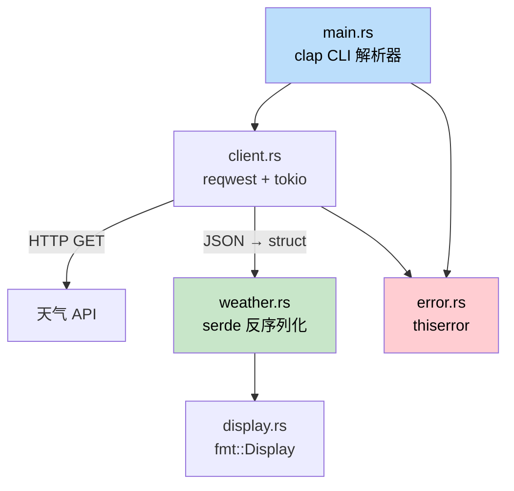

[English Original](../en/ch17-capstone-project.md)

## 项目实战：构建命令行天气工具

> **你将学到：** 如何将本书学到的所有知识 —— 结构体、特性 (Traits)、错误处理、异步编程、模块、serde 以及命令行参数解析 —— 组合成一个完整的 Rust 应用。这个项目镜像了 C# 开发者使用 `HttpClient`, `System.Text.Json` 和 `System.CommandLine` 构建工具的过程。
>
> **难度：** 🟡 中级

这个实战项目汇聚了本书各章节的核心概念。你将构建一个名为 `weather-cli` 的命令行工具，它从 API 获取天气数据并将其展示出来。该项目被组织为一个规范的小型 Crate，拥有合理的模块布局、错误类型以及测试用例。

### 项目概览



**你将构建出的效果：**
```
$ weather-cli --city "Seattle"
🌧  Seattle: 12°C, Overcast clouds
    Humidity: 82%  Wind: 5.4 m/s
```

**运用的核心概念：**
| 本书章节 | 本项目中对应的概念 |
|---|---|
| 第 5 章 (结构体) | `WeatherReport`, `Config` 数据类型 |
| 第 8 章 (模块) | `src/lib.rs`, `src/client.rs`, `src/display.rs` |
| 第 9 章 (错误) | 使用 `thiserror` 定义的自定义 `WeatherError` |
| 第 10 章 (特性) | 实现 `Display` 特性以进行格式化输出 |
| 第 11 章 (数据转换) | 通过 `serde` 进行 JSON 反序列化 |
| 第 12 章 (迭代器) | 处理来自 API 响应的数组数据 |
| 第 13 章 (异步) | 使用 `reqwest` + `tokio` 发起 HTTP 请求 |
| 第 14 章 (测试) | 单元测试 + 集成测试 |

---

### 第一步：创建项目

```bash
cargo new weather-cli
cd weather-cli
```

在 `Cargo.toml` 中添加依赖项：
```toml
[package]
name = "weather-cli"
version = "0.1.0"
edition = "2021"

[dependencies]
clap = { version = "4", features = ["derive"] }   # 命令行参数 (类似于 System.CommandLine)
reqwest = { version = "0.12", features = ["json"] } # HTTP 客户端 (类似于 HttpClient)
serde = { version = "1", features = ["derive"] }    # 序列化 (类似于 System.Text.Json)
serde_json = "1"
thiserror = "2"                                      # 错误类型定义
tokio = { version = "1", features = ["full"] }       # 异步运行时
```

```csharp
// C# 中对应的依赖项：
// dotnet add package System.CommandLine
// dotnet add package System.Net.Http.Json
// (System.Text.Json 和 HttpClient 是内置的)
```

### 第二步：定义数据类型

创建 `src/weather.rs` ：
```rust
use serde::Deserialize;

/// 原始 API 响应 (匹配 JSON 结构)
#[derive(Deserialize, Debug)]
pub struct ApiResponse {
    pub main: MainData,
    pub weather: Vec<WeatherCondition>,
    pub wind: WindData,
    pub name: String,
}

#[derive(Deserialize, Debug)]
pub struct MainData {
    pub temp: f64,
    pub humidity: u32,
}

#[derive(Deserialize, Debug)]
pub struct WeatherCondition {
    pub description: String,
    pub icon: String,
}

#[derive(Deserialize, Debug)]
pub struct WindData {
    pub speed: f64,
}

/// 我们的领域模型 (纯净的，与 API 解耦)
#[derive(Debug, Clone)]
pub struct WeatherReport {
    pub city: String,
    pub temp_celsius: f64,
    pub description: String,
    pub humidity: u32,
    pub wind_speed: f64,
}

impl From<ApiResponse> for WeatherReport {
    fn from(api: ApiResponse) -> Self {
        let description = api.weather
            .first()
            .map(|w| w.description.clone())
            .unwrap_or_else(|| "未知".to_string());

        WeatherReport {
            city: api.name,
            temp_celsius: api.main.temp,
            description,
            humidity: api.main.humidity,
            wind_speed: api.wind.speed,
        }
    }
}
```

```csharp
// C# 等效写法：
// public record ApiResponse(MainData Main, List<WeatherCondition> Weather, ...);
// public record WeatherReport(string City, double TempCelsius, ...);
// 手动进行映射或者使用 AutoMapper
```

**关键区别**：Rust 中使用 `#[derive(Deserialize)]` + `From` 特性实现来替代 C# 的 `JsonSerializer.Deserialize<T>()` + AutoMapper。在 Rust 中这两者都是在编译时完成的，无需反射。

### 第三步：定义错误类型

创建 `src/error.rs` ：
```rust
use thiserror::Error;

#[derive(Error, Debug)]
pub enum WeatherError {
    #[error("HTTP 请求失败: {0}")]
    Http(#[from] reqwest::Error),

    #[error("未找到城市: {0}")]
    CityNotFound(String),

    #[error("未设置 API Key —— 请运行 export WEATHER_API_KEY")]
    MissingApiKey,
}

pub type Result<T> = std::result::Result<T, WeatherError>;
```

### 第四步：构建 HTTP 客户端

创建 `src/client.rs` ：
```rust
use crate::error::{WeatherError, Result};
use crate::weather::{ApiResponse, WeatherReport};

pub struct WeatherClient {
    api_key: String,
    http: reqwest::Client,
}

impl WeatherClient {
    pub fn new(api_key: String) -> Self {
        WeatherClient {
            api_key,
            http: reqwest::Client::new(),
        }
    }

    pub async fn get_weather(&self, city: &str) -> Result<WeatherReport> {
        let url = format!(
            "https://api.openweathermap.org/data/2.5/weather?q={}&appid={}&units=metric",
            city, self.api_key
        );

        let response = self.http.get(&url).send().await?;

        if response.status() == reqwest::StatusCode::NOT_FOUND {
            return Err(WeatherError::CityNotFound(city.to_string()));
        }

        let api_data: ApiResponse = response.json().await?;
        Ok(WeatherReport::from(api_data))
    }
}
```

```csharp
// C# 等效写法：
// var response = await _httpClient.GetAsync(url);
// if (response.StatusCode == HttpStatusCode.NotFound)
//     throw new CityNotFoundException(city);
// var data = await response.Content.ReadFromJsonAsync<ApiResponse>();
```

**关键区别**：
- 使用 `?` 运算符替代 `try/catch` —— 错误通过 `Result` 自动向上游传播。
- `WeatherReport::from(api_data)` 使用 `From` 特性而非 AutoMapper。
- 无须 `IHttpClientFactory` —— `reqwest::Client` 内部会自动处理连接池。

### 第五步：格式化展示内容

创建 `src/display.rs` ：
```rust
use std::fmt;
use crate::weather::WeatherReport;

impl fmt::Display for WeatherReport {
    fn fmt(&self, f: &mut fmt::Formatter<'_>) -> fmt::Result {
        let icon = weather_icon(&self.description);
        writeln!(f, "{}  {}: {:.0}°C, {}",
            icon, self.city, self.temp_celsius, self.description)?;
        write!(f, "    湿度: {}%  风速: {:.1} m/s",
            self.humidity, self.wind_speed)
    }
}

fn weather_icon(description: &str) -> &str {
    let desc = description.to_lowercase();
    if desc.contains("clear") { "☀️" }
    else if desc.contains("cloud") { "☁️" }
    else if desc.contains("rain") || desc.contains("drizzle") { "🌧" }
    else if desc.contains("snow") { "❄️" }
    else if desc.contains("thunder") { "⛈" }
    else { "🌡" }
}
```

### 第六步：将所有模块连接起来

`src/lib.rs` ：
```rust
pub mod client;
pub mod display;
pub mod error;
pub mod weather;
```

`src/main.rs` ：
```rust
use clap::Parser;
use weather_cli::{client::WeatherClient, error::WeatherError};

#[derive(Parser)]
#[command(name = "weather-cli", about = "在命令行中获取天气信息")]
struct Cli {
    /// 欲查询的城市名称
    #[arg(short, long)]
    city: String,
}

#[tokio::main]
async fn main() {
    let cli = Cli::parse();

    let api_key = match std::env::var("WEATHER_API_KEY") {
        Ok(key) => key,
        Err(_) => {
            eprintln!("错误: {}", WeatherError::MissingApiKey);
            std::process::exit(1);
        }
    };

    let client = WeatherClient::new(api_key);

    match client.get_weather(&cli.city).await {
        Ok(report) => println!("{report}"),
        Err(WeatherError::CityNotFound(city)) => {
            eprintln!("未找到城市: {city}");
            std::process::exit(1);
        }
        Err(e) => {
            eprintln!("错误: {e}");
            std::process::exit(1);
        }
    }
}
```

### 第七步：编写测试

```rust
// 可以在 src/weather.rs 或 tests/weather_test.rs 中编写
#[cfg(test)]
mod tests {
    use super::*;

    fn sample_api_response() -> ApiResponse {
        serde_json::from_str(r#"{
            "main": {"temp": 12.3, "humidity": 82},
            "weather": [{"description": "overcast clouds", "icon": "04d"}],
            "wind": {"speed": 5.4},
            "name": "Seattle"
        }"#).unwrap()
    }

    #[test]
    fn api_response_to_weather_report() {
        let report = WeatherReport::from(sample_api_response());
        assert_eq!(report.city, "Seattle");
        assert!((report.temp_celsius - 12.3).abs() < 0.01);
        assert_eq!(report.description, "overcast clouds");
    }

    #[test]
    fn display_format_includes_icon() {
        let report = WeatherReport {
            city: "Test".into(),
            temp_celsius: 20.0,
            description: "clear sky".into(),
            humidity: 50,
            wind_speed: 3.0,
        };
        let output = format!("{report}");
        assert!(output.contains("☀️"));
        assert!(output.contains("20°C"));
    }

    #[test]
    fn empty_weather_array_defaults_to_unknown() {
        let json = r#"{
            "main": {"temp": 0.0, "humidity": 0},
            "weather": [],
            "wind": {"speed": 0.0},
            "name": "Nowhere"
        }"#;
        let api: ApiResponse = serde_json::from_str(json).unwrap();
        let report = WeatherReport::from(api);
        assert_eq!(report.description, "未知");
    }
}
```

---

### 应用最终的文件布局

```
weather-cli/
├── Cargo.toml
├── src/
│   ├── main.rs        # CLI 入口 (clap)
│   ├── lib.rs         # 模块声明
│   ├── client.rs      # HTTP 客户端 (reqwest + tokio)
│   ├── weather.rs     # 数据类型 + From 实现 + 测试
│   ├── display.rs     # 展示格式化
│   └── error.rs       # WeatherError 定义 + Result 别名
└── tests/
    └── integration.rs # 集成测试
```

对比 C# 的等效布局：
```
WeatherCli/
├── WeatherCli.csproj
├── Program.cs
├── Services/
│   └── WeatherClient.cs
├── Models/
│   ├── ApiResponse.cs
│   └── WeatherReport.cs
└── Tests/
    └── WeatherTests.cs
```

**Rust 版本的结构与 C# 非常相似**。主要的区别在于：
- 使用 `mod` 声明而非命名空间 (Namespaces)。
- 使用 `Result<T, E>` 而非异常。
- 使用 `From` 特性而非 AutoMapper。
- 显式使用 `#[tokio::main]` 而非内置的异步运行时。

### 扩展：集成测试存根

创建 `tests/integration.rs` 以便在不请求真实服务器的情况下测试公有 API ：

```rust
// tests/integration.rs
use weather_cli::weather::WeatherReport;

#[test]
fn weather_report_display_roundtrip() {
    let report = WeatherReport {
        city: "Seattle".into(),
        temp_celsius: 12.3,
        description: "overcast clouds".into(),
        humidity: 82,
        wind_speed: 5.4,
    };

    let output = format!("{report}");
    assert!(output.contains("Seattle"));
    assert!(output.contains("12°C"));
    assert!(output.contains("82%"));
}
```

使用 `cargo test` 运行测试 —— Rust 会自动发现 `src/`（带有 `#[cfg(test)]` 的模块）和 `tests/`（集成测试）中的所有测试用例。无需配置专门的测试框架 —— 对比 C# 中设置 xUnit/NUnit 的过程，你会发现 Rust 非常简洁。

---

### 进阶挑战

项目跑通后，尝试以下挑战来深化你的技能：

1. **添加缓存功能** —— 将最后一次 API 响应存储到文件中。启动时，检查文件内容是否创建于 10 分钟内，如果是则跳过 HTTP 请求。这将练习到 `std::fs`, `serde_json::to_writer` 以及 `SystemTime`。

2. **支持多个城市** —— 允许通过 `--city "Seattle,Portland,Vancouver"` 传入多个城市，并使用 `tokio::join!` 同时获取它们的数据。这将练习到异步并发。

3. **添加 `--format json` 标志** —— 使用 `serde_json::to_string_pretty` 将报告输出为 JSON 格式而非人类易读的文本。这将练习到条件化格式化展示和 `Serialize` 特性。

4. **编写完整的集成测试** —— 在 `tests/integration.rs` 中使用 `wiremock` 创建模拟 HTTP 服务器，对完整流程进行测试。这将练习到第 14 章中的 `tests/` 目录模式。
