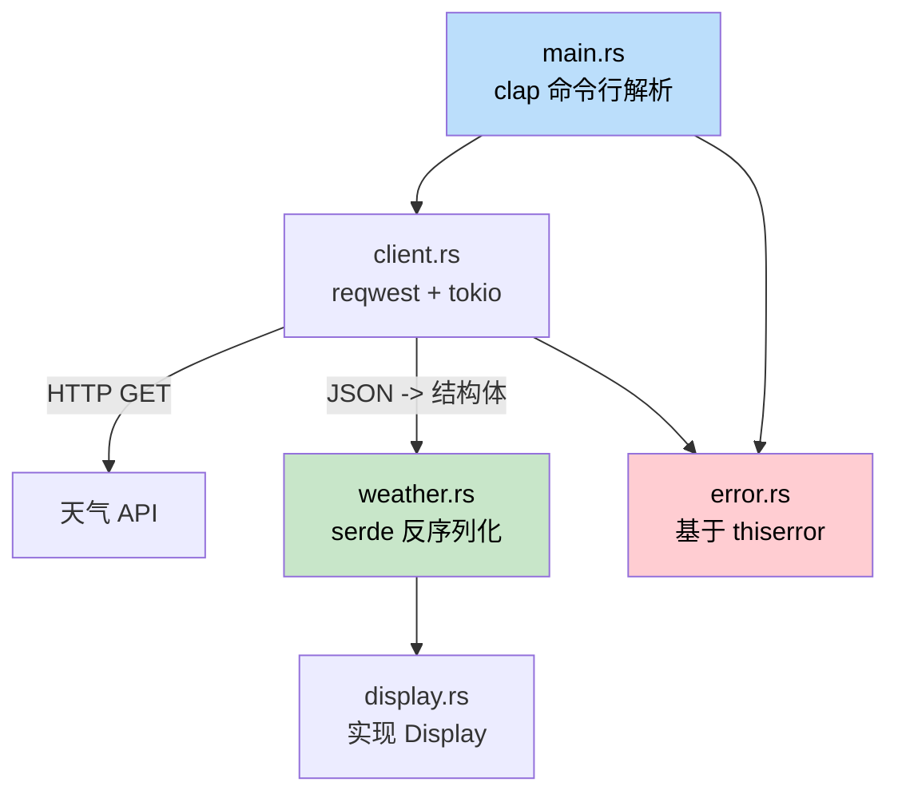

[English Original](../en/ch17-capstone-project.md)

## 综合项目：构建一个命令行天气工具

> **你将学到什么：** 如何把 struct、trait、错误处理、async、模块、serde 和命令行参数解析组合起来，做成一个真正可运行的 Rust 应用。这基本对应于 C# 开发者会用 `HttpClient`、`System.Text.Json` 和 `System.CommandLine` 构建的那类工具。
>
> **难度：** 中级

这个综合项目会把本书前面几乎所有重要概念串联起来。你将构建一个名为 `weather-cli` 的命令行工具，它会从天气 API 拉取数据并展示结果。整个项目会按照一个小型 crate 的方式组织，包含清晰的模块布局、错误类型和测试。

---

### 项目概览



**运行效果：**
```text
$ weather-cli --city "Seattle"
Seattle: 12 degC, Overcast clouds
    Humidity: 82%  Wind: 5.4 m/s
```

---

### 第 1 步：项目初始化

```bash
cargo new weather-cli
cd weather-cli
```

把依赖加入 `Cargo.toml`：
```toml
[dependencies]
clap = { version = "4", features = ["derive"] }
reqwest = { version = "0.12", features = ["json"] }
serde = { version = "1", features = ["derive"] }
serde_json = "1"
thiserror = "2"
tokio = { version = "1", features = ["full"] }
```

---

### 第 2 步：定义数据类型

```rust
use serde::Deserialize;

#[derive(Deserialize, Debug)]
pub struct ApiResponse {
    pub main: MainData,
    pub weather: Vec<WeatherCondition>,
    pub wind: WindData,
    pub name: String,
}

#[derive(Debug, Clone)]
pub struct WeatherReport {
    pub city: String,
    pub temp_celsius: f64,
    pub description: String,
}

impl From<ApiResponse> for WeatherReport {
    fn from(api: ApiResponse) -> Self {
        let description = api.weather.first()
            .map(|w| w.description.clone())
            .unwrap_or_else(|| "Unknown".to_string());

        WeatherReport {
            city: api.name,
            temp_celsius: api.main.temp,
            description,
        }
    }
}
```

---

### 与 C# 的对比总结

Rust 版本在结构上其实和 C# 被良好设计的应用非常接：
- 用 `mod` 声明代替命名空间。
- 用 `Result<T, E>` 替代异常。
- 使用 `From` trait 替代 AutoMapper。
- 使用显式的 `#[tokio::main]` 而不是隐式的 async 运行时。
