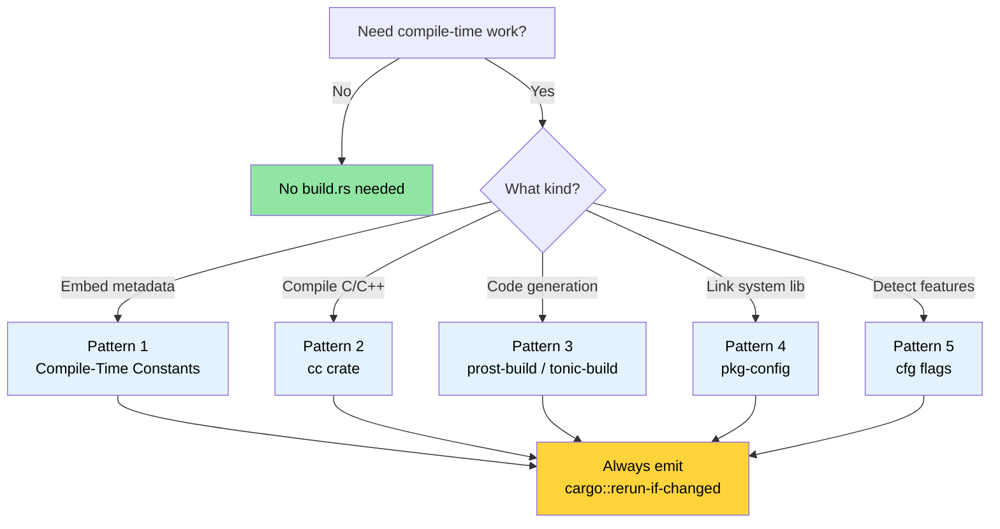

# Build Scripts — `build.rs` in Depth 🟢

> **What you'll learn:**
> - How `build.rs` fits into the Cargo build pipeline and when it runs
> - Five production patterns: compile-time constants, C/C++ compilation, protobuf codegen, `pkg-config` linking, and feature detection
> - Anti-patterns that slow builds or break cross-compilation
> - How to balance traceability with reproducible builds
>
> **Cross-references:** [Cross-Compilation](ch02-cross-compilation-one-source-many-target.md) uses build scripts for target-aware builds · [`no_std` & Features](ch09-no-std-and-feature-verification.md) extends `cfg` flags set here · [CI/CD Pipeline](ch11-putting-it-all-together-a-production-cic.md) orchestrates build scripts in automation

Every Cargo package can include a file named `build.rs` at the crate root.
Cargo compiles and executes this file *before* compiling your crate. The build
script communicates back to Cargo through `println!` instructions on stdout.

### What build.rs Is and When It Runs

```text
┌─────────────────────────────────────────────────────────┐
│                    Cargo Build Pipeline                  │
│                                                         │
│  1. Resolve dependencies                                │
│  2. Download crates                                     │
│  3. Compile build.rs  ← ordinary Rust, runs on HOST     │
│  4. Execute build.rs  ← stdout → Cargo instructions     │
│  5. Compile the crate (using instructions from step 4)  │
│  6. Link                                                │
└─────────────────────────────────────────────────────────┘
```

Key facts:
- `build.rs` runs on the **host** machine, not the target. During cross-compilation,
  the build script runs on your development machine even when the final binary targets
  a different architecture.
- The build script's scope is limited to its own package. It cannot affect how
  other crates compile — unless the package declares a `links` key in `Cargo.toml`,
  which enables passing metadata to dependent crates via
  `cargo::metadata=KEY=VALUE`.
- It runs **every time** Cargo detects a change — unless you emit `cargo::rerun-if-changed`
  instructions to limit re-runs.

> **Note (Rust 1.71+)**: Since Rust 1.71, Cargo fingerprints the compiled
> `build.rs` binary — if the binary is identical, it won't re-run even if
> source timestamps changed. However, `cargo::rerun-if-changed=build.rs` is
> still valuable: without *any* `rerun-if-changed` instruction, Cargo re-runs
> `build.rs` whenever **any file in the package** changes (not just `build.rs`).
> Emitting `cargo::rerun-if-changed=build.rs` limits re-runs to only when
> `build.rs` itself changes — a significant compile-time saving in large crates.
- It can emit *cfg flags*, *environment variables*, *linker arguments*, and
  *file paths* that the main crate consumes.

The minimal `Cargo.toml` entry:

```toml
[package]
name = "my-crate"
version = "0.1.0"
edition = "2021"
build = "build.rs"       # default — Cargo looks for build.rs automatically
# build = "src/build.rs" # or put it elsewhere
```

### The Cargo Instruction Protocol

Your build script communicates with Cargo by printing instructions to stdout.
Since Rust 1.77, the preferred prefix is `cargo::` (replacing the older
`cargo:` single-colon form).

| Instruction | Purpose |
|-------------|---------|
| `cargo::rerun-if-changed=PATH` | Only re-run build.rs when PATH changes |
| `cargo::rerun-if-env-changed=VAR` | Only re-run when environment variable VAR changes |
| `cargo::rustc-link-lib=NAME` | Link against native library NAME |
| `cargo::rustc-link-search=PATH` | Add PATH to the library search path |
| `cargo::rustc-cfg=KEY` | Set a `#[cfg(KEY)]` flag for conditional compilation |
| `cargo::rustc-cfg=KEY="VALUE"` | Set a `#[cfg(KEY = "VALUE")]` flag |
| `cargo::rustc-env=KEY=VALUE` | Set an environment variable accessible via `env!()` |
| `cargo::rustc-cdylib-link-arg=FLAG` | Pass FLAG to the linker for cdylib targets |
| `cargo::warning=MESSAGE` | Display a warning during compilation |
| `cargo::metadata=KEY=VALUE` | Store metadata readable by dependent crates |

```rust
// build.rs — minimal example
fn main() {
    // Only re-run if build.rs itself changes
    println!("cargo::rerun-if-changed=build.rs");

    // Set a compile-time environment variable
    let timestamp = std::time::SystemTime::now()
        .duration_since(std::time::UNIX_EPOCH)
        .map(|d| d.as_secs().to_string())
        .unwrap_or_else(|_| "0".into());
    println!("cargo::rustc-env=BUILD_TIMESTAMP={timestamp}");
}
```

### Pattern 1: Compile-Time Constants

The most common use case: baking build metadata into the binary so you can
report it at runtime (git hash, build date, CI job ID).

```rust
// build.rs
use std::process::Command;

fn main() {
    println!("cargo::rerun-if-changed=.git/HEAD");
    println!("cargo::rerun-if-changed=.git/refs");

    // Git commit hash
    let output = Command::new("git")
        .args(["rev-parse", "--short", "HEAD"])
        .output()
        .expect("git not found");
    let git_hash = String::from_utf8_lossy(&output.stdout).trim().to_string();
    println!("cargo::rustc-env=GIT_HASH={git_hash}");

    // Build profile (debug or release)
    let profile = std::env::var("PROFILE").unwrap_or_else(|_| "unknown".into());
    println!("cargo::rustc-env=BUILD_PROFILE={profile}");

    // Target triple
    let target = std::env::var("TARGET").unwrap_or_else(|_| "unknown".into());
    println!("cargo::rustc-env=BUILD_TARGET={target}");
}
```

```rust
// src/main.rs — consuming the build-time values
fn print_version() {
    println!(
        "{} {} (git:{} target:{} profile:{})",
        env!("CARGO_PKG_NAME"),
        env!("CARGO_PKG_VERSION"),
        env!("GIT_HASH"),
        env!("BUILD_TARGET"),
        env!("BUILD_PROFILE"),
    );
}
```

> **Built-in Cargo environment variables** you get for free, no build.rs needed:
> `CARGO_PKG_NAME`, `CARGO_PKG_VERSION`, `CARGO_PKG_AUTHORS`,
> `CARGO_PKG_DESCRIPTION`, `CARGO_MANIFEST_DIR`.
> See the [full list](https://doc.rust-lang.org/cargo/reference/environment-variables.html#environment-variables-cargo-sets-for-crates).

### Pattern 2: Compiling C/C++ Code with the `cc` Crate

When your Rust crate wraps a C library or needs a small C helper (common in
hardware interfaces), the [`cc`](https://docs.rs/cc) crate simplifies
compilation inside build.rs.

```toml
# Cargo.toml
[build-dependencies]
cc = "1.0"
```

```rust
// build.rs
fn main() {
    println!("cargo::rerun-if-changed=csrc/");

    cc::Build::new()
        .file("csrc/ipmi_raw.c")
        .file("csrc/smbios_parser.c")
        .include("csrc/include")
        .flag("-Wall")
        .flag("-Wextra")
        .opt_level(2)
        .compile("diag_helpers");
    // This produces libdiag_helpers.a and emits the right
    // cargo::rustc-link-lib and cargo::rustc-link-search instructions.
}
```

```rust
// src/lib.rs — FFI bindings to the compiled C code
extern "C" {
    fn ipmi_raw_command(
        netfn: u8,
        cmd: u8,
        data: *const u8,
        data_len: usize,
        response: *mut u8,
        response_len: *mut usize,
    ) -> i32;
}

/// Safe wrapper around the raw IPMI command interface.
/// Assumes: enum IpmiError { CommandFailed(i32), ... }
pub fn send_ipmi_command(netfn: u8, cmd: u8, data: &[u8]) -> Result<Vec<u8>, IpmiError> {
    let mut response = vec![0u8; 256];
    let mut response_len: usize = response.len();

    // SAFETY: response buffer is large enough and response_len is correctly initialized.
    let rc = unsafe {
        ipmi_raw_command(
            netfn,
            cmd,
            data.as_ptr(),
            data.len(),
            response.as_mut_ptr(),
            &mut response_len,
        )
    };

    if rc != 0 {
        return Err(IpmiError::CommandFailed(rc));
    }
    response.truncate(response_len);
    Ok(response)
}
```

For C++ code, use `.cpp(true)` and `.flag("-std=c++17")`:

```rust
// build.rs — C++ variant
fn main() {
    println!("cargo::rerun-if-changed=cppsrc/");

    cc::Build::new()
        .cpp(true)
        .file("cppsrc/vendor_parser.cpp")
        .flag("-std=c++17")
        .flag("-fno-exceptions")    // match Rust's no-exception model
        .compile("vendor_helpers");
}
```

### Pattern 3: Protocol Buffers and Code Generation

Build scripts excel at code generation — turning `.proto`, `.fbs`, or `.json`
schema files into Rust source at compile time. Here's the protobuf pattern
using [`prost-build`](https://docs.rs/prost-build):

```toml
# Cargo.toml
[build-dependencies]
prost-build = "0.13"
```

```rust
// build.rs
fn main() {
    println!("cargo::rerun-if-changed=proto/");

    prost_build::compile_protos(
        &["proto/diagnostics.proto", "proto/telemetry.proto"],
        &["proto/"],
    )
    .expect("Failed to compile protobuf definitions");
}
```

```rust
// src/lib.rs — include the generated code
pub mod diagnostics {
    include!(concat!(env!("OUT_DIR"), "/diagnostics.rs"));
}

pub mod telemetry {
    include!(concat!(env!("OUT_DIR"), "/telemetry.rs"));
}
```

> **`OUT_DIR`** is a Cargo-provided directory where build scripts should place
> generated files. Each crate gets its own `OUT_DIR` under `target/`.

### Pattern 4: Linking System Libraries with `pkg-config`

For system libraries that provide `.pc` files (systemd, OpenSSL, libpci),
the [`pkg-config`](https://docs.rs/pkg-config) crate probes the system and
emits the right link instructions:

```toml
# Cargo.toml
[build-dependencies]
pkg-config = "0.3"
```

```rust
// build.rs
fn main() {
    // Probe for libpci (used for PCIe device enumeration)
    pkg_config::Config::new()
        .atleast_version("3.6.0")
        .probe("libpci")
        .expect("libpci >= 3.6.0 not found — install pciutils-dev");

    // Probe for libsystemd (optional — for sd_notify integration)
    if pkg_config::probe_library("libsystemd").is_ok() {
        println!("cargo::rustc-cfg=has_systemd");
    }
}
```

```rust
// src/lib.rs — conditional compilation based on pkg-config probing
#[cfg(has_systemd)]
mod systemd_notify {
    extern "C" {
        fn sd_notify(unset_environment: i32, state: *const std::ffi::c_char) -> i32;
    }

    pub fn notify_ready() {
        let state = std::ffi::CString::new("READY=1").unwrap();
        // SAFETY: state is a valid null-terminated C string.
        unsafe { sd_notify(0, state.as_ptr()) };
    }
}

#[cfg(not(has_systemd))]
mod systemd_notify {
    pub fn notify_ready() {
        // no-op on systems without systemd
    }
}
```

### Pattern 5: Feature Detection and Conditional Compilation

Build scripts can probe the compilation environment and set cfg flags that
the main crate uses for conditional code paths.

**CPU architecture and OS detection** (safe — these are compile-time constants):

```rust
// build.rs — detect CPU features and OS capabilities
fn main() {
    println!("cargo::rerun-if-changed=build.rs");

    let target = std::env::var("TARGET").unwrap();
    let target_os = std::env::var("CARGO_CFG_TARGET_OS").unwrap();

    // Enable AVX2-optimized paths on x86_64
    if target.starts_with("x86_64") {
        println!("cargo::rustc-cfg=has_x86_64");
    }

    // Enable ARM NEON paths on aarch64
    if target.starts_with("aarch64") {
        println!("cargo::rustc-cfg=has_aarch64");
    }

    // Detect if /dev/ipmi0 is available (build-time check)
    if target_os == "linux" && std::path::Path::new("/dev/ipmi0").exists() {
        println!("cargo::rustc-cfg=has_ipmi_device");
    }
}
```

> ⚠️ **Anti-pattern demonstration** — The code below shows a tempting but
> problematic approach. **Do not use this in production.**

```rust
// build.rs — BAD: runtime hardware detection at build time
fn main() {
    // ANTI-PATTERN: Binary is baked to the BUILD machine's hardware.
    // If you build on a machine with a GPU and deploy to one without,
    // the binary silently assumes a GPU is present.
    if std::process::Command::new("accel-query")
        .arg("--query-gpu=name")
        .arg("--format=csv,noheader")
        .output()
        .is_ok()
    {
        println!("cargo::rustc-cfg=has_accel_device");
    }
}
```

```rust
// src/gpu.rs — code that adapts based on build-time detection
pub fn query_gpu_info() -> GpuResult {
    #[cfg(has_accel_device)]
    {
        run_accel_query()
    }

    #[cfg(not(has_accel_device))]
    {
        GpuResult::NotAvailable("accel-query not found at build time".into())
    }
}
```

> ⚠️ **Why this is wrong**: Runtime device detection is almost always better than
> build-time detection for optional hardware. The binary produced above is
> *tied to the build machine's hardware configuration* — it will behave differently
> on the deployment target. Use build-time detection only for capabilities that are
> truly fixed at compile time (architecture, OS, library availability).
> For hardware like GPUs, detect at runtime with `which accel-query` or `accel-mgmt` probing.

### Anti-Patterns and Pitfalls

| Anti-Pattern | Why It's Bad | Fix |
|-------------|-------------|-----|
| No `rerun-if-changed` | build.rs runs on *every* build, slowing iteration | Always emit at least `cargo::rerun-if-changed=build.rs` |
| Network calls in build.rs | Builds fail offline, non-reproducible | Vendor files or use a separate fetch step |
| Writing to `src/` | Cargo doesn't expect source to change during build | Write to `OUT_DIR` and use `include!()` |
| Heavy computation | Slows every `cargo build` | Cache results in `OUT_DIR`, gate with `rerun-if-changed` |
| Ignoring cross-compilation | Using `Command::new("gcc")` without respecting `$CC` | Use the `cc` crate which handles cross-compilation toolchains |
| Panicking without context | `unwrap()` gives opaque "build script failed" error | Use `.expect("descriptive message")` or print `cargo::warning=` |

### Application: Embedding Build Metadata

The project currently uses `env!("CARGO_PKG_VERSION")` for version
reporting. A build script would extend this with richer metadata:

```rust
// build.rs — proposed addition
fn main() {
    println!("cargo::rerun-if-changed=.git/HEAD");
    println!("cargo::rerun-if-changed=.git/refs");
    println!("cargo::rerun-if-changed=build.rs");

    // Embed git hash for traceability in diagnostic reports
    if let Ok(output) = std::process::Command::new("git")
        .args(["rev-parse", "--short=10", "HEAD"])
        .output()
    {
        let hash = String::from_utf8_lossy(&output.stdout).trim().to_string();
        println!("cargo::rustc-env=APP_GIT_HASH={hash}");
    } else {
        println!("cargo::rustc-env=APP_GIT_HASH=unknown");
    }

    // Embed build timestamp for report correlation
    let timestamp = std::time::SystemTime::now()
        .duration_since(std::time::UNIX_EPOCH)
        .map(|d| d.as_secs().to_string())
        .unwrap_or_else(|_| "0".into());
    println!("cargo::rustc-env=APP_BUILD_EPOCH={timestamp}");

    // Emit target triple — useful in multi-arch deployment
    let target = std::env::var("TARGET").unwrap_or_else(|_| "unknown".into());
    println!("cargo::rustc-env=APP_TARGET={target}");
}
```

```rust
// src/version.rs — consuming the metadata
pub struct BuildInfo {
    pub version: &'static str,
    pub git_hash: &'static str,
    pub build_epoch: &'static str,
    pub target: &'static str,
}

pub const BUILD_INFO: BuildInfo = BuildInfo {
    version: env!("CARGO_PKG_VERSION"),
    git_hash: env!("APP_GIT_HASH"),
    build_epoch: env!("APP_BUILD_EPOCH"),
    target: env!("APP_TARGET"),
};

impl BuildInfo {
    /// Parse the epoch at runtime when needed (const &str → u64 is not
    /// possible on stable Rust — there is no const fn for str-to-int).
    pub fn build_epoch_secs(&self) -> u64 {
        self.build_epoch.parse().unwrap_or(0)
    }
}

impl std::fmt::Display for BuildInfo {
    fn fmt(&self, f: &mut std::fmt::Formatter<'_>) -> std::fmt::Result {
        write!(
            f,
            "DiagTool v{} (git:{} target:{})",
            self.version, self.git_hash, self.target
        )
    }
}
```

> **Key insight from the project**: The codebase has zero `build.rs` files
> across all many crates because it's pure Rust with no C dependencies, no codegen,
> and no system library linking. When you need these, `build.rs` is the tool — but
> don't add it "just because." The absence of build scripts in a large codebase
> is a feature, not a gap. See [Dependency Management](ch06-dependency-management-and-supply-chain-s.md)
> for how the project manages its supply chain without custom build logic.
> is a *positive* signal of a clean architecture.

### Try It Yourself

1. **Embed git metadata**: Create a `build.rs` that emits `APP_GIT_HASH` and
   `APP_BUILD_EPOCH` as environment variables. Consume them with `env!()` in
   `main.rs` and print the build info. Verify the hash changes after a commit.

2. **Probe a system library**: Write a `build.rs` that uses `pkg-config` to probe
   for `libz` (zlib). Emit `cargo::rustc-cfg=has_zlib` if found. In `main.rs`,
   conditionally print "zlib available" or "zlib not found" based on the cfg flag.

3. **Trigger a build failure intentionally**: Remove the `rerun-if-changed` line
   from your `build.rs` and observe how many times it reruns during `cargo build`
   and `cargo test`. Then add it back and compare.

### Reproducible Builds

Chapter 1 teaches embedding timestamps and git hashes into binaries. This is
useful for traceability, but it **conflicts with reproducible builds** — the
property that building the same source always produces the same binary.

**The tension:**

| Goal | Achievement | Cost |
|------|-------------|------|
| Traceability | `APP_BUILD_EPOCH` in binary | Every build is unique — can't verify integrity |
| Reproducibility | `cargo build --locked` always produces same output | No build-time metadata |

**Practical resolution:**

```bash
# 1. Always use --locked in CI (ensures Cargo.lock is respected)
cargo build --release --locked
# Fails if Cargo.lock is missing or outdated — catches "works on my machine"

# 2. For reproducibility-critical builds, set SOURCE_DATE_EPOCH
SOURCE_DATE_EPOCH=$(git log -1 --format=%ct) cargo build --release --locked
# Uses the last commit timestamp instead of "now" — same commit = same binary
```

```rust
// In build.rs: respect SOURCE_DATE_EPOCH for reproducibility
let timestamp = std::env::var("SOURCE_DATE_EPOCH")
    .unwrap_or_else(|_| {
        std::time::SystemTime::now()
            .duration_since(std::time::UNIX_EPOCH)
            .map(|d| d.as_secs().to_string())
            .unwrap_or_else(|_| "0".into())
    });
println!("cargo::rustc-env=APP_BUILD_EPOCH={timestamp}");
```

> **Best practice**: Use `SOURCE_DATE_EPOCH` in build scripts so release builds
> are reproducible (`git-hash + locked deps + deterministic timestamp = same binary`),
> while dev builds still get live timestamps for convenience.

### Build Pipeline Decision Diagram



### 🏋️ Exercises

#### 🟢 Exercise 1: Version Stamp

Create a minimal crate with a `build.rs` that embeds the current git hash and build profile into environment variables. Print them from `main()`. Verify the output changes between debug and release builds.

<details>
<summary>Solution</summary>

```rust
// build.rs
fn main() {
    println!("cargo::rerun-if-changed=.git/HEAD");
    println!("cargo::rerun-if-changed=build.rs");

    let hash = std::process::Command::new("git")
        .args(["rev-parse", "--short", "HEAD"])
        .output()
        .map(|o| String::from_utf8_lossy(&o.stdout).trim().to_string())
        .unwrap_or_else(|_| "unknown".into());
    println!("cargo::rustc-env=GIT_HASH={hash}");
    println!("cargo::rustc-env=BUILD_PROFILE={}", std::env::var("PROFILE").unwrap_or_default());
}
```

```rust,ignore
// src/main.rs
fn main() {
    println!("{} v{} (git:{} profile:{})",
        env!("CARGO_PKG_NAME"),
        env!("CARGO_PKG_VERSION"),
        env!("GIT_HASH"),
        env!("BUILD_PROFILE"),
    );
}
```

```bash
cargo run          # shows profile:debug
cargo run --release # shows profile:release
```
</details>

#### 🟡 Exercise 2: Conditional System Library

Write a `build.rs` that probes for both `libz` and `libpci` using `pkg-config`. Emit a `cfg` flag for each one found. In `main.rs`, print which libraries were detected at build time.

<details>
<summary>Solution</summary>

```toml
# Cargo.toml
[build-dependencies]
pkg-config = "0.3"
```

```rust,ignore
// build.rs
fn main() {
    println!("cargo::rerun-if-changed=build.rs");
    if pkg_config::probe_library("zlib").is_ok() {
        println!("cargo::rustc-cfg=has_zlib");
    }
    if pkg_config::probe_library("libpci").is_ok() {
        println!("cargo::rustc-cfg=has_libpci");
    }
}
```

```rust
// src/main.rs
fn main() {
    #[cfg(has_zlib)]
    println!("✅ zlib detected");
    #[cfg(not(has_zlib))]
    println!("❌ zlib not found");

    #[cfg(has_libpci)]
    println!("✅ libpci detected");
    #[cfg(not(has_libpci))]
    println!("❌ libpci not found");
}
```
</details>

### Key Takeaways

- `build.rs` runs on the **host** at compile time — always emit `cargo::rerun-if-changed` to avoid unnecessary rebuilds
- Use the `cc` crate (not raw `gcc` commands) for C/C++ compilation — it handles cross-compilation toolchains correctly
- Write generated files to `OUT_DIR`, never to `src/` — Cargo doesn't expect source to change during builds
- Prefer runtime detection over build-time detection for optional hardware
- Use `SOURCE_DATE_EPOCH` to make builds reproducible when embedding timestamps

---

