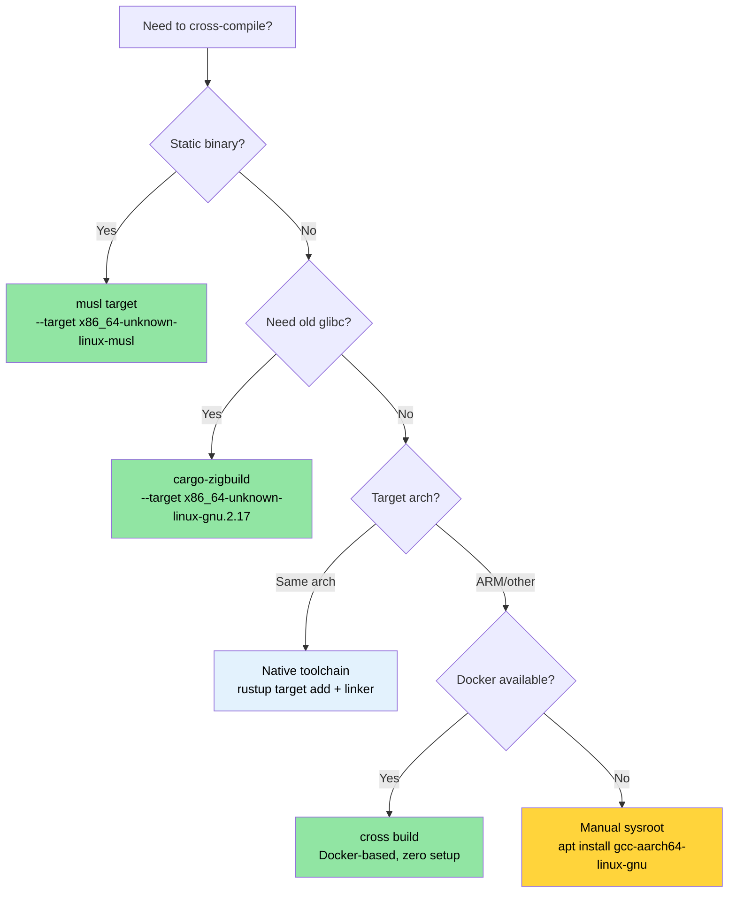

# Cross-Compilation — One Source, Many Targets 🟡

> **What you'll learn:**
> - How Rust target triples work and how to add them with `rustup`
> - Building static musl binaries for container/cloud deployment
> - Cross-compiling to ARM (aarch64) with native toolchains, `cross`, and `cargo-zigbuild`
> - Setting up GitHub Actions matrix builds for multi-architecture CI
>
> **Cross-references:** [Build Scripts](ch01-build-scripts-buildrs-in-depth.md) — build.rs runs on HOST during cross-compilation · [Release Profiles](ch07-release-profiles-and-binary-size.md) — LTO and strip settings for cross-compiled release binaries · [Windows](ch10-windows-and-conditional-compilation.md) — Windows cross-compilation and `no_std` targets

Cross-compilation means building an executable on one machine (the **host**) that
runs on a different machine (the **target**). The host might be your x86_64 laptop;
the target might be an ARM server, a musl-based container, or even a Windows machine.
Rust makes this remarkably feasible because `rustc` is already a cross-compiler —
it just needs the right target libraries and a compatible linker.

### The Target Triple Anatomy

Every Rust compilation target is identified by a **target triple** (which often has
four parts despite the name):

```text
<arch>-<vendor>-<os>-<env>

Examples:
  x86_64  - unknown - linux  - gnu      ← standard Linux (glibc)
  x86_64  - unknown - linux  - musl     ← static Linux (musl libc)
  aarch64 - unknown - linux  - gnu      ← ARM 64-bit Linux
  x86_64  - pc      - windows- msvc     ← Windows with MSVC
  aarch64 - apple   - darwin             ← macOS on Apple Silicon
  x86_64  - unknown - none              ← bare metal (no OS)
```

List all available targets:

```bash
# Show all targets rustc can compile to (~250 targets)
rustc --print target-list | wc -l

# Show installed targets on your system
rustup target list --installed

# Show current default target
rustc -vV | grep host
```

### Installing Toolchains with rustup

```bash
# Add target libraries (Rust std for that target)
rustup target add x86_64-unknown-linux-musl
rustup target add aarch64-unknown-linux-gnu

# Now you can cross-compile:
cargo build --target x86_64-unknown-linux-musl
cargo build --target aarch64-unknown-linux-gnu  # needs a linker — see below
```

**What `rustup target add` gives you**: the pre-compiled `std`, `core`, and `alloc`
libraries for that target. It does *not* give you a C linker or C library. For targets
that need a C toolchain (most `gnu` targets), you need to install one separately.

```bash
# Ubuntu/Debian — install the cross-linker for aarch64
sudo apt install gcc-aarch64-linux-gnu

# Ubuntu/Debian — install musl toolchain for static builds
sudo apt install musl-tools

# Fedora
sudo dnf install gcc-aarch64-linux-gnu
```

### `.cargo/config.toml` — Per-Target Configuration

Instead of passing `--target` on every command, configure defaults in
`.cargo/config.toml` at your project root or home directory:

```toml
# .cargo/config.toml

# Default target for this project (optional — omit to keep native default)
# [build]
# target = "x86_64-unknown-linux-musl"

# Linker for aarch64 cross-compilation
[target.aarch64-unknown-linux-gnu]
linker = "aarch64-linux-gnu-gcc"
rustflags = ["-C", "target-feature=+crc"]

# Linker for musl static builds (usually just the system gcc works)
[target.x86_64-unknown-linux-musl]
linker = "musl-gcc"
rustflags = ["-C", "target-feature=+crc,+aes"]

# ARM 32-bit (Raspberry Pi, embedded)
[target.armv7-unknown-linux-gnueabihf]
linker = "arm-linux-gnueabihf-gcc"

# Environment variables for all targets
[env]
# Example: set a custom sysroot
# SYSROOT = "/opt/cross/sysroot"
```

**Config file search order** (first match wins):
1. `<project>/.cargo/config.toml`
2. `<project>/../.cargo/config.toml` (parent directories, walking up)
3. `$CARGO_HOME/config.toml` (usually `~/.cargo/config.toml`)

### Static Binaries with musl

For deploying to minimal containers (Alpine, scratch Docker images) or systems
where you can't control the glibc version, build with musl:

```bash
# Install musl target
rustup target add x86_64-unknown-linux-musl
sudo apt install musl-tools  # provides musl-gcc

# Build a fully static binary
cargo build --release --target x86_64-unknown-linux-musl

# Verify it's static
file target/x86_64-unknown-linux-musl/release/diag_tool
# → ELF 64-bit LSB executable, x86-64, statically linked

ldd target/x86_64-unknown-linux-musl/release/diag_tool
# → not a dynamic executable
```

**Static vs dynamic trade-offs:**

| Aspect | glibc (dynamic) | musl (static) |
|--------|-----------------|---------------|
| Binary size | Smaller (shared libs) | Larger (~5-15 MB increase) |
| Portability | Needs matching glibc version | Runs anywhere on Linux |
| DNS resolution | Full `nsswitch` support | Basic resolver (no mDNS) |
| Deployment | Needs sysroot or container | Single binary, no deps |
| Performance | Slightly faster malloc | Slightly slower malloc |
| `dlopen()` support | Yes | No |

> **For the project**: A static musl build is ideal for deployment to diverse
> server hardware where you can't guarantee the host OS version. The single-binary
> deployment model eliminates "works on my machine" issues.

### Cross-Compiling to ARM (aarch64)

ARM servers (AWS Graviton, Ampere Altra, Grace) are increasingly common
in data centers. Cross-compiling for aarch64 from an x86_64 host:

```bash
# Step 1: Install target + cross-linker
rustup target add aarch64-unknown-linux-gnu
sudo apt install gcc-aarch64-linux-gnu

# Step 2: Configure linker in .cargo/config.toml (see above)

# Step 3: Build
cargo build --release --target aarch64-unknown-linux-gnu

# Step 4: Verify the binary
file target/aarch64-unknown-linux-gnu/release/diag_tool
# → ELF 64-bit LSB executable, ARM aarch64
```

**Running tests for the target architecture** requires either:
- An actual ARM machine
- QEMU user-mode emulation

```bash
# Install QEMU user-mode (runs ARM binaries on x86_64)
sudo apt install qemu-user qemu-user-static binfmt-support

# Now cargo test can run cross-compiled tests through QEMU
cargo test --target aarch64-unknown-linux-gnu
# (Slow — each test binary is emulated. Use for CI validation, not daily dev.)
```

Configure QEMU as the test runner in `.cargo/config.toml`:

```toml
[target.aarch64-unknown-linux-gnu]
linker = "aarch64-linux-gnu-gcc"
runner = "qemu-aarch64-static -L /usr/aarch64-linux-gnu"
```

### The `cross` Tool — Docker-Based Cross-Compilation

The [`cross`](https://github.com/cross-rs/cross) tool provides a zero-setup
cross-compilation experience using pre-configured Docker images:

```bash
# Install cross (from crates.io — stable releases)
cargo install cross
# Or from git for latest features (less stable):
# cargo install cross --git https://github.com/cross-rs/cross

# Cross-compile — no toolchain setup needed!
cross build --release --target aarch64-unknown-linux-gnu
cross build --release --target x86_64-unknown-linux-musl
cross build --release --target armv7-unknown-linux-gnueabihf

# Cross-test — QEMU included in the Docker image
cross test --target aarch64-unknown-linux-gnu
```

**How it works**: `cross` replaces `cargo` and runs the build inside a Docker
container that has the correct cross-compilation toolchain pre-installed. Your
source is mounted into the container, and the output goes to your normal `target/`
directory.

**Customizing the Docker image** with `Cross.toml`:

```toml
# Cross.toml
[target.aarch64-unknown-linux-gnu]
# Use a custom Docker image with extra system libraries
image = "my-registry/cross-aarch64:latest"

# Pre-install system packages
pre-build = [
    "dpkg --add-architecture arm64",
    "apt-get update && apt-get install -y libpci-dev:arm64"
]

[target.aarch64-unknown-linux-gnu.env]
# Pass environment variables into the container
passthrough = ["CI", "GITHUB_TOKEN"]
```

`cross` requires Docker (or Podman) but eliminates the need to manually install
cross-compilers, sysroots, and QEMU. It's the recommended approach for CI.

### Using Zig as a Cross-Compilation Linker

[Zig](https://ziglang.org/) bundles a C compiler and cross-compilation sysroot
for ~40 targets in a single ~40 MB download. This makes it a remarkably convenient
cross-linker for Rust:

```bash
# Install Zig (single binary, no package manager needed)
# Download from https://ziglang.org/download/
# Or via package manager:
sudo snap install zig --classic --beta  # Ubuntu
brew install zig                          # macOS

# Install cargo-zigbuild
cargo install cargo-zigbuild
```

**Why Zig?** The key advantage is **glibc version targeting**. Zig lets you specify
the exact glibc version to link against, ensuring your binary runs on older Linux
distributions:

```bash
# Build for glibc 2.17 (CentOS 7 / RHEL 7 compatibility)
cargo zigbuild --release --target x86_64-unknown-linux-gnu.2.17

# Build for aarch64 with glibc 2.28 (Ubuntu 18.04+)
cargo zigbuild --release --target aarch64-unknown-linux-gnu.2.28

# Build for musl (fully static)
cargo zigbuild --release --target x86_64-unknown-linux-musl
```

The `.2.17` suffix is a Zig extension — it tells Zig's linker to use glibc 2.17
symbol versions, so the resulting binary runs on CentOS 7 and later. No Docker,
no sysroot management, no cross-compiler installation.

**Comparison: cross vs cargo-zigbuild vs manual:**

| Feature | Manual | cross | cargo-zigbuild |
|---------|--------|-------|----------------|
| Setup effort | High (install toolchain per target) | Low (needs Docker) | Low (single binary) |
| Docker required | No | Yes | No |
| glibc version targeting | No (uses host glibc) | No (uses container glibc) | Yes (exact version) |
| Test execution | Needs QEMU | Included | Needs QEMU |
| macOS → Linux | Difficult | Easy | Easy |
| Linux → macOS | Very difficult | Not supported | Limited |
| Binary size overhead | None | None | None |

### CI Pipeline: GitHub Actions Matrix

A production-grade CI workflow that builds for multiple targets:

```yaml
# .github/workflows/cross-build.yml
name: Cross-Platform Build

on: [push, pull_request]

env:
  CARGO_TERM_COLOR: always

jobs:
  build:
    strategy:
      matrix:
        include:
          - target: x86_64-unknown-linux-gnu
            os: ubuntu-latest
            name: linux-x86_64
          - target: x86_64-unknown-linux-musl
            os: ubuntu-latest
            name: linux-x86_64-static
          - target: aarch64-unknown-linux-gnu
            os: ubuntu-latest
            name: linux-aarch64
            use_cross: true
          - target: x86_64-pc-windows-msvc
            os: windows-latest
            name: windows-x86_64

    runs-on: ${{ matrix.os }}
    name: Build (${{ matrix.name }})

    steps:
      - uses: actions/checkout@v4

      - uses: dtolnay/rust-toolchain@stable
        with:
          targets: ${{ matrix.target }}

      - name: Install musl tools
        if: matrix.target == 'x86_64-unknown-linux-musl'
        run: sudo apt-get install -y musl-tools

      - name: Install cross
        if: matrix.use_cross
        run: cargo install cross

      - name: Build (native)
        if: "!matrix.use_cross"
        run: cargo build --release --target ${{ matrix.target }}

      - name: Build (cross)
        if: matrix.use_cross
        run: cross build --release --target ${{ matrix.target }}

      - name: Run tests
        if: "!matrix.use_cross"
        run: cargo test --target ${{ matrix.target }}

      - name: Upload artifact
        uses: actions/upload-artifact@v4
        with:
          name: diag_tool-${{ matrix.name }}
          path: target/${{ matrix.target }}/release/diag_tool*
```

### Application: Multi-Architecture Server Builds

The binary currently has no cross-compilation setup. For a hardware
diagnostics tool deployed across diverse server fleets, the recommended addition:

```text
my_workspace/
├── .cargo/
│   └── config.toml          ← linker configs per target
├── Cross.toml                ← cross tool configuration
└── .github/workflows/
    └── cross-build.yml       ← CI matrix for 3 targets
```

**Recommended `.cargo/config.toml`:**

```toml
# .cargo/config.toml for the project

# Release profile optimizations (already in Cargo.toml, shown for reference)
# [profile.release]
# lto = true
# codegen-units = 1
# panic = "abort"
# strip = true

# aarch64 for ARM servers (Graviton, Ampere, Grace)
[target.aarch64-unknown-linux-gnu]
linker = "aarch64-linux-gnu-gcc"

# musl for portable static binaries
[target.x86_64-unknown-linux-musl]
linker = "musl-gcc"
```

**Recommended build targets:**

| Target | Use Case | Deploy To |
|--------|----------|-----------|
| `x86_64-unknown-linux-gnu` | Default native build | Standard x86 servers |
| `x86_64-unknown-linux-musl` | Static binary, any distro | Containers, minimal hosts |
| `aarch64-unknown-linux-gnu` | ARM servers | Graviton, Ampere, Grace |

> **Key insight**: The `[profile.release]` in the workspace's root `Cargo.toml`
> already has `lto = true`, `codegen-units = 1`, `panic = "abort"`, and
> `strip = true` — an ideal release profile for cross-compiled deployment binaries
> (see [Release Profiles](ch07-release-profiles-and-binary-size.md) for the full impact table).
> Combined with musl, this produces a single ~10 MB static binary with no runtime
> dependencies.

### Troubleshooting Cross-Compilation

| Symptom | Cause | Fix |
|---------|-------|-----|
| `linker 'aarch64-linux-gnu-gcc' not found` | Missing cross-linker toolchain | `sudo apt install gcc-aarch64-linux-gnu` |
| `cannot find -lssl` (musl target) | System OpenSSL is glibc-linked | Use `vendored` feature: `openssl = { version = "0.10", features = ["vendored"] }` |
| `build.rs` runs wrong binary | build.rs runs on HOST, not target | Check `CARGO_CFG_TARGET_OS` in build.rs, not `cfg!(target_os)` |
| Tests pass locally, fail in `cross` | Docker image missing test fixtures | Mount test data via `Cross.toml`: `[build.env] volumes = ["./TestArea:/TestArea"]` |
| `undefined reference to __cxa_thread_atexit_impl` | Old glibc on target | Use `cargo-zigbuild` with explicit glibc version: `--target x86_64-unknown-linux-gnu.2.17` |
| Binary segfaults on ARM | Compiled for wrong ARM variant | Verify target triple matches hardware: `aarch64-unknown-linux-gnu` for 64-bit ARM |
| `GLIBC_2.XX not found` at runtime | Build machine has newer glibc | Use musl for static builds, or `cargo-zigbuild` for glibc version pinning |

### Cross-Compilation Decision Tree



### 🏋️ Exercises

#### 🟢 Exercise 1: Static musl Binary

Build any Rust binary for `x86_64-unknown-linux-musl`. Verify it's statically linked using `file` and `ldd`.

<details>
<summary>Solution</summary>

```bash
rustup target add x86_64-unknown-linux-musl
cargo new hello-static && cd hello-static
cargo build --release --target x86_64-unknown-linux-musl

# Verify
file target/x86_64-unknown-linux-musl/release/hello-static
# Output: ... statically linked ...

ldd target/x86_64-unknown-linux-musl/release/hello-static
# Output: not a dynamic executable
```
</details>

#### 🟡 Exercise 2: GitHub Actions Cross-Build Matrix

Write a GitHub Actions workflow that builds a Rust project for three targets: `x86_64-unknown-linux-gnu`, `x86_64-unknown-linux-musl`, and `aarch64-unknown-linux-gnu`. Use a matrix strategy.

<details>
<summary>Solution</summary>

```yaml
name: Cross-build
on: [push]
jobs:
  build:
    runs-on: ubuntu-latest
    strategy:
      matrix:
        target:
          - x86_64-unknown-linux-gnu
          - x86_64-unknown-linux-musl
          - aarch64-unknown-linux-gnu
    steps:
      - uses: actions/checkout@v4
      - uses: dtolnay/rust-toolchain@stable
        with:
          targets: ${{ matrix.target }}
      - name: Install cross
        run: cargo install cross --locked
      - name: Build
        run: cross build --release --target ${{ matrix.target }}
      - uses: actions/upload-artifact@v4
        with:
          name: binary-${{ matrix.target }}
          path: target/${{ matrix.target }}/release/my-binary
```
</details>

### Key Takeaways

- Rust's `rustc` is already a cross-compiler — you just need the right target and linker
- **musl** produces fully static binaries with zero runtime dependencies — ideal for containers
- **`cargo-zigbuild`** solves the "which glibc version" problem for enterprise Linux targets
- **`cross`** is the easiest path for ARM and other exotic targets — Docker handles the sysroot
- Always test with `file` and `ldd` to verify the binary matches your deployment target

---

