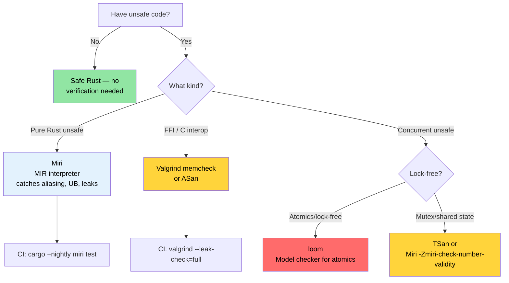

# Miri, Valgrind, and Sanitizers — Verifying Unsafe Code 🔴

> **What you'll learn:**
> - Miri as a MIR interpreter — what it catches (aliasing, UB, leaks) and what it can't (FFI, syscalls)
> - Valgrind memcheck, Helgrind (data races), Callgrind (profiling), and Massif (heap)
> - LLVM sanitizers: ASan, MSan, TSan, LSan with nightly `-Zbuild-std`
> - `cargo-fuzz` for crash discovery and `loom` for concurrency model checking
> - A decision tree for choosing the right verification tool
>
> **Cross-references:** [Code Coverage](ch04-code-coverage-seeing-what-tests-miss.md) — coverage finds untested paths, Miri verifies the tested ones · [`no_std` & Features](ch09-no-std-and-feature-verification.md) — `no_std` code often requires `unsafe` that Miri can verify · [CI/CD Pipeline](ch11-putting-it-all-together-a-production-cic.md) — Miri job in the pipeline

Safe Rust guarantees memory safety and data-race freedom at compile time. But the
moment you write `unsafe` — for FFI, hand-rolled data structures, or performance
tricks — those guarantees become *your* responsibility. This chapter covers the
tools that verify your `unsafe` code actually upholds the safety contracts it claims.

### Miri — An Interpreter for Unsafe Rust

[Miri](https://github.com/rust-lang/miri) is an **interpreter** for Rust's
Mid-level Intermediate Representation (MIR). Instead of compiling to machine code,
Miri *executes* your program step-by-step with exhaustive checks for undefined
behavior at every operation.

```bash
# Install Miri (nightly-only component)
rustup +nightly component add miri

# Run your test suite under Miri
cargo +nightly miri test

# Run a specific binary under Miri
cargo +nightly miri run

# Run a specific test
cargo +nightly miri test -- test_name
```

**How Miri works:**

```text
Source → rustc → MIR → Miri interprets MIR
                        │
                        ├─ Tracks every pointer's provenance
                        ├─ Validates every memory access
                        ├─ Checks alignment at every deref
                        ├─ Detects use-after-free
                        ├─ Detects data races (with threads)
                        └─ Enforces Stacked Borrows / Tree Borrows rules
```

### What Miri Catches (and What It Cannot)

**Miri detects:**

| Category | Example | Would Crash at Runtime? |
|----------|---------|------------------------|
| Out-of-bounds access | `ptr.add(100).read()` past allocation | Sometimes (depends on page layout) |
| Use after free | Reading a dropped `Box` through raw pointer | Sometimes (depends on allocator) |
| Double free | Calling `drop_in_place` twice | Usually |
| Unaligned access | `(ptr as *const u32).read()` on odd address | On some architectures |
| Invalid values | `transmute::<u8, bool>(2)` | Silently wrong |
| Dangling references | `&*ptr` where ptr is freed | No (silent corruption) |
| Data races | Two threads, one writing, no synchronization | Intermittent, hard to reproduce |
| Stacked Borrows violation | Aliasing `&mut` references | No (silent corruption) |

**Miri does NOT detect:**

| Limitation | Why |
|-----------|-----|
| Logic bugs | Miri checks memory safety, not correctness |
| Concurrency deadlocks | Miri checks data races, not livelocks |
| Performance issues | Interpretation is 10-100× slower than native |
| OS/hardware interaction | Miri can't emulate syscalls, device I/O |
| All FFI calls | Can't interpret C code (only Rust MIR) |
| Exhaustive path coverage | Only tests the paths your test suite reaches |

**A concrete example — catching unsound code that "works" in practice:**

```rust
#[cfg(test)]
mod tests {
    #[test]
    fn test_miri_catches_ub() {
        // This "works" in release builds but is undefined behavior
        let mut v = vec![1, 2, 3];
        let ptr = v.as_ptr();

        // Push may reallocate, invalidating ptr
        v.push(4);

        // ❌ UB: ptr may be dangling after reallocation
        // Miri will catch this even if the allocator happens to
        // not move the buffer.
        // let _val = unsafe { *ptr };
        // Error: Miri would report:
        //   "pointer to alloc1234 was dereferenced after this
        //    allocation got freed"
        
        // ✅ Correct: get a fresh pointer after mutation
        let ptr = v.as_ptr();
        let val = unsafe { *ptr };
        assert_eq!(val, 1);
    }
}
```

### Running Miri on a Real Crate

**Practical Miri workflow for a crate with `unsafe`:**

```bash
# Step 1: Run all tests under Miri
cargo +nightly miri test 2>&1 | tee miri_output.txt

# Step 2: If Miri reports errors, isolate them
cargo +nightly miri test -- failing_test_name

# Step 3: Use Miri's backtrace for diagnosis
MIRIFLAGS="-Zmiri-backtrace=full" cargo +nightly miri test

# Step 4: Choose a borrow model
# Stacked Borrows (default, stricter):
cargo +nightly miri test

# Tree Borrows (experimental, more permissive):
MIRIFLAGS="-Zmiri-tree-borrows" cargo +nightly miri test
```

**Miri flags for common scenarios:**

```bash
# Disable isolation (allow file system access, env vars)
MIRIFLAGS="-Zmiri-disable-isolation" cargo +nightly miri test

# Memory leak detection is ON by default in Miri.
# To suppress leak errors (e.g., for intentional leaks):
# MIRIFLAGS="-Zmiri-ignore-leaks" cargo +nightly miri test

# Seed the RNG for reproducible results with randomized tests
MIRIFLAGS="-Zmiri-seed=42" cargo +nightly miri test

# Enable strict provenance checking
MIRIFLAGS="-Zmiri-strict-provenance" cargo +nightly miri test

# Multiple flags
MIRIFLAGS="-Zmiri-disable-isolation -Zmiri-backtrace=full -Zmiri-strict-provenance" \
    cargo +nightly miri test
```

**Miri in CI:**

```yaml
# .github/workflows/miri.yml
name: Miri
on: [push, pull_request]

jobs:
  miri:
    runs-on: ubuntu-latest
    steps:
      - uses: actions/checkout@v4
      - uses: dtolnay/rust-toolchain@nightly
        with:
          components: miri

      - name: Run Miri
        run: cargo miri test --workspace
        env:
          MIRIFLAGS: "-Zmiri-backtrace=full"
          # Leak checking is on by default.
          # Skip tests that use system calls Miri can't handle
          # (file I/O, networking, etc.)
```

> **Performance note**: Miri is 10-100× slower than native execution. A test suite
> that runs in 5 seconds natively may take 5 minutes under Miri. In CI, run Miri
> on a focused subset: crates with `unsafe` code only.

### Valgrind and Its Rust Integration

[Valgrind](https://valgrind.org/) is the classic C/C++ memory checker. It works
on compiled Rust binaries too, checking for memory errors at the machine-code level.

```bash
# Install Valgrind
sudo apt install valgrind  # Debian/Ubuntu
sudo dnf install valgrind  # Fedora

# Build with debug info (Valgrind needs symbols)
cargo build --tests
# or for release with debug info:
# cargo build --release
# [profile.release]
# debug = true

# Run a specific test binary under Valgrind
valgrind --tool=memcheck \
    --leak-check=full \
    --show-leak-kinds=all \
    --track-origins=yes \
    ./target/debug/deps/my_crate-abc123 --test-threads=1

# Run the main binary
valgrind --tool=memcheck \
    --leak-check=full \
    --error-exitcode=1 \
    ./target/debug/diag_tool --run-diagnostics
```

**Valgrind tools beyond memcheck:**

| Tool | Command | What It Detects |
|------|---------|----------------|
| **Memcheck** | `--tool=memcheck` | Memory leaks, use-after-free, buffer overflows |
| **Helgrind** | `--tool=helgrind` | Data races and lock-order violations |
| **DRD** | `--tool=drd` | Data races (different detection algorithm) |
| **Callgrind** | `--tool=callgrind` | CPU instruction profiling (path-level) |
| **Massif** | `--tool=massif` | Heap memory profiling over time |
| **Cachegrind** | `--tool=cachegrind` | Cache miss analysis |

**Using Callgrind for instruction-level profiling:**

```bash
# Record instruction counts (more stable than wall-clock time)
valgrind --tool=callgrind \
    --callgrind-out-file=callgrind.out \
    ./target/release/diag_tool --run-diagnostics

# Visualize with KCachegrind
kcachegrind callgrind.out
# or the text-based alternative:
callgrind_annotate callgrind.out | head -100
```

**Miri vs Valgrind — when to use which:**

| Aspect | Miri | Valgrind |
|--------|------|----------|
| Checks Rust-specific UB | ✅ Stacked/Tree Borrows | ❌ Not aware of Rust rules |
| Checks C FFI code | ❌ Can't interpret C | ✅ Checks all machine code |
| Needs nightly | ✅ Yes | ❌ No |
| Speed | 10-100× slower | 10-50× slower |
| Platform | Any (interprets MIR) | Linux, macOS (runs native code) |
| Data race detection | ✅ Yes | ✅ Yes (Helgrind/DRD) |
| Leak detection | ✅ Yes | ✅ Yes (more thorough) |
| False positives | Very rare | Occasional (especially with allocators) |

**Use both**:
- **Miri** for pure-Rust `unsafe` code (Stacked Borrows, provenance)
- **Valgrind** for FFI-heavy code and whole-program leak analysis

### AddressSanitizer, MemorySanitizer, ThreadSanitizer

LLVM sanitizers are compile-time instrumentation passes that insert runtime checks.
They're faster than Valgrind (2-5× overhead vs 10-50×) and catch different classes
of bugs.

```bash
# Required: install Rust source for rebuilding std with sanitizer instrumentation
rustup component add rust-src --toolchain nightly
# AddressSanitizer (ASan) — buffer overflows, use-after-free, stack overflows
RUSTFLAGS="-Zsanitizer=address" \
    cargo +nightly test -Zbuild-std --target x86_64-unknown-linux-gnu

# MemorySanitizer (MSan) — uninitialized memory reads
RUSTFLAGS="-Zsanitizer=memory" \
    cargo +nightly test -Zbuild-std --target x86_64-unknown-linux-gnu

# ThreadSanitizer (TSan) — data races
RUSTFLAGS="-Zsanitizer=thread" \
    cargo +nightly test -Zbuild-std --target x86_64-unknown-linux-gnu

# LeakSanitizer (LSan) — memory leaks (included in ASan by default)
RUSTFLAGS="-Zsanitizer=leak" \
    cargo +nightly test --target x86_64-unknown-linux-gnu
```

> **Note**: ASan, MSan, and TSan require `-Zbuild-std` to rebuild the standard
> library with sanitizer instrumentation. LSan does not.

**Sanitizer comparison:**

| Sanitizer | Overhead | Catches | Nightly? | `-Zbuild-std`? |
|-----------|----------|---------|----------|----------------|
| **ASan** | 2× memory, 2× CPU | Buffer overflow, use-after-free, stack overflow | Yes | Yes |
| **MSan** | 3× memory, 3× CPU | Uninitialized reads | Yes | Yes |
| **TSan** | 5-10× memory, 5× CPU | Data races | Yes | Yes |
| **LSan** | Minimal | Memory leaks | Yes | No |

**Practical example — catching a data race with TSan:**

```rust
use std::sync::Arc;
use std::thread;

fn racy_counter() -> u64 {
    // ❌ UB: unsynchronized shared mutable state
    let data = Arc::new(std::cell::UnsafeCell::new(0u64));
    let mut handles = vec![];

    for _ in 0..4 {
        let data = Arc::clone(&data);
        handles.push(thread::spawn(move || {
            for _ in 0..1000 {
                // SAFETY: UNSOUND — data race!
                unsafe {
                    *data.get() += 1;
                }
            }
        }));
    }

    for h in handles {
        h.join().unwrap();
    }

    // Value should be 4000 but may be anything due to race
    unsafe { *data.get() }
}

// Both Miri and TSan catch this:
// Miri:  "Data race detected between (1) write and (2) write"
// TSan:  "WARNING: ThreadSanitizer: data race"
//
// Fix: use AtomicU64 or Mutex<u64>
```

### Related Tools: Fuzzing and Concurrency Verification

**`cargo-fuzz` — Coverage-Guided Fuzzing** (finds crashes in parsers and decoders):

```bash
# Install
cargo install cargo-fuzz

# Initialize a fuzz target
cargo fuzz init
cargo fuzz add parse_gpu_csv
```

```rust
// fuzz/fuzz_targets/parse_gpu_csv.rs
#![no_main]
use libfuzzer_sys::fuzz_target;

fuzz_target!(|data: &[u8]| {
    if let Ok(s) = std::str::from_utf8(data) {
        // The fuzzer generates millions of inputs looking for panics/crashes.
        let _ = diag_tool::parse_gpu_csv(s);
    }
});
```

```bash
# Run the fuzzer (runs until interrupted or crash found)
cargo +nightly fuzz run parse_gpu_csv -- -max_total_time=300  # 5 minutes

# Minimize a crash
cargo +nightly fuzz tmin parse_gpu_csv artifacts/parse_gpu_csv/crash-...
```

> **When to fuzz**: Any function that parses untrusted/semi-trusted input (sensor output,
> config files, network data, JSON/CSV). Fuzzing found real bugs in every major
> Rust parser crate (serde, regex, image).

**`loom` — Concurrency Model Checker** (exhaustively tests atomic orderings):

```toml
[dev-dependencies]
loom = "0.7"
```

```rust
#[cfg(loom)]
mod tests {
    use loom::sync::atomic::{AtomicUsize, Ordering};
    use loom::thread;

    #[test]
    fn test_counter_is_atomic() {
        loom::model(|| {
            let counter = loom::sync::Arc::new(AtomicUsize::new(0));
            let c1 = counter.clone();
            let c2 = counter.clone();

            let t1 = thread::spawn(move || { c1.fetch_add(1, Ordering::SeqCst); });
            let t2 = thread::spawn(move || { c2.fetch_add(1, Ordering::SeqCst); });

            t1.join().unwrap();
            t2.join().unwrap();

            // loom explores ALL possible thread interleavings
            assert_eq!(counter.load(Ordering::SeqCst), 2);
        });
    }
}
```

> **When to use `loom`**: When you have lock-free data structures or custom
> synchronization primitives. Loom exhaustively explores thread interleavings —
> it's a model checker, not a stress test. Not needed for `Mutex`/`RwLock`-based code.

### When to Use Which Tool

```text
Decision tree for unsafe verification:

Is the code pure Rust (no FFI)?
├─ Yes → Use Miri (catches Rust-specific UB, Stacked Borrows)
│        Also run ASan in CI for defense-in-depth
└─ No (calls C/C++ code via FFI)
   ├─ Memory safety concerns?
   │  └─ Yes → Use Valgrind memcheck AND ASan
   ├─ Concurrency concerns?
   │  └─ Yes → Use TSan (faster) or Helgrind (more thorough)
   └─ Memory leak concerns?
      └─ Yes → Use Valgrind --leak-check=full
```

**Recommended CI matrix:**

```yaml
# Run all tools in parallel for fast feedback
jobs:
  miri:
    runs-on: ubuntu-latest
    steps:
      - uses: dtolnay/rust-toolchain@nightly
        with: { components: miri }
      - run: cargo miri test --workspace

  asan:
    runs-on: ubuntu-latest
    steps:
      - uses: dtolnay/rust-toolchain@nightly
      - run: |
          RUSTFLAGS="-Zsanitizer=address" \
          cargo test -Zbuild-std --target x86_64-unknown-linux-gnu

  valgrind:
    runs-on: ubuntu-latest
    steps:
      - run: sudo apt-get install -y valgrind
      - uses: dtolnay/rust-toolchain@stable
      - run: cargo build --tests
      - run: |
          for test_bin in $(find target/debug/deps -maxdepth 1 -executable -type f ! -name '*.d'); do
            valgrind --error-exitcode=1 --leak-check=full "$test_bin" --test-threads=1
          done
```

### Application: Zero Unsafe — and When You'll Need It

The project contains **zero `unsafe` blocks** across 90K+ lines of
Rust. This is a remarkable achievement for a systems-level diagnostics tool and
demonstrates that safe Rust is sufficient for:
- IPMI communication (via `std::process::Command` to `ipmitool`)
- GPU queries (via `std::process::Command` to `accel-query`)
- PCIe topology parsing (pure JSON/text parsing)
- SEL record management (pure data structures)
- DER report generation (JSON serialization)

**When will the project need `unsafe`?**

The likely triggers for introducing `unsafe`:

| Scenario | Why `unsafe` | Recommended Verification |
|----------|-------------|-------------------------|
| Direct ioctl-based IPMI | `libc::ioctl()` bypasses `ipmitool` subprocess | Miri + Valgrind |
| Direct GPU driver queries | accel-mgmt FFI instead of `accel-query` parsing | Valgrind (C library) |
| Memory-mapped PCIe config | `mmap` for direct config-space reads | ASan + Valgrind |
| Lock-free SEL buffer | `AtomicPtr` for concurrent event collection | Miri + TSan |
| Embedded/no_std variant | Raw pointer manipulation for bare-metal | Miri |

**Preparation**: Before introducing `unsafe`, add the verification tools to CI:

```toml
# Cargo.toml — add a feature flag for unsafe optimizations
[features]
default = []
direct-ipmi = []     # Enable direct ioctl IPMI instead of ipmitool subprocess
direct-accel-api = []     # Enable accel-mgmt FFI instead of accel-query parsing
```

```rust
// src/ipmi.rs — gated behind a feature flag
#[cfg(feature = "direct-ipmi")]
mod direct {
    //! Direct IPMI device access via /dev/ipmi0 ioctl.
    //!
    //! # Safety
    //! This module uses `unsafe` for ioctl system calls.
    //! Verified with: Miri (where possible), Valgrind memcheck, ASan.

    use std::os::unix::io::RawFd;

    // ... unsafe ioctl implementation ...
}

#[cfg(not(feature = "direct-ipmi"))]
mod subprocess {
    //! IPMI via ipmitool subprocess (default, fully safe).
    // ... current implementation ...
}
```

> **Key insight**: Keep `unsafe` behind [feature flags](ch09-no-std-and-feature-verification.md)
> so it can be verified independently. Run `cargo +nightly miri test --features direct-ipmi`
> in [CI](ch11-putting-it-all-together-a-production-cic.md) to continuously verify the unsafe
> paths without affecting the safe default build.

### `cargo-careful` — Extra UB Checks on Stable

[`cargo-careful`](https://github.com/RalfJung/cargo-careful) runs your code
with extra standard library checks enabled — catching some undefined behavior
that normal builds ignore, without requiring nightly or Miri's 10-100× slowdown:

```bash
# Install (requires nightly, but runs your code at near-native speed)
cargo install cargo-careful

# Run tests with extra UB checks (catches uninitialized memory, invalid values)
cargo +nightly careful test

# Run a binary with extra checks
cargo +nightly careful run -- --run-diagnostics
```

**What `cargo-careful` catches that normal builds don't:**
- Reads of uninitialized memory in `MaybeUninit` and `zeroed()`
- Creating invalid `bool`, `char`, or enum values via transmute
- Unaligned pointer reads/writes
- `copy_nonoverlapping` with overlapping ranges

**Where it fits in the verification ladder:**

```text
Least overhead                                          Most thorough
├─ cargo test ──► cargo careful test ──► Miri ──► ASan ──► Valgrind ─┤
│  (0× overhead)  (~1.5× overhead)   (10-100×)  (2×)     (10-50×)   │
│  Safe Rust only  Catches some UB    Pure-Rust  FFI+Rust FFI+Rust   │
```

> **Recommendation**: Add `cargo +nightly careful test` to CI as a fast safety
> check. It runs at near-native speed (unlike Miri) and catches real bugs that
> safe Rust abstractions mask.

### Troubleshooting Miri and Sanitizers

| Symptom | Cause | Fix |
|---------|-------|-----|
| `Miri does not support FFI` | Miri is a Rust interpreter; it can't execute C code | Use Valgrind or ASan for FFI code instead |
| `error: unsupported operation: can't call foreign function` | Miri hit an `extern "C"` call | Mock the FFI boundary or gate behind `#[cfg(miri)]` |
| `Stacked Borrows violation` | Aliasing rule violation — even if code "works" | Miri is correct; refactor to avoid aliasing `&mut` with `&` |
| Sanitizer says `DEADLYSIGNAL` | ASan detected buffer overflow | Check array indexing, slice operations, and pointer arithmetic |
| `LeakSanitizer: detected memory leaks` | `Box::leak()`, `forget()`, or missing `drop()` | Intentional: suppress with `__lsan_disable()`; unintentional: fix the leak |
| Miri is extremely slow | Miri interprets, doesn't compile — 10-100× slower | Run only on `--lib` tests or tag specific tests with `#[cfg_attr(miri, ignore)]` for slow ones |
| `TSan: false positive` with atomics | TSan doesn't understand Rust's atomic ordering model perfectly | Add `TSAN_OPTIONS=suppressions=tsan.supp` with specific suppressions |

### Try It Yourself

1. **Trigger a Miri UB detection**: Write an `unsafe` function that creates two
   `&mut` references to the same `i32` (aliasing violation). Run `cargo +nightly miri test`
   and observe the "Stacked Borrows" error. Fix it with `UnsafeCell` or separate allocations.

2. **Run ASan on a deliberate bug**: Create a test that does `unsafe` out-of-bounds
   array access. Build with `RUSTFLAGS="-Zsanitizer=address"` and observe ASan's
   report. Note how it pinpoints the exact line.

3. **Benchmark Miri overhead**: Time `cargo test --lib` vs `cargo +nightly miri test --lib`
   on the same test suite. Calculate the slowdown factor. Based on this, decide
   which tests to run under Miri in CI and which to skip with `#[cfg_attr(miri, ignore)]`.

### Safety Verification Decision Tree



### 🏋️ Exercises

#### 🟡 Exercise 1: Trigger a Miri UB Detection

Write an `unsafe` function that creates two `&mut` references to the same `i32` (aliasing violation). Run `cargo +nightly miri test` and observe the Stacked Borrows error. Fix it.

<details>
<summary>Solution</summary>

```rust
#[cfg(test)]
mod tests {
    #[test]
    fn aliasing_ub() {
        let mut x: i32 = 42;
        let ptr = &mut x as *mut i32;
        unsafe {
            // BUG: Two &mut references to the same location
            let _a = &mut *ptr;
            let _b = &mut *ptr; // Miri: Stacked Borrows violation!
        }
    }
}
```

Fix: use separate allocations or `UnsafeCell`:

```rust
use std::cell::UnsafeCell;

#[test]
fn no_aliasing_ub() {
    let x = UnsafeCell::new(42);
    unsafe {
        let a = &mut *x.get();
        *a = 100;
    }
}
```
</details>

#### 🔴 Exercise 2: ASan Out-of-Bounds Detection

Create a test with `unsafe` out-of-bounds array access. Build with `RUSTFLAGS="-Zsanitizer=address"` on nightly and observe ASan's report.

<details>
<summary>Solution</summary>

```rust
#[test]
fn oob_access() {
    let arr = [1u8, 2, 3, 4, 5];
    let ptr = arr.as_ptr();
    unsafe {
        let _val = *ptr.add(10); // Out of bounds!
    }
}
```

```bash
RUSTFLAGS="-Zsanitizer=address" cargo +nightly test -Zbuild-std \
  --target x86_64-unknown-linux-gnu -- oob_access
# ASan report: stack-buffer-overflow at <exact address>
```
</details>

### Key Takeaways

- **Miri** is the tool for pure-Rust `unsafe` — it catches aliasing violations, use-after-free, and leaks that compile and pass tests
- **Valgrind** is the tool for FFI/C interop — it works on the final binary without recompilation
- **Sanitizers** (ASan, TSan, MSan) require nightly but run at near-native speed — ideal for large test suites
- **`loom`** is purpose-built for verifying lock-free concurrent data structures
- Run Miri in CI on every push; run sanitizers on a nightly schedule to avoid slowing the main pipeline

---

