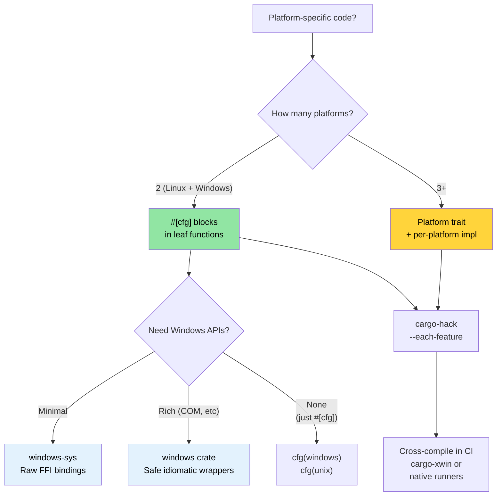

# Windows and Conditional Compilation 🟡

> **What you'll learn:**
> - Windows support patterns: `windows-sys`/`windows` crates, `cargo-xwin`
> - Conditional compilation with `#[cfg]` — checked by the compiler, not the preprocessor
> - Platform abstraction architecture: when `#[cfg]` blocks suffice vs when to use traits
> - Cross-compiling for Windows from Linux
>
> **Cross-references:** [`no_std` & Features](ch09-no-std-and-feature-verification.md) — `cargo-hack` and feature verification · [Cross-Compilation](ch02-cross-compilation-one-source-many-target.md) — general cross-build setup · [Build Scripts](ch01-build-scripts-buildrs-in-depth.md) — `cfg` flags emitted by `build.rs`

### Windows Support — Platform Abstractions

Rust's `#[cfg()]` attributes and Cargo features allow a single codebase to
target both Linux and Windows cleanly. The project already
demonstrates this pattern in `platform::run_command`:

```rust
// Real pattern from the project — platform-specific shell invocation
pub fn exec_cmd(cmd: &str, timeout_secs: Option<u64>) -> Result<CommandResult, CommandError> {
    #[cfg(windows)]
    let mut child = Command::new("cmd")
        .args(["/C", cmd])
        .stdout(Stdio::piped())
        .stderr(Stdio::piped())
        .spawn()?;

    #[cfg(not(windows))]
    let mut child = Command::new("sh")
        .args(["-c", cmd])
        .stdout(Stdio::piped())
        .stderr(Stdio::piped())
        .spawn()?;

    // ... rest is platform-independent ...
}
```

**Available `cfg` predicates:**

```rust
// Operating system
#[cfg(target_os = "linux")]         // Linux specifically
#[cfg(target_os = "windows")]       // Windows
#[cfg(target_os = "macos")]         // macOS
#[cfg(unix)]                        // Linux, macOS, BSDs, etc.
#[cfg(windows)]                     // Windows (shorthand)

// Architecture
#[cfg(target_arch = "x86_64")]      // x86 64-bit
#[cfg(target_arch = "aarch64")]     // ARM 64-bit
#[cfg(target_arch = "x86")]         // x86 32-bit

// Pointer width (portable alternative to arch)
#[cfg(target_pointer_width = "64")] // Any 64-bit platform
#[cfg(target_pointer_width = "32")] // Any 32-bit platform

// Environment / C library
#[cfg(target_env = "gnu")]          // glibc
#[cfg(target_env = "musl")]         // musl libc
#[cfg(target_env = "msvc")]         // MSVC on Windows

// Endianness
#[cfg(target_endian = "little")]
#[cfg(target_endian = "big")]

// Combinations with any(), all(), not()
#[cfg(all(target_os = "linux", target_arch = "x86_64"))]
#[cfg(any(target_os = "linux", target_os = "macos"))]
#[cfg(not(windows))]
```

### The `windows-sys` and `windows` Crates

For calling Windows APIs directly:

```toml
# Cargo.toml — use windows-sys for raw FFI (lighter, no abstraction)
[target.'cfg(windows)'.dependencies]
windows-sys = { version = "0.59", features = [
    "Win32_Foundation",
    "Win32_System_Services",
    "Win32_System_Registry",
    "Win32_System_Power",
] }
# NOTE: windows-sys uses semver-incompatible releases (0.48 → 0.52 → 0.59).
# Pin to a single minor version — each release may remove or rename API bindings.
# Check https://github.com/microsoft/windows-rs for the latest version
# before starting a new project.

# Or use the windows crate for safe wrappers (heavier, more ergonomic)
# windows = { version = "0.59", features = [...] }
```

```rust
// src/platform/windows.rs
#[cfg(windows)]
mod win {
    use windows_sys::Win32::System::Power::{
        GetSystemPowerStatus, SYSTEM_POWER_STATUS,
    };

    pub fn get_battery_status() -> Option<u8> {
        let mut status = SYSTEM_POWER_STATUS::default();
        // SAFETY: GetSystemPowerStatus writes to the provided buffer.
        // The buffer is correctly sized and aligned.
        let ok = unsafe { GetSystemPowerStatus(&mut status) };
        if ok != 0 {
            Some(status.BatteryLifePercent)
        } else {
            None
        }
    }
}
```

**`windows-sys` vs `windows` crate:**

| Aspect | `windows-sys` | `windows` |
|--------|---------------|----------|
| API style | Raw FFI (`unsafe` calls) | Safe Rust wrappers |
| Binary size | Minimal (just extern declarations) | Larger (wrapper code) |
| Compile time | Fast | Slower |
| Ergonomics | C-style, manual safety | Rust-idiomatic |
| Error handling | Raw `BOOL` / `HRESULT` | `Result<T, windows::core::Error>` |
| Use when | Performance-critical, thin wrapper | Application code, ease of use |

### Cross-Compiling for Windows from Linux

```bash
# Option 1: MinGW (GNU ABI)
rustup target add x86_64-pc-windows-gnu
sudo apt install gcc-mingw-w64-x86-64
cargo build --target x86_64-pc-windows-gnu
# Produces a .exe — runs on Windows, links against msvcrt

# Option 2: MSVC ABI via xwin (for full MSVC compatibility)
cargo install cargo-xwin
cargo xwin build --target x86_64-pc-windows-msvc
# Uses Microsoft's CRT and SDK headers downloaded automatically

# Option 3: Zig-based cross-compilation
cargo zigbuild --target x86_64-pc-windows-gnu
```

**GNU vs MSVC ABI on Windows:**

| Aspect | `x86_64-pc-windows-gnu` | `x86_64-pc-windows-msvc` |
|--------|-------------------------|---------------------------|
| Linker | MinGW `ld` | MSVC `link.exe` or `lld-link` |
| C runtime | `msvcrt.dll` (universal) | `ucrtbase.dll` (modern) |
| C++ interop | GCC ABI | MSVC ABI |
| Cross-compile from Linux | Easy (MinGW) | Possible (`cargo-xwin`) |
| Windows API support | Full | Full |
| Debug info format | DWARF | PDB |
| Recommended for | Simple tools, CI builds | Full Windows integration |

### Conditional Compilation Patterns

**Pattern 1: Platform module selection**

```rust
// src/platform/mod.rs — compile different modules per OS
#[cfg(target_os = "linux")]
mod linux;
#[cfg(target_os = "linux")]
pub use linux::*;

#[cfg(target_os = "windows")]
mod windows;
#[cfg(target_os = "windows")]
pub use windows::*;

// Both modules implement the same public API:
// pub fn get_cpu_temperature() -> Result<f64, PlatformError>
// pub fn list_pci_devices() -> Result<Vec<PciDevice>, PlatformError>
```

**Pattern 2: Feature-gated platform support**

```toml
# Cargo.toml
[features]
default = ["linux"]
linux = []              # Linux-specific hardware access
windows = ["dep:windows-sys"]  # Windows-specific APIs

[target.'cfg(windows)'.dependencies]
windows-sys = { version = "0.59", features = [...], optional = true }
```

```rust
// Compile error if someone tries to build for Windows without the feature:
#[cfg(all(target_os = "windows", not(feature = "windows")))]
compile_error!("Enable the 'windows' feature to build for Windows");
```

**Pattern 3: Trait-based platform abstraction**

```rust
/// Platform-independent interface for hardware access.
pub trait HardwareAccess {
    type Error: std::error::Error;

    fn read_cpu_temperature(&self) -> Result<f64, Self::Error>;
    fn read_gpu_temperature(&self, gpu_index: u32) -> Result<f64, Self::Error>;
    fn list_pci_devices(&self) -> Result<Vec<PciDevice>, Self::Error>;
    fn send_ipmi_command(&self, cmd: &IpmiCmd) -> Result<IpmiResponse, Self::Error>;
}

#[cfg(target_os = "linux")]
pub struct LinuxHardware;

#[cfg(target_os = "linux")]
impl HardwareAccess for LinuxHardware {
    type Error = LinuxHwError;

    fn read_cpu_temperature(&self) -> Result<f64, Self::Error> {
        // Read from /sys/class/thermal/thermal_zone0/temp
        let raw = std::fs::read_to_string("/sys/class/thermal/thermal_zone0/temp")?;
        Ok(raw.trim().parse::<f64>()? / 1000.0)
    }
    // ...
}

#[cfg(target_os = "windows")]
pub struct WindowsHardware;

#[cfg(target_os = "windows")]
impl HardwareAccess for WindowsHardware {
    type Error = WindowsHwError;

    fn read_cpu_temperature(&self) -> Result<f64, Self::Error> {
        // Read via WMI (Win32_TemperatureProbe) or Open Hardware Monitor
        todo!("WMI temperature query")
    }
    // ...
}

/// Create the platform-appropriate implementation
pub fn create_hardware() -> impl HardwareAccess {
    #[cfg(target_os = "linux")]
    { LinuxHardware }
    #[cfg(target_os = "windows")]
    { WindowsHardware }
}
```

### Platform Abstraction Architecture

For a project that targets multiple platforms, organize code into three layers:

```text
┌──────────────────────────────────────────────────┐
│ Application Logic (platform-independent)          │
│  diag_tool, accel_diag, network_diag, event_log, etc.      │
│  Uses only the platform abstraction trait          │
├──────────────────────────────────────────────────┤
│ Platform Abstraction Layer (trait definitions)    │
│  trait HardwareAccess { ... }                     │
│  trait CommandRunner { ... }                      │
│  trait FileSystem { ... }                         │
├──────────────────────────────────────────────────┤
│ Platform Implementations (cfg-gated)              │
│  ┌──────────────┐  ┌──────────────┐              │
│  │ Linux impl   │  │ Windows impl │              │
│  │ /sys, /proc  │  │ WMI, Registry│              │
│  │ ipmitool     │  │ ipmiutil     │              │
│  │ lspci        │  │ devcon       │              │
│  └──────────────┘  └──────────────┘              │
└──────────────────────────────────────────────────┘
```

**Testing the abstraction**: Mock the platform trait for unit tests:

```rust
#[cfg(test)]
mod tests {
    use super::*;

    struct MockHardware {
        cpu_temp: f64,
        gpu_temps: Vec<f64>,
    }

    impl HardwareAccess for MockHardware {
        type Error = std::io::Error;

        fn read_cpu_temperature(&self) -> Result<f64, Self::Error> {
            Ok(self.cpu_temp)
        }

        fn read_gpu_temperature(&self, index: u32) -> Result<f64, Self::Error> {
            self.gpu_temps.get(index as usize)
                .copied()
                .ok_or_else(|| std::io::Error::new(
                    std::io::ErrorKind::NotFound,
                    format!("GPU {index} not found")
                ))
        }

        fn list_pci_devices(&self) -> Result<Vec<PciDevice>, Self::Error> {
            Ok(vec![]) // Mock returns empty
        }

        fn send_ipmi_command(&self, _cmd: &IpmiCmd) -> Result<IpmiResponse, Self::Error> {
            Ok(IpmiResponse::default())
        }
    }

    #[test]
    fn test_thermal_check_with_mock() {
        let hw = MockHardware {
            cpu_temp: 75.0,
            gpu_temps: vec![82.0, 84.0],
        };
        let result = run_thermal_diagnostic(&hw);
        assert!(result.is_ok());
    }
}
```

### Application: Linux-First, Windows-Ready

The project is already partially Windows-ready. Use
[`cargo-hack`](ch09-no-std-and-feature-verification.md) to verify all feature
combinations, and [cross-compile](ch02-cross-compilation-one-source-many-target.md)
to test on Windows from Linux:

**Already done:**
- `platform::run_command` uses `#[cfg(windows)]` for shell selection
- Tests use `#[cfg(windows)]` / `#[cfg(not(windows))]` for platform-appropriate
  test commands

**Recommended evolution path for Windows support:**

```text
Phase 1: Extract platform abstraction trait (current → 2 weeks)
  ├─ Define HardwareAccess trait in core_lib
  ├─ Wrap current Linux code behind LinuxHardware impl
  └─ All diagnostic modules depend on trait, not Linux specifics

Phase 2: Add Windows stubs (2 weeks)
  ├─ Implement WindowsHardware with TODO stubs
  ├─ CI builds for x86_64-pc-windows-msvc (compile check only)
  └─ Tests pass with MockHardware on all platforms

Phase 3: Windows implementation (ongoing)
  ├─ IPMI via ipmiutil.exe or OpenIPMI Windows driver
  ├─ GPU via accel-mgmt (accel-api.dll) — same API as Linux
  ├─ PCIe via Windows Setup API (SetupDiEnumDeviceInfo)
  └─ NIC via WMI (Win32_NetworkAdapter)
```

**Cross-platform CI addition:**

```yaml
# Add to CI matrix
- target: x86_64-pc-windows-msvc
  os: windows-latest
  name: windows-x86_64
```

This ensures the codebase compiles on Windows even before full Windows
implementation is complete — catching `cfg` mistakes early.

> **Key insight**: The abstraction doesn't need to be perfect on day one.
> Start with `#[cfg]` blocks in leaf functions (like `exec_cmd` already does),
> then refactor to traits when you have two or more platform implementations.
> Premature abstraction is worse than `#[cfg]` blocks.

### Conditional Compilation Decision Tree



### 🏋️ Exercises

#### 🟢 Exercise 1: Platform-Conditional Module

Create a module with `#[cfg(unix)]` and `#[cfg(windows)]` implementations of a `get_hostname()` function. Verify both compile with `cargo check` and `cargo check --target x86_64-pc-windows-msvc`.

<details>
<summary>Solution</summary>

```rust
// src/hostname.rs
#[cfg(unix)]
pub fn get_hostname() -> String {
    use std::fs;
    fs::read_to_string("/etc/hostname")
        .unwrap_or_else(|_| "unknown".to_string())
        .trim()
        .to_string()
}

#[cfg(windows)]
pub fn get_hostname() -> String {
    use std::env;
    env::var("COMPUTERNAME").unwrap_or_else(|_| "unknown".to_string())
}

#[cfg(test)]
mod tests {
    use super::*;

    #[test]
    fn hostname_is_not_empty() {
        let name = get_hostname();
        assert!(!name.is_empty());
    }
}
```

```bash
# Verify Linux compilation
cargo check

# Verify Windows compilation (cross-check)
rustup target add x86_64-pc-windows-msvc
cargo check --target x86_64-pc-windows-msvc
```
</details>

#### 🟡 Exercise 2: Cross-Compile for Windows with cargo-xwin

Install `cargo-xwin` and build a simple binary for `x86_64-pc-windows-msvc` from Linux. Verify the output is a `.exe`.

<details>
<summary>Solution</summary>

```bash
cargo install cargo-xwin
rustup target add x86_64-pc-windows-msvc

cargo xwin build --release --target x86_64-pc-windows-msvc
# Downloads Windows SDK headers/libs automatically

file target/x86_64-pc-windows-msvc/release/my-binary.exe
# Output: PE32+ executable (console) x86-64, for MS Windows

# You can also test with Wine:
wine target/x86_64-pc-windows-msvc/release/my-binary.exe
```
</details>

### Key Takeaways

- Start with `#[cfg]` blocks in leaf functions; refactor to traits only when three or more platforms diverge
- `windows-sys` is for raw FFI; the `windows` crate provides safe, idiomatic wrappers
- `cargo-xwin` cross-compiles to Windows MSVC ABI from Linux — no Windows machine needed
- Always check `--target x86_64-pc-windows-msvc` in CI even if you only ship on Linux
- Combine `#[cfg]` with Cargo features for optional platform support (e.g., `feature = "windows"`)

---

