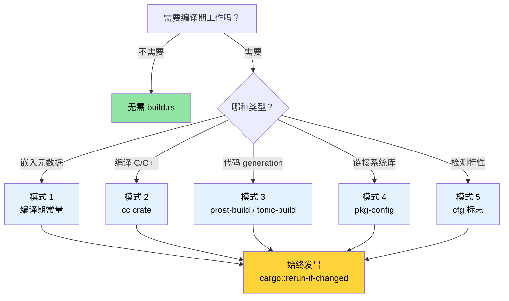

[English Original](../en/ch01-build-scripts-buildrs-in-depth.md)

# 构建脚本 — 深入理解 `build.rs` 🟢

> **你将学到：**
> - `build.rs` 如何融入 Cargo 构建流水线及其运行机制
> - 五种生产实践模式：编译期常量、C/C++ 编译、protobuf 代码生成、`pkg-config` 链接和特性检测
> - 会拖慢构建或破坏交叉编译的反模式
> - 如何权衡可追溯性与可复现构建 (Reproducible Builds)
>
> **相关章节：** [交叉编译](ch02-cross-compilation-one-source-many-target.md) 使用构建脚本实现目标平台感知构建 · [`no_std` 与特性验证](ch09-no-std-and-feature-verification.md) 扩展了此处设置的 `cfg` 标志 · [CI/CD 流水线](ch11-putting-it-all-together-a-production-cic.md) 在自动化中编排构建脚本

每个 Cargo 包都可以在 crate 根目录下包含一个名为 `build.rs` 的文件。
Cargo 会在编译你的 crate *之前* 编译并执行该文件。构建脚本通过 stdout 上的 `println!` 指令与 Cargo 进行通信。

### 什么是 build.rs 以及它何时运行

```text
┌─────────────────────────────────────────────────────────┐
│                    Cargo 构建流水线                      │
│                                                         │
│  1. 解析依赖                                            │
│  2. 下载 crate                                          │
│  3. 编译 build.rs  ← 普通 Rust 代码，在 HOST（宿机）运行  │
│  4. 执行 build.rs  ← stdout → Cargo 指令                │
│  5. 编译 crate（使用步骤 4 中的指令）                      │
│  6. 链接                                                │
└─────────────────────────────────────────────────────────┘
```

关键事实：
- `build.rs` 在 **宿主 (Host)** 机器上运行，而不是在目标 (Target) 机器上。在交叉编译期间，构建脚本在你的开发机上运行，即使最终二进制文件针对的是不同的架构。
- 构建脚本的作用范围仅限于其所属的包。它无法影响其他 crate 的编译方式 —— 除非该包在 `Cargo.toml` 中声明了 `links` 键，这允许通过 `cargo::metadata=KEY=VALUE` 向下游 crate 传递元数据。
- 只要 Cargo 检测到变更，它就会 **每次** 运行 —— 除非你发出 `cargo::rerun-if-changed` 指令来限制重新运行。

> **注意 (Rust 1.71+)**：自 Rust 1.71 起，Cargo 会对编译后的 `build.rs` 二进制文件进行指纹识别 —— 如果二进制文件完全相同，即使源代码时间戳改变了，它也不会重新运行。然而，`cargo::rerun-if-changed=build.rs` 仍然很有价值：如果没有 *任何* `rerun-if-changed` 指令，Cargo 会在 **包内的任何文件** 发生变化时重新运行 `build.rs`（而不仅仅是 `build.rs` 发生变化）。发出 `cargo::rerun-if-changed=build.rs` 可以将重新运行限制在仅当 `build.rs` 本身发生变化时 —— 这在大型 crate 中能显著节省编译时间。
- 它可以发出 *cfg 标志*、*环境变量*、*链接器参数* 以及主 crate 消费的 *文件路径*。

最简 `Cargo.toml` 配置项：

```toml
[package]
name = "my-crate"
version = "0.1.0"
edition = "2021"
build = "build.rs"       # 默认值 —— Cargo 会自动寻找 build.rs
# build = "src/build.rs" # 或者将其放在其他位置
```

### Cargo 指令协议

构建脚本通过在标准输出打印指令来与 Cargo 通信。自 Rust 1.77 起，首选前缀是 `cargo::`（取代了旧的单冒号 `cargo:` 形式）。

| 指令 | 用途 |
|-------------|---------|
| `cargo::rerun-if-changed=PATH` | 仅当 PATH 变更时重新运行 build.rs |
| `cargo::rerun-if-env-changed=VAR` | 仅当环境变量 VAR 变更时重新运行 |
| `cargo::rustc-link-lib=NAME` | 链接原生库 NAME |
| `cargo::rustc-link-search=PATH` | 向库搜索路径添加 PATH |
| `cargo::rustc-cfg=KEY` | 为条件编译设置 `#[cfg(KEY)]` 标志 |
| `cargo::rustc-cfg=KEY="VALUE"` | 设置 `#[cfg(KEY = "VALUE")]` 标志 |
| `cargo::rustc-env=KEY=VALUE` | 设置可通过 `env!()` 访问的环境变量 |
| `cargo::rustc-cdylib-link-arg=FLAG` | 为 cdylib 目标向链接器传递 FLAG |
| `cargo::warning=MESSAGE` | 在编译期间显示警告 |
| `cargo::metadata=KEY=VALUE` | 存储可由下游 crate 读取的元数据 |

```rust
// build.rs — 极简示例
fn main() {
    // 仅在 build.rs 本身变化时重新运行
    println!("cargo::rerun-if-changed=build.rs");

    // 设置编译期环境变量
    let timestamp = std::time::SystemTime::now()
        .duration_since(std::time::UNIX_EPOCH)
        .map(|d| d.as_secs().to_string())
        .unwrap_or_else(|_| "0".into());
    println!("cargo::rustc-env=BUILD_TIMESTAMP={timestamp}");
}
```

### 模式 1：编译期常量

最常见的用例：将构建元数据写入二进制文件，以便在运行时报告（git 哈希、构建日期、CI 任务 ID）。

```rust
// build.rs
use std::process::Command;

fn main() {
    println!("cargo::rerun-if-changed=.git/HEAD");
    println!("cargo::rerun-if-changed=.git/refs");

    // Git commit hash
    let output = Command::new("git")
        .args(["rev-parse", "--short", "HEAD"])
        .output()
        .expect("git not found");
    let git_hash = String::from_utf8_lossy(&output.stdout).trim().to_string();
    println!("cargo::rustc-env=GIT_HASH={git_hash}");

    // 构建配置 (debug 或 release)
    let profile = std::env::var("PROFILE").unwrap_or_else(|_| "unknown".into());
    println!("cargo::rustc-env=BUILD_PROFILE={profile}");

    // 目标三元组 (Target triple)
    let target = std::env::var("TARGET").unwrap_or_else(|_| "unknown".into());
    println!("cargo::rustc-env=BUILD_TARGET={target}");
}
```

```rust
// src/main.rs — 消费构建期的值
fn print_version() {
    println!(
        "{} {} (git:{} target:{} profile:{})",
        env!("CARGO_PKG_NAME"),
        env!("CARGO_PKG_VERSION"),
        env!("GIT_HASH"),
        env!("BUILD_TARGET"),
        env!("BUILD_PROFILE"),
    );
}
```

> **内置 Cargo 环境变量**（免费获得，无需 build.rs）：
> `CARGO_PKG_NAME`、`CARGO_PKG_VERSION`、`CARGO_PKG_AUTHORS`、
> `CARGO_PKG_DESCRIPTION`、`CARGO_MANIFEST_DIR`。
> 查看 [完整列表](https://doc.rust-lang.org/cargo/reference/environment-variables.html#environment-variables-cargo-sets-for-crates)。

### 模式 2：使用 `cc` crate 编译 C/C++ 代码

当你的 Rust crate 封装了 C 库或需要小型 C 辅助程序（在硬件接口中很常见）时，[`cc`](https://docs.rs/cc) crate 简化了 inside build.rs 的编译工作。

```toml
# Cargo.toml
[build-dependencies]
cc = "1.0"
```

```rust
// build.rs
fn main() {
    println!("cargo::rerun-if-changed=csrc/");

    cc::Build::new()
        .file("csrc/ipmi_raw.c")
        .file("csrc/smbios_parser.c")
        .include("csrc/include")
        .flag("-Wall")
        .flag("-Wextra")
        .opt_level(2)
        .compile("diag_helpers");
    // 这将产生 libdiag_helpers.a 并发出正确的
    // cargo::rustc-link-lib 和 cargo::rustc-link-search 指令。
}
```

```rust
// src/lib.rs — 编译后的 C 代码的 FFI 绑定
extern "C" {
    fn ipmi_raw_command(
        netfn: u8,
        cmd: u8,
        data: *const u8,
        data_len: usize,
        response: *mut u8,
        response_len: *mut usize,
    ) -> i32;
}

/// 封装了原始 IPMI 命令接口的安全包装。
/// 假设：enum IpmiError { CommandFailed(i32), ... }
pub fn send_ipmi_command(netfn: u8, cmd: u8, data: &[u8]) -> Result<Vec<u8>, IpmiError> {
    let mut response = vec![0u8; 256];
    let mut response_len: usize = response.len();

    // SAFETY: 响应缓冲区足够大，且 response_len 已正确初始化。
    let rc = unsafe {
        ipmi_raw_command(
            netfn,
            cmd,
            data.as_ptr(),
            data.len(),
            response.as_mut_ptr(),
            &mut response_len,
        )
    };

    if rc != 0 {
        return Err(IpmiError::CommandFailed(rc));
    }
    response.truncate(response_len);
    Ok(response)
}
```

对于 C++ 代码，使用 `.cpp(true)` 和 `.flag("-std=c++17")`：

```rust
// build.rs — C++ 变体
fn main() {
    println!("cargo::rerun-if-changed=cppsrc/");

    cc::Build::new()
        .cpp(true)
        .file("cppsrc/vendor_parser.cpp")
        .flag("-std=c++17")
        .flag("-fno-exceptions")    // 匹配 Rust 的无异常模型
        .compile("vendor_helpers");
}
```

### 模式 3：Protocol Buffers 与代码生成

构建脚本非常擅长代码生成 —— 在编译时将 `.proto`、`.fbs` 或 `.json` 等模式文件转换为 Rust 源码。以下是使用 [`prost-build`](https://docs.rs/prost-build) 的 protobuf 模式：

```toml
# Cargo.toml
[build-dependencies]
prost-build = "0.13"
```

```rust
// build.rs
fn main() {
    println!("cargo::rerun-if-changed=proto/");

    prost_build::compile_protos(
        &["proto/diagnostics.proto", "proto/telemetry.proto"],
        &["proto/"],
    )
    .expect("Failed to compile protobuf definitions");
}
```

```rust
// src/lib.rs — 包含生成的代码
pub mod diagnostics {
    include!(concat!(env!("OUT_DIR"), "/diagnostics.rs"));
}

pub mod telemetry {
    include!(concat!(env!("OUT_DIR"), "/telemetry.rs"));
}
```

> **`OUT_DIR`** 是 Cargo 提供的目录，构建脚本应在此放置生成的文件。每个 crate 都在 `target/` 下拥有自己的 `OUT_DIR`。

### 模式 4：使用 `pkg-config` 链接系统库

对于提供 `.pc` 文件的系统库（如 systemd、OpenSSL、libpci），[`pkg-config`](https://docs.rs/pkg-config) crate 会探测系统并发出正确的链接指令：

```toml
# Cargo.toml
[build-dependencies]
pkg-config = "0.3"
```

```rust
// build.rs
fn main() {
    // 探测 libpci（用于 PCIe 设备枚举）
    pkg_config::Config::new()
        .atleast_version("3.6.0")
        .probe("libpci")
        .expect("libpci >= 3.6.0 not found — install pciutils-dev");

    // 探测 libsystemd（可选 — 用于 sd_notify 集成）
    if pkg_config::probe_library("libsystemd").is_ok() {
        println!("cargo::rustc-cfg=has_systemd");
    }
}
```

```rust
// src/lib.rs — 基于 pkg-config 探测结果的条件编译
#[cfg(has_systemd)]
mod systemd_notify {
    extern "C" {
        fn sd_notify(unset_environment: i32, state: *const std::ffi::c_char) -> i32;
    }

    pub fn notify_ready() {
        let state = std::ffi::CString::new("READY=1").unwrap();
        // SAFETY: state 是一个有效的以 null 结尾的 C 字符串。
        unsafe { sd_notify(0, state.as_ptr()) };
    }
}

#[cfg(not(has_systemd))]
mod systemd_notify {
    pub fn notify_ready() {
        // 在没有 systemd 的系统上不执行任何操作
    }
}
```

### 模式 5：特性检测与条件编译

构建脚本可以探测编译环境并设置 `cfg` 标志，供主 crate 用于条件代码路径。

**CPU 架构和操作系统检测**（安全 —— 这些是编译期常量）：

```rust
// build.rs — 检测 CPU 特性和操作系统能力
fn main() {
    println!("cargo::rerun-if-changed=build.rs");

    let target = std::env::var("TARGET").unwrap();
    let target_os = std::env::var("CARGO_CFG_TARGET_OS").unwrap();

    // 在 x86_64 上启用 AVX2 优化路径
    if target.starts_with("x86_64") {
        println!("cargo::rustc-cfg=has_x86_64");
    }

    // 在 aarch64 上启用 ARM NEON 路径
    if target.starts_with("aarch64") {
        println!("cargo::rustc-cfg=has_aarch64");
    }

    // 检测 /dev/ipmi0 是否可用（编译期检查）
    if target_os == "linux" && std::path::Path::new("/dev/ipmi0").exists() {
        println!("cargo::rustc-cfg=has_ipmi_device");
    }
}
```

> ⚠️ **反模式演示** —— 下面的代码显示了一种诱人但有问题的做法。**请勿在生产环境中使用。**

```rust
// build.rs — 坏习惯：在构建时进行运行时硬件探测
fn main() {
    // 反模式：二进制文件与构建机器的硬件绑定了。
    // 如果你在带 GPU 的机器上构建并部署到不带 GPU 的机器，
    // 二进制文件会默认为存在 GPU。
    if std::process::Command::new("accel-query")
        .arg("--query-gpu=name")
        .arg("--format=csv,noheader")
        .output()
        .is_ok()
    {
        println!("cargo::rustc-cfg=has_accel_device");
    }
}
```

```rust
// src/gpu.rs — 基于构建期检测进行适配的代码
pub fn query_gpu_info() -> GpuResult {
    #[cfg(has_accel_device)]
    {
        run_accel_query()
    }

    #[cfg(not(has_accel_device))]
    {
        GpuResult::NotAvailable("accel-query not found at build time".into())
    }
}
```

> ⚠️ **为什么这是错的**：对于可选硬件，运行时设备检测几乎总是优于构建时检测。上面产生的二进制文件会 *与构建机器的硬件配置绑定* —— 它在部署目标上的行为可能会有所不同。仅对那些在编译时确实固定总结的能力（架构、操作系统、库的可用性）使用构建时检测。对于像 GPU 这样的硬件，应使用 `which accel-query` 或 `accel-mgmt` 探测在运行时进行探测。

### 反模式与坑点

| 反模式 | 危害 | 修正 |
|-------------|-------------|-----|
| 缺少 `rerun-if-changed` | build.rs 在 *每次* 构建时都会运行，拖慢迭代速度 | 始终至少发出 `cargo::rerun-if-changed=build.rs` |
| 在 build.rs 中发起网络请求 | 离线构建失败，不可复现 | 使用 Vendor 文件或单独的 fetch 步骤 |
| 写入 `src/` 目录 | Cargo 不期望源码在构建期间改变 | 写入 `OUT_DIR` 并使用 `include!()` |
| 重型计算 | 拖慢每次 `cargo build` | 将结果缓存至 `OUT_DIR`，并使用 `rerun-if-changed` 进行门控 |
| 忽略交叉编译 | 直接使用 `Command::new("gcc")` 而不尊重 `$CC` | 使用能正确处理交叉编译工具链的 `cc` crate |
| 无上下文的 panic | `unwrap()` 会给出模糊的 "build script failed" 错误 | 使用 `.expect("描述性消息")` 或打印 `cargo::warning=` |

### 应用：嵌入构建元数据

该项目目前使用 `env!("CARGO_PKG_VERSION")`进行版本报告。构建脚本可以通过更丰富的元数据来扩展这一点：

```rust
// build.rs — 建议的添加项
fn main() {
    println!("cargo::rerun-if-changed=.git/HEAD");
    println!("cargo::rerun-if-changed=.git/refs");
    println!("cargo::rerun-if-changed=build.rs");

    // 嵌入 git 哈希以便在诊断报告中进行溯源
    if let Ok(output) = std::process::Command::new("git")
        .args(["rev-parse", "--short=10", "HEAD"])
        .output()
    {
        let hash = String::from_utf8_lossy(&output.stdout).trim().to_string();
        println!("cargo::rustc-env=APP_GIT_HASH={hash}");
    } else {
        println!("cargo::rustc-env=APP_GIT_HASH=unknown");
    }

    // 嵌入构建时间戳以便进行报告关联
    let timestamp = std::time::SystemTime::now()
        .duration_since(std::time::UNIX_EPOCH)
        .map(|d| d.as_secs().to_string())
        .unwrap_or_else(|_| "0".into());
    println!("cargo::rustc-env=APP_BUILD_EPOCH={timestamp}");

    // 输出目标三元组 — 在多架构部署中很有用
    let target = std::env::var("TARGET").unwrap_or_else(|_| "unknown".into());
    println!("cargo::rustc-env=APP_TARGET={target}");
}
```

```rust
// src/version.rs — 消费元数据
pub struct BuildInfo {
    pub version: &'static str,
    pub git_hash: &'static str,
    pub build_epoch: &'static str,
    pub target: &'static str,
}

pub const BUILD_INFO: BuildInfo = BuildInfo {
    version: env!("CARGO_PKG_VERSION"),
    git_hash: env!("APP_GIT_HASH"),
    build_epoch: env!("APP_BUILD_EPOCH"),
    target: env!("APP_TARGET"),
};

impl BuildInfo {
    /// 必要时在运行时解析 epoch（在 stable Rust 上，目前还无法实现 const &str → u64 的转换 — 
    /// 还没有用于字符串转整数的 const fn）。
    pub fn build_epoch_secs(&self) -> u64 {
        self.build_epoch.parse().unwrap_or(0)
    }
}

impl std::fmt::Display for BuildInfo {
    fn fmt(&self, f: &mut std::fmt::Formatter<'_>) -> std::fmt::Result {
        write!(
            f,
            "DiagTool v{} (git:{} target:{})",
            self.version, self.git_hash, self.target
        )
    }
}
```

> **来自项目的关键洞察**：整个代码库中几乎没有任何 `build.rs` 文件，因为它采用了纯 Rust 开发，没有 C 依赖、没有代码生成，也没有系统库链接。当你确实需要这些功能时，`build.rs` 是不二之选 —— 但不要“为了加而加”。在大型代码库中，**没有**构建脚本往往是一个特性，而非缺失。请参阅 [依赖管理](ch06-dependency-management-and-supply-chain-s.md) 了解该项目如何在没有自定义构建逻辑的情况下管理其供应链，这正是架构简洁的有力信号。

### 亲自尝试

1. **嵌入 Git 元数据**：创建一个 `build.rs`，将 `APP_GIT_HASH` 和 `APP_BUILD_EPOCH` 作为环境变量输出。在 `main.rs` 中使用 `env!()` 获取并打印。验证提交代码后哈希值是否发生变化。

2. **探测系统库**：编写一个 `build.rs`，使用 `pkg-config` 探测 `libz` (zlib)。如果找到，则发出 `cargo::rustc-cfg=has_zlib` 指令。在 `main.rs` 中根据该标志条件打印 "zlib available" 或 "zlib not found"。基于该 cfg 标志。

3. **人为触发构建失败**：从你的 `build.rs` 中移除 `rerun-if-changed` 行，观察在 `cargo build` 和 `cargo test` 期间它运行了多少次。然后将其加回，对比差异。

### 可复现构建 (Reproducible Builds)

第 1 章介绍了如何将时间戳和 Git 哈希嵌入二进制文件。虽然这对溯源很有用，但它会 **与可复现构建相冲突** —— 即相同的源代码应当始终产生完全相同的二进制文件。

**矛盾点：**

| 目标 | 成效 | 代价 |
|------|-------------|------|
| 可溯源性 | 二进制文件包含 `APP_BUILD_EPOCH` | 每次构建都是唯一的 — 无法验证完整性 |
| 可复现性 | `cargo build --locked` 始终产生相同输出 | 缺少构建时的元数据 |

**实际解决方案：**

```bash
# 1. 在 CI 中始终使用 --locked（确保遵循 Cargo.lock）
cargo build --release --locked
# 如果 Cargo.lock 缺失或过时则会失败 — 从而捕获 "在我的机器上能跑" 的问题

# 2. 对于对复现性要求极高的构建，设置 SOURCE_DATE_EPOCH
SOURCE_DATE_EPOCH=$(git log -1 --format=%ct) cargo build --release --locked
# 使用最后一次提交的时间戳而非 "现在" — 相同的提交 = 相同的二进制文件
```

```rust
// 在 build.rs 中：遵循 SOURCE_DATE_EPOCH 以保证复现性
let timestamp = std::env::var("SOURCE_DATE_EPOCH")
    .unwrap_or_else(|_| {
        std::time::SystemTime::now()
            .duration_since(std::time::UNIX_EPOCH)
            .map(|d| d.as_secs().to_string())
            .unwrap_or_else(|_| "0".into())
    });
println!("cargo::rustc-env=APP_BUILD_EPOCH={timestamp}");
```

> **最佳实践**：在构建脚本中使用 `SOURCE_DATE_EPOCH`，这样发布构建就是可复现的（`git-hash + 锁定的依赖 + 确定的时间戳 = 相同的二进制文件`），而开发构建依然可以享受实时时间戳带来的便利。

### 构建流水线决策图



### 🏋️ 练习

#### 🟢 练习 1：版本标记

创建一个包含 `build.rs` 的最小 crate，将当前 Git 哈希和构建配置 (profile) 嵌入环境变量。在 `main()` 中打印它们。验证在 debug 和 release 构建之间输出是否发生改变。

<details>
<summary>答案</summary>

```rust
// build.rs
fn main() {
    println!("cargo::rerun-if-changed=.git/HEAD");
    println!("cargo::rerun-if-changed=build.rs");

    let hash = std::process::Command::new("git")
        .args(["rev-parse", "--short", "HEAD"])
        .output()
        .map(|o| String::from_utf8_lossy(&o.stdout).trim().to_string())
        .unwrap_or_else(|_| "unknown".into());
    println!("cargo::rustc-env=GIT_HASH={hash}");
    println!("cargo::rustc-env=BUILD_PROFILE={}", std::env::var("PROFILE").unwrap_or_default());
}
```

```rust,ignore
// src/main.rs
fn main() {
    println!("{} v{} (git:{} profile:{})",
        env!("CARGO_PKG_NAME"),
        env!("CARGO_PKG_VERSION"),
        env!("GIT_HASH"),
        env!("BUILD_PROFILE"),
    );
}
```

```bash
cargo run          # 显示 profile:debug
cargo run --release # 显示 profile:release
```
</details>

#### 🟡 练习 2：条件系统库

编写一个 `build.rs`，使用 `pkg-config` 同时探测 `libz` 和 `libpci`。为找到的每个库分别发出核心 `cfg` 标志。在 `main.rs` 中，打印构建时检测到了哪些库。

<details>
<summary>答案</summary>

```toml
# Cargo.toml
[build-dependencies]
pkg-config = "0.3"
```

```rust,ignore
// build.rs
fn main() {
    println!("cargo::rerun-if-changed=build.rs");
    if pkg_config::probe_library("zlib").is_ok() {
        println!("cargo::rustc-cfg=has_zlib");
    }
    if pkg_config::probe_library("libpci").is_ok() {
        println!("cargo::rustc-cfg=has_libpci");
    }
}
```

```rust
// src/main.rs
fn main() {
    #[cfg(has_zlib)]
    println!("✅ 检测到 zlib");
    #[cfg(not(has_zlib))]
    println!("❌ 未找到 zlib");

    #[cfg(has_libpci)]
    println!("✅ 检测到 libpci");
    #[cfg(not(has_libpci))]
    println!("❌ 未找到 libpci");
}
```
</details>

### 关键收获

- `build.rs` 在编译时运行在 **宿主机** 上 —— 务必发出 `cargo::rerun-if-changed` 以避免不必要的重新构建。
- 使用 `cc` crate（而非原始 `gcc` 命令）进行 C/C++ 编译 —— 它能正确处理交叉编译工具链。
- 将生成的文件写入 `OUT_DIR`，永远不要写入 `src/` —— Cargo 不希望源码在构建期间发生改变。
- 对于可选硬件，运行时探测优于构建时探测。
- 嵌入时间戳时使用 `SOURCE_DATE_EPOCH` 以保证构建的可复现性。

---
