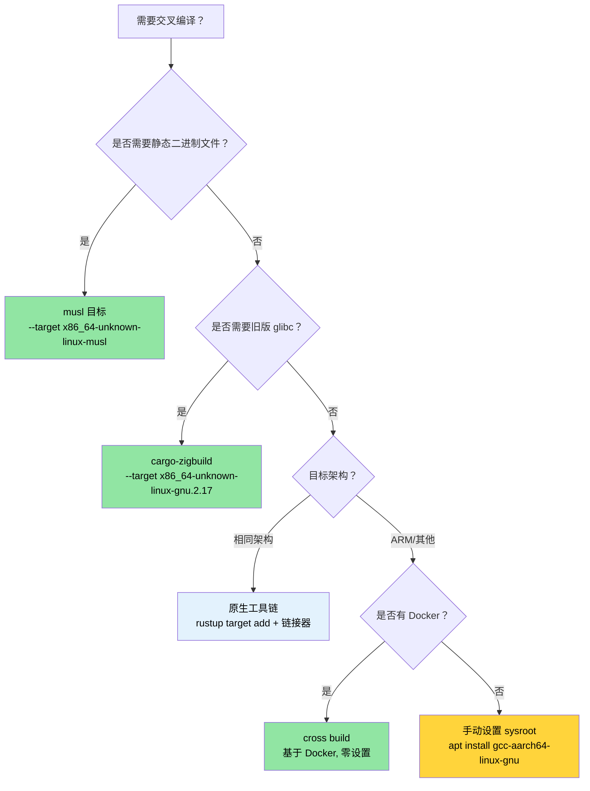

[English Original](../en/ch02-cross-compilation-one-source-many-target.md)

# 交叉编译 — 一份源码，多种目标 🟡

> **你将学到：**
> - Rust 目标三元组 (Target Triples) 的工作原理以及如何使用 `rustup` 添加它们
> - 为容器/云端部署构建静态 musl 二进制文件
> - 使用原生工具链、`cross` 和 `cargo-zigbuild` 交叉编译到 ARM (aarch64)
> - 为多架构 CI 设置 GitHub Actions 矩阵构建
>
> **相关章节：** [构建脚本](ch01-build-scripts-buildrs-in-depth.md) — 交叉编译期间 build.rs 在 HOST 上运行 · [发布配置](ch07-release-profiles-and-binary-size.md) — 交叉编译发布版二进制文件的 LTO 和 strip 设置 · [Windows](ch10-windows-and-conditional-compilation.md) — Windows 交叉编译与 `no_std` 目标

交叉编译是指在一台机器（**宿主机**）上构建可在另一台机器（**目标机**）上运行的可执行文件。宿主机可能是你的 x86_64 笔记本电脑；目标机可能是 ARM 服务器、基于 musl 的容器，甚至是 Windows 机器。
Rust 使这变得非常可行，因为 `rustc` 本身就是一个交叉编译器 —— 它只需要正确的目标库和兼容的链接器。

### 目标三元组详解

每个 Rust 编译目标都由一个 **目标三元组 (Target Triple)** 标识（尽管叫三元组，但通常包含四个部分）：

```text
<架构>-<厂商>-<操作系统>-<环境>

示例：
  x86_64  - unknown - linux  - gnu      ← 标准 Linux (glibc)
  x86_64  - unknown - linux  - musl     ← 静态 Linux (musl libc)
  aarch64 - unknown - linux  - gnu      ← ARM 64 位 Linux
  x86_64  - pc      - windows- msvc     ← 带有 MSVC 的 Windows
  aarch64 - apple   - darwin             ← 搭载 Apple Silicon 的 macOS
  x86_64  - unknown - none              ← 裸机 (无 OS)
```

列出所有可用目标：

```bash
# 显示 rustc 可以编译到的所有目标（约 250 个）
rustc --print target-list | wc -l

# 显示系统中已安装的目标
rustup target list --installed

# 显示当前的默认目标
rustc -vV | grep host
```

### 使用 rustup 安装工具链

```bash
# 添加目标库（该目标的 Rust 标准库）
rustup target add x86_64-unknown-linux-musl
rustup target add aarch64-unknown-linux-gnu

# 现在你可以进行交叉编译了：
cargo build --target x86_64-unknown-linux-musl
cargo build --target aarch64-unknown-linux-gnu  # 需要链接器 —— 见下文
```

**`rustup target add` 为你提供了什么**：该目标的预编译 `std`、`core` 和 `alloc` 库。它 *不* 提供 C 链接器或 C 库。对于需要 C 工具链的目标（大多数 `gnu` 目标），你需要单独安装。

```bash
# Ubuntu/Debian — 安装 aarch64 的交叉链接器
sudo apt install gcc-aarch64-linux-gnu

# Ubuntu/Debian — 安装用于静态构建的 musl 工具链
sudo apt install musl-tools

# Fedora
sudo dnf install gcc-aarch64-linux-gnu
```

### `.cargo/config.toml` — 针对目标的配置

不必在每个命令中都传递 `--target`，可以在项目根目录或主目录的 `.cargo/config.toml` 中配置默认值：

```toml
# .cargo/config.toml

# 此项目的默认目标（可选 — 省略则保持原生默认值）
# [build]
# target = "x86_64-unknown-linux-musl"

# aarch64 交叉编译的链接器
[target.aarch64-unknown-linux-gnu]
linker = "aarch64-linux-gnu-gcc"
rustflags = ["-C", "target-feature=+crc"]

# musl 静态构建的链接器（通常系统级 gcc 即可胜任）
[target.x86_64-unknown-linux-musl]
linker = "musl-gcc"
rustflags = ["-C", "target-feature=+crc,+aes"]

# ARM 32 位 (Raspberry Pi, 嵌入式)
[target.armv7-unknown-linux-gnueabihf]
linker = "arm-linux-gnueabihf-gcc"

# 适用于所有目标的环境变量
[env]
# 示例：设置自定义 sysroot
# SYSROOT = "/opt/cross/sysroot"
```

**配置文件搜索顺序**（匹配即停止）：
1. `<项目>/.cargo/config.toml`
2. `<项目>/../.cargo/config.toml`（逐级向上查找父目录）
3. `$CARGO_HOME/config.toml`（通常是 `~/.cargo/config.toml`）

### 使用 musl 构建静态二进制文件

为了部署到极简容器（Alpine、scratch Docker 镜像）或无法控制 glibc 版本的系统，请使用 musl 进行构建：

```bash
# 安装 musl 目标
rustup target add x86_64-unknown-linux-musl
sudo apt install musl-tools  # 提供 musl-gcc

# 构建完全静态的二进制文件
cargo build --release --target x86_64-unknown-linux-musl

# 验证其是否为静态链接
file target/x86_64-unknown-linux-musl/release/diag_tool
# → ELF 64-bit LSB executable, x86-64, statically linked

ldd target/x86_64-unknown-linux-musl/release/diag_tool
# → not a dynamic executable
```

**静态与动态的权衡：**

| 维度 | glibc (动态) | musl (静态) |
|--------|-----------------|---------------|
| 二进制体积 | 较小 (共享库) | 较大 (增加约 5-15 MB) |
| 可移植性 | 需要匹配 glibc 版本 | 在任何 Linux 上均可运行 |
| DNS 解析 | 完整的 `nsswitch` 支持 | 基础解析器 (不支持 mDNS) |
| 部署 | 需要 sysroot 或容器 | 单一二进制文件，无依赖 |
| 性能 | malloc 稍快 | malloc 稍慢 |
| `dlopen()` 支持 | 支持 | 不支持 |

> **针对本项目**：静态 musl 构建是部署到各种服务器硬件的理想选择，因为你无法保证宿主机的操作系统版本。单一二进制文件的部署模型消除了“在我的机器上能跑”的问题。

### 交叉编译到 ARM (aarch64)

ARM 服务器（AWS Graviton、Ampere Altra、Grace）在数据中心变得越来越普遍。在 x86_64 宿主机上为 aarch64 进行交叉编译：

```bash
# 第 1 步：安装目标 + 交叉链接器
rustup target add aarch64-unknown-linux-gnu
sudo apt install gcc-aarch64-linux-gnu

# 第 2 步：在 .cargo/config.toml 中配置链接器（见上文）

# 第 3 步：构建
cargo build --release --target aarch64-unknown-linux-gnu

# 第 4 步：验证二进制文件
file target/aarch64-unknown-linux-gnu/release/diag_tool
# → ELF 64-bit LSB executable, ARM aarch64
```

**运行目标架构的测试**需要：
- 一台真实的 ARM 机器
- 或者 QEMU 用户模式模拟

```bash
# 安装 QEMU 用户模式（在 x86_64 上运行 ARM 二进制文件）
sudo apt install qemu-user qemu-user-static binfmt-support

# 现在 cargo test 可以通过 QEMU 运行交叉编译的测试
cargo test --target aarch64-unknown-linux-gnu
# （速度较慢 —— 每个测试二进制文件都是模拟运行的。适用于 CI 验证，不建议日常开发使用。）
```

在 `.cargo/config.toml` 中将 QEMU 配置为测试运行器：

```toml
[target.aarch64-unknown-linux-gnu]
linker = "aarch64-linux-gnu-gcc"
runner = "qemu-aarch64-static -L /usr/aarch64-linux-gnu"
```

### `cross` 工具 — 基于 Docker 的交叉编译

[`cross`](https://github.com/cross-rs/cross) 工具使用预配置的 Docker 镜像提供“零设置”交叉编译体验：

```bash
# 安装 cross (来自 crates.io — 稳定版)
cargo install cross
# 或者来自 git 以获得最新特性 (不太稳定):
# cargo install cross --git https://github.com/cross-rs/cross

# 交叉编译 — 无需手动设置工具链！
cross build --release --target aarch64-unknown-linux-gnu
cross build --release --target x86_64-unknown-linux-musl
cross build --release --target armv7-unknown-linux-gnueabihf

# 交叉测试 — Docker 镜像中已包含 QEMU
cross test --target aarch64-unknown-linux-gnu
```

**工作原理**：`cross` 替换了 `cargo` 命令，在预装了正确交叉编译工具链的 Docker 容器内运行构建。你的源码被挂载到容器中，输出结果则存放在正常的 `target/` 目录下。

**通过 `Cross.toml` 自定义 Docker 镜像**：

```toml
# Cross.toml
[target.aarch64-unknown-linux-gnu]
# 使用带有额外系统库的自定义 Docker 镜像
image = "my-registry/cross-aarch64:latest"

# 预安装系统包
pre-build = [
    "dpkg --add-architecture arm64",
    "apt-get update && apt-get install -y libpci-dev:arm64"
]

[target.aarch64-unknown-linux-gnu.env]
# 将环境变量传递到容器中
passthrough = ["CI", "GITHUB_TOKEN"]
```

`cross` 需要 Docker (或 Podman)，但它消除了手动安装交叉编译器、sysroot 和 QEMU 的麻烦。它是 CI 的推荐方案。

### 使用 Zig 作为交叉编译链接器

[Zig](https://ziglang.org/) 在单个约 40 MB 的下载包中捆绑了 C 编译器和针对约 40 个目标的交叉编译 sysroot。这使其成为 Rust 极佳的交叉链接器：

```bash
# 安装 Zig (单一二进制文件，无需包管理器)
# 从 https://ziglang.org/download/ 下载
# 或通过包管理器安装：
sudo snap install zig --classic --beta  # Ubuntu
brew install zig                          # macOS

# 安装 cargo-zigbuild
cargo install cargo-zigbuild
```

**为什么要用 Zig？** 关键优势在于 **glibc 版本定向 (glibc version targeting)**。Zig 允许你指定链接的具体 glibc 版本，确保你的二进制文件能在旧版 Linux 发行版上运行：

```bash
# 为 glibc 2.17 构建 (兼容 CentOS 7 / RHEL 7)
cargo zigbuild --release --target x86_64-unknown-linux-gnu.2.17

# 为 glibc 2.28 构建 aarch64 (Ubuntu 18.04+)
cargo zigbuild --release --target aarch64-unknown-linux-gnu.2.28

# 为 musl 构建 (完全静态)
cargo zigbuild --release --target x86_64-unknown-linux-musl
```

`.2.17` 后缀是 Zig 的扩展 —— 它告诉 Zig 链接器使用 glibc 2.17 的符号版本，从而使生成的二进制文件可以在 CentOS 7 及更高版本上运行。无需 Docker，无需 sysroot 管理，也无需安装交叉编译器。

**对比：cross vs cargo-zigbuild vs 手动配置:**

| 特性 | 手动配置 | cross | cargo-zigbuild |
|---------|--------|-------|----------------|
| 设置开销 | 高 (需为每个目标安装工具链) | 低 (需要 Docker) | 低 (单一二进制) |
| 是否需要 Docker | 否 | 是 | 否 |
| glibc 版本定向 | 否 (使用宿主机 glibc) | 否 (使用容器 glibc) | 是 (精确版本) |
| 测试执行 | 需要 QEMU | 已包含 | 需要 QEMU |
| macOS → Linux | 困难 | 简单 | 简单 |
| Linux → macOS | 非常困难 | 不支持 | 受限 |
| 二进制体积开销 | 无 | 无 | 无 |

### CI 流水线：GitHub Actions 矩阵

一个旨在构建多个目标的生产级 CI 工作流：

```yaml
# .github/workflows/cross-build.yml
name: Cross-Platform Build

on: [push, pull_request]

env:
  CARGO_TERM_COLOR: always

jobs:
  build:
    strategy:
      matrix:
        include:
          - target: x86_64-unknown-linux-gnu
            os: ubuntu-latest
            name: linux-x86_64
          - target: x86_64-unknown-linux-musl
            os: ubuntu-latest
            name: linux-x86_64-static
          - target: aarch64-unknown-linux-gnu
            os: ubuntu-latest
            name: linux-aarch64
            use_cross: true
          - target: x86_64-pc-windows-msvc
            os: windows-latest
            name: windows-x86_64

    runs-on: ${{ matrix.os }}
    name: Build (${{ matrix.name }})

    steps:
      - uses: actions/checkout@v4

      - uses: dtolnay/rust-toolchain@stable
        with:
          targets: ${{ matrix.target }}

      - name: Install musl tools
        if: matrix.target == 'x86_64-unknown-linux-musl'
        run: sudo apt-get install -y musl-tools

      - name: Install cross
        if: matrix.use_cross
        run: cargo install cross

      - name: Build (native)
        if: "!matrix.use_cross"
        run: cargo build --release --target ${{ matrix.target }}

      - name: Build (cross)
        if: matrix.use_cross
        run: cross build --release --target ${{ matrix.target }}

      - name: Run tests
        if: "!matrix.use_cross"
        run: cargo test --target ${{ matrix.target }}

      - name: Upload artifact
        uses: actions/upload-artifact@v4
        with:
          name: diag_tool-${{ matrix.name }}
          path: target/${{ matrix.target }}/release/diag_tool*
```

### 应用：多架构服务器构建

目前的二进制程序还没有设置交叉编译。对于一个部署在各种服务器集群中的硬件诊断工具，建议添加以下结构：

```text
my_workspace/
├── .cargo/
│   └── config.toml          ← 每个目标的链接器配置
├── Cross.toml                ← cross 工具配置
└── .github/workflows/
    └── cross-build.yml       ← 针对 3 个目标的 CI 矩阵
```

**建议的 `.cargo/config.toml`：**

```toml
# 此项目的 .cargo/config.toml

# 发布配置优化（已在 Cargo.toml 中，此处仅供参考）
# [profile.release]
# lto = true
# codegen-units = 1
# panic = "abort"
# strip = true

# 针对 ARM 服务器（Graviton, Ampere, Grace）的 aarch64
[target.aarch64-unknown-linux-gnu]
linker = "aarch64-linux-gnu-gcc"

# 用于便携式静态二进制文件的 musl
[target.x86_64-unknown-linux-musl]
linker = "musl-gcc"
```

**建议的构建目标：**

| 目标 | 使用场景 | 部署至 |
|--------|----------|-----------|
| `x86_64-unknown-linux-gnu` | 默认原生构建 | 标准 x86 服务器 |
| `x86_64-unknown-linux-musl` | 静态二进制，适用于任何发行版 | 容器、极简宿主机 |
| `aarch64-unknown-linux-gnu` | ARM 服务器 | Graviton, Ampere, Grace |

> **关键洞察**：工作区根目录 `Cargo.toml` 中的 `[profile.release]` 已经设置了 `lto = true`、`codegen-units = 1`、`panic = "abort"` 和 `strip = true` —— 这是交叉编译部署二进制文件的理想配置（见 [发布配置](ch07-release-profiles-and-binary-size.md) 获取完整的收益表）。结合 musl，这将产生一个约 10 MB 的单一静态二进制文件，且无运行时依赖。

### 交叉编译排错

| 现象 | 原因 | 修复方法 |
|---------|-------|-----|
| `linker 'aarch64-linux-gnu-gcc' not found` | 缺少交叉链接器工具链 | `sudo apt install gcc-aarch64-linux-gnu` |
| `cannot find -lssl` (musl 目标) | 系统 OpenSSL 是 glibc 链接的 | 使用 `vendored` 特性：`openssl = { version = "0.10", features = ["vendored"] }` |
| `build.rs` 运行了错误的二进制文件 | build.rs 在 HOST 而非目标机运行 | 在 build.rs 中检查 `CARGO_CFG_TARGET_OS`，而非 `cfg!(target_os)` |
| 本地测试通过，在 `cross` 中失败 | Docker 镜像缺少测试固件 | 通过 `Cross.toml` 挂载测试数据：`[build.env] volumes = ["./TestArea:/TestArea"]` |
| `undefined reference to __cxa_thread_atexit_impl` | 目标机 glibc 版本过旧 | 使用 `cargo-zigbuild` 并显式指定 glibc 版本：`--target x86_64-unknown-linux-gnu.2.17` |
| 二进制文件在 ARM 上段错误 (segfault) | 编译成了错误的 ARM 变体 | 验证目标三元组是否匹配硬件：64 位 ARM 应为 `aarch64-unknown-linux-gnu` |
| 运行时提示 `GLIBC_2.XX not found` | 构建机器的 glibc 版本更高 | 使用 musl 进行静态构建，或使用 `cargo-zigbuild` 固定 glibc 版本 |

### 交叉编译决策树



### 🏋️ 练习

#### 🟢 练习 1：静态 musl 二进制文件

为 `x86_64-unknown-linux-musl` 构建任意 Rust 二进制程序。使用 `file` 和 `ldd` 验证其是否为静态链接。

<details>
<summary>答案</summary>

```bash
rustup target add x86_64-unknown-linux-musl
cargo new hello-static && cd hello-static
cargo build --release --target x86_64-unknown-linux-musl

# 验证
file target/x86_64-unknown-linux-musl/release/hello-static
# 输出：... statically linked ...

ldd target/x86_64-unknown-linux-musl/release/hello-static
# 输出：not a dynamic executable
```
</details>

#### 🟡 练习 2：GitHub Actions 交叉构建矩阵

编写一个 GitHub Actions 工作流，针对三个目标平台构建 Rust 项目：`x86_64-unknown-linux-gnu`、`x86_64-unknown-linux-musl` 和 `aarch64-unknown-linux-gnu`。使用矩阵 (matrix) 策略。

<details>
<summary>答案</summary>

```yaml
name: Cross-build
on: [push]
jobs:
  build:
    runs-on: ubuntu-latest
    strategy:
      matrix:
        target:
          - x86_64-unknown-linux-gnu
          - x86_64-unknown-linux-musl
          - aarch64-unknown-linux-gnu
    steps:
      - uses: actions/checkout@v4
      - uses: dtolnay/rust-toolchain@stable
        with:
          targets: ${{ matrix.target }}
      - name: Install cross
        run: cargo install cross --locked
      - name: Build
        run: cross build --release --target ${{ matrix.target }}
      - uses: actions/upload-artifact@v4
        with:
          name: binary-${{ matrix.target }}
          path: target/${{ matrix.target }}/release/my-binary
```
</details>

### 关键收获

- Rust 的 `rustc` 本身就是一个交叉编译器 —— 你只需要匹配正确的目标平台和链接器。
- **musl** 开箱即用且无运行时依赖，非常适合构建单一静态二进制文件 —— 是容器化部署的理想。
- **`cargo-zigbuild`** 完美解决了针对企业级 Linux 目标的“glibc 版本”问题。
- **`cross`** 是处理 ARM 和其他小众目标的最简路径 —— Docker 负责处理 sysroot。
- 部署前始终使用 `file` 和 `ldd` 进行测试，验证二进制文件是否与目标部署环境匹配。

---
