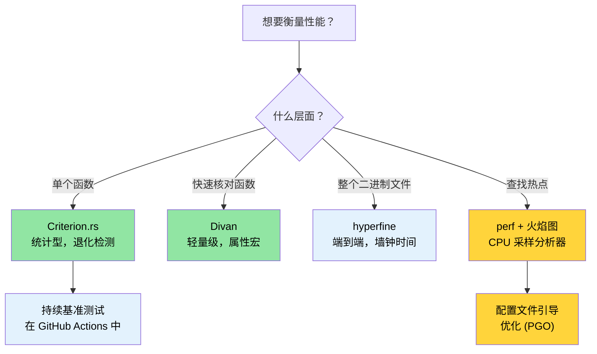

[English Original](../en/ch03-benchmarking-measuring-what-matters.md)

# 基准测试 — 衡量真正重要的指标 🟡

> **你将学到：**
> - 为什么使用 `Instant::now()` 进行简单计时会产生不可靠的结果
> - 使用 Criterion.rs 进行统计型基准测试，以及更轻量的替代方案 Divan
> - 使用 `perf`、火焰图 (flamegraphs) 和 PGO (配置文件引导优化) 分析性能热点
> - 在 CI 中设置持续基准测试，自动捕获性能退化
>
> **相关章节：** [发布配置](ch07-release-profiles-and-binary-size.md) — 找到热动点后，优化二进制文件 · [CI/CD 流水线](ch11-putting-it-all-together-a-production-cic.md) — 流水线中的基准测试任务 · [代码覆盖率](ch04-code-coverage-seeing-what-tests-miss.md) — 覆盖率告诉你测试了什么，基准测试告诉你什么运行得快

“在大约 97% 的时间里，我们应该忘记微小的效率提升：过早的优化是万恶之源。然而，我们不应在剩下的 3% 的关键机会中失之交臂。” —— Donald Knuth

难点不在于 *编写* 基准测试，而在于编写能产生 **有意义、可复现、可操作** 的数据的基准测试。本章涵盖了能让你从“它看起来很快”升级到“我们有统计证据表明 PR #347 使解析吞吐量退化了 4.2%”的工具和技巧。

### 为什么不用 `std::time::Instant`？

常见的做法及其弊端：

```rust
// ❌ 简陋的基准测试 — 结果不可靠
use std::time::Instant;

fn main() {
    let start = Instant::now();
    let result = parse_device_query_output(&sample_data);
    let elapsed = start.elapsed();
    println!("解析耗时 {:?}", elapsed);
    // 问题 1：编译器可能会优化掉 `result`（死代码消除）
    // 问题 2：样本单一 — 无统计学意义
    // 问题 3：CPU 频率缩放、热节流、其他进程干扰
    // 问题 4：未控制冷缓存与热缓存
}
```

手动计时的问题：
1. **死代码消除 (Dead code elimination)** — 如果结果未被使用，编译器可能会完全跳过计算。
2. **缺乏预热 (No warm-up)** — 第一次运行包含缓存未命中、JIT 效应（虽然在 Rust 中不适用，但操作系统页错误适用）和惰性初始化。
3. **缺乏统计分析** — 单次测量无法告诉你方差、异常值或置信区间。
4. **无法检测退化** — 你无法与之前的运行结果进行对比。

### Criterion.rs — 统计基准测试

[Criterion.rs](https://bheisler.github.io/criterion.rs/book/) 是 Rust 微基准测试的事实标准。它使用统计方法产生可靠的测量结果，并自动检测性能退化。

**准备工作：**

```toml
# Cargo.toml
[dev-dependencies]
criterion = { version = "0.5", features = ["html_reports", "cargo_bench_support"] }

[[bench]]
name = "parsing_bench"
harness = false  # 使用 Criterion 的运行器，而非内置的测试运行器
```

**一个完整的基准测试示例：**

```rust
// benches/parsing_bench.rs
use criterion::{black_box, criterion_group, criterion_main, Criterion, BenchmarkId};

/// 解析后的 GPU 信息数据类型
#[derive(Debug, Clone)]
struct GpuInfo {
    index: u32,
    name: String,
    temp_c: u32,
    power_w: f64,
}

/// 待测函数 — 模拟解析设备查询的 CSV 输出
fn parse_gpu_csv(input: &str) -> Vec<GpuInfo> {
    input
        .lines()
        .filter(|line| !line.starts_with('#'))
        .filter_map(|line| {
            let fields: Vec<&str> = line.split(", ").collect();
            if fields.len() >= 4 {
                Some(GpuInfo {
                    index: fields[0].parse().ok()?,
                    name: fields[1].to_string(),
                    temp_c: fields[2].parse().ok()?,
                    power_w: fields[3].parse().ok()?,
                })
            } else {
                None
            }
        })
        .collect()
}

fn bench_parse_gpu_csv(c: &mut Criterion) {
    // 具有代表性的测试数据
    let small_input = "0, Acme Accel-V1-80GB, 32, 65.5\n\
                       1, Acme Accel-V1-80GB, 34, 67.2\n";

    let large_input = (0..64)
        .map(|i| format!("{i}, Acme Accel-X1-80GB, {}, {:.1}\n", 30 + i % 20, 60.0 + i as f64))
        .collect::<String>();

    c.bench_function("parse_2_gpus", |b| {
        b.iter(|| parse_gpu_csv(black_box(small_input)))
    });

    c.bench_function("parse_64_gpus", |b| {
        b.iter(|| parse_gpu_csv(black_box(&large_input)))
    });
}

criterion_group!(benches, bench_parse_gpu_csv);
criterion_main!(benches);
```

**运行并阅读结果：**

```bash
# 运行所有基准测试
cargo bench

# 运行特定的基准测试（按名称过滤）
cargo bench -- parse_64

# 输出示例：
# parse_2_gpus        time:   [1.2345 µs  1.2456 µs  1.2578 µs]
#                      ▲            ▲           ▲
#                      │          置信区间
#                    下限 95%      中位数      上限 95%
#
# parse_64_gpus       time:   [38.123 µs  38.456 µs  38.812 µs]
#                     change: [-1.2345% -0.5678% +0.1234%] (p = 0.12 > 0.05)
#                     未检测到性能变化。
```

**`black_box()` 的作用**：它是一个编译器提示，用于防止死代码消除和过度激进的常量折叠。编译器无法看穿 `black_box`，因此它必须实际计算结果。

### 参数化基准测试与基准测试组

对比多种实现或输入规模：

```rust
// benches/comparison_bench.rs
use criterion::{criterion_group, criterion_main, Criterion, BenchmarkId, Throughput};

fn bench_parsing_strategies(c: &mut Criterion) {
    let mut group = c.benchmark_group("csv_parsing");

    // 在不同的输入规模上进行测试
    for num_gpus in [1, 8, 32, 64, 128] {
        let input = generate_gpu_csv(num_gpus);

        // 设置吞吐量，以报告每秒处理的字节数
        group.throughput(Throughput::Bytes(input.len() as u64));

        group.bench_with_input(
            BenchmarkId::new("split_based", num_gpus),
            &input,
            |b, input| b.iter(|| parse_split(input)),
        );

        group.bench_with_input(
            BenchmarkId::new("regex_based", num_gpus),
            &input,
            |b, input| b.iter(|| parse_regex(input)),
        );

        group.bench_with_input(
            BenchmarkId::new("nom_based", num_gpus),
            &input,
            |b, input| b.iter(|| parse_nom(input)),
        );
    }
    group.finish();
}

criterion_group!(benches, bench_parsing_strategies);
criterion_main!(benches);
```

**报告**：Criterion 会在 `target/criterion/report/index.html` 生成 HTML 报告，包含小提琴图、对比图和退化分析 —— 可直接在浏览器中打开。

### Divan — 一个更轻量的替代方案

[Divan](https://github.com/nvzqz/divan) 是一个新的基准测试框架，它使用属性宏代替了 Criterion 的宏 DSL：

```toml
# Cargo.toml
[dev-dependencies]
divan = "0.1"

[[bench]]
name = "parsing_bench"
harness = false
```

```rust
// benches/parsing_bench.rs
use divan::black_box;

const SMALL_INPUT: &str = "0, Acme Accel-V1-80GB, 32, 65.5\n\
                          1, Acme Accel-V1-80GB, 34, 67.2\n";

fn generate_gpu_csv(n: usize) -> String {
    (0..n)
        .map(|i| format!("{i}, Acme Accel-X1-80GB, {}, {:.1}\n", 30 + i % 20, 60.0 + i as f64))
        .collect()
}

fn main() {
    divan::main();
}

#[divan::bench]
fn parse_2_gpus() -> Vec<GpuInfo> {
    parse_gpu_csv(black_box(SMALL_INPUT))
}

#[divan::bench(args = [1, 8, 32, 64, 128])]
fn parse_n_gpus(n: usize) -> Vec<GpuInfo> {
    let input = generate_gpu_csv(n);
    parse_gpu_csv(black_box(&input))
}

// Divan 输出的是简洁的表格：
// ╰─ parse_2_gpus   最快      │ 最慢      │ 中位数    │ 平均值    │ 样本数  │ 迭代次数
//                   1.234 µs │ 1.567 µs │ 1.345 µs │ 1.350 µs │ 100     │ 1600
```

**何时选择 Divan 而非 Criterion：**
- 更简单的 API（属性宏，更少的样板代码）
- 编译速度更快（依赖更少）
- 适合开发过程中的快速性能检查

**何时选择 Criterion：**
- 跨运行的统计退化检测
- 带有图表的 HTML 报告
- 成熟的生态系统，更多的 CI 集成

### 使用 `perf` 和火焰图进行性能分析

基准测试告诉你 *有多快* —— 性能分析 (profiling) 告诉你 *时间都花在哪了*。

```bash
# 第 1 步：构建时包含调试信息（发布速度，调试符号）
cargo build --release
# 确保调试信息可用：
# [profile.release]
# debug = true          # 临时添加此项进行分析

# 第 2 步：使用 perf 记录
perf record --call-graph=dwarf ./target/release/diag_tool --run-diagnostics

# 第 3 步：生成火焰图
# 安装：cargo install flamegraph
# 安装：cargo install addr2line --features=bin（可选，加速 cargo-flamegraph）
cargo flamegraph --root -- --run-diagnostics
# 生成并打开一个交互式的 SVG 火焰图

# 另一种方式：使用 perf + inferno
perf script | inferno-collapse-perf | inferno-flamegraph > flamegraph.svg
```

**阅读火焰图：**
- **宽度 (Width)** = 在该函数中花费的时间（越宽 = 越慢）
- **高度 (Height)** = 调用栈深度（越高 ≠ 越慢，只是更深）
- **底部 (Bottom)** = 入口点，**顶部 (Top)** = 执行实际工作的叶子函数
- 寻找顶部宽广的“平原” —— 那些就是你的性能热点。

**配置文件引导优化 (PGO):**

```bash
# 第 1 步：构建带有插桩的可执行文件
RUSTFLAGS="-Cprofile-generate=/tmp/pgo-data" cargo build --release

# 第 2 步：运行代表性的负载
./target/release/diag_tool --run-full   # 生成性能分析数据

# 第 3 步：合并性能分析数据
# 使用与 rustc 的 LLVM 版本匹配的 llvm-profdata：
# $(rustc --print sysroot)/lib/rustlib/x86_64-unknown-linux-gnu/bin/llvm-profdata
# 或者如果你安装了 llvm-tools：rustup component add llvm-tools
llvm-profdata merge -o /tmp/pgo-data/merged.profdata /tmp/pgo-data/

# 第 4 步：根据分析反馈重新构建
RUSTFLAGS="-Cprofile-use=/tmp/pgo-data/merged.profdata" cargo build --release
# 典型的提升：计算密集型代码（解析、加密、代码生成）提升 5-20%。
# I/O 密集型或系统调用频繁的代码提升较小，因为 CPU 大部分时间在等待。
```

> **提示**：在花时间研究 PGO 之前，确保你的 [发布配置](ch07-release-profiles-and-binary-size.md) 已经启用了 LTO —— 这通常只需更少的努力就能获得更大的收益。

### `hyperfine` — 快速端到端计时

[`hyperfine`](https://github.com/sharkdp/hyperfine) 对整个命令进行基准测试，而不是单个函数。它非常适合衡量二进制文件的整体性能：

```bash
# 安装
cargo install hyperfine
# 或者通过包管理器安装 (Ubuntu 23.04+): sudo apt install hyperfine

# 基础基准测试
hyperfine './target/release/diag_tool --run-diagnostics'

# 比较两种实现
hyperfine './target/release/diag_tool_v1 --run-diagnostics' \
          './target/release/diag_tool_v2 --run-diagnostics'

# 预热运行 + 最小迭代次数
hyperfine --warmup 3 --min-runs 10 './target/release/diag_tool --run-all'

# 将结果导出为 JSON 以便在 CI 中对比
hyperfine --export-json bench.json './target/release/diag_tool --run-all'
```

**何时使用 `hyperfine` 而非 Criterion：**
- `hyperfine`：整体二进制文件计时、重构前后的对比、I/O 密集型负载
- Criterion：单个函数的微基准测试、统计型退化检测

### 在 CI 中进行持续基准测试

在性能退化版本发布前拦截它们：

```yaml
# .github/workflows/bench.yml
name: Benchmarks

on:
  pull_request:
    paths: ['**/*.rs', 'Cargo.toml', 'Cargo.lock']

jobs:
  benchmark:
    runs-on: ubuntu-latest
    steps:
      - uses: actions/checkout@v4

      - uses: dtolnay/rust-toolchain@stable

      - name: Run benchmarks
        # 需要 criterion = { features = ["cargo_bench_support"] } 以支持 --output-format
        run: cargo bench -- --output-format bencher | tee bench_output.txt

      - name: Store benchmark result
        uses: benchmark-action/github-action-benchmark@v1
        with:
          tool: 'cargo'
          output-file-path: bench_output.txt
          github-token: ${{ secrets.GITHUB_TOKEN }}
          auto-push: true
          alert-threshold: '120%'    # 如果慢了 20% 则报警
          comment-on-alert: true
          fail-on-alert: true        # 检测到退化时阻止 PR 合并
```

**CI 关键考虑点：**
- 使用 **专用基准测试运行器**（而非共享的 CI 节点）以获得一致的结果。
- 如果使用云端 CI，请将运行器固定到特定的机器类型。
- 存储历史数据以检测渐进式的退化。
- 根据负载的容忍度设置阈值（热路径 5%，其他 20%）。

### 应用：解析性能

该项目有多个对性能敏感的解析路径，它们将从基准测试中受益：

| 解析热点 | Crate | 为什么重要 |
|------------------|-------|----------------|
| 加速器查询 CSV/XML 输出 | `device_diag` | 每个 GPU 都会调用，每次运行最多 8 次 |
| 传感器事件解析 | `event_log` | 繁忙服务器上有数千条记录 |
| PCIe 拓扑 JSON | `topology_lib` | 复杂的嵌套结构，经过 Golden-file 验证 |
| 报告 JSON 序列化 | `diag_framework` | 最终报告输出，对体积敏感 |
| 配置 JSON 加载 | `config_loader` | 启动延迟 |

**建议的第一个基准测试** —— 拓扑结构解析器，它已经有了 Golden-file 测试数据：

```rust
// topology_lib/benches/parse_bench.rs (建议)
use criterion::{criterion_group, criterion_main, Criterion, Throughput};
use std::fs;

fn bench_topology_parse(c: &mut Criterion) {
    let mut group = c.benchmark_group("topology_parse");

    for golden_file in ["S2001", "S1015", "S1035", "S1080"] {
        let path = format!("tests/test_data/{golden_file}.json");
        let data = fs::read_to_string(&path).expect("golden file not found");
        group.throughput(Throughput::Bytes(data.len() as u64));

        group.bench_function(golden_file, |b| {
            b.iter(|| {
                topology_lib::TopologyProfile::from_json_str(
                    criterion::black_box(&data)
                )
            });
        });
    }
    group.finish();
}

criterion_group!(benches, bench_topology_parse);
criterion_main!(benches);
```

### 亲自尝试

1. **编写一个 Criterion 基准测试**：挑出代码库中任意一个解析函数。创建一个 `benches/` 目录，设置一个 Criterion 基准测试来衡量每秒处理的字节数。运行 `cargo bench` 并查看 HTML 报告。

2. **生成一份火焰图**：在 `[profile.release]` 中设置 `debug = true` 构建你的项目，然后运行 `cargo flamegraph -- <你的参数>`。找出火焰图顶部最宽的三个栈 —— 它们就是你的热点。

3. **与 `hyperfine` 对比**：安装 `hyperfine` 并在不同标志下测量二进制文件的整体执行时间。将其与 Criterion 测量的各函数时间进行对比。Criterion 没看到的时间都花在哪了？（提示：I/O、系统调用、进程启动）。

### 基准测试工具选择



### 🏋️ 练习

#### 🟢 练习 1：第一个 Criterion 基准测试

创建一个 crate，包含一个对拥有 10,000 个随机元素的 `Vec<u64>` 进行排序的函数。编写一个 Criterion 基准测试。尝试切换到 `.sort_unstable()` 并观察 HTML 报告中性能的差异。

<details>
<summary>答案</summary>

```toml
# Cargo.toml
[[bench]]
name = "sort_bench"
harness = false

[dev-dependencies]
criterion = { version = "0.5", features = ["html_reports"] }
rand = "0.8"
```

```rust
// benches/sort_bench.rs
use criterion::{black_box, criterion_group, criterion_main, Criterion};
use rand::Rng;

fn generate_data(n: usize) -> Vec<u64> {
    let mut rng = rand::thread_rng();
    (0..n).map(|_| rng.gen()).collect()
}

fn bench_sort(c: &mut Criterion) {
    let mut group = c.benchmark_group("sort-10k");

    group.bench_function("stable", |b| {
        b.iter_batched(
            || generate_data(10_000),
            |mut data| { data.sort(); black_box(&data); },
            criterion::BatchSize::SmallInput,
        )
    });

    group.bench_function("unstable", |b| {
        b.iter_batched(
            || generate_data(10_000),
            |mut data| { data.sort_unstable(); black_box(&data); },
            criterion::BatchSize::SmallInput,
        )
    });

    group.finish();
}

criterion_group!(benches, bench_sort);
criterion_main!(benches);
```

```bash
cargo bench
open target/criterion/sort-10k/report/index.html
```
</details>

#### 🟡 练习 2：火焰图中的热点

在 `[profile.release]` 中设置 `debug = true` 构建项目，生成一份火焰图。找出最宽的前三个栈。

<details>
<summary>答案</summary>

```toml
# Cargo.toml
[profile.release]
debug = true  # 保留火焰图所需的符号
```

```bash
cargo install flamegraph
cargo flamegraph --release -- <你的参数>
# 在浏览器中打开 flamegraph.svg
# 顶部最宽的栈就是你的性能热点
```
</details>

### 关键收获

- 绝不要用 `Instant::now()` 进行微基准测试 —— 使用 Criterion.rs 获得统计学上的严谨性和退化检测。
- `black_box()` 防止编译器将你的基准测试目标通过内联或折叠优化掉。
- `hyperfine` 衡量整体二进制文件的运行时间；Criterion 衡量单个函数 —— 两者配合使用。
- 火焰图展示时间花在 *哪* 了；基准测试展示花了 *多少* 时间。
- 在 CI 中设置持续基准测试，可在性能退化上线前及时捕获。

---
