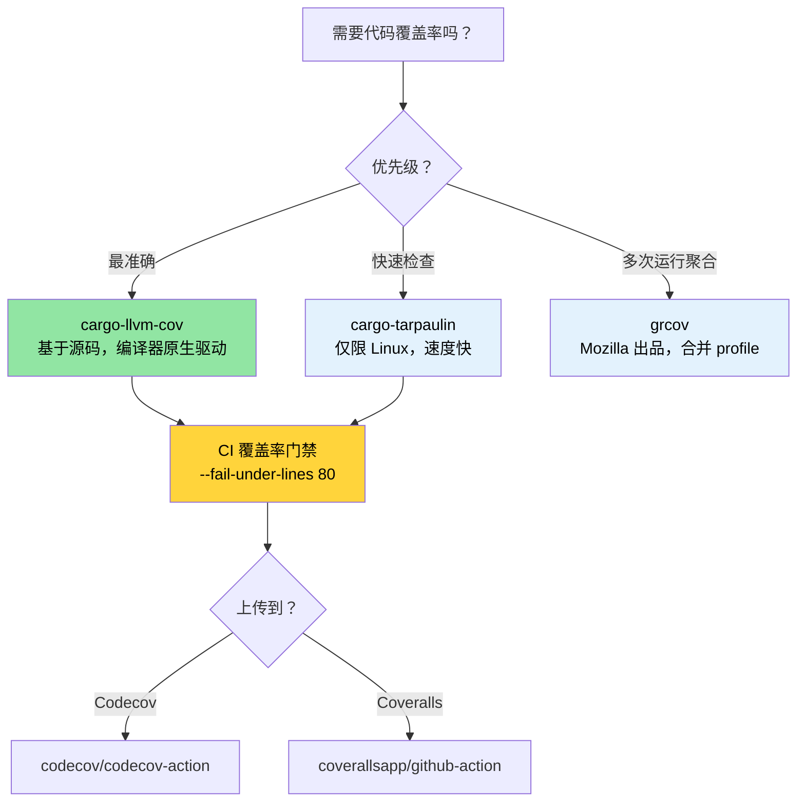

[English Original](../en/ch04-code-coverage-seeing-what-tests-miss.md)

# 代码覆盖率 — 发现测试遗漏 🟢

> **你将学到：**
> - 使用 `cargo-llvm-cov` 进行基于源码的覆盖率分析（最准确的 Rust 覆盖率工具）
> - 使用 `cargo-tarpaulin` 和 Mozilla 的 `grcov` 进行快速覆盖率检查
> - 在 CI 中使用 Codecov 和 Coveralls 设置覆盖率门禁 (Coverage Gates)
> - 优先处理高风险盲点的覆盖率导向型测试策略
>
> **相关章节：** [Miri 与 Sanitizer](ch05-miri-valgrind-and-sanitizers-verifying-u.md) — 覆盖率发现未测试的代码，Miri 发现已测试代码中的 UB · [基准测试](ch03-benchmarking-measuring-what-matters.md) — 覆盖率展示 *测试了什么*，基准测试展示 *什么运行得快* · [CI/CD 流水线](ch11-putting-it-all-together-a-production-cic.md) — 流水线中的覆盖率门禁

代码覆盖率衡量你的测试实际执行了哪些行、分支或函数。它不能证明代码的正确性（覆盖到的行仍可能存在 bug），但它能可靠地揭示 **盲点** —— 即没有任何测试覆盖到的代码路径。

本项目在多个 crate 中拥有 1,006 个测试，投入了大量的测试精力。覆盖率分析可以回答：“这些投入是否触及了真正关键的代码？”

### 使用 `llvm-cov` 进行基于源码的覆盖率分析

Rust 使用 LLVM，它提供了基于源码的插桩覆盖率 —— 这是目前最准确的覆盖率分析方法。推荐使用的工具是 [`cargo-llvm-cov`](https://github.com/taiki-e/cargo-llvm-cov)：

```bash
# 安装
cargo install cargo-llvm-cov

# 或者通过 rustup 安装组件（获取原始 llvm 工具）
rustup component add llvm-tools-preview
```

**基础用法：**

```bash
# 运行测试并显示每个文件的覆盖率摘要
cargo llvm-cov

# 生成 HTML 报告（可浏览器查阅，带有逐行高亮）
cargo llvm-cov --html
# 输出路径：target/llvm-cov/html/index.html

# 生成 LCOV 格式（用于 CI 集成）
cargo llvm-cov --lcov --output-path lcov.info

# 工作区全量覆盖率（所有 crate）
cargo llvm-cov --workspace

# 仅包含特定的包
cargo llvm-cov --package accel_diag --package topology_lib

# 覆盖率包含文档测试 (doc tests)
cargo llvm-cov --doctests
```

**阅读 HTML 报告：**

```text
target/llvm-cov/html/index.html
├── 文件名                │ 函数     │ 行       │ 分支     │ 区域
├─ accel_diag/src/lib.rs │  78.5%  │ 82.3%   │ 61.2%   │  74.1%
├─ sel_mgr/src/parse.rs  │  95.2%  │ 96.8%   │ 88.0%   │  93.5%
├─ topology_lib/src/..   │  91.0%  │ 93.4%   │ 79.5%   │  89.2%
└─ ...

绿色 = 已覆盖    红色 = 未覆盖    黄色 = 部分覆盖（分支）
```

**覆盖率类型说明：**

| 类型 | 衡量内容 | 意义 |
|------|------------------|-------------|
| **行覆盖率 (Line)** | 执行了哪些源码行 | 基础的“这段代码被跑到了吗？” |
| **分支覆盖率 (Branch)** | 执行了哪些 `if`/`match` 分支 | 捕捉未测试的条件判断 |
| **函数覆盖率 (Function)** | 调用了哪些函数 | 发现死代码 |
| **区域覆盖率 (Region)** | 命中了哪些代码区域（子表达式） | 颗粒度最细 |

### cargo-tarpaulin — 快捷路径

[`cargo-tarpaulin`](https://github.com/xd009642/tarpaulin) 是一个专门针对 Linux 的覆盖率工具，它的设置更简单（无需安装 LLVM 组件）：

```bash
# 安装
cargo install cargo-tarpaulin

# 基础覆盖率报告
cargo tarpaulin

# HTML 输出
cargo tarpaulin --out Html

# 使用特定选项
cargo tarpaulin \
    --workspace \
    --timeout 120 \
    --out Xml Html \
    --output-dir coverage/ \
    --exclude-files "*/tests/*" "*/benches/*" \
    --ignore-panics

# 跳过特定的 crate
cargo tarpaulin --workspace --exclude diag_tool  # 排除二进制 crate
```

**tarpaulin 与 llvm-cov 对比：**

| 特性 | cargo-llvm-cov | cargo-tarpaulin |
|---------|----------------|-----------------|
| 准确性 | 基于源码 (最准确) | 基于 ptrace (偶尔会有误报) |
| 平台 | 任何 (基于 llvm) | 仅限 Linux |
| 分支覆盖率 | 支持 | 有限支持 |
| 文档测试 | 支持 | 不支持 |
| 安装设置 | 需要 `llvm-tools-preview` | 自包含 |
| 速度 | 较快 (编译期插桩) | 较慢 (ptrace 开销) |
| 稳定性 | 非常稳定 | 偶尔会出现伪阳性 |

**建议**：追求准确性时使用 `cargo-llvm-cov`。如果你只需要在 Linux 上进行快速检查且不想安装 LLVM 工具，可以使用 `cargo-tarpaulin`。

### grcov — Mozilla 的覆盖率工具

[`grcov`](https://github.com/mozilla/grcov) 是 Mozilla 开发的覆盖率聚合器。它消费原始的 LLVM 剖析数据并生成多种格式的报告：

```bash
# 安装
cargo install grcov

# 第 1 步：构建带有插桩信息的二进制文件
export RUSTFLAGS="-Cinstrument-coverage"
export LLVM_PROFILE_FILE="target/coverage/%p-%m.profraw"
cargo build --tests

# 第 2 步：运行测试（生成 .profraw 文件）
cargo test

# 第 3 步：使用 grcov 进行聚合
grcov target/coverage/ \
    --binary-path target/debug/ \
    --source-dir . \
    --output-types html,lcov \
    --output-path target/coverage/report \
    --branch \
    --ignore-not-existing \
    --ignore "*/tests/*" \
    --ignore "*/.cargo/*"

# 第 4 步：查看报告
open target/coverage/report/html/index.html
```

**何时使用 grcov**：当你需要将 **多次测试运行的覆盖率合并**（例如：单元测试 + 集成测试 + 模糊测试）到单一报告中时，它最为有用。

### CI 中的覆盖率：Codecov 与 Coveralls

将覆盖率数据上传至跟踪服务，以便查看历史趋势和 PR 批注：

```yaml
# .github/workflows/coverage.yml
name: Code Coverage

on: [push, pull_request]

jobs:
  coverage:
    runs-on: ubuntu-latest
    steps:
      - uses: actions/checkout@v4
      - uses: dtolnay/rust-toolchain@stable
        with:
          components: llvm-tools-preview

      - name: Install cargo-llvm-cov
        uses: taiki-e/install-action@cargo-llvm-cov

      - name: Generate coverage
        run: cargo llvm-cov --workspace --lcov --output-path lcov.info

      - name: Upload to Codecov
        uses: codecov/codecov-action@v4
        with:
          files: lcov.info
          token: ${{ secrets.CODECOV_TOKEN }}
          fail_ci_if_error: true

      # 可选：强制要求最低覆盖率
      - name: Check coverage threshold
        run: |
          cargo llvm-cov --workspace --fail-under-lines 80
          # 如果行覆盖率低于 80%，则构建失败
```

**覆盖率门禁** —— 通过读取 JSON 输出，对每个 crate 强制执行最低标准：

```bash
# 获取每个 crate 的覆盖率（JSON 格式）
cargo llvm-cov --workspace --json | jq '.data[0].totals.lines.percent'

# 低于阈值则报错
cargo llvm-cov --workspace --fail-under-lines 80
cargo llvm-cov --workspace --fail-under-functions 70
cargo llvm-cov --workspace --fail-under-regions 60
```

### 覆盖率导向型测试策略

如果没有策略，覆盖率数值本身毫无意义。以下是如何有效利用覆盖率数据的方法：

**第 1 步：按风险进行分类 (Triage by risk)**

```text
高覆盖率，高风险     → ✅ 优 — 保持现状
高覆盖率，低风险     → 🔄 可能过度测试 — 如果速度太慢可精简
低覆盖率，高风险     → 🔴 立即编写测试 — 这是 bug 处理的温床
低覆盖率，低风险     → 🟡 跟踪但不必恐慌
```

**第 2 步：关注分支覆盖率，而非行覆盖率**

```rust
// 100% 的行覆盖率，但只有 50% 的分支覆盖率 —— 仍然充满风险！
pub fn classify_temperature(temp_c: i32) -> ThermalState {
    if temp_c > 105 {       // ← 使用 temp=110 测试过 → Critical
        ThermalState::Critical
    } else if temp_c > 85 { // ← 使用 temp=90 测试过 → Warning
        ThermalState::Warning
    } else if temp_c < -10 { // ← 从未测试过 → 遗漏了传感器错误情况
        ThermalState::SensorError
    } else {
        ThermalState::Normal  // ← 使用 temp=25 测试过 → Normal
    }
}
```

**第 3 步：排除噪音**

```bash
# 排除测试代码（它们总是“被覆盖”的）
cargo llvm-cov --workspace --ignore-filename-regex 'tests?\.rs$|benches/'

# 排除生成的代码
cargo llvm-cov --workspace --ignore-filename-regex 'target/'
```

在代码中标记无法测试的部分：

```rust
// 覆盖率工具可以识别这种模式
#[cfg(not(tarpaulin_include))]  // 针对 tarpaulin
fn unreachable_hardware_path() {
    // 该路径需要实际的 GPU 硬件才能触发
}

// 对于 llvm-cov，建议采用更有针对性的方法：
// 接受某些路径需要集成/硬件测试而非单元测试。
// 将它们整理进覆盖率例外清单中。
```

### 补充测试工具

**`proptest` — 基于属性的测试 (Property-Based Testing)** 能发现手动编写测试时遗漏的边界情况：

```toml
[dev-dependencies]
proptest = "1"
```

```rust
use proptest::prelude::*;

proptest! {
    #[test]
    fn parse_never_panics(input in "\\PC*") {
        // proptest 生成数千个随机字符串
        // 如果 parse_gpu_csv 在任何输入上崩溃 (panic)，测试就会失败，
        // 并且 proptest 会为你最小化失败用例。
        let _ = parse_gpu_csv(&input);
    }

    #[test]
    fn temperature_roundtrip(raw in 0u16..4096) {
        let temp = Temperature::from_raw(raw);
        let md = temp.millidegrees_c();
        // 属性：毫摄氏度应当总是能从原始值推导出来
        assert_eq!(md, (raw as i32) * 625 / 10);
    }
}
```

**`insta` — 快照测试 (Snapshot Testing)** 适用于大型结构化输出（JSON、文本报告）：

```toml
[dev-dependencies]
insta = { version = "1", features = ["json"] }
```

```rust
#[test]
fn test_der_report_format() {
    let report = generate_der_report(&test_results);
    // 第一次运行：创建快照文件。后续运行：与快照进行对比。
    // 运行 `cargo insta review` 可以交互式地接受变更。
    insta::assert_json_snapshot!(report);
}
```

> **何时添加 proptest/insta**：如果你的单元测试全都是“常用路径”示例，proptest 会帮你找出遗漏的边界情况。如果你正在测试大型输出格式（JSON 报告、DER 记录），insta 快照比手动编写断言更快且更易维护。

### 应用：1,000+ 测试的覆盖率蓝图

本项目有 1,000 多个测试，但没有覆盖率跟踪。添加覆盖率分析可以揭示测试投入的分布情况。未覆盖的路径是进行 [Miri 与 sanitizer](ch05-miri-valgrind-and-sanitizers-verifying-u.md) 验证的首选对象：

**建议的覆盖率配置：**

```bash
# 工作区快速覆盖率分析（建议的 CI 命令）
cargo llvm-cov --workspace \
    --ignore-filename-regex 'tests?\.rs$' \
    --fail-under-lines 75 \
    --html

# 针对各个 crate 的覆盖率，进行定向提升
for crate in accel_diag event_log topology_lib network_diag compute_diag fan_diag; do
    echo "=== $crate ==="
    cargo llvm-cov --package "$crate" --json 2>/dev/null | \
        jq -r '.data[0].totals | "Lines: \(.lines.percent | round)%  Branches: \(.branches.percent | round)%"'
done
```

**预期覆盖率较高的 crate**（基于测试密度）：
- `topology_lib` — 拥有 922 行的 Golden-file 测试套件
- `event_log` — 拥有 `create_test_record()` 辅助函数的注册中心
- `cable_diag` — 采用了 `make_test_event()` / `make_test_context()` 模式的代码

**预期覆盖率缺口**（基于代码检查）：
- IPMI 通信路径中的错误处理分支
- GPU 硬件特定的分支（需要实际 GPU 环境）
- `dmesg` 解析边界情况（依赖特定平台的输出）

> **覆盖率的 80/20 法则**：从 0% 提升到 80% 覆盖率是比较直接的。从 80% 提升到 95% 则需要日益复杂的测试场景。从 95% 提升到 100% 通常需要大量 `#[cfg(not(...))]` 排除项，往往得不偿失。在实践中，建议将 **80% 行覆盖率和 70% 分支覆盖率** 作为底线。

### 覆盖率排错

| 现象 | 原因 | 修复方法 |
|---------|-------|-----|
| `llvm-cov` 对所有文件显示 0% | 未启用插桩 | 确保运行的是 `cargo llvm-cov`，而不是分开运行 `cargo test` 和 `llvm-cov` |
| 覆盖率将 `unreachable!()` 计为未覆盖 | 编译后的代码中确实存在这些分支 | 使用 `#[cfg(not(tarpaulin_include))]` 或将其加入排除正则 |
| 测试二进制文件在覆盖率模式下崩溃 | 插桩信息与 sanitizer 冲突 | 不要同时运行 `cargo llvm-cov` 和 `-Zsanitizer=address`；请分开运行 |
| `llvm-cov` 与 `tarpaulin` 结果不一致 | 插桩技术不同 | 以 `llvm-cov` 为准（编译器原生支持）；如果差异过大请提交 issue |
| 提示 `error: profraw file is malformed` | 测试二进制文件在执行过程中崩溃 | 首先修复测试失败；如果进程异常退出，profraw 文件会损坏 |
| 分支覆盖率低得离谱 | 优化器为 match 分支、unwrap 等创建了分支 | 在设置门槛时关注 *行* 覆盖率；分支覆盖率天然较低 |

### 亲自尝试

1. **衡量你项目的覆盖率**：运行 `cargo llvm-cov --workspace --html` 并打开报告。找出覆盖率最低的三个文件。它们是未经测试，还是由于硬件依赖性而天生难以测试？

2. **设置覆盖率门禁**：在 CI 中添加 `cargo llvm-cov --workspace --fail-under-lines 60`。故意注释掉一个测试，验证 CI 是否失败。然后逐步将阈值提高到实际覆盖率减去 2% 的水平。

3. **分支 vs 行覆盖率**：编写一个带有 3 分支 `match` 的函数，仅测试其中 2 个分支。对比行覆盖率（可能显示 66%）与分支覆盖率（可能显示 50%）。哪种指标对你的项目更有参考价值？

### 覆盖率工具选择



### 🏋️ 练习

#### 🟢 练习 1：第一份覆盖率报告

安装 `cargo-llvm-cov`，在任意 Rust 项目上运行并打开 HTML 报告。找出行覆盖率最低的三个文件。

<details>
<summary>答案</summary>

```bash
cargo install cargo-llvm-cov
cargo llvm-cov --workspace --html --open
# 报告会根据覆盖率对文件进行排序 —— 覆盖率最低的排在前面或按列排序
# 寻找低于 50% 的文件 —— 它们就是你的盲点
```
</details>

#### 🟡 练习 2：CI 覆盖率门禁

在 GitHub Actions 工作流中添加一个覆盖率门禁，如果行覆盖率低于 60% 则报错。通过注释掉一个测试来验证其效果。

<details>
<summary>答案</summary>

```yaml
# .github/workflows/coverage.yml
name: Coverage
on: [push, pull_request]
jobs:
  coverage:
    runs-on: ubuntu-latest
    steps:
      - uses: actions/checkout@v4
      - uses: dtolnay/rust-toolchain@stable
        with:
          components: llvm-tools-preview
      - run: cargo install cargo-llvm-cov
      - run: cargo llvm-cov --workspace --fail-under-lines 60
```

注释掉一个测试后推送，观察工作流是否失败。
</details>

### 关键收获

- `cargo-llvm-cov` 是 Rust 最准确的覆盖率工具 —— 它采用了编译器原生的插桩技术。
- 覆盖率不能证明代码正确，但 **零覆盖率能证明零测试** —— 利用它寻找盲点。
- 在 CI 中设置覆盖率门禁（例如 `--fail-under-lines 80`）以防止性能/质量退化。
- 不要盲目追求 100% 覆盖率 —— 重点关注高风险的代码路径（错误处理、unsafe、解析）。
- 绝不要在同一次运行中混合使用覆盖率插桩和 sanitizer。

---
