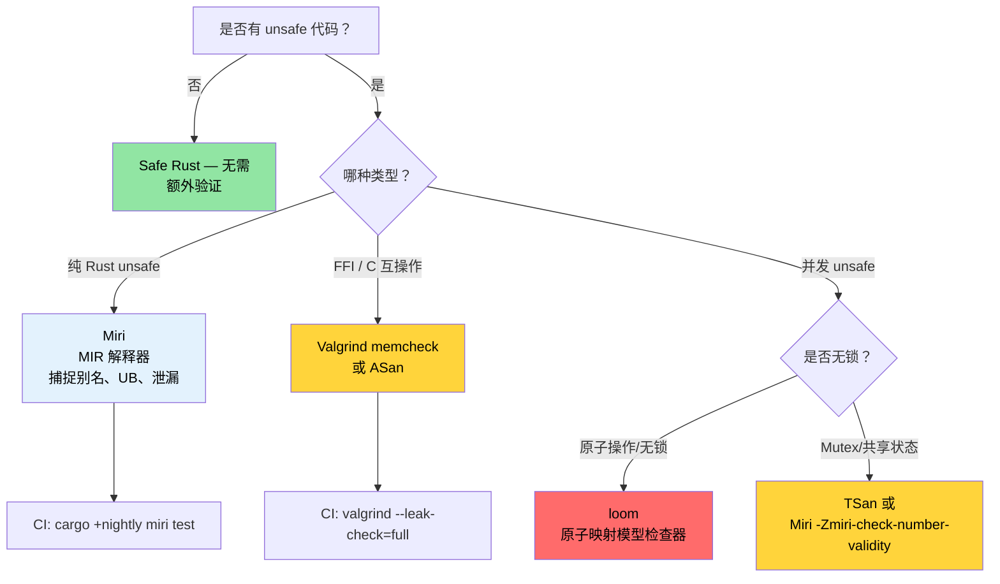

[English Original](../en/ch05-miri-valgrind-and-sanitizers-verifying-u.md)

# Miri, Valgrind 与 Sanitizer — 验证 Unsafe 代码 🔴

> **你将学到：**
> - Miri 作为 MIR 解释器 — 它能捕捉到什么（别名违规、UB、泄漏）以及它的局限性（FFI、系统调用）
> - Valgrind memcheck (内存检查)、Helgrind (数据竞态)、Callgrind (性能分析) 和 Massif (堆分析)
> - LLVM sanitizer：ASan、MSan、TSan、LSan 配合 nightly `-Zbuild-std` 的使用
> - 使用 `cargo-fuzz` 进行崩溃发现，以及使用 `loom` 进行并发模型检查
> - 选择合适的验证工具的决策树
>
> **相关章节：** [代码覆盖率](ch04-code-coverage-seeing-what-tests-miss.md) — 覆盖率发现未测试的路径，Miri 验证已测试的路径 · [`no_std` 与特性验证](ch09-no-std-and-feature-verification.md) — `no_std` 代码通常需要 `unsafe`，可用 Miri 验证 · [CI/CD 流水线](ch11-putting-it-all-together-a-production-cic.md) — 流水线中的 Miri 任务

Safe Rust 在编译时保证了内存安全和无数据竞态。但当你为了 FFI、手写数据结构或性能优化而写下 `unsafe` 的那一刻起，这些保证就变成了 *你* 的责任。本章涵盖了用于验证你的 `unsafe` 代码是否真正履行了其安全承诺的工具。

### Miri — Unsafe Rust 解释器

[Miri](https://github.com/rust-lang/miri) 是 Rust 中层中间表示 (Mid-level Intermediate Representation, MIR) 的 **解释器**。它不将代码编译为机器码，而是逐步 *执行* 你的程序，并在每一步操作中对未定义行为 (Undefined Behavior, UB) 进行详尽检查。

```bash
# 安装 Miri (仅限 nightly 组件)
rustup +nightly component add miri

# 在 Miri 下运行测试套件
cargo +nightly miri test

# 在 Miri 下运行特定二进制文件
cargo +nightly miri run

# 运行特定测试
cargo +nightly miri test -- test_name
```

**Miri 工作原理：**

```text
源码 → rustc → MIR → Miri 解释 MIR
                       │
                       ├─ 跟踪每个指针的来源 (provenance)
                       ├─ 验证每次内存访问
                       ├─ 在每次解引用时检查对齐情况
                       ├─ 检测释放后使用 (use-after-free)
                       ├─ 检测数据竞态 (配合线程)
                       └─ 强制执行 Stacked Borrows / Tree Borrows 规则
```

### Miri 能捕捉到什么 (以及它不能做什么)

**Miri 检测项：**

| 类别 | 示例 | 运行时会崩溃吗？ |
|----------|---------|------------------------|
| 越界访问 | 对分配空间外的 `ptr.add(100).read()` | 有时会 (取决于页面布局) |
| 释放后使用 | 通过原始指针读取已掉落的 `Box` | 有时会 (取决于分配器) |
| 重复释放 | 调用 `drop_in_place` 两次 | 通常会 |
| 未对齐访问 | 在奇数地址上执行 `(ptr as *const u32).read()` | 在某些架构上会 |
| 无效值 | 执行 `transmute::<u8, bool>(2)` | 静默错误 |
| 悬空引用 | 指向已释放内存的 `&*ptr` | 不会 (静默损坏) |
| 数据竞态 | 两线程一写一读，无同步 | 间歇性，难以复现 |
| 借用规则违规 | 别名化 `&mut` 引用 (Stacked Borrows) | 不会 (静默损坏) |

**Miri 无法检测项：**

| 局限性 | 原因 |
|-----------|-----|
| 逻辑 Bug | Miri 检查内存安全，而非逻辑正确性 |
| 并发死锁 | Miri 检查数据竞态，而非活锁 |
| 性能问题 | 解释执行比原生执行慢 10-100 倍 |
| 系统/硬件交互 | Miri 无法模拟系统调用、设备 I/O |
| 所有 FFI 调用 | 无法解释 C 代码 (仅限 Rust MIR) |
| 完备的路径覆盖 | 仅测试你的测试套件所触及的路径 |

**具体示例 — 捕捉在实践中能“跑通”但存在风险的代码：**

```rust
#[cfg(test)]
mod tests {
    #[test]
    fn test_miri_catches_ub() {
        // 这在 release 构建中可能“正常工作”，但属于未定义行为
        let mut v = vec![1, 2, 3];
        let ptr = v.as_ptr();

        // push 可能会导致重新分配，从而使 ptr 失效
        v.push(4);

        // ❌ UB: 重新分配后 ptr 可能悬空
        // 即使分配器恰好没有移动缓冲区，Miri 也会捕捉到这一点。
        // let _val = unsafe { *ptr };
        // Miri 会报告错误：
        //   "pointer to alloc1234 was dereferenced after this
        //    allocation got freed"
        
        // ✅ 正确：在变更后获取新指针
        let ptr = v.as_ptr();
        let val = unsafe { *ptr };
        assert_eq!(val, 1);
    }
}
```

### 在真实 Crate 上运行 Miri

**针对含有 `unsafe` 的 crate 的 Miri 实践流程：**

```bash
# 第 1 步：在 Miri 下运行所有测试
cargo +nightly miri test 2>&1 | tee miri_output.txt

# 第 2 步：如果 Miri 报错，隔离该测试
cargo +nightly miri test -- failing_test_name

# 第 3 步：使用 Miri 的回溯信息进行诊断
MIRIFLAGS="-Zmiri-backtrace=full" cargo +nightly miri test

# 第 4 步：选择借用模型
# Stacked Borrows (默认，最严格):
cargo +nightly miri test

# Tree Borrows (实验性，更宽松):
MIRIFLAGS="-Zmiri-tree-borrows" cargo +nightly miri test
```

**常用场景的 Miri 标志：**

```bash
# 禁用隔离 (允许访问文件系统、环境变量)
MIRIFLAGS="-Zmiri-disable-isolation" cargo +nightly miri test

# Miri 默认开启内存泄漏检测。
# 若要屏蔽泄漏错误 (例如有意为之的泄漏):
# MIRIFLAGS="-Zmiri-ignore-leaks" cargo +nightly miri test

# 为随机化测试设置种子，以保证结果可复现
MIRIFLAGS="-Zmiri-seed=42" cargo +nightly miri test

# 开启严格的来源 (provenance) 检查
MIRIFLAGS="-Zmiri-strict-provenance" cargo +nightly miri test

# 组合多个标志
MIRIFLAGS="-Zmiri-disable-isolation -Zmiri-backtrace=full -Zmiri-strict-provenance" \
    cargo +nightly miri test
```

**CI 中的 Miri 配置：**

```yaml
# .github/workflows/miri.yml
name: Miri
on: [push, pull_request]

jobs:
  miri:
    runs-on: ubuntu-latest
    steps:
      - uses: actions/checkout@v4
      - uses: dtolnay/rust-toolchain@nightly
        with:
          components: miri

      - name: Run Miri
        run: cargo miri test --workspace
        env:
          MIRIFLAGS: "-Zmiri-backtrace=full"
          # 默认开启泄漏检查。
          # 跳过那些使用了 Miri 无法处理的系统调用的测试
          # (如文件 I/O、网络等)
```

> **性能提示**：Miri 比原生执行慢 10-100 倍。一个原生运行需 5 秒的测试套件，在 Miri 下可能需要 5 分钟。在 CI 中，建议仅对包含 `unsafe` 代码的关键 crate 运行 Miri。

### Valgrind 及其 Rust 集成

[Valgrind](https://valgrind.org/) 是经典的 C/C++ 内存检查器。它同样适用于编译后的 Rust 二进制文件，在机器码层面检查内存错误。

```bash
# 安装 Valgrind
sudo apt install valgrind  # Debian/Ubuntu
sudo dnf install valgrind  # Fedora

# 构建时包含调试信息 (Valgrind 需要符号表)
cargo build --tests
# 或者构建带调试信息的 release 版本：
# cargo build --release
# [profile.release]
# debug = true

# 在 Valgrind 下运行特定的测试二进制文件
valgrind --tool=memcheck \
    --leak-check=full \
    --show-leak-kinds=all \
    --track-origins=yes \
    ./target/debug/deps/my_crate-abc123 --test-threads=1

# 运行主二进制文件
valgrind --tool=memcheck \
    --leak-check=full \
    --error-exitcode=1 \
    ./target/debug/diag_tool --run-diagnostics
```

**除 memcheck 外的其他 Valgrind 工具：**

| 工具 | 命令 | 检测内容 |
|------|---------|----------------|
| **Memcheck** | `--tool=memcheck` | 内存泄漏、释放后使用、缓冲区溢出 |
| **Helgrind** | `--tool=helgrind` | 数据竞态和锁顺序违规 |
| **DRD** | `--tool=drd` | 数据竞态 (不同的检测算法) |
| **Callgrind** | `--tool=callgrind` | CPU 指令级分析 (路径级) |
| **Massif** | `--tool=massif` | 堆内存随时间的使用情况分析 |
| **Cachegrind** | `--tool=cachegrind` | 缓存未命中分析 |

**使用 Callgrind 进行指令级分析：**

```bash
# 记录指令计数 (比墙钟时间更稳定)
valgrind --tool=callgrind \
    --callgrind-out-file=callgrind.out \
    ./target/release/diag_tool --run-diagnostics

# 使用 KCachegrind 可视化
kcachegrind callgrind.out
# 或使用命令行工具查看：
callgrind_annotate callgrind.out | head -100
```

**Miri vs Valgrind — 如何选择：**

| 维度 | Miri | Valgrind |
|--------|------|----------|
| 检查 Rust 特有的 UB | ✅ 支持 Stacked/Tree Borrows | ❌ 不理解 Rust 特有规则 |
| 检查 C FFI 代码 | ❌ 无法解释 C 代码 | ✅ 检查所有机器码 |
| 是否需要 Nightly | ✅ 是 | ❌ 否 |
| 运行速度 | 慢 10-100 倍 | 慢 10-50 倍 |
| 平台支持 | 任何 (解释 MIR) | Linux, macOS (运行原生代码) |
| 数据竞态检测 | ✅ 是 | ✅ 是 (Helgrind/DRD) |
| 内存泄漏检测 | ✅ 是 | ✅ 是 (更彻底) |
| 误报率 | 极低 | 偶有 (尤其是针对分配器时) |

**建议两者结合使用**：
- **Miri** 用于纯 Rust 的 `unsafe` 代码（检查 Stacked Borrows、来源等）。
- **Valgrind** 用于包含大量 FFI 的代码以及全程序的泄漏分析。

### AddressSanitizer, MemorySanitizer, ThreadSanitizer

LLVM sanitizer 是编译期插桩手段，它会在运行时插入检查。它们比 Valgrind 更快（开销为 2-5 倍，而 Valgrind 为 10-50 倍），且能捕捉不同类别的 Bug。

```bash
# 必需：安装 Rust 源码以便在使用 sanitizer 插桩时重新编译 std
rustup component add rust-src --toolchain nightly

# AddressSanitizer (ASan) — 缓冲区溢出、释放后使用、栈溢出
RUSTFLAGS="-Zsanitizer=address" \
    cargo +nightly test -Zbuild-std --target x86_64-unknown-linux-gnu

# MemorySanitizer (MSan) — 读取未初始化内存
RUSTFLAGS="-Zsanitizer=memory" \
    cargo +nightly test -Zbuild-std --target x86_64-unknown-linux-gnu

# ThreadSanitizer (TSan) — 数据竞态
RUSTFLAGS="-Zsanitizer=thread" \
    cargo +nightly test -Zbuild-std --target x86_64-unknown-linux-gnu

# LeakSanitizer (LSan) — 内存泄漏 (默认已包含在 ASan 中)
RUSTFLAGS="-Zsanitizer=leak" \
    cargo +nightly test --target x86_64-unknown-linux-gnu
```

> **注意**：ASan, MSan 和 TSan 都需要 `-Zbuild-std` 来重新编译标准库以便插入插桩信息。LSan 则不需要。

**Sanitizer 对比：**

| Sanitizer | 开销 | 捕捉内容 | 是否需 Nightly | 是否需 `-Zbuild-std` |
|-----------|----------|---------|----------|----------------|
| **ASan** | 2倍内存, 2倍 CPU | 缓冲区溢出、释放后使用、栈溢出 | 是 | 是 |
| **MSan** | 3倍内存, 3倍 CPU | 读取未初始化内存 | 是 | 是 |
| **TSan** | 5-10倍内存, 5倍 CPU | 数据竞态 | 是 | 是 |
| **LSan** | 极小 | 内存泄漏 | 是 | 否 |

**实践示例 — 使用 TSan 捕捉数据竞态：**

```rust
use std::sync::Arc;
use std::thread;

fn racy_counter() -> u64 {
    // ❌ UB: 未经同步的共享可变状态
    let data = Arc::new(std::cell::UnsafeCell::new(0u64));
    let mut handles = vec![];

    for _ in 0..4 {
        let data = Arc::clone(&data);
        handles.push(thread::spawn(move || {
            for _ in 0..1000 {
                // SAFETY: 这是一个不健壮的实现 —— 存在数据竞态！
                unsafe {
                    *data.get() += 1;
                }
            }
        }));
    }

    for h in handles {
        h.join().unwrap();
    }

    // 正确结果应为 4000，但由于竞态，结果是不确定的
    unsafe { *data.get() }
}

// Miri 和 TSan 都能捕捉到这一点：
// Miri:  "Data race detected between (1) write and (2) write"
// TSan:  "WARNING: ThreadSanitizer: data race"
//
// 修复：使用 AtomicU64 或 Mutex<u64>
```

### 相关工具：模糊测试与并发验证

**`cargo-fuzz` — 覆盖率导向型模糊测试** (用于发现解析器和解码器中的崩溃):

```bash
# 安装
cargo install cargo-fuzz

# 初始化模糊测试目标
cargo fuzz init
cargo fuzz add parse_gpu_csv
```

```rust
// fuzz/fuzz_targets/parse_gpu_csv.rs
#![no_main]
use libfuzzer_sys::fuzz_target;

fuzz_target!(|data: &[u8]| {
    if let Ok(s) = std::str::from_utf8(data) {
        // 模糊测试器会生成数百万个输入，试图寻找导致 panic 或崩溃的情况。
        let _ = diag_tool::parse_gpu_csv(s);
    }
});
```

```bash
# 运行模糊测试 (持续运行直至手动中断或发现崩溃)
cargo +nightly fuzz run parse_gpu_csv -- -max_total_time=300  # 运行 5 分钟

# 最小化崩溃用例
cargo +nightly fuzz tmin parse_gpu_csv artifacts/parse_gpu_csv/crash-...
```

> **何时进行模糊测试**：任何解析不可信/半可信输入的函数（如传感器输出、配置文件、网络数据、JSON/CSV）。模糊测试在几乎所有主流 Rust 解析库（如 serde, regex, image）中都发现了真实的 Bug。

**`loom` — 并发模型检查器** (详尽测试原子操作顺序):

```toml
[dev-dependencies]
loom = "0.7"
```

```rust
#[cfg(loom)]
mod tests {
    use loom::sync::atomic::{AtomicUsize, Ordering};
    use loom::thread;

    #[test]
    fn test_counter_is_atomic() {
        loom::model(|| {
            let counter = loom::sync::Arc::new(AtomicUsize::new(0));
            let c1 = counter.clone();
            let c2 = counter.clone();

            let t1 = thread::spawn(move || { c1.fetch_add(1, Ordering::SeqCst); });
            let t2 = thread::spawn(move || { c2.fetch_add(1, Ordering::SeqCst); });

            t1.join().unwrap();
            t2.join().unwrap();

            // loom 会探索所有可能的线程交织情况
            assert_eq!(counter.load(Ordering::SeqCst), 2);
        });
    }
}
```

> **何时使用 `loom`**：当你编写无锁 (lock-free) 数据结构或自定义同步原语时。Loom 会穷尽探索线程间的各种交织 —— 它是一个模型检查器，而非压力测试器。基于 `Mutex`/`RwLock` 的代码通常不需要它。

### 验证工具决策树

```text
Unsafe 验证决策树：

代码是纯 Rust 吗 (无 FFI)？
├─ 是 → 使用 Miri (捕捉 Rust 特有的 UB, Stacked Borrows)
│        同时在 CI 中运行 ASan 以实现深度防御
└─ 否 (通过 FFI 调用了 C/C++ 代码)
   ├─ 担心内存安全？
   │  └─ 是 → 同时使用 Valgrind memcheck 和 ASan
   ├─ 担心并发问题？
   │  └─ 是 → 使用 TSan (更灵敏) 或 Helgrind (更彻底)
   └─ 担心内存泄漏？
      └─ 是 → 使用 Valgrind --leak-check=full
```

**建议的 CI 矩阵：**

```yaml
# 并行运行所有工具以获得快速反馈
jobs:
  miri:
    runs-on: ubuntu-latest
    steps:
      - uses: dtolnay/rust-toolchain@nightly
        with: { components: miri }
      - run: cargo miri test --workspace

  asan:
    runs-on: ubuntu-latest
    steps:
      - uses: dtolnay/rust-toolchain@nightly
      - run: |
          RUSTFLAGS="-Zsanitizer=address" \
          cargo test -Zbuild-std --target x86_64-unknown-linux-gnu

  valgrind:
    runs-on: ubuntu-latest
    steps:
      - run: sudo apt-get install -y valgrind
      - uses: dtolnay/rust-toolchain@stable
      - run: cargo build --tests
      - run: |
          for test_bin in $(find target/debug/deps -maxdepth 1 -executable -type f ! -name '*.d'); do
            valgrind --error-exitcode=1 --leak-check=full "$test_bin" --test-threads=1
          done
```

### 应用：保持 Unsafe 为零 — 及其必要性

本项目在 9 万多行 Rust 代码中实现了 **零 `unsafe` 块**。对于一个系统级诊断工具来说，这是一个了不起的成就，证明了 Safe Rust 足以胜任：
- IPMI 通信（通过 `std::process::Command` 调用 `ipmitool`）
- GPU 查询（通过 `std::process::Command` 调用 `accel-query`）
- PCIe 拓扑解析（纯 JSON/文本解析）
- SEL 记录管理（纯数据结构）
- DER 报告生成（JSON 序列化）

**本项目何时会需要 `unsafe`？**

引入 `unsafe` 的潜在触发因素：

| 场景 | 引入 `unsafe` 的原因 | 建议的验证手段 |
|----------|-------------|-------------------------|
| 基于 ioctl 的直接 IPMI | 使用 `libc::ioctl()` 绕过 `ipmitool` 子进程 | Miri + Valgrind |
| 直接调用 GPU 驱动接口 | 使用 accel-mgmt FFI 代替 `accel-query` 解析 | Valgrind (针对 C 库) |
| 内存映射 PCIe 配置空间 | 使用 `mmap` 直接读取配置空间 | ASan + Valgrind |
| 无锁 SEL 缓冲区 | 使用 `AtomicPtr` 进行并发事件采集 | Miri + TSan |
| 裸机 / no_std 变体 | 针对底层硬件进行原始指针操作 | Miri |

**准备工作**：在引入 `unsafe` 之前，先将验证工具集成到 CI 中：

```toml
# Cargo.toml — 为 unsafe 优化添加特性标志 (feature flag)
[features]
default = []
direct-ipmi = []     # 启用直接 ioctl IPMI，而非 ipmitool 子进程
direct-accel-api = []     # 启用 accel-mgmt FFI，而非 accel-query 解析
```

```rust
// src/ipmi.rs — 放在特性标志后面
#[cfg(feature = "direct-ipmi")]
mod direct {
    //! 通过 /dev/ipmi0 ioctl 直接访问 IPMI 设备。
    //!
    //! # Safety
    //! 本模块使用 `unsafe` 执行 ioctl 系统调用。
    //! 已验证工具：Miri (尽可能)、Valgrind memcheck、ASan。

    use std::os::unix::io::RawFd;

    // ... unsafe ioctl 实现 ...
}

#[cfg(not(feature = "direct-ipmi"))]
mod subprocess {
    //! 通过 ipmitool 子进程执行 IPMI (默认方案，完全安全)。
    // ... 当前实现 ...
}
```

> **关键洞察**：将 `unsafe` 代码放在 [特性标志](ch09-no-std-and-feature-verification.md) 后面，这样就可以独立验证。在 [CI](ch11-putting-it-all-together-a-production-cic.md) 中运行 `cargo +nightly miri test --features direct-ipmi` 来持续验证 unsafe 路径，而不会影响默认的安全构建。

### `cargo-careful` — Stable 上的额外 UB 检查

[`cargo-careful`](https://github.com/RalfJung/cargo-careful) 运行时会开启标准库的额外检查 —— 捕捉到一些普通构建会忽略的未定义行为，它不需要 nightly 也不像 Miri 那样慢 100 倍：

```bash
# 安装 (需要 nightly，但运行代码的速度接近原生)
cargo install cargo-careful

# 运行带有额外 UB 检查的测试 (可捕捉未初始化内存、无效值)
cargo +nightly careful test

# 运行二进制文件
cargo +nightly careful run -- --run-diagnostics
```

**`cargo-careful` 能捕捉到而普通构建不能捕捉到的：**
- 对 `MaybeUninit` 和 `zeroed()` 创建的未初始化内存的读取
- 通过 transmute 创建无效的 `bool`、`char` 或枚举值
- 未对齐的指针读写
- `copy_nonoverlapping` 的范围重叠

**它在验证阶梯中的位置：**

```text
最小开销                                               最彻底
├─ cargo test ──► cargo careful test ──► Miri ──► ASan ──► Valgrind ─┤
│  (0层开销)       (~1.5倍开销)          (10-100倍) (2倍)    (10-50倍)  │
│  仅 Safe Rust    捕捉部分 UB           纯 Rust    FFI+Rust  FFI+Rust  │
```

> **建议**：将 `cargo +nightly careful test` 加入 CI 作为一个快速安全检查。它的运行速度接近原生（不像 Miri），且能捕捉到 Safe Rust 抽象层掩盖的真实 Bug。

### Miri 与 Sanitizer 常见排错

| 现象 | 原因 | 修复方法 |
|---------|-------|-----|
| `Miri does not support FFI` | Miri 是 Rust 解释器，无法执行 C 代码 | 改用 Valgrind 或 ASan 处理 FFI 代码 |
| `error: unsupported operation: can't call foreign function` | Miri 触及了 `extern "C"` 调用 | 模拟 FFI 边界或使用 `#[cfg(miri)]` 屏蔽 |
| `Stacked Borrows violation` | 违反了别名规则 —— 即使代码能“跑通” | Miri 是正确的；重构代码以避免 `&mut` 与 `&` 别名化 |
| Sanitizer 提示 `DEADLYSIGNAL` | ASan 检测到了缓冲区溢出 | 检查数组索引、切片操作和指针算术 |
| `LeakSanitizer: detected memory leaks` | `Box::leak()`、`forget()` 或遗漏了 `drop()` | 有意为之：使用 `__lsan_disable()` 屏蔽；无意为之：修复泄漏 |
| Miri 运行极其缓慢 | Miri 是解释执行，而非编译执行 | 仅对 `--lib` 测试运行，或对繁重的测试标记 `#[cfg_attr(miri, ignore)]` |
| `TSan: false positive` 涉及原子操作 | TSan 可能无法完美理解 Rust 的原子排序模型 | 添加 `TSAN_OPTIONS=suppressions=tsan.supp` 进行特定屏蔽 |

### 亲自尝试

1. **触发一次 Miri UB 检测**：编写一个 `unsafe` 函数，对同一个 `i32` 创建两个 `&mut` 引用（违反别名规则）。运行 `cargo +nightly miri test` 并观察 "Stacked Borrows" 错误。通过使用 `UnsafeCell` 或独立的分配空间来修复它。

2. **在刻意制造的 Bug 上运行 ASan**：创建一个包含 `unsafe` 数组越界访问的测试。使用 `RUSTFLAGS="-Zsanitizer=address"` 进行构建并观察 ASan 报告。注意它是如何精准定位到那一行的。

3. **衡量 Miri 的开销**：在同一测试套件上计时 `cargo test --lib` 与 `cargo +nightly miri test --lib`，计算减速倍数。以此决定哪些测试应在 CI 的 Miri 任务中运行，哪些应使用 `#[cfg_attr(miri, ignore)]` 跳过。

### 安全验证决策树



### 🏋️ 练习

#### 🟡 练习 1：触发 Miri UB 检测

编写一个 `unsafe` 函数，对同一个 `i32` 创建两个 `&mut` 引用（违反别名规则）。运行 `cargo +nightly miri test` 并观察 Stacked Borrows 错误。修复它。

<details>
<summary>答案</summary>

```rust
#[cfg(test)]
mod tests {
    #[test]
    fn aliasing_ub() {
        let mut x: i32 = 42;
        let ptr = &mut x as *mut i32;
        unsafe {
            // BUG: 同一位置存在两个 &mut 引用
            let _a = &mut *ptr;
            let _b = &mut *ptr; // Miri: Stacked Borrows violation!
        }
    }
}
```

修复：使用独立的分配空间或 `UnsafeCell`:

```rust
use std::cell::UnsafeCell;

#[test]
fn no_aliasing_ub() {
    let x = UnsafeCell::new(42);
    unsafe {
        let a = &mut *x.get();
        *a = 100;
    }
}
```
</details>

#### 🔴 练习 2：ASan 越界检测

创建一个包含 `unsafe` 数组越界访问的测试。在 nightly 上使用 `RUSTFLAGS="-Zsanitizer=address"` 进行构建并观察 ASan 报告。

<details>
<summary>答案</summary>

```rust
#[test]
fn oob_access() {
    let arr = [1u8, 2, 3, 4, 5];
    let ptr = arr.as_ptr();
    unsafe {
        let _val = *ptr.add(10); // 越界访问！
    }
}
```

```bash
RUSTFLAGS="-Zsanitizer=address" cargo +nightly test -Zbuild-std \
  --target x86_64-unknown-linux-gnu -- oob_access
# ASan 报告：stack-buffer-overflow at <具体地址>
```
</details>

### 关键收获

- **Miri** 是用于纯 Rust `unsafe` 代码的首选工具 —— 它能捕捉到别名规则违规、释放后使用，以及那些能通过编译和测试的内存泄漏。
- **Valgrind** 是针对 FFI/C 互操作的首选工具 —— 它无需重新编译即可对最终二进制文件生效。
- **Sanitizer** (ASan, TSan, MSan) 需要 nightly 环境，但其运行速度接近原生 —— 是大型测试套件的理想选择。
- **`loom`** 专门用于验证无锁并发数据结构。
- 建议在每次 push 时的 CI 任务中运行 Miri；周期性运行 sanitizer 任务，以免拖慢主流水线。

---
