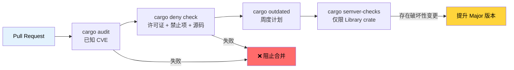

[English Original](../en/ch06-dependency-management-and-supply-chain-s.md)

# 依赖管理与供应链安全 🟢

> **你将学到：**
> - 使用 `cargo-audit` 扫描已知漏洞
> - 使用 `cargo-deny` 强制执行许可证、漏洞通告和源码策略
> - 使用 Mozilla 的 `cargo-vet` 进行供应链信任验证
> - 跟踪过期的依赖并检测破坏性的 API 变更 (Breaking Changes)
> - 可视化并去重你的依赖树
>
> **相关章节：** [发布配置](ch07-release-profiles-and-binary-size.md) — `cargo-udeps` 会在此处清理未使用的依赖 · [CI/CD 流水线](ch11-putting-it-all-together-a-production-cic.md) — 流水线中的 audit 和 deny 任务 · [构建脚本](ch01-build-scripts-buildrs-in-depth.md) — `build-dependencies` 同样也是供应链的一部分

一个 Rust 二进制文件不只是包含你的代码 —— 它包含了 `Cargo.lock` 中所有的传递依赖。该依赖树中任何地方出现的漏洞、许可证违规或恶意 crate 都会变成 *你* 的问题。本章涵盖了使依赖管理变得可审计且自动化的工具。

### cargo-audit — 已知漏洞扫描

[`cargo-audit`](https://github.com/rustsec/rustsec/tree/main/cargo-audit) 会根据 [RustSec 漏洞通告数据库](https://rustsec.org/) 检查你的 `Cargo.lock`，该数据库跟踪了已发布的 crate 中已知的安全性漏洞。

```bash
# 安装
cargo install cargo-audit

# 扫描已知漏洞
cargo audit

# 输出示例：
# Crate:     chrono
# Version:   0.4.19
# Title:     Potential segfault in localtime_r invocations
# Date:      2020-11-10
# ID:        RUSTSEC-2020-0159
# URL:       https://rustsec.org/advisories/RUSTSEC-2020-0159
# 解决方案:  升级至 >= 0.4.20

# 如果存在漏洞，则使 CI 失败
cargo audit --deny warnings

# 为自动化处理生成 JSON 输出
cargo audit --json

# 通过更新 Cargo.lock 修复漏洞
cargo audit fix
```

**CI 集成：**

```yaml
# .github/workflows/audit.yml
name: Security Audit
on:
  schedule:
    - cron: '0 0 * * *'  # 每日检查 —— 漏洞通告会不断更新
  push:
    paths: ['Cargo.lock']

jobs:
  audit:
    runs-on: ubuntu-latest
    steps:
      - uses: actions/checkout@v4
      - uses: rustsec/audit-check@v2
        with:
          token: ${{ secrets.GITHUB_TOKEN }}
```

### cargo-deny — 全面的策略强制执行

[`cargo-deny`](https://github.com/EmbarkStudios/cargo-deny) 的功能远不止漏洞扫描。它从四个维度强制执行策略：

1. **Advisories (通告)** — 已知漏洞（类似于 cargo-audit）
2. **Licenses (许可证)** — 允许/禁止的许可证列表
3. **Bans (禁止项)** — 禁止的 crate 或重复的版本
4. **Sources (源码)** — 允许的注册表 (Registry) 和 Git 源码

```bash
# 安装
cargo install cargo-deny

# 初始化配置
cargo deny init
# 创建带有文档注释默认值的 deny.toml

# 运行所有检查
cargo deny check

# 运行特定检查
cargo deny check advisories
cargo deny check licenses
cargo deny check bans
cargo deny check sources
```

**`deny.toml` 示例：**

```toml
# deny.toml

[advisories]
vulnerability = "deny"        # 对已知漏洞报错
unmaintained = "warn"         # 对不再维护的 crate 发出警告
yanked = "deny"               # 对已撤回 (yanked) 的 crate 报错
notice = "warn"               # 对通告性质的通知发出警告

[licenses]
unlicensed = "deny"           # 所有 crate 必须有许可证
allow = [
    "MIT",
    "Apache-2.0",
    "BSD-2-Clause",
    "BSD-3-Clause",
    "ISC",
    "Unicode-DFS-2016",
]
copyleft = "deny"             # 该项目禁止使用 GPL/LGPL/AGPL
default = "deny"              # 拒绝任何未明确允许的项目

[bans]
multiple-versions = "warn"    # 如果同一个 crate 出现了 2 个版本则发出警告
wildcards = "deny"            # 禁止在依赖中使用 path = "*"
highlight = "all"             # 显示所有重复项，而不仅是第一个

# 禁止特定的有问题 crate
deny = [
    # openssl-sys 会拉取 C 语言的 OpenSSL —— 建议改用 rustls
    { name = "openssl-sys", wrappers = ["native-tls"] },
]

# 允许特定的重复版本（当无法避免时）
[[bans.skip]]
name = "syn"
version = "1.0"               # syn 1.x 和 2.x 往往共存
```

对于商业项目而言，**许可证强制执行**非常有价值：

```bash
# 检查依赖树中包含哪些许可证
cargo deny list

# 输出示例：
# MIT          — 127 个 crate
# Apache-2.0   — 89 个 crate
# BSD-3-Clause — 12 个 crate
# MPL-2.0      — 3 个 crate   ← 可能需要法务审核
# Unicode-DFS  — 1 个 crate
```

### cargo-vet — 供应链信任验证

[Mozilla 出品的 `cargo-vet`](https://github.com/mozilla/cargo-vet) 解决的是另一个问题：不是“这个 crate 是否有已知的漏洞？”，而是“是否有受信任的人员实际审查过这段代码？”

```bash
# 安装
cargo install cargo-vet

# 初始化 (创建 supply-chain/ 目录)
cargo vet init

# 检查哪些 crate 需要审查
cargo vet

# 审查完一个 crate 后进行认证：
cargo vet certify serde 1.0.203
# 记录下你已针对自己的标准审计过 serde 1.0.203

# 从受信任的组织导入审计结果
cargo vet import mozilla
cargo vet import google
cargo vet import bytecode-alliance
```

**工作机制：**

```text
supply-chain/
├── audits.toml       ← 你所在团队的审计认证
├── config.toml       ← 信任配置和准则
└── imports.lock      ← 从其他组织锁定的导入项
```

`cargo-vet` 对于拥有严格供应链要求的组织（政府、金融、基础设施）最有价值。对于大多数团队来说，`cargo-deny` 已能提供足够的保护。

### cargo-outdated 与 cargo-semver-checks

**`cargo-outdated`** — 查找拥有新版本的依赖项：

```bash
cargo install cargo-outdated

cargo outdated --workspace
# 输出示例：
# 名称        当前版本  兼容版本  最新版本  类型
# serde       1.0.193  1.0.203 1.0.203  Normal
# regex       1.9.6    1.10.4  1.10.4   Normal
# thiserror   1.0.50   1.0.61  2.0.3    Normal  ← 存在大版本更新
```

**`cargo-semver-checks`** — 在发布前检测破坏性的 API 变更。这对于库 (Library) 类型的 crate 至关重要：

```bash
cargo install cargo-semver-checks

# 检查你的更改是否符合语义化版本 (semver)
cargo semver-checks

# 输出示例：
# ✗ 函数 `parse_gpu_csv` 现在变成了私有 (之前是公有)
#   → 这是一个破坏性变更。请提升 MAJOR 版本。
#
# ✗ 结构体 `GpuInfo` 增加了一个新的必需字段 `power_limit_w`
#   → 这是一个破坏性变更。请提升 MAJOR 版本。
#
# ✓ 增加了函数 `parse_gpu_csv_v2` (非破坏性变更)
```

### cargo-tree — 依赖可视化与去重

`cargo tree` 内置于 Cargo 中（无需安装），它是理解依赖关系图的利器：

```bash
# 完整的依赖树
cargo tree

# 查找为什么引入了某个特定的 crate
cargo tree --invert --package openssl-sys
# 显示从你的 crate 到 openssl-sys 的所有路径

# 查找重复的版本
cargo tree --duplicates
# 输出示例：
# syn v1.0.109
# └── serde_derive v1.0.193
#
# syn v2.0.48
# ├── thiserror-impl v1.0.56
# └── tokio-macros v2.2.0

# 仅显示直接依赖
cargo tree --depth 1

# 显示依赖的特性 (features)
cargo tree --format "{p} {f}"

# 统计总依赖数
cargo tree | wc -l
```

**去重策略**：当 `cargo tree --duplicates` 显示同一个 crate 有两个大版本时，请检查是否可以更新依赖链以统一它们。每个重复项都会增加编译时间和二进制体积。

### 应用：多 Crate 依赖健康管理

本工作区使用 `[workspace.dependencies]` 进行中心化的版本管理 —— 这是一个极佳的实践。结合 [`cargo tree --duplicates`](ch07-release-profiles-and-binary-size.md) 进行体积分析，可以防止版本漂移并减少二进制膨胀：

```toml
# 根目录 Cargo.toml — 在一处锁定所有版本
[workspace.dependencies]
serde = { version = "1.0", features = ["derive"] }
serde_json = { version = "1.0", features = ["preserve_order"] }
regex = "1.10"
thiserror = "1.0"
anyhow = "1.0"
rayon = "1.8"
```

**建议为本项目添加：**

```bash
# 添加到 CI 流水线：
cargo deny init              # 一次性设置
cargo deny check             # 每个 PR 运行 — 检查许可证、漏洞通告、禁止项
cargo audit --deny warnings  # 每次 push 运行 — 漏洞扫描
cargo outdated --workspace   # 每周运行 — 跟踪可用更新
```

**建议为本项目配置 `deny.toml`：**

```toml
[advisories]
vulnerability = "deny"
yanked = "deny"

[licenses]
allow = ["MIT", "Apache-2.0", "BSD-2-Clause", "BSD-3-Clause", "ISC", "Unicode-DFS-2016"]
copyleft = "deny"     # 硬件诊断工具 —— 不使用 Copyleft 协议

[bans]
multiple-versions = "warn"   # 跟踪重复项，暂不阻止
wildcards = "deny"

[sources]
unknown-registry = "deny"
unknown-git = "deny"
```

### 供应链审计流水线



### 🏋️ 练习

#### 🟢 练习 1：审计你的依赖

在任意 Rust 项目上运行 `cargo audit` 和 `cargo deny init && cargo deny check`。发现了多少条针对已知漏洞的通告？依赖树中包含多少种许可证类别？

<details>
<summary>答案</summary>

```bash
cargo audit
# 留意任何安全通告 —— 通常见于 chrono, time 或较旧的 crate

cargo deny init
cargo deny list
# 显示许可证明细：MIT (N), Apache-2.0 (N) 等。

cargo deny check
# 显示横跨四个维度的完整审计结果
```
</details>

#### 🟡 练习 2：查找并消除重复依赖

在工作区运行 `cargo tree --duplicates`。找出一个出现两个版本的 crate。你能更新 `Cargo.toml` 来统一它们吗？衡量一下这对编译时间和二进制体积的影响。

<details>
<summary>答案</summary>

```bash
cargo tree --duplicates
# 常见情况：syn 1.x 和 syn 2.x

# 查找是谁拉取了旧版本：
cargo tree --invert --package syn@1.0.109
# 输出示例：serde_derive 1.0.xxx -> syn 1.0.109

# 检查是否有使用 syn 2.x 的新版 serde_derive：
cargo update -p serde_derive
cargo tree --duplicates
# 如果 syn 1.x 消失了，说明你成功消除了一处重复

# 衡量影响：
time cargo build --release  # 更新前后对比
cargo bloat --release --crates | head -20
```
</details>

### 关键收获

- `cargo audit` 能捕捉已知的 CVE 漏洞 —— 建议在每次 push 时以及按每日计划运行。
- `cargo deny` 从四个维度强制执行策略：漏洞通告、许可证、禁止项以及源码。
- 使用 `[workspace.dependencies]` 在多 crate 工作区中进行版本中心化管理。
- `cargo tree --duplicates` 揭示了膨胀；每个重复项都会增加编译时间和二进制体积。
- `cargo-vet` 适用于高安全性要求的环境；对于大多数团队来说，`cargo-deny` 已足够。

---
