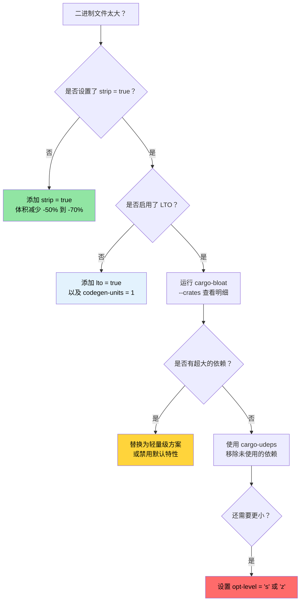

[English Original](../en/ch07-release-profiles-and-binary-size.md)

# 发布配置与二进制体积 🟡

> **你将学到：**
> - 发布配置 (Release Profile) 详解：LTO、codegen-units、panic 策略、strip、opt-level
> - Thin LTO、Fat LTO 与跨语言 LTO 的权衡
> - 使用 `cargo-bloat` 进行二进制体积分析
> - 使用 `cargo-udeps`、`cargo-machete` 和 `cargo-shear` 清理冗余依赖
>
> **相关章节：** [编译期工具](ch08-compile-time-and-developer-tools.md) — 优化的另一面 · [基准测试](ch03-benchmarking-measuring-what-matters.md) — 在优化前先测量运行时间 · [依赖管理](ch06-dependency-management-and-supply-chain-s.md) — 剔除依赖可同时减少体积和编译时间

默认的 `cargo build --release` 已经非常优秀。但对于生产环境部署 —— 尤其是需要分发到数千台服务器的单一二进制工具而言，“优秀”与“极致优化”之间仍有不小的差距。本章涵盖了配置参数以及衡量二进制体积的工具。

### 发布配置详解

Cargo 配置项 (Profile) 控制着 `rustc` 编译代码的方式。默认设置较为保守 —— 旨在保证广泛的兼容性，而非追求极致性能：

```toml
# Cargo.toml — Cargo 内置的默认值（如果你什么都不写的话）

[profile.release]
opt-level = 3        # 优化级别 (0=无, 1=基础, 2=良好, 3=激进)
lto = false          # 禁用链接期优化 (Link-time optimization)
codegen-units = 16   # 并行编译单元 (编译较快，但优化空间受限)
panic = "unwind"     # panic 时的栈回溯 (体积较大，可使用 catch_unwind)
strip = "none"       # 保留所有符号和调试信息
overflow-checks = false  # release 模式下不进行整数溢出检查
debug = false        # release 模式不包含调试信息
```

**针对生产优化的配置**（本项目已在使用）：

```toml
[profile.release]
lto = true           # 开启全量跨 crate 优化
codegen-units = 1    # 单个生成单元 —— 提供最大的优化机会
panic = "abort"      # 无回溯开销 —— 更小、更快
strip = true         # 移除所有符号 —— 二进制体积更小
```

**每项设置的影响：**

| 设置项 | 默认 → 优化后 | 二进制体积 | 运行时速度 | 编译时间 |
|---------|---------------------|-------------|---------------|--------------|
| `lto = false → true` | — | -10% 到 -20% | +5% 到 +20% | 慢 2-5 倍 |
| `codegen-units = 16 → 1` | — | -5% 到 -10% | +5% 到 +10% | 慢 1.5-2 倍 |
| `panic = "unwind" → "abort"` | — | -5% 到 -10% | 微乎其微 | 微乎其微 |
| `strip = "none" → true` | — | -50% 到 -70% | 无 | 无 |
| `opt-level = 3 → "s"` | — | -10% 到 -30% | -5% 到 -10% | 类似 |
| `opt-level = 3 → "z"` | — | -15% 到 -40% | -10% 到 -20% | 类似 |

**其他常用的配置微调：**

```toml
[profile.release]
# 除上述设置外，还可以：
overflow-checks = true    # 即使在 release 中也保留溢出检查 (安全 > 速度)
debug = "line-tables-only" # 仅保留行表，用于回溯时显示行号，而不包含完整的 DWARF
rpath = false             # 不嵌入运行时库路径
incremental = false       # 禁用增量编译 (为了更干净地构建最终版)

# 针对体积高度优化的构建 (如嵌入式、WASM):
# opt-level = "z"         # 极其激进地针对体积进行优化
# strip = "symbols"       # 只移除符号信息，保留调试段
```

**针对单个 crate 的配置覆盖 (Overrides)** — 仅对热点 crate 进行极致优化，其他保持原样：

```toml
# 开发模式：优化依赖项，但不优化自己的代码 (保证快速重新编译)
[profile.dev.package."*"]
opt-level = 2          # 开发模式下优化所有依赖项

# 发布模式：覆盖特定 crate 的优化级别
[profile.release.package.serde_json]
opt-level = 3          # 对 JSON 解析进行最大程度优化
codegen-units = 1

# 测试配置：匹配 release 行为，获取准确的集成测试结果
[profile.test]
opt-level = 1          # 基础优化，避免慢速测试超时
```

### 深入理解 LTO — Thin vs Fat vs 跨语言

链接期优化 (Link-Time Optimization) 允许 LLVM 跨越 crate 边界进行优化 —— 例如将 `serde_json` 的函数内联到你的解析代码中，或者移除 `regex` 中的死代码等。如果不开启 LTO，每个 crate 都是一个独立的“优化孤岛”。

```toml
[profile.release]
# 方案 1: Fat LTO (lto = true 时的默认值)
lto = true
# 所有代码合并为一个 LLVM 模块 → 优化空间最大
# 编译最慢，二进制体积最小、运行最快

# 方案 2: Thin LTO
lto = "thin"
# 保持每个 crate 独立，但 LLVM 会进行跨模块优化
# 比 Fat LTO 编译快，优化效果几乎同样出色
# 大多数项目的最佳折衷方案

# 方案 3: 不开启 LTO
lto = false
# 仅进行 crate 内部优化
# 编译最快，二进制体积较大

# 方案 4: 显式关闭
lto = "off"
# 等同于 false
```

**Fat LTO 与 Thin LTO 对比：**

| 维度 | Fat LTO (`true`) | Thin LTO (`"thin"`) |
|--------|-------------------|----------------------|
| 优化质量 | 最好 | 达到 Fat 的 ~95% |
| 编译时间 | 慢 (所有代码都在一个模块中) | 中等 (并行处理模块) |
| 内存占用 | 高 (所有 LLVM IR 都在内存中) | 较低 (流式处理) |
| 并行性 | 无 (单一模块) | 优秀 (跨模块并行) |
| 推荐场景 | 最终发布构建 | CI 构建、日常开发 |

**跨语言 LTO** — 跨越 Rust 与 C 的边界进行优化：

```toml
[profile.release]
lto = true

# Cargo.toml — 使用了 cc crate 的 crate
[build-dependencies]
cc = "1.0"
```

```rust
// build.rs — 启用跨语言 (linker-plugin) LTO
fn main() {
    // cc crate 会遵循环境变量中的 CFLAGS。
    // 对于跨语言 LTO，编译 C 代码时需使用：
    //   -flto=thin -O2
    cc::Build::new()
        .file("csrc/fast_parser.c")
        .flag("-flto=thin")
        .opt_level(2)
        .compile("fast_parser");
}
```

```bash
# 启用链接器插件 LTO (需要兼容的 LLD 或 gold 链接器)
RUSTFLAGS="-Clinker-plugin-lto -Clinker=clang -Clink-arg=-fuse-ld=lld" \
    cargo build --release
```

跨语言 LTO 允许 LLVM 将 C 函数内联到 Rust 调用者中，反之亦然。这对于频繁调用 C 语言小函数（如 IPMI ioctl 封装函数）的 FFI 密集型代码效果显著。

### 使用 `cargo-bloat` 进行二进制体积分析

[`cargo-bloat`](https://github.com/RazrFalcon/cargo-bloat) 能够回答：“二进制文件中哪些函数和 crate 占用的空间最多？”

```bash
# 安装
cargo install cargo-bloat

# 显示占用空间最大的前 20 个函数
cargo bloat --release -n 20
# 输出示例：
#  文件    .text     大小          Crate    名称
#  2.8%   5.1%  78.5KiB  serde_json       serde_json::de::Deserializer::parse_...
#  2.1%   3.8%  58.2KiB  regex_syntax     regex_syntax::ast::parse::ParserI::p...
#  1.5%   2.7%  42.1KiB  accel_diag         accel_diag::vendor::parse_smi_output
#  ...

# 按 crate 显示（哪个依赖最占空间）
cargo bloat --release --crates
# 输出示例：
#  文件    .text     大小 Crate
# 12.3%  22.1%  340KiB serde_json
#  8.7%  15.6%  240KiB regex
#  6.2%  11.1%  170KiB std
#  5.1%   9.2%  141KiB accel_diag
#  ...

# 对比两次构建（优化前后的变化）
cargo bloat --release --crates > before.txt
# ... 进行修改 ...
cargo bloat --release --crates > after.txt
diff before.txt after.txt
```

**常见的代码膨胀来源及修复方法：**

| 膨胀来源 | 典型体积 | 修复方法 |
|-------------|-------------|-----|
| `regex` (全量引擎) | 200-400 KB | 如果不需要 Unicode 支持，改用 `regex-lite` |
| `serde_json` (全量) | 200-350 KB | 如果注重极致性能，考虑 `simd-json` 或 `sonic-rs` |
| 泛型实例化 (Monomorphization) | 可变 | 在 API 边界处使用 `dyn Trait` |
| 格式化机制 (`Display`, `Debug`) | 50-150 KB | 对大型枚举使用 `#[derive(Debug)]` 会累积不少体积 |
| Panic 错误字符串 | 20-80 KB | `panic = "abort"` 移除回溯逻辑，`strip` 移除字符串 |
| 未使用的特性 (Features) | 可变 | 禁用默认特性：`serde = { version = "1", default-features = false }` |

### 使用 `cargo-udeps` 清理冗余依赖

[`cargo-udeps`](https://github.com/est31/cargo-udeps) 会找出 `Cargo.toml` 中声明了但代码中并未实际使用的依赖：

```bash
# 安装 (需要 nightly)
cargo install cargo-udeps

# 查找未使用的依赖
cargo +nightly udeps --workspace
# 输出示例：
# 未使用的依赖:
# `diag_tool v0.1.0`
# └── "tempfile" (dev-dependency)
#
# `accel_diag v0.1.0`
# └── "once_cell"    ← 之前需要，现在有了 LazyLock 变成了冗余
```

每一个未使用的依赖都会：
- 增加编译时间
- 增加二进制体积
- 增加供应链风险
- 增加潜在的许可证合规复杂性

**另一种选择：`cargo-machete`** — 速度更快，基于启发式算法：

```bash
cargo install cargo-machete
cargo machete
# 速度快，但由于是单纯的静态扫描，可能会有误报
```

**另一种选择：`cargo-shear`** — 介于 `cargo-udeps` 和 `cargo-machete` 之间的平衡点：

```bash
cargo install cargo-shear
cargo shear --fix
# 比 machete 慢但比 udeps 快得多
# 误报率远低于 machete
```

### 体积优化决策树



### 🏋️ 练习

#### 🟢 练习 1：测量 LTO 的影响

先使用默认的编译配置构建项目，然后再尝试添加 `lto = true` + `codegen-units = 1` + `strip = true`。对比二进制文件的体积和编译时间。

<details>
<summary>答案</summary>

```bash
# 默认配置构建
cargo build --release
ls -lh target/release/my-binary
time cargo build --release  # 记录时间

# 优化后的配置 —— 在 Cargo.toml 中添加：
# [profile.release]
# lto = true
# codegen-units = 1
# strip = true
# panic = "abort"

cargo clean
cargo build --release
ls -lh target/release/my-binary  # 通常会减少 30-50% 的体积
time cargo build --release       # 编译时间通常会增加 2-3 倍
```
</details>

#### 🟡 练习 2：找出你项目中最大的 Crate

在项目上运行 `cargo bloat --release --crates`。识别出最大的依赖项。你能否通过禁用默认特性或切换到轻量级替代方案来减小它的体积？

<details>
<summary>答案</summary>

```bash
cargo install cargo-bloat
cargo bloat --release --crates
# 输出示例：
#  文件    .text     大小 Crate
# 12.3%  22.1%  340KiB serde_json
#  8.7%  15.6%  240KiB regex

# 针对 regex — 如果不需要 Unicode 尝试 regex-lite:
# regex-lite = "0.1"  # 比全量 regex 小约 10 倍

# 针对 serde — 如果不需要标准库则禁用默认特性：
# serde = { version = "1", default-features = false, features = ["derive"] }

cargo bloat --release --crates  # 修改后再次对比
```
</details>

### 关键收获

- `lto = true` + `codegen-units = 1` + `strip = true` + `panic = "abort"` 是生产环境发布版的理想配置。
- Thin LTO (`lto = "thin"`) 仅需较小的编译成本，即可获得 Fat LTO 约 80% 的收益。
- `cargo-bloat --crates` 能清晰展示哪些依赖在吞噬二进制空间。
- `cargo-udeps`、`cargo-machete` 和 `cargo-shear` 能帮你清理浪费编译时间且增加体积的沉余依赖。
- 通过针对单个 crate 的配置覆盖 (Profile Overwrites)，可以在不拖慢整体构建的前提下优化性能热点。

---
