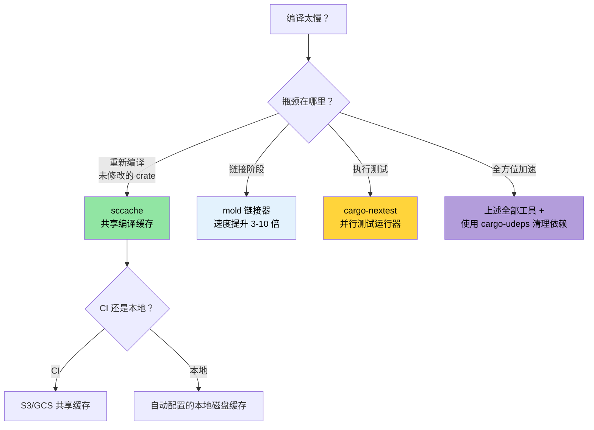

[English Original](../en/ch08-compile-time-and-developer-tools.md)

# 编译期与开发工具 🟡

> **你将学到：**
> - 使用 `sccache` 为本地和 CI 构建加速
> - 使用 `mold` 实现更快的链接（比默认链接器快 3-10 倍）
> - `cargo-nextest`：一个更快、信息更丰富的测试运行器
> - 开发者生产力工具：`cargo-expand`、`cargo-geiger`、`cargo-watch`
> - 配置工作区 Lint (Lints)、MSRV 策略以及文档即 CI
>
> **相关章节：** [发布配置](ch07-release-profiles-and-binary-size.md) — LTO 和二进制体积优化 · [CI/CD 流水线](ch11-putting-it-all-together-a-production-cic.md) — 这些工具在流水线中的集成 · [依赖管理](ch06-dependency-management-and-supply-chain-s.md) — 减少依赖 = 编译更快

### 编译期优化：sccache, mold, cargo-nextest

漫长的编译时间是 Rust 开发者最大的痛点。以下工具组合可以减少 50-80% 的迭代延迟：

**`sccache` — 共享编译缓存：**

```bash
# 安装
cargo install sccache

# 配置为 Rust 封装器 (Wrapper)
export RUSTC_WRAPPER=sccache

# 或者在 .cargo/config.toml 中永久设置：
# [build]
# rustc-wrapper = "sccache"

# 第一次构建：正常速度（填充缓存）
cargo build --release  # 耗时 3 分钟

# 执行清理并重新构建：命中未改变的 crate 缓存
cargo clean && cargo build --release  # 耗时 45 秒

# 检查缓存统计信息
sccache --show-stats
# 编译请求数            1,234
# 缓存命中数             987 (80%)
# 缓存未命中数           247
```

`sccache` 支持共享缓存（S3, GCS, Azure Blob），适用于团队协作和 CI 环境下的缓存共享。

**`mold` — 更快的链接器：**

链接通常是编译过程中最慢的阶段。`mold` 比 `lld` 快 3-5 倍，比默认的 GNU `ld` 快 10-20 倍：

```bash
# 安装
sudo apt install mold  # Ubuntu 22.04+
# 注意：mold 针对 ELF 目标 (Linux)。macOS 使用的是 Mach-O 而非 ELF。
# macOS 的链接器 (ld64) 本身已经很快；如果你追求更快：
# brew install sold     # sold = 针对 Mach-O 的 mold (实验性)
# 在实践中，macOS 的链接时间很少成为瓶颈。
```

```toml
# 在 .cargo/config.toml 中启用 mold 链接器
[target.x86_64-unknown-linux-gnu]
rustflags = ["-C", "link-arg=-fuse-ld=mold"]
```

```bash
# 验证是否正在使用 mold
cargo build -v 2>&1 | grep mold
```

**`cargo-nextest` — 更快的测试运行器：**

```bash
# 安装
cargo install cargo-nextest

# 运行测试（默认并行，对每个测试设置超时及重试）
cargo nextest run

# 相比 cargo test 的关键优势：
# - 每个测试都在独立的进程中运行 → 隔离性更好
# - 带有智能调度的并行执行
# - 每个测试都有超时控制（CI 不会再卡死）
# - 导出 JUnit XML 格式供 CI 使用
# - 可自动重试失败的测试

# 常用配置
cargo nextest run --retries 2 --fail-fast

# 归档测试二进制文件（适用于 CI：构建一次，在多台机器上测试）
cargo nextest archive --archive-file tests.tar.zst
cargo nextest run --archive-file tests.tar.zst
```

```toml
# .config/nextest.toml
[profile.default]
retries = 0
slow-timeout = { period = "60s", terminate-after = 3 }
fail-fast = true

[profile.ci]
retries = 2
fail-fast = false
junit = { path = "test-results.xml" }
```

**综合开发环境配置示例：**

```toml
# .cargo/config.toml — 优化开发迭代闭环
[build]
rustc-wrapper = "sccache"       # 缓存编译产物

[target.x86_64-unknown-linux-gnu]
rustflags = ["-C", "link-arg=-fuse-ld=mold"]  # 更快的链接

# 开发配置 (Dev profile)：优化依赖但不优化自己的代码
# (放入 Cargo.toml)
# [profile.dev.package."*"]
# opt-level = 2
```

### cargo-expand 与 cargo-geiger — 可见性工具

**`cargo-expand`** — 查看宏生成的代码：

```bash
cargo install cargo-expand

# 展开特定模块中的所有宏
cargo expand --lib accel_diag::vendor

# 展开特定的派生宏
# 假设有：#[derive(Debug, Serialize, Deserialize)]
# cargo expand 将显示生成的 impl 代码块
cargo expand --lib --tests
```

这对于调试 `#[derive]` 宏输出、`macro_rules!` 展开以及理解 `serde` 为你的类型生成了什么非常有价值。

除了 `cargo-expand`，你也可以直接在 rust-analyzer 中展开宏：
1. 将光标移动到目标宏上。
2. 打开命令面板 (VSCode 中为 `F1`)。
3. 搜索 `rust-analyzer: Expand macro recursively at caret`。

**`cargo-geiger`** — 统计依赖树中的 `unsafe` 使用情况：

```bash
cargo install cargo-geiger

cargo geiger
# 输出示例：
# 指标格式：x/y
#   x = 构建实际使用的 unsafe 代码
#   y = crate 中发现的总 unsafe 代码
#
# 函数       表达式       Impls  Traits  方法
# 0/0        0/0          0/0    0/0     0/0      ✅ my_crate
# 0/5        0/23         0/2    0/0     0/3      ✅ serde
# 3/3        14/14        0/0    0/0     2/2      ❗ libc
# 15/15      142/142      4/4    0/0     12/12    ☢️ ring

# 符号含义：
# ✅ = 未使用 unsafe
# ❗ = 使用了少量 unsafe
# ☢️ = 重度使用 unsafe
```

针对本项目的“零 unsafe”政策，`cargo geiger` 可以验证是否没有任何依赖项在你实际执行的代码路径中引入了 unsafe 代码。

### 工作区 Lint 配置 — `[workspace.lints]`

自 Rust 1.74 起，你可以在 `Cargo.toml` 中统一配置 Clippy 和编译器 Lint —— 不必再在每个 crate 顶层写 `#![deny(...)]`：

```toml
# 根目录 Cargo.toml — 为所有 crate 配置 lint
[workspace.lints.clippy]
unwrap_used = "warn"         # 倾向于使用 ? 或 expect("原因")
dbg_macro = "deny"           # 禁止在提交的代码中包含 dbg!()
todo = "warn"                # 跟踪未完成的实现
large_enum_variant = "warn"  # 发现意外的体积膨胀

[workspace.lints.rust]
unsafe_code = "deny"         # 强制执行零 unsafe 政策
missing_docs = "warn"        # 鼓励编写文档
```

```toml
# 每个 crate 的 Cargo.toml — 选用工作区 lint 配置
[lints]
workspace = true
```

这取代了零散的 `#![deny(clippy::unwrap_used)]` 属性，并确保整个工作区的政策一致。

**自动修复 Clippy 警告：**

```bash
# 让 Clippy 自动应用可机器修复的建议
cargo clippy --fix --workspace --all-targets --allow-dirty

# 修复并应用那些可能改变行为的建议（需仔细审核！）
cargo clippy --fix --workspace --all-targets --allow-dirty -- -W clippy::pedantic
```

> **提示**：在提交代码前运行 `cargo clippy --fix`。它可以处理大部分琐碎问题（如未使用导入、冗余克隆、类型简化），节省手动修改的时间。

### MSRV 政策与 rust-version

最低支持 Rust 版本 (Minimum Supported Rust Version, MSRV) 确保你的 crate 可以在较旧的工具链上编译。这在部署至 Rust 版本固定的系统时非常重要。

```toml
# Cargo.toml
[package]
name = "diag_tool"
version = "0.1.0"
rust-version = "1.75"    # 所需的最低 Rust 版本
```

```bash
# 验证 MSRV 兼容性
cargo +1.75.0 check --workspace

# 自动探测 MSRV
cargo install cargo-msrv
cargo msrv find
# 输出示例：Minimum Supported Rust Version is 1.75.0

# 在 CI 中验证
cargo msrv verify
```

**MSRV 策略建议：**
- **二进制应用程序** (如本项目)：使用最新稳定版。通常不需要刻意设置过旧的 MSRV。
- **库类型 crate** (发布到 crates.io)：将 MSRV 设置为支持你所用特性的最旧 Rust 版本。通常采取 `N-2` 策略（比当前版本落后 2 个版本）。
- **企业部署**：设置 MSRV 以匹配你服务器集群中安装的最旧 Rust 版本。

### 应用：生产环境二进制配置

本项目已经拥有一个出色的 [发布配置 (release profile)](ch07-release-profiles-and-binary-size.md)：

```toml
# 根目录 Cargo.toml
[profile.release]
lto = true           # ✅ 开启全量跨 crate 优化
codegen-units = 1    # ✅ 最大程度优化
panic = "abort"      # ✅ 移除回溯开销
strip = true         # ✅ 部署时移除符号表

[profile.dev]
opt-level = 0        # ✅ 快速编译
debug = true         # ✅ 完整的调试信息
```

**进一步建议：**

```toml
# 在开发模式下优化依赖项（加快测试执行速度）
[profile.dev.package."*"]
opt-level = 2

# 测试配置：进行基础优化，防止慢速测试超时
[profile.test]
opt-level = 1

# 在发布版中保留溢出检查（出于安全考虑）
[profile.release]
lto = true
codegen-units = 1
panic = "abort"
strip = true
overflow-checks = true    # ← 建议添加：捕捉整数溢出
debug = "line-tables-only" # ← 建议添加：保留用于回溯的行表，压缩体积
```

**建议的开发者工具配置：**

```toml
# .cargo/config.toml (建议)
[build]
rustc-wrapper = "sccache"  # 首次构建后缓存命中率可达 80%+

[target.x86_64-unknown-linux-gnu]
rustflags = ["-C", "link-arg=-fuse-ld=mold"]  # 链接速度提升 3-5 倍
```

**预期收益：**

| 指标 | 当前 | 优化后 |
|--------|---------|----------------|
| 发布版二进制体积 | 约 10 MB (已 strip, 开启 LTO) | 保持一致 |
| 开发环境构建耗时 | 约 45s | 约 25s (sccache + mold) |
| 重新构建 (修改 1 个文件) | 约 15s | 约 5s (sccache + mold) |
| 测试执行 | `cargo test` | `cargo nextest` — 快 2 倍 |
| 依赖漏洞扫描 | 无 | CI 中使用 `cargo audit` |
| 许可证合规检查 | 手动 | CI 中使用 `cargo deny` 自动化 |
| 冗余依赖检测 | 手动 | CI 中使用 `cargo udeps` |

### `cargo-watch` — 文件变更自动重新构建

[`cargo-watch`](https://github.com/watchexec/cargo-watch) 在源文件发生变化时重新运行命令 —— 是实现快速反馈环的关键：

```bash
# 安装
cargo install cargo-watch

# 每次保存时自动检查（即时反馈）
cargo watch -x check

# 变更后运行 clippy + 测试
cargo watch -x 'clippy --workspace --all-targets' -x 'test --workspace --lib'

# 仅监听特定的 crate（大型工作区中速度更快）
cargo watch -w accel_diag/src -x 'test -p accel_diag'

# 每次运行前清屏
cargo watch -c -x check
```

> **提示**：将其与上述的 `mold` 和 `sccache` 结合使用，可以在增量修改后实现亚秒级的重新检查。

### `cargo doc` 与工作区文档

对于大型工作区，生成的文档对于代码的可维护性和上手门槛至关重要。`cargo doc` 使用 rustdoc 从文档注释和类型签名中生成 HTML 文档：

```bash
# 为所有工作区 crate 生成文档 (自动在浏览器打开)
cargo doc --workspace --no-deps --open

# 包含私有项 (开发调试时非常有用)
cargo doc --workspace --no-deps --document-private-items

# 仅检查文档链接是否损坏 (快速 CI 检查)
cargo doc --workspace --no-deps 2>&1 | grep -E 'warning|error'
```

**文档内引用 (Intra-doc links)** — 无需 URL 即可在跨 crate 的类型间建立链接：

```rust
/// 使用 [`GpuConfig`] 设置运行 GPU 诊断。
///
/// 具体实现请参考 [`crate::accel_diag::run_diagnostics`].
/// 返回 [`DiagResult`]，可序列化为
/// [`DerReport`](crate::core_lib::DerReport) 格式。
pub fn run_accel_diag(config: &GpuConfig) -> DiagResult {
    // ...
}
```

**在文档中展示平台特定的 API：**

```rust
// Cargo.toml: [package.metadata.docs.rs]
// all-features = true
// rustdoc-args = ["--cfg", "docsrs"]

/// 仅限 Windows：通过 Win32 API 读取电池状态。
///
/// 仅可在 `cfg(windows)` 环境下使用。
#[cfg(windows)]
#[doc(cfg(windows))]  // 在文档中显示“仅在 Windows 可用”的徽章
pub fn get_battery_status() -> Option<u8> {
    // ...
}
```

**CI 中的文档检查：**

```yaml
# 添加到 CI 工作流
- name: Check documentation
  run: RUSTDOCFLAGS="-D warnings" cargo doc --workspace --no-deps
  # 将损坏的文档链接视为错误
```

> **针对本项目**：由于包含多个 crate，`cargo doc --workspace` 是新成员快速了解 API 全貌的最佳方式。建议将 `RUSTDOCFLAGS="-D warnings"` 加入 CI，以便在合并前拦截损坏的文档链接。

### 编译期优化决策树



### 🏋️ 练习

#### 🟢 练习 1：配置 sccache + mold

安装 `sccache` 和 `mold`，在 `.cargo/config.toml` 中配置它们，然后测量干净构建 (clean rebuild) 时的编译提速。

<details>
<summary>答案</summary>

```bash
# 安装
cargo install sccache
sudo apt install mold  # Ubuntu 22.04+

# 配置 .cargo/config.toml
cat > .cargo/config.toml << 'EOF'
[build]
rustc-wrapper = "sccache"

[target.x86_64-unknown-linux-gnu]
linker = "clang"
rustflags = ["-C", "link-arg=-fuse-ld=mold"]
EOF

# 第一次构建（填充缓存）
time cargo build --release  # 例如 180s

# 执行清理并重新构建（命中缓存）
cargo clean
time cargo build --release  # 例如 45s

sccache --show-stats
# 缓存命中率应在 60-80% 以上
```
</details>

#### 🟡 练习 2：切换到 cargo-nextest

安装 `cargo-nextest` 并运行你的测试套件。对比其与 `cargo test` 的墙钟时间。提速效果如何？

<details>
<summary>答案</summary>

```bash
cargo install cargo-nextest

# 标准测试运行器
time cargo test --workspace 2>&1 | tail -5

# nextest (并行跨二进制文件执行)
time cargo nextest run --workspace 2>&1 | tail -5

# 对于大型工作区，提速通常在 2-5 倍。
# nextest 还提供：
# - 每个测试的耗时统计
# - 对不稳定的测试进行重试
# - 导出供 CI 使用的 JUnit XML 
cargo nextest run --workspace --retries 2
```
</details>

### 关键收获

- 配合 S3/GCS 后端的 `sccache` 可以跨团队和 CI 共享编译缓存。
- `mold` 是目前最快的 ELF 链接器 —— 链接时间可从秒级降至毫秒级。
- `cargo-nextest` 并行运行测试二进制文件，并提供更好的输出支持及重试机制。
- `cargo-geiger` 用于统计 `unsafe` 使用量 —— 在引入新依赖前建议先以此检查。
- `[workspace.lints]` 可以在大型工作区顶层统一管理 Clippy 和 rustc 的 lint 规则。

---
