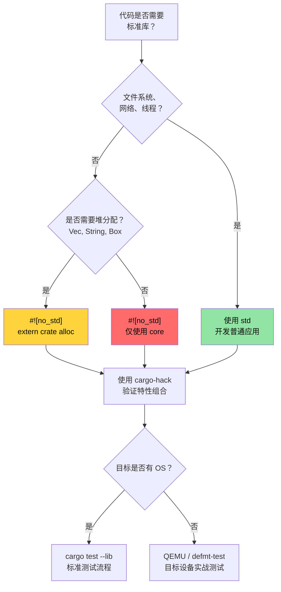

[English Original](../en/ch09-no-std-and-feature-verification.md)

# `no_std` 与特性验证 🔴

> **你将学到：**
> - 使用 `cargo-hack` 系统地验证特性 (Feature) 组合
> - Rust 的三个层面：`core` vs `alloc` vs `std` 以及各自的适用场景
> - 使用自定义 panic 处理程序和分配器构建 `no_std` crate
> - 在宿主机和 QEMU 上测试 `no_std` 代码
>
> **相关章节：** [Windows 与条件编译](ch10-windows-and-conditional-compilation.md) — 该话题的另一半：平台相关性 · [交叉编译](ch02-cross-compilation-one-source-many-target.md) — 交叉编译到 ARM 和嵌入式目标 · [Miri 与 Sanitizer](ch05-miri-valgrind-and-sanitizers-verifying-u.md) — 验证 `no_std` 环境中的 `unsafe` 代码 · [构建脚本](ch01-build-scripts-buildrs-in-depth.md) — 由 `build.rs` 发出的 `cfg` 标志

从 8 位微控制器到云端服务器，Rust 几乎运行在任何地方。本章涵盖了基础知识：通过 `#![no_std]` 剥离标准库，并验证你的特性组合是否能实际通过编译。

### 使用 `cargo-hack` 验证特性组合

[`cargo-hack`](https://github.com/taiki-e/cargo-hack) 能够系统地测试所有特性组合 —— 这对于包含 `#[cfg(...)]` 代码的 crate 来说至关重要：

```bash
# 安装
cargo install cargo-hack

# 检查每个特性是否都能独立通过编译
cargo hack check --each-feature --workspace

# 终极方案：测试所有特性组合（指数级增长！）
# 仅建议在特性数少于 8 个的 crate 上运行。
cargo hack check --feature-powerset --workspace

# 务实的折衷方案：分别测试每个特性运行 + 全部特性运行 + 无特性运行
cargo hack check --each-feature --workspace --no-dev-deps
cargo check --workspace --all-features
cargo check --workspace --no-default-features
```

**为什么这对于本项目很重要：**

如果你添加了平台特性（如 `linux`、`windows`、`direct-ipmi`、`direct-accel-api`），`cargo-hack` 能及时捕捉到会导致构建失败的组合：

```toml
# 示例：控制平台代码的特性
[features]
default = ["linux"]
linux = []                          # Linux 特有的硬件访问
windows = ["dep:windows-sys"]       # Windows 特有的 API
direct-ipmi = []                    # 使用 unsafe 的 IPMI ioctl (见第5章)
direct-accel-api = []                    # 使用 unsafe 的 accel-mgmt FFI (见第5章)
```

```bash
# 验证所有特性在隔离以及组合情况下均能编译通过
cargo hack check --each-feature -p diag_tool
# 捕捉错误：“feature 'windows' doesn't compile without 'direct-ipmi'”
# 捕捉错误：“#[cfg(feature = "linux")] 拼写错误 — 误写成了 'lnux'”
```

**CI 集成：**

```yaml
# 添加到 CI 流水线 (由于仅执行编译检查，速度很快)
- name: Feature matrix check
  run: cargo hack check --each-feature --workspace --no-dev-deps
```

> **经验法则**：对于任何拥有 2 个以上特性的 crate，建议在 CI 中运行 `cargo hack check --each-feature`。对于少于 8 个特性的核心库 crate，才运行 `--feature-powerset` —— 它是指数级的（$2^n$ 种组合）。

### `no_std` — 何时以及为何使用

`#![no_std]` 告诉编译器：“不要链接标准库。” 你的 crate 将只能使用 `core`（以及可选的 `alloc`）。为什么要这么做？

| 场景 | 为什么选择 `no_std` |
|----------|-------------|
| 嵌入式固件 (ARM Cortex-M, RISC-V) | 无操作系统、无堆内存、无文件系统 |
| UEFI 诊断工具 | 预启环境，无操作系统 API |
| 内核模块 | 内核空间无法使用用户空间的 `std` |
| WebAssembly (WASM) | 最小化二进制体积，无操作系统依赖 |
| 引导程序 (Bootloaders) | 在任何操作系统加载前运行 |
| 带有 C 接口的共享库 | 避免在调用者中引入 Rust 运行时 |

**对于硬件诊断工具**，当构建以下内容时，`no_std` 变得非常相关：
- 基于 UEFI 的预启诊断工具（在操作系统加载前运行）
- BMC 固件诊断（资源受限的 ARM SoC）
- 内核级 PCIe 诊断（内核模块或 eBPF 探针）

### `core` vs `alloc` vs `std` — 三个层面

```text
┌─────────────────────────────────────────────────────────────┐
│ std                                                         │
│  包含 core + alloc 的所有内容，外加：                         │
│  • 文件 I/O (std::fs, std::io)                              │
│  • 网络 (std::net)                                          │
│  • 线程 (std::thread)                                       │
│  • 时间 (std::time)                                         │
│  • 环境变量 (std::env)                                       │
│  • 进程 (std::process)                                      │
│  • 操作系统特定 (std::os::unix, std::os::windows)            │
├─────────────────────────────────────────────────────────────┤
│ alloc          (在 #![no_std] 下可用，需手动声明 extern crate│
│                 alloc，且必须配置有全局分配器)                │
│  • String, Vec, Box, Rc, Arc                                │
│  • BTreeMap, BTreeSet                                       │
│  • format!() 宏                                             │
│  • 任何需要堆空间的代码集合与智能指针                         │
├─────────────────────────────────────────────────────────────┤
│ core           (即使在 #![no_std] 下也总是可用)              │
│  • 基础类型 (u8, bool, char 等)                              │
│  • Option, Result                                           │
│  • 迭代器、切片、数组、str (指 slice，而非 String)           │
│  • Trait: Clone, Copy, Debug, Display, From, Into           │
│  • 原子操作 (core::sync::atomic)                             │
│  • Cell, RefCell (core::cell) —— Pin (core::pin)            │
│  • core::fmt (无需分配空间的格式化)                          │
│  • core::mem, core::ptr (低层内存操作)                        │
│  • 数学运算: core::num, 基础算术                             │
└─────────────────────────────────────────────────────────────┘
```

**失去 `std` 会带来什么影响：**
- 没有 `HashMap`（需要哈希器 —— 改用 `alloc` 中的 `BTreeMap` 或 `hashbrown`）
- 没有 `println!()`（需要标准输出 —— 改用 `core::fmt::Write` 写入缓冲区）
- 没有 `std::error::Error`（自 Rust 1.81 起已在 `core` 中稳定，但许多生态库尚未迁移）
- 没有文件 I/O、无网络、无线程（除非由平台 HAL 提供）
- 没有 `Mutex`（改用 `spin::Mutex` 或平台特有的锁）

### 构建一个 `no_std` Crate

```rust
// src/lib.rs — 一个 no_std 库 crate
#![no_std]

// 可选：使用堆分配 (heap allocation)
extern crate alloc;
use alloc::string::String;
use alloc::vec::Vec;
use core::fmt;

/// 从热传感器读取的温度。
/// 该结构体适用于任何环境 —— 从裸机到 Linux。
#[derive(Clone, Copy, Debug)]
pub struct Temperature {
    /// 原始传感器值（对于典型的 I2C 传感器，每 LSB 为 0.0625°C）
    raw: u16,
}

impl Temperature {
    pub const fn from_raw(raw: u16) -> Self {
        Self { raw }
    }

    /// 转换为摄氏度（定点运算，无需 FPU）
    pub const fn millidegrees_c(&self) -> i32 {
        (self.raw as i32) * 625 / 10 // 0.0625°C 分辨率
    }

    pub fn degrees_c(&self) -> f32 {
        self.raw as f32 * 0.0625
    }
}

impl fmt::Display for Temperature {
    fn fmt(&self, f: &mut fmt::Formatter<'_>) -> fmt::Result {
        let md = self.millidegrees_c();
        // 处理 -0.999°C 到 -0.001°C 之间的符号显示
        // 此时 md / 1000 == 0，但数值实际上是负数。
        if md < 0 && md > -1000 {
            write!(f, "-0.{:03}°C", (-md) % 1000)
        } else {
            write!(f, "{}.{:03}°C", md / 1000, (md % 1000).abs())
        }
    }
}

/// 解析以空格分隔的温度值。
/// 使用了 alloc —— 需要全局分配器。
pub fn parse_temperatures(input: &str) -> Vec<Temperature> {
    input
        .split_whitespace()
        .filter_map(|s| s.parse::<u16>().ok())
        .map(Temperature::from_raw)
        .collect()
}

/// 无需分配空间的格式化 —— 直接写入缓冲区。
/// 适用于仅 `core` 的环境（无 alloc，无堆）。
pub fn format_temp_into(temp: &Temperature, buf: &mut [u8]) -> usize {
    use core::fmt::Write;
    struct SliceWriter<'a> {
        buf: &'a mut [u8],
        pos: usize,
    }
    impl<'a> Write for SliceWriter<'a> {
        fn write_str(&mut self, s: &str) -> fmt::Result {
            let bytes = s.as_bytes();
            let remaining = self.buf.len() - self.pos;
            if bytes.len() > remaining {
                // 缓冲区已满 —— 返回错误而非静默截断
                return Err(fmt::Error);
            }
            self.buf[self.pos..self.pos + bytes.len()].copy_from_slice(bytes);
            self.pos += bytes.len();
            Ok(())
        }
    }
    let mut w = SliceWriter { buf, pos: 0 };
    let _ = write!(w, "{}", temp);
    w.pos
}
```

```toml
# no_std crate 的 Cargo.toml
[package]
name = "thermal-sensor"
version = "0.1.0"
edition = "2021"

[features]
default = ["alloc"]
alloc = []    # 启用 Vec, String 等
std = []      # 启用完整的 std (隐含启用 alloc)

[dependencies]
# 使用兼容 no_std 的 crate
serde = { version = "1.0", default-features = false, features = ["derive"] }
# ↑ default-features = false 移除了对 std 的依赖！
```

> **核心 Crate 模式**：许多流行 crate（如 serde, log, rand, embedded-hal）通过 `default-features = false` 支持 `no_std`。在 `no_std` 上下文中使用依赖项之前，请务必检查其是否强制要求 `std`。请注意，某些 crate（如 `regex`）至少需要 `alloc`，无法在仅 `core` 的环境下运行。

### 自定义 Panic 处理程序与分配器

在 `#![no_std]` 二进制文件（而非库）中，你必须提供 panic 处理程序，并可选地提供全局分配器：

```rust
// src/main.rs — 一个 no_std 二进制文件 (例如 UEFI 诊断程序)
#![no_std]
#![no_main]

extern crate alloc;

use core::panic::PanicInfo;

// 必需：panic 时的处理逻辑（此时无法执行栈回溯）
#[panic_handler]
fn panic(info: &PanicInfo) -> ! {
    // 嵌入式环境下：闪烁 LED、写入串口、由于死循环挂起
    // UEFI 环境下：打印到控制台、停机
    // 最简方案：无限循环
    loop {
        core::hint::spin_loop();
    }
}

// 如果使用了 alloc 则必需：提供全局分配器
use alloc::alloc::{GlobalAlloc, Layout};

struct BumpAllocator {
    // 适用于嵌入式/UEFI 的简单线性分配器 (Bump Allocator)
    // 实践中，建议使用 `linked_list_allocator` 或 `embedded-alloc` 等 crate
}

// 警告：这只是一个非功能的占位符！调用 alloc() 将返回空指针，
// 从而导致立即触发 UB（全局分配器契约要求对非零字节的分配返回非空指针）。
// 在实际代码中，请使用成熟的分配器 crate：
//   - embedded-alloc (针对嵌入式目标)
//   - linked_list_allocator (针对 UEFI / 内核)
//   - talc (通用的 no_std 分配器)
unsafe impl GlobalAlloc for BumpAllocator {
    unsafe fn alloc(&self, _layout: Layout) -> *mut u8 {
        // 占位符 —— 会导致崩溃！请替换为真实的分配逻辑。
        core::ptr::null_mut()
    }
    unsafe fn dealloc(&self, _ptr: *mut u8, _layout: Layout) {
        // 线性分配器通常不执行释放操作
    }
}

#[global_allocator]
static ALLOCATOR: BumpAllocator = BumpAllocator {};

// 入口点 (平台相关，而非简单的 fn main)
// 针对 UEFI: #[entry] 或 efi_main
// 针对嵌入式: #[cortex_m_rt::entry]
```

### 测试 `no_std` 代码

测试是在宿主机上运行的，而宿主机拥有 `std`。技巧在于：你的库虽然是 `no_std` 的，但你的测试运行器使用的是 `std`：

```rust
// 你的 crate: 在 src/lib.rs 中声明 #![no_std]
// 但测试会自动在 std 下运行：

#[cfg(test)]
mod tests {
    use super::*;
    // 此处 std 可用 —— println!, assert!, Vec 等均可正常工作

    #[test]
    fn test_temperature_conversion() {
        let temp = Temperature::from_raw(800); // 50.0°C
        assert_eq!(temp.millidegrees_c(), 50000);
        assert!((temp.degrees_c() - 50.0).abs() < 0.01);
    }

    #[test]
    fn test_format_into_buffer() {
        let temp = Temperature::from_raw(800);
        let mut buf = [0u8; 32];
        let len = format_temp_into(&temp, &mut buf);
        let s = core::str::from_utf8(&buf[..len]).unwrap();
        assert_eq!(s, "50.000°C");
    }
}
```

**在实际目标上测试**（当完全没有 `std` 可用时）：

```bash
# 使用 defmt-test 进行片上测试 (嵌入式 ARM)
# 使用 uefi-test-runner 进行 UEFI 目标测试
# 使用 QEMU 进行跨架构测试（无需真实硬件）

# 在宿主机上运行 no_std 库测试（始终可行）：
cargo test --lib

# 针对 no_std 目标验证 no_std 编译情况：
cargo check --target thumbv7em-none-eabihf  # ARM Cortex-M
cargo check --target riscv32imac-unknown-none-elf  # RISC-V
```

### `no_std` 决策树



### 🏋️ 练习

#### 🟡 练习 1：特性组合验证

安装 `cargo-hack` 并对一个包含多个特性的项目运行 `cargo hack check --each-feature --workspace`。它是否发现了失效的组合？

<details>
<summary>答案</summary>

```bash
cargo install cargo-hack

# 分别检查每个特性
cargo hack check --each-feature --workspace --no-dev-deps

# 如果某个特性组合报错：
# error[E0433]: failed to resolve: use of undeclared crate or module `std`
# → 这意味着某个特性开关处缺少了 #[cfg] 保护。

# 检查全部特性开启 + 零特性开启 + 逐个特性开启：
cargo hack check --each-feature --workspace
cargo check --workspace --all-features
cargo check --workspace --no-default-features
```
</details>

#### 🔴 练习 2：构建 `no_std` 库

创建一个能够使用 `#![no_std]` 编译的库 crate。实现一个简单的栈分配环形缓冲区 (Ring Buffer)。验证其可以针对 `thumbv7em-none-eabihf` (ARM Cortex-M) 通过编译。

<details>
<summary>答案</summary>

```rust
// lib.rs
#![no_std]

pub struct RingBuffer<const N: usize> {
    data: [u8; N],
    head: usize,
    len: usize,
}

impl<const N: usize> RingBuffer<N> {
    pub const fn new() -> Self {
        Self { data: [0; N], head: 0, len: 0 }
    }

    pub fn push(&mut self, byte: u8) -> bool {
        if self.len == N { return false; }
        let idx = (self.head + self.len) % N;
        self.data[idx] = byte;
        self.len += 1;
        true
    }

    pub fn pop(&mut self) -> Option<u8> {
        if self.len == 0 { return None; }
        let byte = self.data[self.head];
        self.head = (self.head + 1) % N;
        self.len -= 1;
        Some(byte)
    }
}

#[cfg(test)]
mod tests {
    use super::*;

    #[test]
    fn push_pop() {
        let mut rb = RingBuffer::<4>::new();
        assert!(rb.push(1));
        assert!(rb.push(2));
        assert_eq!(rb.pop(), Some(1));
        assert_eq!(rb.pop(), Some(2));
        assert_eq!(rb.pop(), None);
    }
}
```

```bash
rustup target add thumbv7em-none-eabihf
cargo check --target thumbv7em-none-eabihf
# ✅ 针对裸机 ARM 的编译通过
```
</details>

### 关键收获

- `cargo-hack --each-feature` 对于任何包含条件编译的 crate 来说都是必需的 —— 建议在 CI 中运行。
- `core` → `alloc` → `std` 是分层架构：每一层都增加了功能，但同时也需要更多的运行时支持。
- 裸机 `#![no_std]` 二进制文件需要自定义 panic 处理程序和分配器。
- 使用 `cargo test --lib` 在宿主机上测试 `no_std` 库 —— 通常不需要真实硬件。
- 仅对特性数少于 8 个的核心库运行 `--feature-powerset` —— 指数级组合 ($2^n$) 会导致构建爆炸。

---
